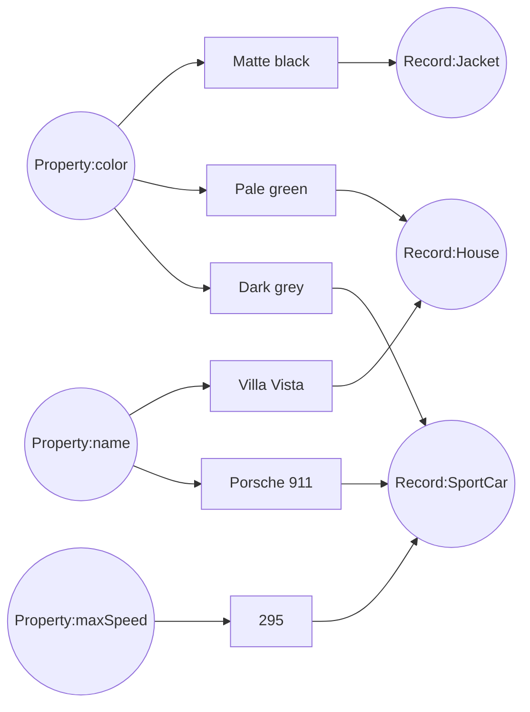

# Properties


The fundamental unit of meaningful data in RushDB is known as a **Property**. Despite its apparent simplicity and 
modest size, the entire RushDB core is built upon this architectural cornerstone.

**Property** serves as the critical link that interconnects diverse data within [Records](/basic-concepts/records) 
by matching properties and, importantly, by aligning [data types](/advanced/data-types) to create 
connections using exact values.


## How it works

You can liken a **Property** to a real-world descriptor for a specific object.
Here is a simplified diagram illustrating its appearance in a graph:



And this is how those **Records** can be represented in code:

```typescript
// Record:Jacket
const jacket = {
    color: "Matte black" // Property:color     [string]
}   

// Record:SportCar
const sportCar = {
    name: "Porsche 911", // Property:name      [string]
    color: "Dark grey",  // Property:color     [string]
    maxSpeed: 295        // Property:maxSpeed  [number]
}

// Record:House
const house = {
    name: "Villa Vista", // Property:name      [string]
    color: "Pale green"  // Property:color     [string]
}
```

Simple as that :) 

## Considerations

Real-world data can be considerably more intricate and may encompass all conceivable 
[data types](/advanced/data-types) within a single **Record**. 
However, rest assured that RushDB adeptly manages this complexity without hesitation. Nevertheless, there are a few 
important considerations you should be aware of:

1. **Property** is designed to accommodate only consistent values. This means that RushDB will strive to retain the 
original value type. However, if there are any inconsistent or non-convertible values in the payload, RushDB will 
automatically convert them to a _string_ type.


Payload contains inconsistent values but can be converted to desired _number_ type:
```js

{
    name: "Combination",
    type: "number",    
    value: [4, 8, 15, 16, "23", "42.0"]
} 
// ---> converts to
{
    name: "Combination",
    type: "number",
    value: [4, 8, 15, 16, 23, 42.0]
}
```

Payload contains inconsistent values but cannot be converted to desired _number_ type:
```js
{
    name: "Secret",
    type:"number",
    value: [1, 2, 3, "jelly bear"]
}
// ---> converts to
{
    name: "Secret",
    type: "string",
    value: ["1", "2", "3", "jelly bear"]
}
```

--- 

2. When two (or more) properties with the <u>same name</u> but <u>different types</u> come into play, RushDB will make 
every effort to maintain data consistency. It does this by appending a suffix to the duplicated name, ensuring that the 
distinction is preserved. For instance:

```js
[
    {
        type: "Raincoat",
        size: "M"
    }, 
    { 
        type: "Cardigan",
        size: 38
    }
]
```

Will be saved into:
```js
[
    {
        type: "Raincoat",
        size: "M"
    },
    {
        type: "Cardigan",
        size__NUMBER: 38
    }
]
```