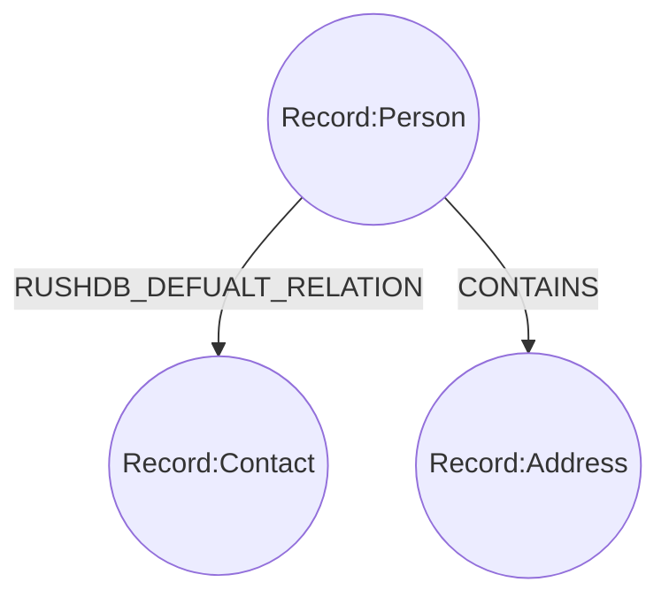

# Relationships

In the realm of real-world data and a human-centric mindset, there may arise a need to store nested data within **Records**.
In the context of RushDB, this becomes a critical requirement in order to maintain simplicity and eliminate the layers
of abstraction that exist between the raw data and our conceptual understanding of it.


This is precisely why we have
engineered RushDB to have the capability to contain **Records** within other **Records**. While each individual **Record**
remains distinct and accessible on its own, you retain the flexibility to structure your data in a manner that aligns
with your thought process. 

## How it works

Here is basic example of nested data in the way the human beings are thinking of it:

```js
const data = {
  Person: {
    Name: "John Galt", 
    Age: 30,
    Contact: {
      Email: "john.galt@example.com",
      Phone: "123-456-7890"
    },
    Address: {
      Street: "123 Main Street",
      City: "Anytown",
      State: "CA",
      ZipCode: "12345"
    }
  }
}
```

As you may be aware, there's no need to manually define a schema for your data in RushDB because it handles this 
process automatically. In this example, RushDB will transform the data into 3 **Records** and 8 **Properties**, each
with its appropriate data type. Moreover, RushDB will assign **Labels** based on the inherent data structure automatically.


This structure is flexible and can be modified easily if necessary. You have the freedom to rearrange **Records** within the
structure as needed. Additionally, RushDB doesn't limit **Relations** to just child and parent connections.
To learn more about different types of **Record** **Relations**, visit the [Relations documentation](/basic-concepts/relations).
