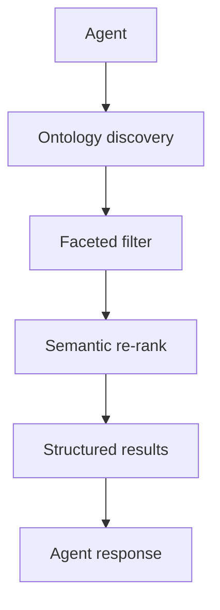

# Agent Memory Model

RushDB is designed from the ground up as a **structured memory store for AI agents**. Unlike flat vector databases or document stores, RushDB gives agents three distinct memory layers — each addressing a different dimension of knowledge — and a retrieval stack that composes them at query time.

## The Three Memory Layers

| Layer | What it stores | RushDB primitive |
|---|---|---|
| **Episodic** | Individual facts, events, entities, and their connections | Records + Relationships |
| **Semantic** | Meaning encoded as dense vectors (embeddings) | Vector Properties + AI Indexes |
| **Structural** | Schema: what labels exist, what properties they carry, how they connect | Ontology API |

### Episodic Memory — Records and Relationships

Every discrete piece of knowledge is a **Record**: a typed key-value object carrying a label, properties, and a system-generated ID. Records connect to one another via **Relationships**, forming a traversable knowledge graph. An agent can store anything from a conversation turn to a product entity as a record, then retrieve it by property values, label, or graph traversal.

→ See [Records](./records.md) and [Relationships](./relationships.md)

### Semantic Memory — Vector Properties

A subset of record properties carry dense vector representations (embeddings). Because all properties in RushDB are first-class graph nodes shared across every record with the same `(name, type)`, a vector-indexed property is simultaneously a semantic index over every record it connects to. Embeddings can be supplied by the application (Bring Your Own Vector) or generated automatically by RushDB.

→ See [Properties — Vector Properties and Semantic Indexing](./properties.md#vector-properties-and-semantic-indexing)

### Structural Memory — Ontology

The **Ontology API** returns a live snapshot of the graph's schema: all labels, all properties per label with types and value ranges, and the full relationship map. An agent calls this once per session to bootstrap awareness of what is in the database — no hardcoded schema, no external documentation required.

→ See [Ontology & Schema Discovery](./ontology-schema-discovery.md)

---

## The Retrieval Stack

A well-designed agent retrieval pipeline uses all three layers in sequence:



**Step 1 — Discover the schema.** Before constructing any query, the agent calls the ontology endpoint to learn what labels, properties, and relationships exist. This prevents hallucinated field names and enables dynamic query construction.

**Step 2 — Filter structurally.** The `where` clause narrows the candidate set by exact or range conditions on scalar properties. This is fast (index-backed) and deterministic. It is the right tool when the agent knows what it is looking for.

**Step 3 — Re-rank semantically.** After structural filtering, a `vector.similarity` aggregation scores each candidate against the agent's query embedding. This surfaces the most *relevant* records from the structurally valid candidate set.

**Step 4 — Return to agent.** The sorted, scored result set is returned. The agent reasons over structured records — not raw text chunks — because RushDB preserves full property context alongside the similarity score.

---

## Self-Awareness Without External Documentation

A central design goal of RushDB is that agents should be able to operate against an unknown or evolving knowledge graph **without any out-of-band schema documentation**. Two mechanisms make this possible:

1. **`__proptypes`** — every Record carries a `__proptypes` field listing the name and type of each property it holds. This makes every record self-describing.

2. **The Ontology API** — aggregates all `__proptypes` metadata across the project and returns it as a schema snapshot. An agent that calls `/ai/ontology/md` at the start of a session receives the full graph schema in a single, token-efficient Markdown string.

Together, these enable a zero-configuration agentic loop:

```
Boot → call ontology → understand what exists in the graph
     → construct SearchQuery from real labels/properties
     → retrieve relevant records
     → act on structured, typed results
```

---

## Composing the Retrieval Approaches

The three retrieval approaches are not mutually exclusive — they compose:

| Approach | When to use | Mechanism |
|---|---|---|
| **Structural only** | Known labels and property values | `where` filter |
| **Semantic with pre-filter** | Meaning-based lookup, optionally scoped by structural conditions | `db.ai.search()` with `where` |
| **Structural + semantic in one query** | Full SearchQuery features (groupBy, collect, multi-hop) alongside similarity scoring | `where` + `vector.similarity` aggregation |

Both `db.ai.search()` and `db.records.find()` support pre-filtering before scoring — choose based on whether you need managed text embedding (`db.ai.search()`) or the full SearchQuery feature set (`db.records.find()`).

→ See [Properties — Composing Faceted and Semantic Search](./properties.md#composing-faceted-and-semantic-search) for code examples.
