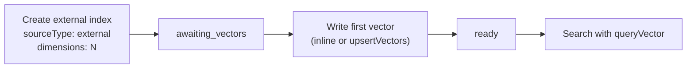

# Bring Your Own Vectors (BYOV)

By default, RushDB generates embeddings server-side when you create an **embedding index** on a string property. With **BYOV** (Bring Your Own Vectors) you compute the embeddings yourself and push them alongside your records. RushDB stores, indexes, and searches them — you stay in full control of the model and the pipeline.

## Why BYOV?

| Scenario                            | Why BYOV helps                                                                                                                  |
| ----------------------------------- | ------------------------------------------------------------------------------------------------------------------------------- |
| Domain-specific or fine-tuned model | Use any model — a locally fine-tuned LLM, a multimodal encoder, a document-structure model — without configuring it server-side |
| Compliance / data residency         | Raw text never leaves your infrastructure; only the numeric vector is sent to RushDB                                            |
| Multimodal embeddings               | Encode images, audio, or structured documents into vectors before storing them                                                  |
| Existing ML pipeline                | Re-use vectors already produced by your data pipeline                                                                           |
| Reproducibility                     | Lock embedding logic to a specific model version; no coupling to server-side model upgrades                                     |

## Managed vs. External

| Aspect                          | Managed                            | External (BYOV)                                           |
| ------------------------------- | ---------------------------------- | --------------------------------------------------------- |
| `sourceType`                    | `managed` (default)                | `external`                                                |
| Who generates embeddings        | RushDB server                      | Your application                                          |
| Search input                    | Natural-language `query` string    | Pre-computed `queryVector` array                          |
| `dimensions` required on create | No — uses server default           | **Yes** — must match your model                           |
| Initial index status            | `pending` → `ready` after backfill | `awaiting_vectors` → `ready` once first vector is written |
| Backfill existing records       | Automatic                          | Manual via `upsertVectors` or inline writes               |

Both index types can coexist on the same `(label, propertyName)` pair.

## Write Flows

There are two ways to push vectors into an external index.

### Option A — Inline at write time

Attach vectors directly inside any record create or import call. The index must already exist before vectors are written.

```typescript
await db.records.create('Article', {
  title: 'Understanding Graph RAG',
  body: 'Graphs provide context that plain vector search lacks...',
  __vectors: [
    {
      propertyName: 'body',
      vector: await embed('Understanding Graph RAG...') // your embedding function
    }
  ]
})
```

This is the lowest-latency path: one round-trip creates the record and stores its vector.

### Option B — Upsert after the fact

Push vectors separately, useful for seeding an index from an existing dataset or syncing after a batch embedding job.

```typescript
await db.ai.indexes.upsertVectors(indexId, {
  items: [
    { recordId: 'rec_001', vector: [0.1, 0.2, ...] },
    { recordId: 'rec_002', vector: [0.7, 0.8, ...] }
  ]
})
```

The upsert call is **idempotent** — re-running it with the same `recordId` replaces the stored vector.

## Searching with a Pre-computed Vector

Once vectors are stored, search with `queryVector` instead of `query`:

```typescript
const results = await db.ai.search({
  label: 'Article',
  propertyName: 'body',
  queryVector: await embed('graph databases and retrieval'), // your embedding function
  limit: 10
})
```

The result shape is the same as a managed semantic search — records ranked by cosine (or euclidean) similarity, with an optional `__score` field.

## Lifecycle



An external index stays in `awaiting_vectors` until at least one vector has been written. After that it is `ready` and searchable.

---

## Implementation Reference

<div className="not-prose grid grid-cols-1 gap-3 sm:grid-cols-3" style={{ marginTop: '0.5rem' }}>
  <a
    href="/typescript-sdk/ai/overview"
    className="flex flex-col rounded-xl border border-[var(--ifm-color-emphasis-200)] bg-[var(--ifm-card-background-color)] p-5 text-inherit no-underline hover:bg-[var(--ifm-color-emphasis-100)] hover:no-underline"
  >
    <span className="mb-1 text-[14px] font-bold text-[var(--ifm-font-color-base)]">TypeScript SDK</span>
    <span className="text-[13px] text-[var(--ifm-color-emphasis-600)]">
      db.ai.indexes · upsertVectors · ai.search
    </span>
  </a>
  <a
    href="/python-sdk/ai/overview"
    className="flex flex-col rounded-xl border border-[var(--ifm-color-emphasis-200)] bg-[var(--ifm-card-background-color)] p-5 text-inherit no-underline hover:bg-[var(--ifm-color-emphasis-100)] hover:no-underline"
  >
    <span className="mb-1 text-[14px] font-bold text-[var(--ifm-font-color-base)]">Python SDK</span>
    <span className="text-[13px] text-[var(--ifm-color-emphasis-600)]">
      db.ai.indexes · upsert_vectors · ai.search
    </span>
  </a>
  <a
    href="/rest-api/ai/advanced-indexing"
    className="flex flex-col rounded-xl border border-[var(--ifm-color-emphasis-200)] bg-[var(--ifm-card-background-color)] p-5 text-inherit no-underline hover:bg-[var(--ifm-color-emphasis-100)] hover:no-underline"
  >
    <span className="mb-1 text-[14px] font-bold text-[var(--ifm-font-color-base)]">REST API</span>
    <span className="text-[13px] text-[var(--ifm-color-emphasis-600)]">
      POST /ai/indexes · /vectors/upsert · BYOV guide
    </span>
  </a>
</div>

<div className="not-prose grid grid-cols-1 gap-3 sm:grid-cols-1" style={{ marginTop: '0.75rem' }}>
  <a
    href="/tutorials/byov-external-embeddings"
    className="flex flex-col rounded-xl border border-[var(--ifm-color-emphasis-200)] bg-[var(--ifm-card-background-color)] p-5 text-inherit no-underline hover:bg-[var(--ifm-color-emphasis-100)] hover:no-underline"
  >
    <span className="mb-1 text-[14px] font-bold text-[var(--ifm-font-color-base)]">
      Tutorial — BYOV External Embeddings
    </span>
    <span className="text-[13px] text-[var(--ifm-color-emphasis-600)]">
      Step-by-step walkthrough with TypeScript, Python, and Shell examples
    </span>
  </a>
</div>
