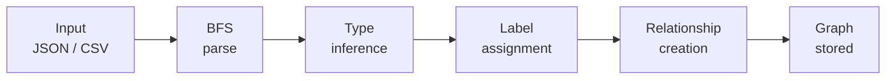
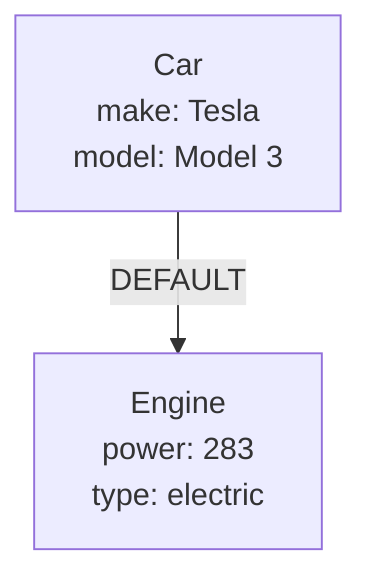

# Data Ingestion

RushDB accepts raw data — JSON objects, nested trees, flat arrays, or CSV — and turns it into a fully typed, linked graph. No schema definitions, no migrations, no manual relationship wiring.

## How It Works

Every ingestion call goes through the same pipeline:



1. **Parse** — RushDB walks the input with a breadth-first search (BFS) algorithm. Each nested object becomes a separate record.
2. **Type inference** — Every value is classified as `string`, `number`, `boolean`, `datetime`, or `null`. Arrays must contain a consistent type. Mixed types that can be coerced (e.g. `"42"` → `42`) are converted automatically; otherwise the property falls back to `string`.
3. **Label assignment** — Top-level records use the label you provide. Nested objects derive their label from the parent key name (e.g. a key `"engine"` produces label `Engine`).
4. **Relationship creation** — Parent → child records are linked with default relationships (`__RUSHDB__RELATION__DEFAULT__`). Property nodes are connected via value relationships.

The result is a fully navigable graph — queryable by field values, labels, relationships, or vector similarity — all from a single push.

## Input Formats

### Nested JSON (`importJson`)

Use `importJson` when your data contains nested objects, arrays of objects, or hash-map-like structures. RushDB decomposes the tree into linked records automatically.

```json
{
  "company": {
    "name": "Acme Corp",
    "founded": "2020-01-15T00:00:00Z",
    "departments": [
      {
        "name": "Engineering",
        "headcount": 42
      },
      {
        "name": "Design",
        "headcount": 12
      }
    ]
  }
}
```

This single call produces **4 records** (`Company`, `Departments` × 2) with default relationships linking them, plus property nodes for every field — all types inferred.

### Flat arrays (`createMany`)

Use `createMany` when your input is an array of flat, row-like objects (no nesting). This is the fastest path for CSV-shaped data.

```json
[
  { "name": "Alice", "email": "alice@example.com", "age": 30 },
  { "name": "Bob", "email": "bob@example.com", "age": 25 }
]
```

### CSV strings (`importCsv`)

Pass a raw CSV string and RushDB will parse, infer types, and import. Delimiter, quoting, and numeric conversion are configurable.

```csv
name,email,age
Alice,alice@example.com,30
Bob,bob@example.com,25
```

## Upsert: Merge or Replace

All three methods support upsert via `mergeBy` and `mergeStrategy`:

| Option | Description |
|---|---|
| `mergeBy` | Array of property names used to match existing records (e.g. `["email"]`). If empty or omitted with `mergeStrategy` present, all incoming keys are used. |
| `mergeStrategy: 'append'` | (Default) Adds or updates incoming properties. Existing properties not mentioned in the payload are preserved. |
| `mergeStrategy: 'rewrite'` | Replaces all properties on the matched record with the incoming payload. Unmentioned properties are removed. |

## Import Options

| Option | Description |
|---|---|
| `suggestTypes` | When `true`, RushDB infers types from values instead of storing everything as `string`. Enabled by default in most SDK methods. |
| `capitalizeLabels` | Capitalise auto-derived labels (e.g. `departments` → `Departments`). |
| `returnResult` | Return the created/updated records in the response. |

## How Nested Data Becomes a Graph

Consider this payload:

```json
{
  "car": {
    "make": "Tesla",
    "model": "Model 3",
    "engine": {
      "power": 283,
      "type": "electric"
    }
  }
}
```

RushDB produces:



- The outer key `"car"` becomes the label **Car**.
- The nested key `"engine"` becomes a separate record with label **Engine**.
- A default relationship links Car → Engine.
- All property types are inferred (`make: string`, `power: number`, etc.).

See [Records](./records.md) for more on record structure, [Relationships](./relationships.mdx) for relationship types, and [Properties](./properties.md) for type inference details.

---

## Implementation Reference

Each interface covers the full ingestion API — pick the one that fits your stack:

<div className="grid grid-cols-1 gap-3 sm:grid-cols-3 not-prose" style={{marginTop: '0.5rem'}}>
  <a href="/typescript-sdk/records/import-data" className="flex flex-col rounded-xl border border-[var(--ifm-color-emphasis-200)] bg-[var(--ifm-card-background-color)] p-5 text-inherit no-underline hover:bg-[var(--ifm-color-emphasis-100)] hover:no-underline">
    <span className="mb-1 text-[14px] font-bold text-[var(--ifm-font-color-base)]">TypeScript SDK</span>
    <span className="text-[13px] text-[var(--ifm-color-emphasis-600)]">createMany · importJson · importCsv</span>
  </a>
  <a href="/python-sdk/records/import-data" className="flex flex-col rounded-xl border border-[var(--ifm-color-emphasis-200)] bg-[var(--ifm-card-background-color)] p-5 text-inherit no-underline hover:bg-[var(--ifm-color-emphasis-100)] hover:no-underline">
    <span className="mb-1 text-[14px] font-bold text-[var(--ifm-font-color-base)]">Python SDK</span>
    <span className="text-[13px] text-[var(--ifm-color-emphasis-600)]">create_many · import_csv</span>
  </a>
  <a href="/rest-api/records/import-data" className="flex flex-col rounded-xl border border-[var(--ifm-color-emphasis-200)] bg-[var(--ifm-card-background-color)] p-5 text-inherit no-underline hover:bg-[var(--ifm-color-emphasis-100)] hover:no-underline">
    <span className="mb-1 text-[14px] font-bold text-[var(--ifm-font-color-base)]">REST API</span>
    <span className="text-[13px] text-[var(--ifm-color-emphasis-600)]">POST /records/import/json · /records/import/csv</span>
  </a>
</div>
