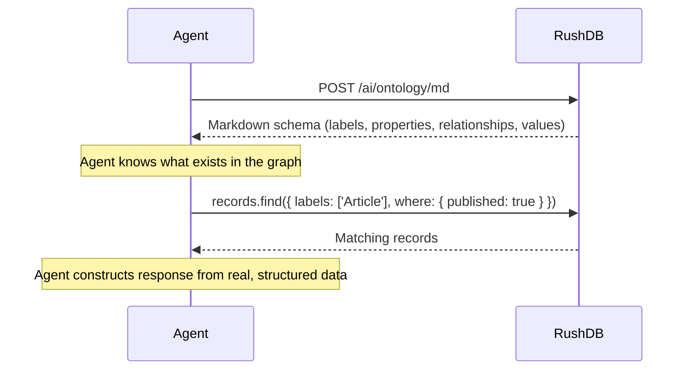

# Ontology & Schema Discovery

The **Ontology API** returns a live, computed snapshot of what exists in your RushDB project: every label, every property per label (with its type and value distribution), and the full relationship map between labels. Agents use it to bootstrap schema awareness at the start of a session — no hardcoded schema, no external documentation required.

## Why This Matters for Agents

Traditional databases assume that the application knows the schema ahead of time. This works when the schema is static and human-authored. AI agents face a different reality:

- The knowledge graph may have been populated by other agents, batch imports, or live event streams.
- The schema drifts over time as new label types and properties appear.
- Agents cannot be pre-programmed with field names they have never seen.

RushDB's answer is **schema-on-read for agents**: call `/ai/ontology/md` at the start of each session and receive the full, current schema as a single response. The agent can then construct valid `SearchQuery` objects referencing only labels and properties that actually exist.

---

## What the Ontology Contains

| Component | Description |
|---|---|
| **Label inventory** | All label names currently in the project, with record counts |
| **Property manifest per label** | Property name, type, and either sample values (strings/booleans) or a min–max range (numbers/datetimes) |
| **Relationship map** | Which labels connect to which, via which relationship type, and in which direction |

This is sufficient for an agent to:

1. Know which labels exist (and how many records each has)
2. Know which fields are queryable on each label and what values they carry
3. Know which graph traversals are valid (which labels are reachable from which)
4. Construct faceted filter ranges without any extra round-trip queries

---

## Two Formats

### Markdown — for LLM context injection

`POST /api/v1/ai/ontology/md`

Returns the schema as compact Markdown tables. This format is optimised for direct injection into an LLM system prompt or tool result — token-efficient, human-readable, and immediately usable by a language model.

```text
# Graph Ontology

## Labels

| Label     | Count |
|-----------|------:|
| `Article` |  4821 |
| `Author`  |   312 |
| `Tag`     |    87 |

---

## `Article` (4821 records)

### Properties

| Property      | Type     | Values / Range                               |
|---------------|----------|----------------------------------------------|
| `title`       | string   | `"Graph databases…"`, `"Intro to…"` (+4819)  |
| `published`   | boolean  | `true`, `false`                              |
| `score`       | number   | `0.0`..`9.8`                                 |
| `publishedAt` | datetime | `2020-01-01`..`2026-03-29`                   |

### Relationships

| Type          | Direction | Other Label |
|---------------|-----------|-------------|
| `WRITTEN_BY`  | out       | `Author`    |
| `TAGGED_WITH` | out       | `Tag`       |
```

### JSON — for programmatic tool calls

`POST /api/v1/ai/ontology`

Returns the same data as a structured JSON array. Use this format when an agent needs to programmatically extract specific labels or property names before constructing a query.

---

## The Self-Awareness Loop



The loop is stateless from RushDB's side. The agent calls the ontology endpoint whenever it needs a fresh view of the schema, then proceeds to query. There is no session to open or schema to register.

---

## Dynamic Facet Discovery

Because the ontology includes value distributions for each property, agents can construct UI filters or reasoning steps entirely from the ontology response — no separate "what values exist?" queries needed.

**Example:** An agent building a product-search interface calls `/ai/ontology/md`, sees that the `Product` label has a `status` string property with sample values `["available", "discontinued", "pre-order"]`, and renders those as filter chips — without ever querying records for distinct values.

**Example:** An agent reasoning over a CRM dataset calls `/ai/ontology`, sees that `Deal.amount` ranges from `500` to `250000`, and uses that range to construct a meaningful `$gte` / `$lte` filter in the next query.

---

## Caching

The ontology is computed once and cached by RushDB. Cache entries are invalidated when labels, properties, or relationships change in the project. Calling `/ai/ontology/md` at the start of every agent session incurs negligible overhead — a single network round trip returning a compact text payload.

---

## Further Reading

- [Labels](./labels.md) — how labels work as the primary organisational axis
- [Properties](./properties.md) — property types and the `__proptypes` self-description mechanism
- [Agent Memory Model](./agent-memory-model.md) — where ontology fits in the full retrieval stack
- [AI & Semantic Search](../../rest-api/ai.md) — complete REST API reference for ontology endpoints
