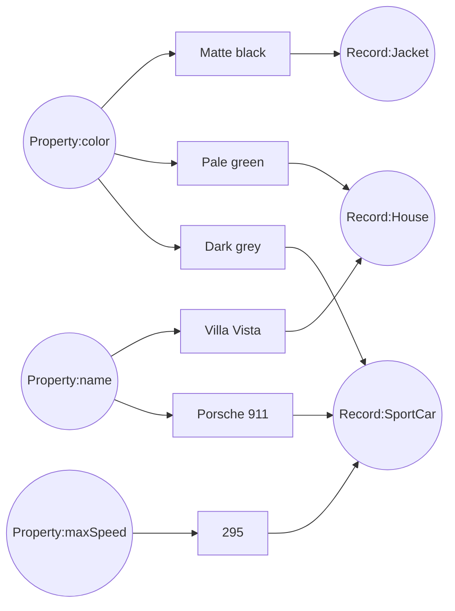
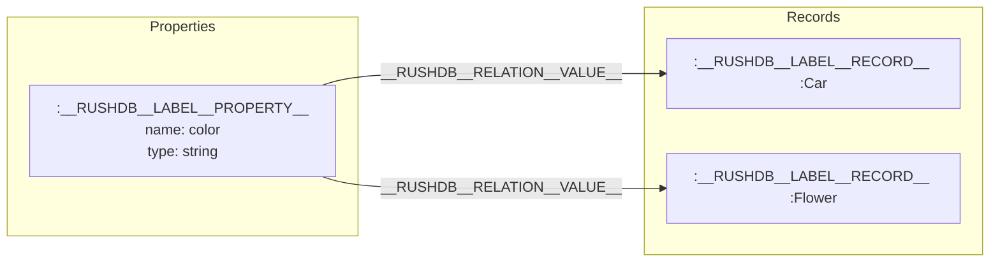

# Properties

The fundamental unit of meaningful data in RushDB is known as a **Property**. Properties are first-class citizens in the RushDB architecture and serve as critical links that interconnect diverse data within [Records](../concepts/records) across the graph database.

## How it works

In RushDB's unique property graph model, properties connect records through a combination of field name and data type. This creates a powerful network that reveals relationships that might otherwise remain hidden.

Here is a simplified diagram illustrating how properties appear in a graph:



And this is how those **Records** can be represented in code:

```typescript
// Record:Jacket
const jacket = {
    color: "Matte black" // Property `color`     [string]
}

// Record:SportCar
const sportCar = {
    name: "Porsche 911", // Property `name`      [string]
    color: "Dark grey",  // Property `color`     [string]
    maxSpeed: 295        // Property `maxSpeed`  [number]
}

// Record:House
const house = {
    name: "Villa Vista", // Property `name`      [string]
    color: "Pale green"  // Property `color`     [string]
}
```

## Internal Structure

Internally, properties are stored as nodes with the label `__RUSHDB__LABEL__PROPERTY__` and contain only the name and type fields (not the actual values). The values are stored in the record nodes, and properties are connected to their records via `__RUSHDB__RELATION__VALUE__` relationships.



This approach enables:
1. Performant queries across different record types
2. Discovery of hidden insights in data through property-based connections
3. Optimized graph traversals leveraging Neo4j's native capabilities

## Considerations

Real-world data can be considerably more intricate and may encompass all conceivable
[data types](../concepts/storage#data-types) within a single **Record**.
However, rest assured that RushDB adeptly manages this complexity without hesitation. Nevertheless, there are a few
important considerations you should be aware of:

1. **Property** is designed to accommodate only consistent values. This means that RushDB will strive to retain the
original value type. However, if there are any inconsistent or non-convertible values in the payload, RushDB will
automatically convert them to a _string_ type.


Payload contains inconsistent values but can be converted to desired _number_ type:
```js
{
    name: "Combination",
    type: "number",
    value: [4, 8, 15, 16, "23", "42.0"]
}
// ---> converts to
{
    name: "Combination",
    type: "number",
    value: [4, 8, 15, 16, 23, 42.0]
}
```

Payload contains inconsistent values but cannot be converted to desired _number_ type:
```js
{
    name: "Secret",
    type:"number",
    value: [1, 2, 3, "jelly bear"]
}
// ---> converts to
{
    name: "Secret",
    type: "string",
    value: ["1", "2", "3", "jelly bear"]
}
```

---

2. When two (or more) properties with the <u>same name</u> but <u>different types</u> come into play, RushDB will maintain both Properties as separate entities. For instance:

```js
[
    {
        type: "Raincoat",
        size: "M"
    },
    {
        type: "Cardigan",
        size: 38
    }
]
```

Will be saved as distinct properties (size:string and size:number) connecting to their respective records.

## Supported Data Types

RushDB supports a variety of data types to accommodate diverse data needs in your applications:

### `string`
Used for any textual information with virtually unlimited length.

```js
{
    name: "productName",
    type: "string",
    value: "Premium Leather Jacket"
}
```

### `number`
Accommodates both floating-point numbers and integers.

```js
{
    name: "price",
    type: "number",
    value: 129.99
}
```

### `boolean`
Represents true or false values.

```js
{
    name: "inStock",
    type: "boolean",
    value: true
}
```

### `datetime`
Follows ISO 8601 format, including timezone information.

```js
{
    name: "manufacturedAt",
    type: "datetime",
    value: "2025-03-15T14:30:00Z"
}
```

### `null`
Represents the absence of a value.

```js
{
    name: "discount",
    type: "null",
    value: null
}
```

### `vector`
Arrays of floating-point numbers or integers, particularly useful for vector similarity searches and machine learning operations.

```js
{
    name: "imageEmbedding",
    type: "vector",
    value: [0.99070, 0.78912, 1.0, 0.0]
}
```

### Arrays

RushDB also supports arrays as property values, but they must contain consistent value types:

> **Note:** Every data type mentioned above (except `vector`, since it's already an array by default) supports an array representation.

```js
// String array
{
    name: "categories",
    type: "string",
    value: ["outerwear", "winter", "premium"]
}

// Number array
{
    name: "availableSizes",
    type: "number",
    value: [36, 38, 40, 42, 44]
}

// Boolean array
{
    name: "features",
    type: "boolean",
    value: [true, false, true, true]
}
```

RushDB automatically handles type inference during data import, ensuring optimal storage and retrieval of your property values. If there are mixed types within an array that can be consistently converted (like strings to numbers), RushDB will attempt the conversion. However, if conversion isn't possible, it will default to the most accommodating type (usually string).

## Multi-tenant Isolation

Properties are not shared amongst projects (database instances), ensuring complete isolation in multi-tenant environments. Each project has its own set of property nodes, maintaining data security and isolation.

For more information on how properties are imported and processed, see [REST API - Import Data](../rest-api/records/import-data).
