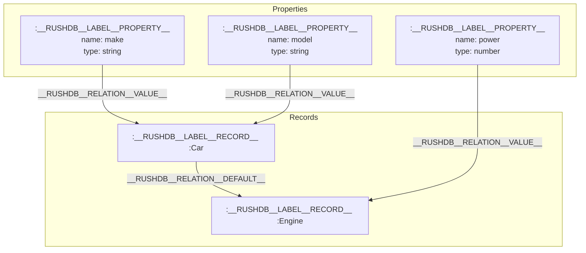
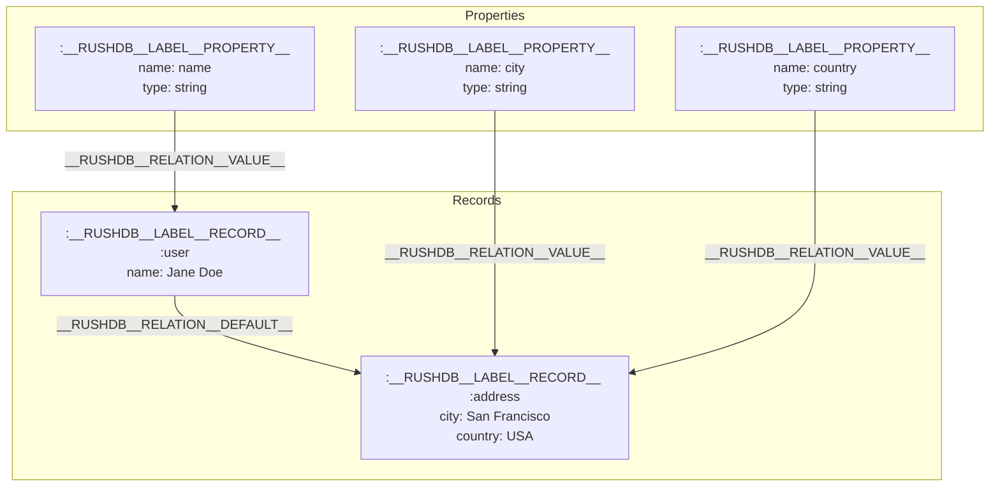

# Records

In RushDB, Records are fundamental data structures that store meaningful key-value data. Each Record consists of individual properties (key-value pairs) and can be connected to other Records through relationships.

## How it works

Records in RushDB can be thought of as nodes in a graph database or rows in a traditional database. While the underlying implementation utilizes complex graph structures, from a user perspective, a Record is simply a key-value object containing properties.

Each record in RushDB consists of:

- User-defined properties (key-value pairs)
- System properties (prefixed with `__`)

Below is an example of a record with the label "User":

```typescript
{
  "__id": "01968aa4-22c1-781a-8e8c-8fe6be6c3fd4",  // Unique identifier
  "__label": "User",  // User-defined label (required and limited to one per record)
  "__proptypes": {    // Property types
    "name": "string",
    "emailConfirmed": "boolean",
    "registeredAt": "datetime",
    "rating": "number",
    "currency": "string",
    "email": "string"
  },
  "name": "John Galt",
  "emailConfirmed": true,
  "registeredAt": "2022-07-19T08:30:28.000Z",
  "rating": 4.98,
  "currency": "USD",
  "email": "john.galt@example.com"
}
```

Or this example with the label "Coffee":
```typescript
{
  "__id": "01968aa4-88c1-781a-8e8c-8fc6be7c3fd4",
  "__label": "Coffee",
  "__proptypes": {
    "origin":  "string",
    "process": "string",
    "cupping": "number",
    "inStock": "boolean",
    "roasted": "datetime",
    "notes": "string"
  },
  "origin": "Guatemala",
  "process": "washed",
  "cupping": 86,
  "inStock": true,
  "roasted": "2023-07-20T14:50:00Z",
  "notes": ["Nuts", "Caramel", "Lime"]
}
```

## Internal Structure

Internally, each Record in RushDB is represented as a node with two labels:
1. The system label `__RUSHDB__LABEL__RECORD__`
2. A user-defined label (exposed as `__label`)

In addition to user-defined properties, each Record contains several internal properties that enable advanced functionality:

| Internal Key | Client Representation | Description |
|--------------|----------------------|-------------|
| `__RUSHDB__KEY__ID__` | `__id` | UUIDv7 that enables lexicographic ordering without relying on user-defined fields like `createdAt`. RushDB SDKs support converting `__id` to timestamp and ISO8601 date. For more details, see [UUIDv7 specification](https://www.ietf.org/archive/id/draft-peabody-uuid-v7-01.html). |
| `__RUSHDB__KEY__PROPERTIES__META__` | `__proptypes` | Stringified meta-object holding the types of data in the current record, e.g., `{ name: "string", active: "boolean", ... }` |
| `__RUSHDB__KEY__LABEL__` | `__label` | Record Label identifier. Every record has two labels: a default one (`__RUSHDB__LABEL__RECORD__`) and a user-defined one that is searchable. Currently, RushDB allows only one custom label per record, and it is required by default. For more details about labels, see [Labels](/concepts/labels). |
| `__RUSHDB__KEY__PROJECT__ID__` | (not exposed) | Project identifier for multitenancy isolation. This property is never exposed to clients via UI or API. |

## Supported Data Types

RushDB supports a wide range of data types to accommodate diverse data needs:

| Data Type | Description | Example |
|-----------|-------------|---------|
| `string` | Textual information of unlimited length | `"Hello World"` |
| `number` | Both floating-point numbers and integers | `-120.209817`, `42` |
| `datetime` | ISO 8601 format, including timezones | `"2012-12-21T18:29:37Z"` |
| `boolean` | True or false values | `true`, `false` |
| `null` | Explicit null value | `null` |
| `vector` | Arrays of floating-point numbers or integers | `[0.99070, 0.78912, 1, 0]` |

### Arrays

RushDB supports arrays as property values, but they must contain consistent value types:

Examples of valid arrays include:
- `["apple", "banana", "carrot"]` - string array
- `[4, 8, 15, 16, 23, 42]` - number array
- `["2023-09-17T02:47:54+04:00", "1990-08-18T04:35:00+05:00"]` - datetime array
- `[true, false, true, false, true]` - boolean array

When records are imported, data types are automatically inferred and stored in the `__proptypes` metadata, which helps maintain type consistency across your database.

## Creating Records

Records can be created through:

1. Direct creation via the API or SDK
2. Automatic creation during data import

During record creation:
- A unique `__id` is automatically generated if not provided
- Property types are inferred from values when not specified
- Relationships are established based on data structure

Learn more at [REST API - Create Records](/rest-api/records/create-records) or through the language-specific SDKs:
- [TypeScript SDK](/typescript-sdk/records/create-records)
- [Python SDK](/python-sdk/records/create-records)

## Graph Representation

In RushDB's underlying Neo4j database, records are represented as nodes in a property graph model:



In this structure:
- Records are nodes with the label `__RUSHDB__LABEL__RECORD__` plus a user-defined label
- Records store actual property values directly as node attributes
- Properties are connected to records via `__RUSHDB__RELATION__VALUE__` relationships
- Related records are connected through `__RUSHDB__RELATION__DEFAULT__` relationships

## Complex Data Structure

RushDB's architecture allows for nested data structures where Records can contain other Records. When importing hierarchical data like JSON objects, RushDB automatically:

1. Assigns unique IDs to all records
2. Applies appropriate labels based on parent keys or user specifications
3. Creates relationships between parent and child records
4. Stores property metadata for type inference

This process enables you to structure your data in a natural, intuitive way while maintaining the graph-based relationships that power efficient queries and traversals.

RushDB automatically manages parent-child relationships between records. When importing nested JSON:

```json
{
  "user": {
    "name": "Jane Doe",
    "address": {
      "city": "San Francisco",
      "country": "USA"
    }
  }
}
```

RushDB creates:
1. A "user" record containing the name property
2. An "address" record containing city and country properties
3. A relationship from "user" to "address" of type `__RUSHDB__RELATION__DEFAULT__`

Each nested object becomes its own record with:
- A label derived from its key in the parent object
- A unique ID (following UUIDv7 format)
- Default relationships connecting it to its parent

This transforms into the following graph structure:



For details on how to import complex data structures, see [REST API - Import Data](/rest-api/import-data) or through the language-specific SDKs:
- [TypeScript SDK](/typescript-sdk/records/import-data)
- [Python SDK](/python-sdk/records/import-data)

For details on how properties are stored and managed, see the [Properties](/concepts/properties) section.
For information about the underlying storage structure, visit the [Storage](/concepts/storage) section.
