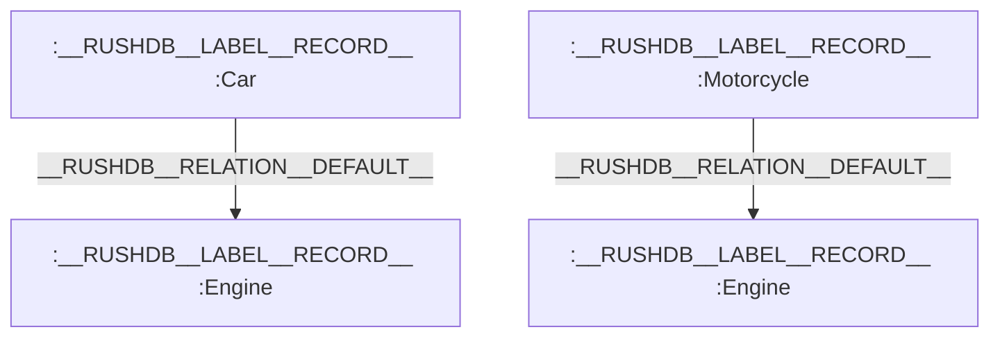
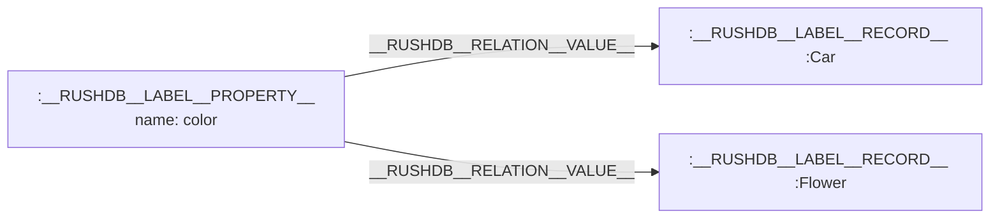
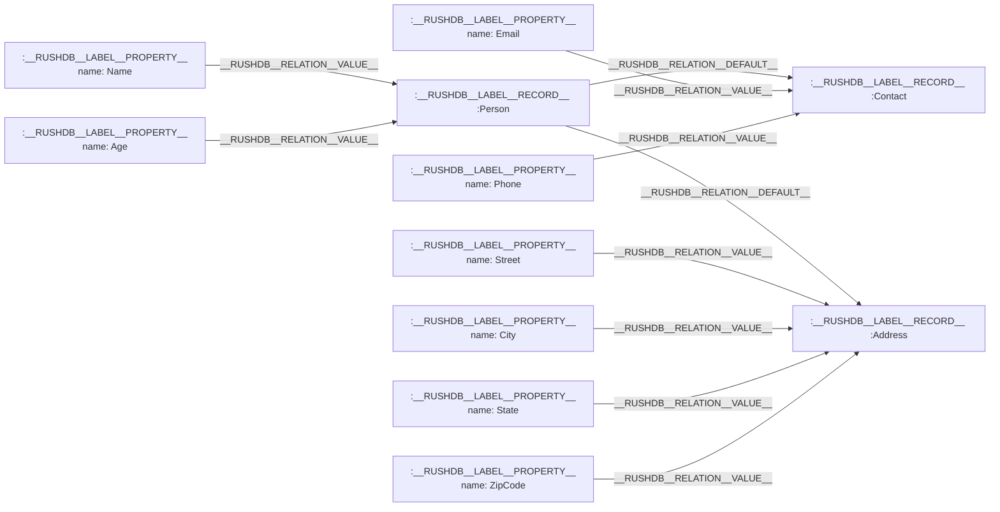

# Relationships

In RushDB, relationships are the connections that link Records together, creating a powerful graph structure that represents both the data itself and how different pieces of data relate to one another. These connections enable intuitive data modeling that aligns with how we naturally think about information and its associations.

## Types of Relationships

RushDB implements three main types of relationships:

### 1. Default Relationships (`__RUSHDB__RELATION__DEFAULT__`)

Default relationships connect related records, typically representing parent-child relationships in nested data structures. For example, a Car record might connect to an Engine record via a default relationship.



These relationships are automatically created during the data import process when nested objects are detected. Learn more at [REST API - Import Data](/rest-api/import-data) or through the language-specific SDKs:
- [TypeScript SDK](/typescript-sdk/records/import-data)
- [Python SDK](/python-sdk/records/import-data)

### 2. Value Relationships (`__RUSHDB__RELATION__VALUE__`)

Value relationships connect Property nodes to their Record nodes. These relationships flow from Properties to Records, indicating which records have which properties.



This structure allows for finding connections between otherwise unrelated records based on shared properties.

> **Note:** RushDB manages Property-Record relationships (Value relationships) autonomously and doesn't provide APIs to manually interact with or modify this type of relationship. This design ensures data integrity and consistency within the graph model.

### 3. Custom Relationships

Beyond the built-in relationships that RushDB creates automatically during data import, users can define and reconstruct relationships manually in any direction and of any type needed. This flexibility enables sophisticated data modeling that precisely captures your domain's relationship semantics.

You can create, modify, and delete relationships programmatically using the [REST API](../rest-api/relationships) or through the language-specific SDKs:
- [TypeScript SDK](../typescript-sdk/relationships)
- [Python SDK](../python-sdk/relationships)

This capability allows you to:
- Define domain-specific relationship types (e.g., "BELONGS_TO", "MANAGES", "DEPENDS_ON")
- Create relationships between previously unconnected records
- Build complex graph structures that evolve over time
- Restructure relationships as your data model changes

## Nested Data Example

Consider this JSON structure:

```json
{
  "Person": {
    "Name": "John Galt",
    "Age": 30,
    "Contact": {
      "Email": "john.galt@example.com",
      "Phone": "123-456-7890"
    },
    "Address": {
      "Street": "123 Main Street",
      "City": "Anytown",
      "State": "CA",
      "ZipCode": "12345"
    }
  }
}
```

When imported into RushDB, this is transformed into a graph structure with:
- 3 Records (Person, Contact, and Address)
- 8 Properties (Name, Age, Email, Phone, Street, City, State, ZipCode)
- Default relationships connecting Person to Contact and Person to Address



## Data Import Process

RushDB's data import mechanism uses a breadth-first search (BFS) algorithm to parse JSON structures and establish relationships:

1. Nested objects are detected and converted to separate Record nodes
2. Parent-child relationships are established via `__RUSHDB__RELATION__DEFAULT__` edges
3. Property nodes are connected to their respective Record nodes via `__RUSHDB__RELATION__VALUE__` edges

This approach allows for intuitive transformation of hierarchical data into a graph structure without requiring users to understand the underlying graph model.

## Benefits of RushDB's Relationship Structure

This relationship model provides several advantages:

1. **Intuitive Data Modeling**: You can structure your data in a way that matches how you think about it
2. **Efficient Traversals**: The graph structure enables fast navigation between related records
3. **Hidden Insights**: Property connections can reveal relationships between seemingly unrelated records
4. **Flexible Structure**: Relationships can be easily rearranged or modified as your data model evolves

To learn more about how to work with relationships in your queries and data operations, see the [REST API](/rest-api/relationships) or through the language-specific SDKs:
- [TypeScript SDK](/typescript-sdk/relationships)
- [Python SDK](/python-sdk/relationships)
