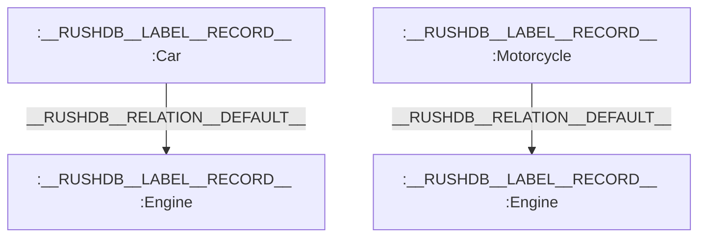
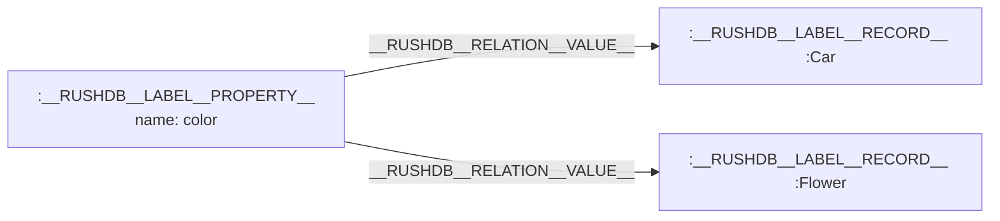
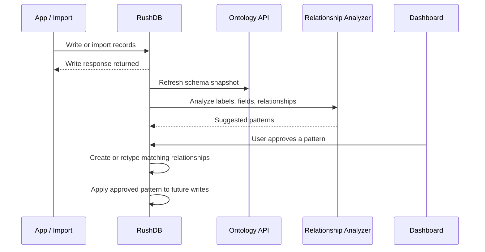
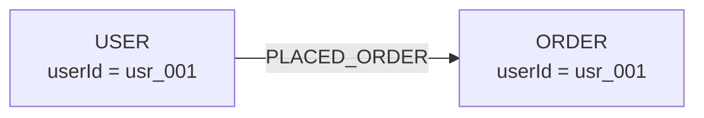
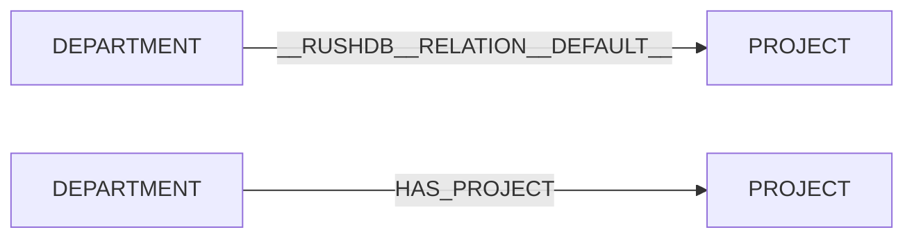
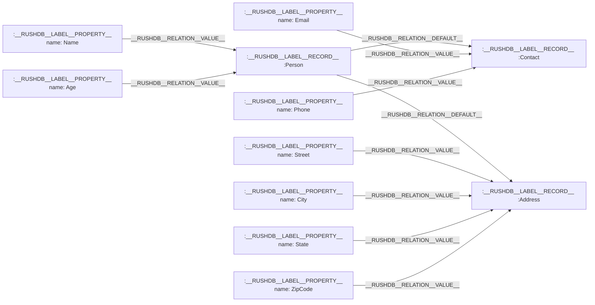

# Relationships

In RushDB, relationships are the connections that link Records together, creating a powerful graph structure that represents both the data itself and how different pieces of data relate to one another. These connections enable intuitive data modeling that aligns with how we naturally think about information and its associations.

## Types of Relationships

RushDB implements three main types of relationships:

### 1. Default Relationships (`__RUSHDB__RELATION__DEFAULT__`)

Default relationships connect related records, typically representing parent-child relationships in nested data structures. For example, a Car record might connect to an Engine record via a default relationship.



These relationships are automatically created during the data import process when nested objects are detected. Learn more at [REST API - Import Data](../rest-api/records/import-data) or through the language-specific SDKs:

- [TypeScript SDK](../typescript-sdk/records/import-data)
- [Python SDK](../python-sdk/records/import-data)

### 2. Value Relationships (`__RUSHDB__RELATION__VALUE__`)

Value relationships connect Property nodes to their Record nodes. These relationships flow from Properties to Records, indicating which records have which properties.



This structure allows for finding connections between otherwise unrelated records based on shared properties.

> **Note:** RushDB manages Property-Record relationships (Value relationships) autonomously and doesn't provide APIs to manually interact with or modify this type of relationship. This design ensures data integrity and consistency within the graph model.

### 3. Custom Relationships

Beyond the built-in relationships that RushDB creates automatically during data import, users can define and reconstruct relationships manually in any direction and of any type needed. This flexibility enables sophisticated data modeling that precisely captures your domain's relationship semantics.

You can create, modify, and delete relationships programmatically using the [REST API](../rest-api/relationships) or through the language-specific SDKs:

- [TypeScript SDK](../typescript-sdk/relationships)
- [Python SDK](../python-sdk/relationships)

This capability allows you to:

- Define domain-specific relationship types (e.g., "BELONGS_TO", "MANAGES", "DEPENDS_ON")
- Create relationships between previously unconnected records
- Build complex graph structures that evolve over time
- Restructure relationships as your data model changes

### Bulk creation and many-to-many caution

RushDB supports a bulk relationship creation endpoint (`POST /relationships/create-many`) that can either:

- join source and target records by equality on provided keys (the common case), or
- when explicitly requested, create a many-to-many (cartesian) set of relationships between all matched sources and targets.

The many-to-many mode is opt-in and guarded: the request must set a flag (e.g. `manyToMany`) and provide non-empty `where` filters for both sides; otherwise the server requires keys to perform a safe equality join. This prevents accidental, unbounded cartesian products which can be expensive to execute and store.

## Suggested Relationships in the Dashboard

Imported data is often structurally useful but semantically incomplete.

For nested JSON, RushDB can already see the parent-child structure and creates default relationships automatically. For flat data imported from systems like MongoDB, PostgreSQL exports, CSV, or external APIs, related records may arrive as separate collections with reference fields such as `userId`, `orderId`, or `addressRef`. In both cases, the ontology can describe the labels, properties, and existing edges, but it may not know the domain-specific relationship names you want to keep long term.

The **Relationships** tab in the Dashboard helps close that gap. RushDB analyzes the project ontology after writes, suggests relationship patterns, and lets you approve only the patterns that match your model.

> Suggested relationships require LLM analysis to be configured for the project. Without it, RushDB still creates default relationships for nested imports and supports manual relationship creation through the API and SDKs.



### Two kinds of suggestions

RushDB distinguishes between two common cases.

| Suggestion kind     | When it appears                                                                 | What approval does                                                                                               |
| ------------------- | ------------------------------------------------------------------------------- | ---------------------------------------------------------------------------------------------------------------- |
| **Match fields**    | Two labels have reference-like fields, such as `ORDER.userId` and `USER.userId` | Creates relationships between matching records now and applies the same pattern to future writes                 |
| **Rename existing** | Nested JSON already created default relationships, but the edge type is generic | Replaces matching default relationships with a semantic type, such as `DEPARTMENT` -> `HAS_PROJECT` -> `PROJECT` |

### Example: flat imported collections

If users and orders are imported separately, no graph edge exists yet:

```json
{
  "USER": [
    { "userId": "usr_001", "name": "Ava Chen" },
    { "userId": "usr_002", "name": "Noah Smith" }
  ],
  "ORDER": [
    { "orderId": "ord_101", "userId": "usr_001", "total": 129.5 },
    { "orderId": "ord_102", "userId": "usr_002", "total": 48.0 }
  ]
}
```

The analyzer can suggest a **Match fields** pattern:



Approving the pattern creates matching relationships for existing records and keeps applying the same rule as more orders arrive.

### Example: nested import with generic edges

Nested payloads already contain structure:

```json
{
  "DEPARTMENT": [
    {
      "name": "Engineering",
      "PROJECT": [{ "name": "Search relevance" }, { "name": "Ontology explorer" }]
    }
  ]
}
```

RushDB imports this as `DEPARTMENT` connected to `PROJECT` through default relationships. The analyzer should not invent a field match like `DEPARTMENT.name` -> `PROJECT.name`; those fields are descriptive, not references. Instead, it can suggest a **Rename existing** pattern:



Approving this kind of pattern retypes the existing default relationships into semantic relationships. Future nested imports with the same structure can be upgraded the same way.

### Why this helps

- **Less manual stitching:** You do not need to write one-off relationship scripts for every imported collection.
- **Safer graph evolution:** Suggestions stay in draft form until approved, and ignored suggestions can be removed later if you want them reconsidered.
- **Better ontology for agents:** Semantic relationship types make schema discovery more useful. An agent can reason over `USER -> PLACED_ORDER -> ORDER` more reliably than over a generic default edge.
- **Lower write latency:** Relationship discovery and application run as side effects after writes, so record writes can return without waiting for graph enrichment to finish.

## Nested Data Example

Consider this JSON structure:

```json
{
  "Person": {
    "Name": "John Galt",
    "Age": 30,
    "Contact": {
      "Email": "john.galt@example.com",
      "Phone": "123-456-7890"
    },
    "Address": {
      "Street": "123 Main Street",
      "City": "Anytown",
      "State": "CA",
      "ZipCode": "12345"
    }
  }
}
```

When imported into RushDB, this is transformed into a graph structure with:

- 3 Records (Person, Contact, and Address)
- 8 Properties (Name, Age, Email, Phone, Street, City, State, ZipCode)
- Default relationships connecting Person to Contact and Person to Address



## Data Import Process

RushDB's data import mechanism uses a breadth-first search (BFS) algorithm to parse JSON structures and establish relationships:

1. Nested objects are detected and converted to separate Record nodes
2. Parent-child relationships are established via `__RUSHDB__RELATION__DEFAULT__` edges
3. Property nodes are connected to their respective Record nodes via `__RUSHDB__RELATION__VALUE__` edges

This approach allows for intuitive transformation of hierarchical data into a graph structure without requiring users to understand the underlying graph model.

## Benefits of RushDB's Relationship Structure

This relationship model provides several advantages:

1. **Intuitive Data Modeling**: You can structure your data in a way that matches how you think about it
2. **Efficient Traversals**: The graph structure enables fast navigation between related records
3. **Hidden Insights**: Property connections can reveal relationships between seemingly unrelated records
4. **Flexible Structure**: Relationships can be easily rearranged or modified as your data model evolves

---

## Implementation Reference

Each interface covers creating, querying, and managing relationships — pick the one that fits your stack:

<div className="not-prose grid grid-cols-1 gap-3 sm:grid-cols-3" style={{ marginTop: '0.5rem' }}>
  <a
    href="/typescript-sdk/relationships"
    className="flex flex-col rounded-xl border border-[var(--ifm-color-emphasis-200)] bg-[var(--ifm-card-background-color)] p-5 text-inherit no-underline hover:bg-[var(--ifm-color-emphasis-100)] hover:no-underline"
  >
    <span className="mb-1 text-[14px] font-bold text-[var(--ifm-font-color-base)]">TypeScript SDK</span>
    <span className="text-[13px] text-[var(--ifm-color-emphasis-600)]">
      attach · detach · relationships API
    </span>
  </a>
  <a
    href="/python-sdk/relationships"
    className="flex flex-col rounded-xl border border-[var(--ifm-color-emphasis-200)] bg-[var(--ifm-card-background-color)] p-5 text-inherit no-underline hover:bg-[var(--ifm-color-emphasis-100)] hover:no-underline"
  >
    <span className="mb-1 text-[14px] font-bold text-[var(--ifm-font-color-base)]">Python SDK</span>
    <span className="text-[13px] text-[var(--ifm-color-emphasis-600)]">
      attach · detach · relationships API
    </span>
  </a>
  <a
    href="/rest-api/relationships"
    className="flex flex-col rounded-xl border border-[var(--ifm-color-emphasis-200)] bg-[var(--ifm-card-background-color)] p-5 text-inherit no-underline hover:bg-[var(--ifm-color-emphasis-100)] hover:no-underline"
  >
    <span className="mb-1 text-[14px] font-bold text-[var(--ifm-font-color-base)]">REST API</span>
    <span className="text-[13px] text-[var(--ifm-color-emphasis-600)]">
      POST /relationships · bulk create
    </span>
  </a>
</div>
