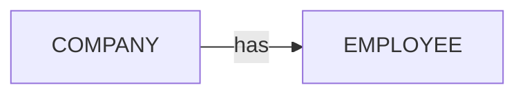
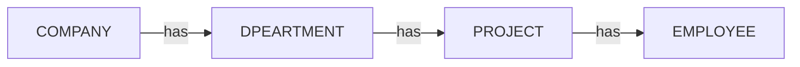
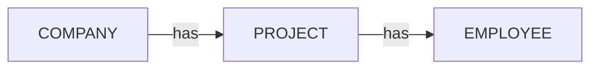
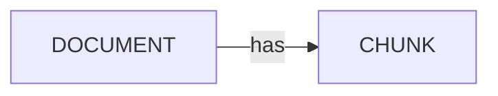

# Aggregations

SearchQuery provides powerful aggregation capabilities that allow you to perform calculations and collect data from your records and their relationships.

#### Aggregation Placement in SearchQuery DTO

All aggregation clauses are defined in the `aggregate` key of the SearchQuery DTO, which is at the same level as other query parameters such as `where`, `limit`, `skip`, `orderBy`, and `labels`:

```typescript
// SearchQuery
{
  labels: ['COMPANY'],       // Record labels to search
  where: { /* conditions */ },  // Filtering conditions
  limit: 10,                 // Results limit
  skip: 0,                   // Results offset
  orderBy: { name: 'asc' },  // Sorting
  aggregate: {               // Aggregation definitions
    count: {
      fn: 'count',
      alias: '$record'
    },
    // More aggregations...
  }
}
```

> **Note**: Aggregations are applied only when fetching records and have no effect on other endpoints supporting SearchQuery. The main goal of aggregations is to fetch Records in the desired shape, optimizing data retrieval and transformation in a single query.


## Available Aggregation Functions

The following aggregation functions are supported:

- `avg` - Calculate average value of a numeric field
- `count` - Count records (with optional `unique` parameter)
- `max` - Get maximum value from a field
- `min` - Get minimum value from a field
- `sum` - Calculate sum of a numeric field
- `collect` - Gather field values or entire records into an array
- `timeBucket` - Bucket a datetime field into calendar intervals (day/week/month/quarter/year or custom N-month size)
- `gds.similarity.*` - Calculate vector similarity using various algorithms:
  - `cosine` - Cosine similarity [-1,1]
  - `euclidean` - Euclidean distance normalized to (0,1]
  - `euclideanDistance` - Raw euclidean distance [0,∞)
  - `jaccard` - Jaccard similarity [0,1]
  - `overlap` - Overlap coefficient [0,1]
  - `pearson` - Pearson correlation [-1,1]

  ## Grouping Results (groupBy)

  For full coverage of grouping semantics, patterns, and limitations see the dedicated [Grouping guide](./group-by.md). Below is a minimal teaser example:

  ```typescript
  {
    labels: ['ORDER'],
    aggregate: {
      count: { fn: 'count' },
      avgTotal: { fn: 'avg', field: 'total' }
    },
    groupBy: ['$record.status'],
    orderBy: { count: 'desc' }
  }
  ```

  You can also "self-group" by an aggregation key itself when you only need the aggregated value(s) and no natural dimension. Example:

  ```typescript
  {
    labels: ['ORDER'],
    aggregate: {
      totalRevenue: { fn: 'sum', field: 'total' },
      orderCount: { fn: 'count' }
    },
    groupBy: ['totalRevenue', 'orderCount']
  }
  ```
  This produces a single-row result array with both metrics. See the [Grouping guide](./group-by.md#grouping-only-by-an-aggregated-value-self-group) for details.

### Ordering by Aggregated Keys (Late Order & Pagination)

When you reference an aggregated key explicitly in `orderBy`, RushDB defers the `ORDER BY` and pagination (`SKIP` / `LIMIT`) until *after* aggregation is performed. This guarantees that the aggregation is calculated across the full qualifying record set before any limiting occurs.

If you omit an explicit `orderBy` on aggregated keys, the engine applies the default ordering (by internal ID, descending) and pagination *before* the aggregation step. In self‑group or small group scenarios this can produce misleading or incomplete aggregate values because only the first page of raw records (according to default ordering) is fed into the aggregation pipeline.

Example (explicit ordering on aggregated key – correct full aggregation):

```jsonc
// Request
{
  "labels": ["HS_DEAL"],
  "aggregate": {
    "totalAmount": { "fn": "sum", "field": "amount", "alias": "$record" }
  },
  "orderBy": { "totalAmount": "asc" },
  "groupBy": ["totalAmount"]
}
```

Produces Cypher (ORDER BY after aggregation):

```cypher
MATCH (record:__RUSHDB__LABEL__RECORD__:`HS_DEAL` { __RUSHDB__KEY__PROJECT__ID__: $projectId })
WITH sum(record.`amount`) AS `totalAmount`
ORDER BY `totalAmount` ASC SKIP 0 LIMIT 100
RETURN {`totalAmount`:`totalAmount`} as records
```

Example (no explicit aggregated ordering – pagination happens early):

```jsonc
// Request
{
  "labels": ["HS_DEAL"],
  "aggregate": {
    "totalAmount": { "fn": "sum", "field": "amount", "alias": "$record" }
  },
  "groupBy": ["totalAmount"]
}
```

Produces Cypher (ORDER BY / LIMIT before aggregation):

```cypher
MATCH (record:__RUSHDB__LABEL__RECORD__:`HS_DEAL` { __RUSHDB__KEY__PROJECT__ID__: $projectId })
ORDER BY record.`__RUSHDB__KEY__ID__` DESC SKIP 0 LIMIT 100
WITH sum(record.`amount`) AS `totalAmount`
RETURN {`totalAmount`:`totalAmount`} as records
```

Why this matters:
- First version sums across all matching deals, then orders/paginates the *result rows* (one row here).
- Second version limits the input rows *before* summing; result may exclude records beyond the first page, giving an underreported total.

Guidelines:
- Always specify `orderBy` with aggregated keys you care about when using `groupBy` (including self-group) if you need accurate totals across the entire match set.
- Omit the aggregated `orderBy` only if you intentionally want to aggregate over a pre-sliced subset of records (rare).
- The late ordering rule applies to any aggregated field listed in `orderBy`, not only self-group patterns.

See also: [Pagination & Order guide](./pagination-order.md#ordering-with-aggregations) for broader pagination implications.


## Aliases

Each aggregation function can specify an `alias` indicating which traversed record to read from. If you omit `alias`, RushDB defaults to the root record alias `$record`. To pull values from related records, introduce aliases in the `where` clause with `$alias` and then reference them in aggregations.

```typescript
{
  labels: ['COMPANY'],
  where: {
    DEPARTMENT: {
      $alias: '$department',
      PROJECT: {
        $alias: '$project',
        EMPLOYEE: {
          $alias: '$employee'
        }
      }
    }
  },
  aggregate: {
    // Referencing to root record using '$record' alias
    companyName: '$record.name',
    // Now can use $employee in aggregations
    avgSalary: { fn: 'avg', field: 'salary', alias: '$employee' }
  }
}
```

## Basic Aggregations

Example topology:



###  avg
**Parameters:**
- `fn`: 'avg' - The aggregation function name
- `field`: string - The field to calculate average for
- `alias?`: string - Record alias (defaults to `$record`)
- `precision?`: number - Optional decimal precision for the result

```typescript
{
  labels: ['COMPANY'],
  where: {
    EMPLOYEE: {
      $alias: '$employee',
      salary: {
        $gte: 50000  // Filter employees by salary
      }
    }
  },
  aggregate: {
    avgSalary: {
      fn: 'avg',
      field: 'salary',
      alias: '$employee',
      precision: 2  // Optional: Set precision for the result
    }
  }
}
```

###  count
**Parameters:**
- `fn`: 'count' - The aggregation function name
- `alias?`: string - Record alias (defaults to `$record`)
- `field?`: string - Optional field to count
- `unique?`: boolean - Optional flag to count unique values

```typescript
{
  labels: ['COMPANY'],
  where: {
    EMPLOYEE: {
      $alias: '$employee'
    }
  },
  aggregate: {
    employeesCount: {
      fn: 'count',
      unique: true,  // Count unique employees
      alias: '$employee'
    }
  }
}
```

###  max
**Parameters:**
- `fn`: 'max' - The aggregation function name
- `field`: string - The field to find maximum value from
- `alias?`: string - Record alias (defaults to `$record`)

```typescript
{
  labels: ['COMPANY'],
  where: {
    EMPLOYEE: {
      $alias: '$employee'
    }
  },
  aggregate: {
    maxSalary: {
      fn: 'max',
      field: 'salary',
      alias: '$employee'
    }
  }
}
```

###  min
**Parameters:**
- `fn`: 'min' - The aggregation function name
- `field`: string - The field to find minimum value from
- `alias?`: string - Record alias (defaults to `$record`)

```typescript
{
  labels: ['COMPANY'],
  where: {
    EMPLOYEE: {
      $alias: '$employee'
    }
  },
  aggregate: {
    minSalary: {
      fn: 'min',
      field: 'salary',
      alias: '$employee'
    }
  }
}
```

###  sum
**Parameters:**
- `fn`: 'sum' - The aggregation function name
- `field`: string - The field to calculate sum for
- `alias?`: string - Record alias (defaults to `$record`)

```typescript
{
  labels: ['COMPANY'],
  where: {
    EMPLOYEE: {
      $alias: '$employee'
    }
  },
  aggregate: {
    totalWage: {
      fn: 'sum',
      field: 'salary',
      alias: '$employee'
    }
  }
}
```

###  collect
**Parameters:**
- `fn`: 'collect' - The aggregation function name
- `alias?`: string - Record alias (defaults to `$record`)
- `field?`: string - Optional field to collect (if not provided, collects entire records)
- `unique?`: boolean - Optional flag to collect unique values only. True by default.
- `limit?`: number - Optional maximum number of items to collect
- `skip?`: number - Optional number of items to skip
- `orderBy?`: TSearchSort - Optional sorting configuration

```typescript
{
  labels: ['COMPANY'],
  where: {
    EMPLOYEE: {
      $alias: '$employee'
    }
  },
  aggregate: {
    employeeNames: {
      fn: 'collect',
      field: 'name',
      alias: '$employee',
      unique: true  // Optional: true by default
    }
  }
}
```

  ###  timeBucket
  Temporal bucketing for datetime fields. Produces a normalized bucket start `datetime` value you can group by (and then apply other aggregations like `count`, `sum`, etc.).

  **Parameters:**
  - `fn`: 'timeBucket' – Function name
  - `field`: string – Datetime field to bucket (must be typed as `"datetime"` in the record metadata)
  - `alias?`: string – Record alias to read from (defaults to `$record`)
  - `granularity`: 'day' | 'week' | 'month' | 'quarter' | 'year' | 'months'
    - Use `'months'` when you need a custom N‑month window size (see `size` below)
  - `size?`: number – Positive integer required only when `granularity: 'months'` (e.g. 2 = bi‑monthly, 3 = quarterly equivalent, 6 = half‑year)

  **Behavior & Guardrails:**
  - RushDB checks the field's type metadata (`datetime`) before computing the bucket; if it is not a datetime field the bucket value becomes `null`.
  - Bucket value is the start of the interval (e.g. month bucket -> first day of month at 00:00:00, quarter -> first day of the quarter, week uses Neo4j `datetime.truncate('week', ...)`).
  - For `granularity: 'months'` the bucket start month is computed with: `1 + size * floor((month - 1)/size)`.
    - Setting `size: 3` is equivalent to `granularity: 'quarter'`.
    - `quarter` is provided as a semantic shortcut (3‑month periods starting at months 1,4,7,10).
  - Difference example: `quarter` -> buckets start at 1,4,7,10; `months` + `size:4` -> buckets start at 1,5,9 (three 4‑month buckets per year). Use `size:3` for quarter‑like grouping when using the generic mode.

  #### Example: Daily record counts
  ```typescript
  {
    labels: ['EVENT'],
    aggregate: {
  day: { fn: 'timeBucket', field: 'createdAt', granularity: 'day' },
  count: { fn: 'count' }
    },
    groupBy: ['day'],
    orderBy: { day: 'asc' }
  }
  ```

  #### Example: Quarterly revenue (semantic `quarter`)
  ```typescript
  {
    labels: ['INVOICE'],
    aggregate: {
  quarterStart: { fn: 'timeBucket', field: 'issuedAt', granularity: 'quarter' },
  quarterlyRevenue: { fn: 'sum', field: 'amount' }
    },
    groupBy: ['quarterStart'],
    orderBy: { quarterStart: 'asc' }
  }
  ```

  #### Example: Custom bi‑monthly (every 2 months) active user count
  ```typescript
  {
    labels: ['SESSION'],
    where: { status: 'active' },
    aggregate: {
  periodStart: { fn: 'timeBucket', field: 'startedAt', granularity: 'months', size: 2 },
  activeSessions: { fn: 'count' }
    },
    groupBy: ['periodStart'],
    orderBy: { periodStart: 'asc' }
  }
  ```

  #### Example: Half‑year (size=6) average deal value
  ```typescript
  {
    labels: ['DEAL'],
    aggregate: {
  halfYear: { fn: 'timeBucket', field: 'closedAt', granularity: 'months', size: 6 },
  avgDeal: { fn: 'avg', field: 'amount', precision: 2 }
    },
    groupBy: ['halfYear'],
    orderBy: { halfYear: 'asc' }
  }
  ```

  #### Filtering / Null Buckets
  If some records lack the datetime type metadata for the chosen field, their bucket will be `null`. To exclude them, add a `where` condition ensuring the field exists and is properly typed, or post‑filter client side. (A future enhancement could expose `$notNull` filtering on aggregation outputs.)

  #### Combining with Other Aggregations (Self‑Group)
  You can self‑group just by the bucket and one or more metrics:
  ```typescript
  {
    labels: ['ORDER'],
    aggregate: {
  monthStart: { fn: 'timeBucket', field: 'createdAt', granularity: 'month' },
  monthlyRevenue: { fn: 'sum', field: 'total' },
  orderCount: { fn: 'count' }
    },
    groupBy: ['monthStart'],
    orderBy: { monthStart: 'asc' }
  }
  ```
  Result rows each represent one calendar month start with aggregated metrics.

  ---

---

### Complete Example

```typescript
{
  labels: ['COMPANY'],
  where: {
    EMPLOYEE: {
      $alias: '$employee',  // Define alias for employee records
      salary: {
        $gte: 50000  // Filter employees by salary
      }
    }
  },
  aggregate: {
    // Use field directly from record
    companyName: '$record.name',

    // Count unique employees using the defined alias
    employeesCount: { fn: 'count', unique: true, alias: '$employee' },

    // Calculate total salary using the defined alias
    totalWage: { fn: 'sum', field: 'salary', alias: '$employee' },

    // Collect unique employees names
    employeeNames: { fn: 'collect', field: 'name', alias: '$employee' },

    // Get average salary with precision
    avgSalary: { fn: 'avg', field: 'salary', alias: '$employee', precision: 0 },

    // Get min and max salary
    minSalary: { fn: 'min', field: 'salary', alias: '$employee' },
    maxSalary: { fn: 'max', field: 'salary', alias: '$employee' }
  }
}
```

<details>

<summary>Example data and response</summary>

```typescript
// Company record
{
  __id: "018838b8-2e1f-7000-8000-a29392548450",
  __label: "COMPANY",
  name: "TechCorp",
  stage: ["seed"]
}

// Employee records
[
  {
    __id: "018838b8-2e1f-7000-8000-b45fd8932abc",
    __label: "EMPLOYEE",
    name: "John Doe",
    salary: 550000
  },
  {
    __id: "018838b8-2e1f-7000-8000-c67de9043def",
    __label: "EMPLOYEE",
    name: "Jane Smith",
    salary: 600000
  }
]

// Query result:
{
  data: [{
    __id: "018838b8-2e1f-7000-8000-a29392548450",
    __label: "COMPANY",
    companyName: "TechCorp",
    employeesCount: 2,
    totalWage: 1150000,
    avgSalary: 575000,
    minSalary: 550000,
    maxSalary: 600000,
    employeeNames: ["Jane Smith", "John Doe"]
  }],
  total: 1,
  success: true
}
```

</details>


## Nested Aggregations

SearchQuery supports two types of nested aggregations:

### 1. Collecting Nested Records

You can use the `collect` operator to build nested JSON structures containing arrays of related records. Due to Cypher limitations, when using nested collection, only the `collect` operator is supported at nested levels.


Example topology:



Example with nested where clauses and corresponding aggregations:

```typescript
{
  labels: ['COMPANY'],
  where: {
    DPEARTMENT: {
      $alias: '$department',  // Level 1 alias
      PROJECT: {
        $alias: '$project',   // Level 2 alias
        EMPLOYEE: {
          $alias: '$employee', // Level 3 alias
          salary: {
            $gte: 100000      // Filter condition
          }
        }
      }
    }
  },
  aggregate: {
    departments: {
      fn: 'collect',
      alias: '$department',   // Use Level 1 alias
      aggregate: {
        projects: {
          fn: 'collect',
          alias: '$project',  // Use Level 2 alias
          orderBy: {
            projectName: 'asc'
          },
          aggregate: {
            employees: {
              fn: 'collect',
              alias: '$employee', // Use Level 3 alias
              orderBy: {
                salary: 'desc'
              },
              limit: 3
            }
          }
        }
      }
    }
  }
}
```

<details>

<summary>Example data and response</summary>

```typescript
// Company record
{
  __id: "018838b8-2e1f-7000-8000-a29392548450",
  __label: "COMPANY",
  name: "TechCorp",
  rating: 4
}

// Department records
[
  {
    __id: "018838b8-2e1f-7000-8000-d89ef1154abc",
    __label: "departments",
    name: "Engineering"
  },
  {
    __id: "018838b8-2e1f-7000-8000-e92fg2265bcd",
    __label: "departments",
    name: "Sales"
  }
]

// Project records
[
  {
    __id: "018838b8-2e1f-7000-8000-f34gh3376cde",
    __label: "projects",
    projectName: "Mobile App"
  },
  {
    __id: "018838b8-2e1f-7000-8000-g56hi4487def",
    __label: "projects",
    projectName: "Web Platform"
  }
]

// Employee records
[
  {
    __id: "018838b8-2e1f-7000-8000-h78ij5598efg",
    __label: "employees",
    name: "John Doe",
    salary: 500000
  },
  {
    __id: "018838b8-2e1f-7000-8000-i90kl6609fgh",
    __label: "employees",
    name: "Jane Smith",
    salary: 550000
  },
  {
    __id: "018838b8-2e1f-7000-8000-j12mn7710ghi",
    __label: "employees",
    name: "Bob Wilson",
    salary: 600000
  }
]

// Query result with nested collection:
{
  data: [{
    __id: "018838b8-2e1f-7000-8000-a29392548450",
    __label: "COMPANY",
    departments: [{
      __id: "018838b8-2e1f-7000-8000-d89ef1154abc",
      name: "Engineering",
      projects: [{
        __id: "018838b8-2e1f-7000-8000-f34gh3376cde",
        projectName: "Mobile App",
        employees: [
          {
            __id: "018838b8-2e1f-7000-8000-j12mn7710ghi",
            name: "Bob Wilson",
            salary: 600000
          },
          {
            __id: "018838b8-2e1f-7000-8000-i90kl6609fgh",
            name: "Jane Smith",
            salary: 550000
          },
          {
            __id: "018838b8-2e1f-7000-8000-h78ij5598efg",
            name: "John Doe",
            salary: 500000
          }
        ]
      }]
    }]
  }],
  total: 1,
  success: true
}
```
</details>


### 2. Aggregating Values from Nested Records

Example topology:



Example with deep nested aggregation:

```typescript
{
  labels: ['COMPANY'],
  where: {
    PROJECT: {
      EMPLOYEE: {
        $alias: '$employee',
        salary: {
          $gte: 50000  // Filter condition
        }
      }
    }
  },
  aggregate: {
    avgEmployeeSalary: {
      fn: 'avg',
      field: 'salary',
      alias: '$employee' // Use alias from deepest level
    }
  }
}
```

<details>

<summary>Example data and response</summary>

```typescript
// Company record
{
  __id: "018838b8-2e1f-7000-8000-a29392548450",
  __label: "COMPANY",
  name: "TechCorp",
  rating: 4
}

// Project records
[
  {
    __id: "018838b8-2e1f-7000-8000-f34gh3376cde",
    __label: "PROJECT",
    name: "Mobile App"
  }
]

// Employee records under projects
[
  {
    __id: "018838b8-2e1f-7000-8000-h78ij5598efg",
    __label: "EMPLOYEE",
    name: "John Doe",
    salary: 500000
  },
  {
    __id: "018838b8-2e1f-7000-8000-i90kl6609fgh",
    __label: "EMPLOYEE",
    name: "Jane Smith",
    salary: 550000
  }
]

// Query result with aggregated values:
{
  data: [{
    __id: "018838b8-2e1f-7000-8000-a29392548450",
    __label: "COMPANY",
    avgEmployeeSalary: 525000
  }],
  total: 1,
  success: true
}
```

</details>

## Collect Operator Options

The `collect` operator supports additional options for pagination and sorting:

- `limit` - Maximum number of records to collect
- `skip` - Number of records to skip
- `orderBy` - Sort collected records by specified fields
- `unique` - Collect only unique values (when collecting field values)
- `field` - Collect specific field values instead of entire records

Example:
```typescript
{
  labels: ['COMPANY'],
  where: {
    DEPARTMENT: {
      $alias: '$department'
    }
  },
  aggregate: {
    // Collect unique tags from departments
    tags: {
      fn: 'collect',
      alias: '$department',
      field: 'tags',    // Collect only tags field
      unique: true,       // Remove duplicates
      limit: 100,       // Collect up to 100 tags
      orderBy: {        // Sort alphabetically
        name: 'asc'
      }
    }
  }
}
```

<details>

<summary>Example data and response</summary>

```typescript
// Company record
{
  __id: "018838b8-2e1f-7000-8000-a29392548450",
  __label: "COMPANY",
  name: "TechCorp"
}

// Department records
[
  {
    __id: "018838b8-2e1f-7000-8000-d89ef1154abc",
    __label: "DEPARTMENT",
    name: "Engineering",
    tags: ["tech", "development", "agile"]
  },
  {
    __id: "018838b8-2e1f-7000-8000-e92fg2265bcd",
    __label: "DEPARTMENT",
    name: "Sales",
    tags: ["sales", "business", "development"]
  }
]

// Query result with collected tags:
{
  data: [{
    __id: "018838b8-2e1f-7000-8000-a29392548450",
    __label: "COMPANY",
    tags: ["agile", "business", "development", "sales", "tech"]
  }],
  total: 1,
  success: true
}
```

</details>


## Vector Similarity Aggregations

Example topology:



###  gds.similarity.*
**Parameters:**
- `fn`: 'gds.similarity.[algorithm]' - The similarity algorithm to use
  - `gds.similarity.cosine` - Cosine similarity [-1,1]
  - `gds.similarity.euclidean` - Euclidean distance normalized to (0,1]
  - `gds.similarity.euclideanDistance` - Raw euclidean distance [0,∞)
  - `gds.similarity.jaccard` - Jaccard similarity [0,1]
  - `gds.similarity.overlap` - Overlap coefficient [0,1]
  - `gds.similarity.pearson` - Pearson correlation [-1,1]
- `field`: string - The vector field to compare
- `alias`: string - The record alias to use
- `query`: number[] - The query vector to calculate similarity against


Example showing vector search with where clause and similarity aggregation:

```typescript
{
  labels: ['DOCUMENT'],
  where: {},
  aggregate: {
    // Calculate similarity score using root level alias
    similarity: {
      fn: 'gds.similarity.cosine',
      field: 'embedding',
      query: [1, 2, 3, 4, 5],
      alias: '$record'
    }
  }
}
```

<details>

<summary>Example data and response</summary>

```typescript
// Document record
{
  __id: "018838b8-2e1f-7000-8000-k34op8821hij",
  __label: "DOCUMENT",
  title: "Machine Learning Basics"
}

// Chunk records
[
  {
    __id: "018838b8-2e1f-7000-8000-l56pq9932ijk",
    __label: "CHUNK",
    content: "Introduction to neural networks",
    embedding: [1.2, 0.5, -0.3, 0.8, 0.1]
  },
  {
    __id: "018838b8-2e1f-7000-8000-m78rs0043jkl",
    __label: "CHUNK",
    content: "Deep learning architectures",
    embedding: [0.9, 0.4, -0.2, 0.7, 0.3]
  }
]

// Query result with similarity scores:
{
  data: [{
    __id: "018838b8-2e1f-7000-8000-k34op8821hij",
    __label: "DOCUMENT",
    similarity: 0.82,
    chunks: [
      {
        __id: "018838b8-2e1f-7000-8000-l56pq9932ijk",
        __label: "CHUNK",
        content: "Introduction to neural networks",
        similarity: 0.78
      },
      {
        __id: "018838b8-2e1f-7000-8000-m78rs0043jkl",
        __label: "CHUNK",
        content: "Deep learning architectures",
        similarity: 0.65
      }
    ]
  }],
  total: 1,
  success: true
}
```
</details>


