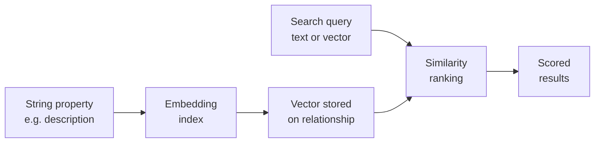

# Semantic Search

RushDB lets you search records by **meaning**, not just exact field values. Create an embedding index on any string property and every record that carries that property becomes searchable by natural-language similarity — while still supporting all the usual field filters, pagination, and graph traversal.

## How It Works



1. **Create an index** — Pick a label and a string property. RushDB creates a vector index policy.
2. **Embed** — For **managed** indexes, RushDB generates embeddings automatically on write and backfills existing records. For **external** (BYOV) indexes, your application supplies pre-computed vectors.
3. **Search** — Pass a natural-language query (managed) or a pre-computed vector (external). RushDB ranks candidates by cosine or euclidean similarity and returns scored results.

## Managed vs. External Indexes

| Aspect | Managed | External (BYOV) |
|---|---|---|
| Embeddings generated by | RushDB (server-side) | Your application |
| Write flow | Automatic on record create/update | Supply vectors via `upsertVectors` or inline on write |
| Search input | Natural-language `query` string | Pre-computed `queryVector` array |
| Model control | RushDB-managed model | Any model, any dimension |

Both types store vectors on the value relationship between the property node and the record node, using Neo4j's native vector index for fast retrieval.

## Combining with Field Filters

Semantic search is not an either/or — it composes with RushDB's structured query capabilities. Pass a `where` clause to pre-filter candidates before similarity ranking:

```
Search "space exploration"
  WHERE genre = "sci-fi" AND year >= 2000
  LIMIT 10
```

This narrows the vector search to only matching records, keeping results precise and fast.

## Two Ways to Search Semantically

### 1. `db.ai.search()` — dedicated semantic endpoint

The simplest path. Returns records ranked by similarity score (`__score`):

- Accepts `query` (text) for managed indexes or `queryVector` for external indexes.
- Supports `where` pre-filtering, `limit`, and `skip`.
- Results always ordered by `__score` descending (best match first).

### 2. `vector.similarity` aggregation in SearchQuery

For advanced use cases, add a `vector.similarity.cosine` or `vector.similarity.euclidean` aggregation to any `db.records.find()` call. This gives you the full SearchQuery feature set (groupBy, collect, multi-hop relationships) alongside similarity scoring.

→ See [Search — Aggregations](./search/aggregations.md) for the aggregation syntax.

## Index Lifecycle

| State | Description |
|---|---|
| `pending` | Index created, backfill not yet started. |
| `indexing` | Backfill in progress — existing records are being embedded. |
| `ready` | All records indexed. New records are embedded on write automatically. |

You can check index status at any time and list all indexes for a project.

## When to Use Semantic Search

| Scenario | Approach |
|---|---|
| User knows the exact value | Structured `where` filter |
| User describes what they want in natural language | `db.ai.search()` with `query` |
| Combine meaning + exact constraints | `db.ai.search()` with `where` pre-filter |
| Need groupBy, collect, or multi-hop alongside similarity | `db.records.find()` with `vector.similarity` aggregation |

→ See also [Agent Memory Model](./agent-memory-model.md) for how semantic search fits into the three-layer retrieval stack.

---

## Implementation Reference

Each interface covers search, indexing, and BYOV — pick the one that fits your stack:

<div className="grid grid-cols-1 gap-3 sm:grid-cols-3 not-prose" style={{marginTop: '0.5rem'}}>
  <a href="/typescript-sdk/ai/overview" className="flex flex-col rounded-xl border border-[var(--ifm-color-emphasis-200)] bg-[var(--ifm-card-background-color)] p-5 text-inherit no-underline hover:bg-[var(--ifm-color-emphasis-100)] hover:no-underline">
    <span className="mb-1 text-[14px] font-bold text-[var(--ifm-font-color-base)]">TypeScript SDK</span>
    <span className="text-[13px] text-[var(--ifm-color-emphasis-600)]">db.ai.search · db.ai.indexes · BYOV</span>
  </a>
  <a href="/python-sdk/ai/overview" className="flex flex-col rounded-xl border border-[var(--ifm-color-emphasis-200)] bg-[var(--ifm-card-background-color)] p-5 text-inherit no-underline hover:bg-[var(--ifm-color-emphasis-100)] hover:no-underline">
    <span className="mb-1 text-[14px] font-bold text-[var(--ifm-font-color-base)]">Python SDK</span>
    <span className="text-[13px] text-[var(--ifm-color-emphasis-600)]">db.ai.search · db.ai.indexes · BYOV</span>
  </a>
  <a href="/rest-api/ai/overview" className="flex flex-col rounded-xl border border-[var(--ifm-color-emphasis-200)] bg-[var(--ifm-card-background-color)] p-5 text-inherit no-underline hover:bg-[var(--ifm-color-emphasis-100)] hover:no-underline">
    <span className="mb-1 text-[14px] font-bold text-[var(--ifm-font-color-base)]">REST API</span>
    <span className="text-[13px] text-[var(--ifm-color-emphasis-600)]">POST /ai/search · /ai/indexes · BYOV</span>
  </a>
</div>
