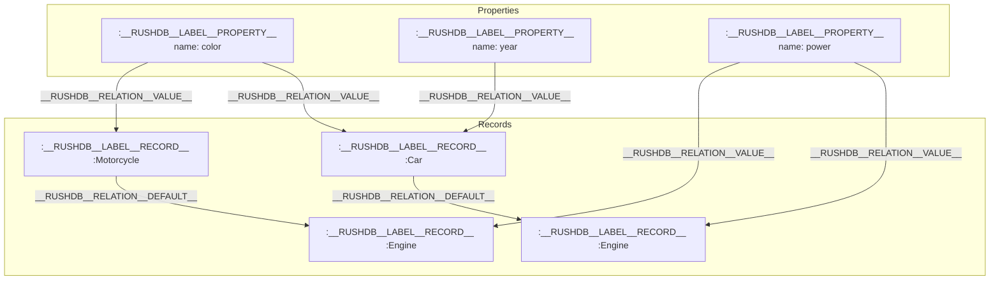
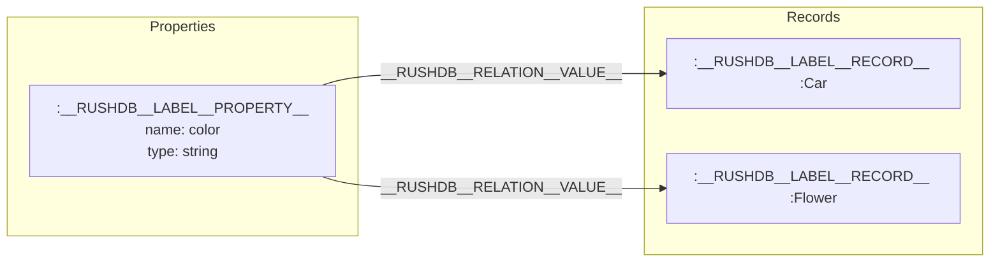
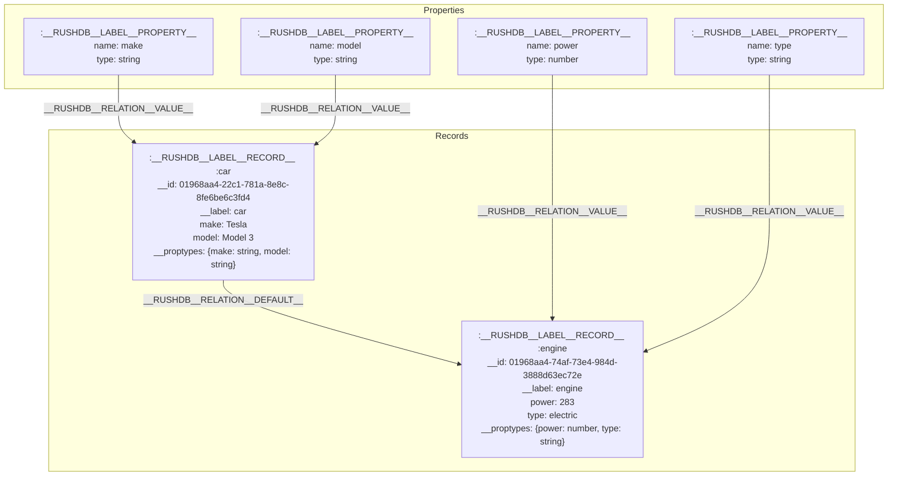

# Storage

RushDB leverages [Neo4j](https://neo4j.com/docs/getting-started/get-started-with-neo4j/) (version 5.25.1 or higher) as its underlying storage engine, enhanced with the [APOC](https://neo4j.com/labs/apoc/) (Awesome Procedures On Cypher) and [GDS](https://neo4j.com/docs/graph-data-science/current/) (Graph Data Science) plugins to perform efficient vector similarity searches and advanced graph operations.

## Graph Database vs. Traditional Databases

Unlike traditional database models, Neo4j's graph approach offers distinct advantages for connected data:

| Database Type | Core Concept | RushDB Analogy |
|---------------|--------------|----------------|
| **Relational DB** | Tables with rows and columns | A table would be a label, a row would be a record, but relationships would require complex JOIN operations |
| **Document DB** | Collections of JSON documents | Each JSON document would be a record, but connecting documents requires explicit reference fields |
| **Graph DB (Neo4j)** | Nodes and relationships | Records are nodes with properties, and relationships are first-class citizens that connect related data |

In Neo4j, relationships are physical connections in the database, not just foreign key references, enabling:
- Traversing connections without costly JOIN operations
- Discovering patterns across different data types
- Modeling complex, interconnected data naturally

## Neo4j Foundation

Neo4j provides RushDB with a robust graph database foundation, allowing for:
- High-performance graph traversals
- ACID-compliant transactions
- Property graph model flexibility
- Scalable data storage and retrieval

The integration with [APOC](https://neo4j.com/labs/apoc/4.4/overview/) and [GDS](https://neo4j.com/docs/graph-data-science/current/introduction/) plugins extends Neo4j's native capabilities with vector-based operations critical for machine learning workflows and similarity search functions.

## Data Overhead

Each record in RushDB (a meaningful key-value data piece) is extended with several internal properties that enable advanced functionality:

| Internal Key | Client Representation | Description |
|--------------|----------------------|-------------|
| `__RUSHDB__KEY__ID__` | `__id` | UUIDv7 that enables lexicographic ordering without relying on user-defined fields like `createdAt`. RushDB SDKs support converting `__id` to timestamp and ISO8601 date. For more details, see [UUIDv7 specification](https://www.ietf.org/archive/id/draft-peabody-uuid-v7-01.html). |
| `__RUSHDB__KEY__PROPERTIES__META__` | `__proptypes` | Stringified meta-object holding the types of data in the current record, e.g., `{ name: "string", active: "boolean", ... }` |
| `__RUSHDB__KEY__LABEL__` | `__label` | Record Label identifier. Every record has two labels: a default one (`__RUSHDB__LABEL__RECORD__`) and a user-defined one that is searchable. Currently, RushDB allows only one custom label per record, and it is required by default. For more details about labels, see [Labels](/concepts/labels). |
| `__RUSHDB__KEY__PROJECT__ID__` | `__projectId` | Project identifier for multitenancy isolation. This property is never exposed to clients via UI or API. |


## Data Structure

RushDB organizes data in a graph structure that represents both records and properties as first-class entities:



In this structure:

| Graph Element | Internal Label | Description |
|--------------|----------------|-------------|
| Records | `__RUSHDB__LABEL__RECORD__` | Nodes that represent user-defined entities (Car, Engine, Motorcycle) |
| Properties | `__RUSHDB__LABEL__PROPERTY__` | Nodes that represent data attributes with a "name" field storing the property name |
| Value Relations | `__RUSHDB__RELATION__VALUE__` | Edges connecting properties to their records (the property → record direction) |
| Default Relations | `__RUSHDB__RELATION__DEFAULT__` | Edges connecting related records (like Car to Engine) |

This structure allows efficient traversals across related records while maintaining property-based connections that can reveal relationships between otherwise unrelated entities.

## Property Graph Model

RushDB implements a unique property graph model where properties are first-class citizens:



Properties interconnect records through a unique set of field name and type. For example, both a `Car` record and a `Flower` record can share a common property `color:string`. This approach:

1. Enables performant queries across different record types
2. Facilitates the discovery of hidden insights in data
3. Creates a natural graph structure that leverages Neo4j's native traversal capabilities

Properties are not shared amongst projects (database instances), ensuring complete isolation in multi-tenant environments.

## Data Types

RushDB supports a wide range of data types to accommodate diverse data needs and provide a flexible environment for your applications. Below is a comprehensive find of the supported data types along with their descriptions:

### `string`
This data type is used for any textual information and can hold text of unlimited length.

### `number`
This data type accommodates both floating-point numbers and integers. For instance, it can handle values like
`-120.209817` (a float) or `42` (an integer).

### `datetime`
This data type adheres to the ISO 8601 format, including timezones. For example: `2012-12-21T18:29:37Z`.

### `boolean`
This data type can only have two possible values: `true` or `false`.

### `null`
This data type has only one possible value: `null`.

### `vector`
This data type accommodates arrays of both floating-point numbers and integers. It handles values like
`[0.99070,0.78912, 1, 0]`. This is particularly useful for vector similarity searches and machine learning operations.


---
### Arrays

In essence, RushDB supports all the data types that JSON does. However, when it comes to arrays (or Lists), RushDB can indeed
hold them as **Property** values, but it's important to note that it can only store <u>consistent values</u> within those
arrays. To learn more, check out the [Properties](/concepts/properties) section.

> **Note:** Every data type mentioned above (except `vector`, since it's already an array by default) supports an array representation.

Here some valid examples:
- `["apple", "banana", "carrot"]` - good
- `[null, null, null, null, null]` - weird, but works fine 🤔
- `[4, 8, 15, 16, 23, 42]` - works as well
- `["2023-09-17T02:47:54+04:00", "1990-08-18T04:35:00+05:00"]` - also good
- `[true, false, true, false, true]` - love is an answer (🌼)

### Type Handling

When records are imported into RushDB, data types are automatically inferred and stored in the `__RUSHDB__KEY__PROPERTIES__META__` internal field (exposed to clients as `__proptypes`). This metadata is crucial for maintaining type consistency and enabling efficient property-based connections across the graph.

To learn more about how RushDB uses data types for property values and type inference during data import, see [REST API - Import Data](/rest-api/import-data).

## Data Import Mechanism

RushDB applies a breadth-first search (BFS) algorithm to parse JSON tree structures, enhancing each flat level with:

1. A unique ID (`__id`), automatically generated or provided by the user for top-level records
2. Labels (`__label`), either explicitly provided by the user for top-level records or derived from parent keys for nested objects
3. Type inference, automatically suggesting data types for all properties
4. Relationship establishment, connecting nested records with `__RUSHDB__RELATION__DEFAULT__` relationships

This approach allows for intuitive transformation of hierarchical JSON data into graph structures without requiring users to understand the underlying graph model.

Example of JSON to graph transformation:

```json
{
  "car": {
    "make": "Tesla",
    "model": "Model 3",
    "engine": {
      "power": 283,
      "type": "electric"
    }
  }
}
```

Which transforms into the following graph structure:



In this representation:
- Records are nodes with the label `__RUSHDB__LABEL__RECORD__` plus a user-defined label (car, engine)
- Records store the actual values of properties directly as node attributes
- Records also store `__proptypes` metadata about property types
- Properties are nodes with the single label `__RUSHDB__LABEL__PROPERTY__` and contain only the name and type fields (not values)
- Nested objects become connected records with `__RUSHDB__RELATION__DEFAULT__` relationships
- Properties are connected to their records via `__RUSHDB__RELATION__VALUE__` relationships (the property → record direction)

The JSON representation of these records as stored in the database would look like:

```json
[
  {
    "__RUSHDB__KEY__ID__": "01968aa4-22c1-781a-8e8c-8fe6be6c3fd4",
    "__RUSHDB__KEY__LABEL__": "car",
    "__RUSHDB__KEY__PROJECT__ID__": "01968aa4-4225-7833-ba60-2f5e4383bf1b",
    "__RUSHDB__KEY__PROPERTIES__META__": "{\"make\":\"string\",\"model\":\"string\"}",
    "make": "Tesla",
    "model": "Model 3"
  },
  {
    "__RUSHDB__KEY__ID__": "01968aa4-74af-73e4-984d-3888d63ec72e",
    "__RUSHDB__KEY__LABEL__": "engine",
    "__RUSHDB__KEY__PROJECT__ID__": "01968aa4-4225-7833-ba60-2f5e4383bf1b",
    "__RUSHDB__KEY__PROPERTIES__META__": "{\"power\":\"number\",\"type\":\"string\"}",
    "power": 283,
    "type": "electric"
  }
]
```

When these records are returned through RushDB's API or SDKs, the internal keys are transformed to their client-friendly aliases:

```json
[
  {
    "__id": "01968aa4-22c1-781a-8e8c-8fe6be6c3fd4",
    "__label": "car",
    "__proptypes": {"make":"string","model":"string"},
    "make": "Tesla",
    "model": "Model 3"
  },
  {
    "__id": "01968aa4-74af-73e4-984d-3888d63ec72e",
    "__label": "engine",
    "__proptypes": {"power":"number","type":"string"},
    "power": 283,
    "type": "electric"
  }
]
```

Note that the `__projectId` field is never exposed to clients via the API or SDKs as noted in the Data Overhead section.

Each of these records is also connected to Property nodes which define the metadata for their fields, but those Property nodes don't store the actual values.

## Database Indexes and Constraints

When RushDB initializes a new database connection, it automatically creates several indexes and constraints to ensure data integrity and optimize query performance:

### Core Constraints

The following uniqueness constraints are created to enforce data consistency:

| Constraint Name | Node Label | Property | Description |
|-----------------|------------|----------|-------------|
| `constraint_user_login` | `__RUSHDB__LABEL__USER__` | `login` | Ensures each user has a unique login |
| `constraint_user_id` | `__RUSHDB__LABEL__USER__` | `id` | Ensures each user has a unique ID |
| `constraint_token_id` | `__RUSHDB__LABEL__TOKEN__` | `id` | Ensures each token has a unique ID |
| `constraint_project_id` | `__RUSHDB__LABEL__PROJECT__` | `id` | Ensures each project has a unique ID |
| `constraint_workspace_id` | `__RUSHDB__LABEL__WORKSPACE__` | `id` | Ensures each workspace has a unique ID |
| `constraint_record_id` | `__RUSHDB__LABEL__RECORD__` | `__RUSHDB__KEY__ID__` | Ensures each record has a unique ID |
| `constraint_property_id` | `__RUSHDB__LABEL__PROPERTY__` | `id` | Ensures each property has a unique ID |

### Performance Indexes

The following indexes are created to optimize query performance:

| Index Name | Node Label | Properties | Description |
|------------|------------|------------|-------------|
| `index_record_id` | `__RUSHDB__LABEL__RECORD__` | `__RUSHDB__KEY__ID__` | Speeds up record lookups by ID |
| `index_record_projectid` | `__RUSHDB__LABEL__RECORD__` | `__RUSHDB__KEY__PROJECT__ID__` | Enables fast filtering of records by project |
| `index_property_name` | `__RUSHDB__LABEL__PROPERTY__` | `name` | Enables fast property lookups by name |
| `index_property_mergerer` | `__RUSHDB__LABEL__PROPERTY__` | `name`, `type`, `projectId`, `metadata` | Optimizes property node merging operations during data imports |

These indexes and constraints are essential for RushDB's performance and data integrity, particularly when dealing with large datasets and complex queries across the property graph model. They ensure that:

1. Record IDs are always unique within the database
2. Project isolation is maintained in multi-tenant environments
3. Property lookups are efficient, especially during joins and traversals
4. User management operations perform optimally

Learn more at [REST API - Import Data](/rest-api/import-data) or through the language-specific SDKs:
- [TypeScript SDK](/typescript-sdk/records/import-data)
- [Python SDK](/python-sdk/records/import-data)

## Performance Considerations

This approach is carefully designed to:
- Enable efficient indexing and querying
- Support advanced graph traversals and pattern matching
- Facilitate vector similarity searches with minimal computational cost

By structuring data this way, RushDB achieves a balance between storage overhead and query performance, optimizing for use cases that require both traditional database operations and advanced graph analytics capabilities.

