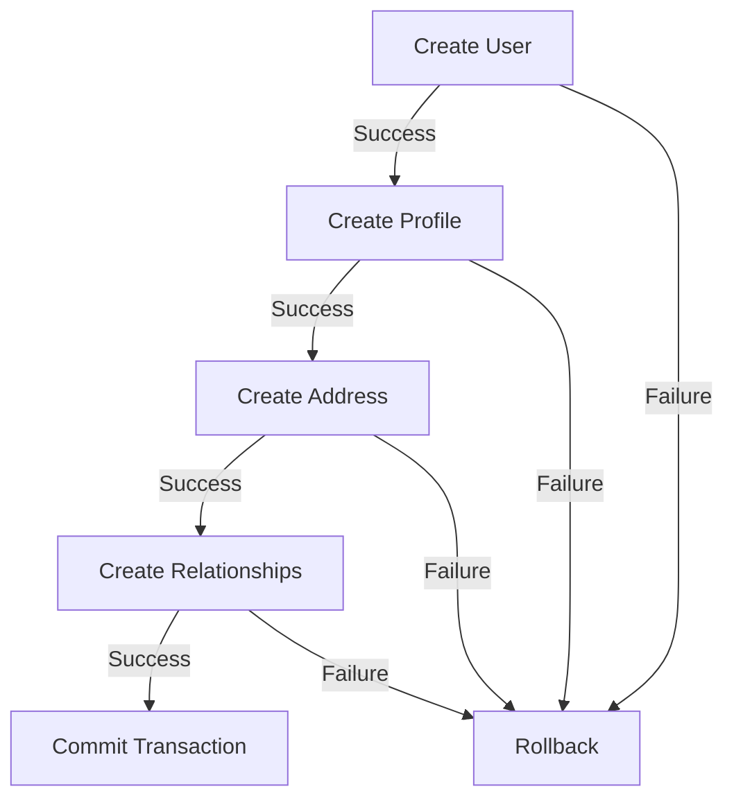

import Tabs from '@theme/Tabs';
import TabItem from '@theme/TabItem';

# Transactions

In RushDB, Transactions provide a mechanism to group multiple database operations into a single atomic unit of work. They ensure data consistency by guaranteeing that either all operations within the transaction succeed, or none of them do.

## How It Works

Transactions in RushDB are built on Neo4j's native transaction capabilities, providing ACID guarantees:

- **Atomicity**: All operations within a transaction either succeed completely or fail completely, with no partial changes.
- **Consistency**: Transactions transform the database from one valid state to another, maintaining data integrity.
- **Isolation**: Concurrent transactions do not interfere with each other, ensuring data consistency.
- **Durability**: Once a transaction is committed, changes are permanent even in case of system failure.

For example:
<Tabs groupId="programming-language">
  <TabItem value="typescript" label="TypeScript" default>
  ```typescript
  // Start a transaction
  const tx = await db.tx.begin({ ttl: 10000 });

  try {
    // Create a new user record within the transaction
    const user = await db.records.create(
      {
        label: 'User',
        payload: {
          name: 'Alice Smith',
          email: 'alice@example.com',
          emailConfirmed: false
        }
      },
      tx
    );

    // Create a related profile record within the same transaction
    const profile = await db.record.create(
      {
        label: "Profile",
        payload: {
          bio: "Software engineer",
          joinDate: new Date().toISOString()
        }
      },
      tx
    );

    // Create a relationship between the records within the same transaction
    await db.records.attach(
      {
        source: user,
        target: profile,
        options: {
          type: 'HAS_PROFILE'
        }
      },
      tx
    );

    // Commit the transaction to make all changes permanent
    await tx.commit();
    // or await db.tx.commit(tx);
  } catch (error) {
    // If any operation fails, roll back the entire transaction
    await tx.rollback();
    // or await db.tx.rollback(tx);
    throw error;
  }
  ```
</TabItem>
  <TabItem value="python" label="Python">
    ```python
    # Start a transaction
    tx = db.tx.begin(ttl=10000)

    try:
        # Create a new user record within the transaction
        user = db.records.create(
            label="User",
            payload={
                "name": "Alice Smith",
                "email": "alice@example.com",
                "emailConfirmed": False
            },
            transaction=tx
        )

        # Create a related profile record within the same transaction
        profile = db.records.create(
            label="Profile",
            payload={
                "bio": "Software engineer",
                "joinDate": datetime.now().isoformat()
            },
            transaction=tx
        )

        # Create a relationship between the records within the same transaction
        db.records.attach(
            source=user,
            target=profile,
            options={
                "type": "HAS_PROFILE"
            },
            transaction=tx
        )

        # Commit the transaction to make all changes permanent
        tx.commit()
        # or db.tx.commit(tx)
    except Exception as error:
        # If any operation fails, roll back the entire transaction
        tx.rollback()
        # or db.tx.rollback(tx)
        raise error
    ```
  </TabItem>
</Tabs>

## Transaction Lifecycle

Each transaction in RushDB follows a clear lifecycle:

1. **Creation**: A transaction is initiated with an optional Time-To-Live (TTL) parameter
2. **Operation Phase**: Multiple database operations are performed using the transaction ID
3. **Termination**: The transaction is explicitly committed to make changes permanent or rolled back to discard all changes
4. **Automatic Cleanup**: If neither committed nor rolled back within the TTL, the transaction is automatically rolled back

## Internal Structure

Built on Neo4j's transaction management system, RushDB transactions maintain several internal states:

| State | Description |
|-------|-------------|
| Active | Transaction is open and can accept operations |
| Committed | Transaction has been successfully completed |
| Rolled Back | Transaction has been explicitly or automatically reverted |
| Timed Out | Transaction exceeded its TTL and was automatically rolled back |

Internally, RushDB maintains a transaction registry that:
1. Tracks all active transactions
2. Monitors their TTL
3. Maps transaction IDs to internal Neo4j transaction objects
4. Manages transaction cleanup and resource release

## Use Cases

Transactions are particularly valuable in several scenarios:

### Complex Data Operations

When creating interconnected data structures, transactions ensure that all components are created successfully or not at all:



### Concurrent Operations

When multiple users or services access the same data simultaneously, transactions maintain data consistency:

<Tabs groupId="programming-language">
  <TabItem value="typescript" label="TypeScript" default>
  ```typescript
  // Service 1
  const tx1 = await db.tx.begin();
  try {
    const record = await db.records.findById(recordId, tx1);
    await db.records.update(
      {
        target: record,
        label: record.label(),
        data: { status: "processing" }
      },
      tx1
    );
    await tx1.commit();
  } catch (error) {
    await tx1.rollback();
  }

  // Service 2 (concurrent)
  const tx2 = await db.tx.begin();
  try {
    const record = await db.records.findById(recordId, tx2);
    // Will see the original record state until tx1 is committed
    await tx2.commit()
  } catch (error) {
    await tx2.rollback()
  }
  ```
  </TabItem>
  <TabItem value="python" label="Python">
    ```python
    # Service 1
    tx1 = db.tx.begin()
    try:
        record = db.records.find_by_id(record_id, transaction=tx1)
        db.records.update(
            target=record,
            label=record.label(),
            data={"status": "processing"},
            transaction=tx1
        )
        tx1.commit()
    except Exception as error:
        tx1.rollback()

    # Service 2 (concurrent)
    tx2 = db.tx.begin()
    try:
        record = db.records.find_by_id(record_id, transaction=tx2)
        # Will see the original record state until tx1 is committed
        tx2.commit()
    except Exception as error:
        tx2.rollback()
    ```
  </TabItem>
</Tabs>

### Data Migrations

When upgrading data structures or transforming records, transactions ensure that data integrity is maintained:
<Tabs groupId="programming-language">
  <TabItem value="typescript" label="TypeScript" default>
  ```typescript
  const tx = await db.tx.begin({ ttl: 30000 }); // Longer TTL for migrations
  try {
    const users = await db.records.find({ labels: ["User"] }, tx);

    for (const user of users) {
      // Create new format record
      await db.records.create(
        {
          label: "Person",
          payload: {
            fullName: `${user.firstName} ${user.lastName}`,
            email: user.email,
            migratedFrom: user.__id
          }
        },
        tx
      );
    }

    await tx.commit();
  } catch (error) {
    await tx.rollback();
    console.error("Migration failed:", error);
  }
  ```
  </TabItem>
  <TabItem value="python" label="Python">
    ```python
    tx = db.tx.begin(ttl=30000)  # Longer TTL for migrations
    try:
        users = db.records.find({"labels": ["User"]}, transaction=tx)

        for user in users:
            # Create new format record
            db.records.create(
                label="Person",
                payload={
                    "fullName": f"{user.get('firstName')} {user.get('lastName')}",
                    "email": user.get('email'),
                    "migratedFrom": user.get('__id')
                },
                transaction=tx
            )

        tx.commit()
    except Exception as error:
        tx.rollback()
        print(f"Migration failed: {error}")
    ```
  </TabItem>
</Tabs>

## Time-To-Live (TTL)

RushDB transactions include a configurable TTL mechanism to prevent hanging transactions:

- **Default**: 5000ms (5 seconds)
- **Maximum**: 30000ms (30 seconds)
- **Purpose**: Automatically rolls back transactions that aren't explicitly committed or rolled back within the specified time
- **Recommendation**: Set TTL based on expected operation duration plus a reasonable buffer

## Transaction Limitations

While transactions provide powerful data consistency guarantees, they come with certain limitations:

1. **Resource Consumption**: Active transactions consume database resources, particularly memory
2. **Performance Impact**: Very long-running transactions can impact overall database performance
3. **TTL Constraints**: Maximum TTL is capped at 30 seconds to prevent resource exhaustion
4. **Isolation Level**: RushDB uses Neo4j's default read-committed isolation level

## Best Practices

To effectively use transactions in RushDB:

1. **Keep transactions short**: Minimize the number and duration of operations within a transaction
2. **Set appropriate TTL**: Choose a TTL that provides enough time for operations to complete without being unnecessarily long
3. **Explicit termination**: Always explicitly commit or rollback transactions rather than relying on automatic TTL-based rollback
4. **Error handling**: Implement proper error handling with rollback in catch blocks
5. **Avoid nested transactions**: Instead of nesting transactions, design workflows to use a single transaction level
6. **Batch operations**: For bulk operations, consider batching changes into multiple smaller transactions

## Integration with Neo4j

RushDB's transaction system leverages Neo4j's native transaction capabilities while adding:

1. Client-friendly transaction IDs
2. Configurable TTL with automatic cleanup
3. Cross-platform SDK integration
4. HTTP API support via transaction headers

This provides the robustness of Neo4j's proven transaction system with the ease of use of RushDB's modern API design.

For detailed information on using transactions, see [REST API - Transactions](/rest-api/transactions) or through the language-specific SDKs:
- [TypeScript SDK](/typescript-sdk/transactions)
- [Python SDK](/python-sdk/transactions)
