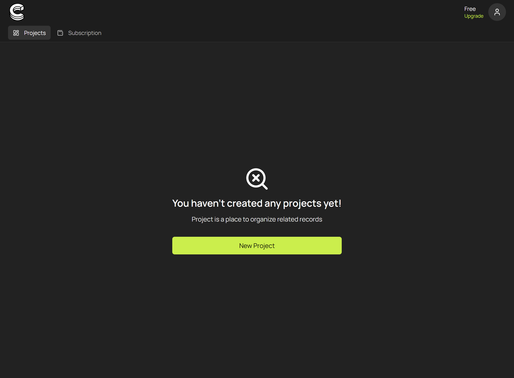

# Get API Key

In this section, we'll walk through the process of registering for RushDB and generating an API token necessary for using the RushDB SDK. This token is essential for authenticating your application's requests to the RushDB backend.

## Step 1: Sign Up for RushDB

First, you need to create a RushDB account. Go to the [RushDB sign-up page](https://app.rushdb.com/signup) and register using your email address or via third-party authentication providers.

## Step 2: Create a Project

Once signed in, you'll be directed to the dashboard. To start working with RushDB, you need to create a project where your records will be stored and managed.

- Click on the **Create Project** button to set up a new project. You might need to provide some basic information about your project, such as its name.



## Step 3: Copy an API Key

After you create your project, you’ll be taken to its Help page, where an API key will already be available. If needed, you can create additional API tokens on the **API Keys** tab.


- In the Authorization section, click the automatically generated API token to copy it. This token will be used to authenticate your SDK instances and allow them to interact with your RushDB project.

**Important:** Keep full-access API tokens secure and do not share them publicly. A full-access token can read, write, and delete all data in your RushDB project — it must only be used server-side.

## Read-only API keys

When creating a key you can choose its permission level:

- **Full access (read & write)** — the default. Can call every API endpoint, including record creation, updates, deletes, imports, and transactions. Server-side use only.
- **Read-only** — can only query data: record search and retrieval, labels, properties, relationships search, aggregations, semantic search, and CSV export. Every write endpoint (creates, updates, deletes, imports, transactions, raw queries) is rejected with `403 Forbidden`, and the underlying database session is additionally opened in read-only mode.

Because a read-only key cannot modify anything, it is safe to embed in client-side code — public demos, dashboards, prototypes, or docs examples that query live data directly from the browser:

```js
import RushDB from '@rushdb/javascript-sdk'

// Safe in the browser: this key can only read data
const db = new RushDB('RUSHDB_READ_ONLY_API_KEY')
const products = await db.records.find({ labels: ['PRODUCT'], limit: 10 })
```

Keep in mind that _read-only_ is not _private_: anyone who extracts the key from your page can read all data in that project. Use read-only keys only for projects whose data is meant to be publicly readable, and set an expiration where possible.

With your API token generated, you're now ready to initialize the RushDB SDK in your application and begin creating and managing Records programmatically. Proceed to the next section to learn about integrating the SDK into your project.
