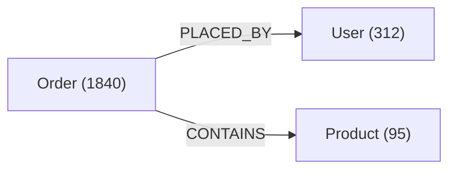

import Tabs from '@site/src/components/LanguageTabs'
import ThemeTabs from '@theme/Tabs'
import TabItem from '@theme/TabItem'

# Schema Self-Awareness

RushDB is **self-aware** — it continuously tracks its own structure and exposes it on demand. Agents use this to operate against an unknown or evolving knowledge graph without any hardcoded schema documentation.

---

## Why Schema Discovery Matters

Without schema discovery, AI agents hallucinate field names, use wrong label casing, and construct invalid queries. With a single schema call at session start, the agent knows:

- Every label and how many records it has
- Every property per label, its type, and sample/range values
- The full relationship map (which labels connect to which)
- Which properties are semantically searchable (have embedding indexes)

---

## What the Agent Receives

Consider a small commerce graph — labels are nodes, relationships are edges:



The schema comes in two formats: a compact Markdown document built for LLM context injection, and structured JSON for programmatic use.

<ThemeTabs groupId="schema-format">
  <TabItem value="markdown" label="Markdown" default>

`getSchemaMarkdown()` serialises the graph into a token-efficient document ready to paste into a system prompt:

```text
# Graph Schema

## Labels

| Label     | Count |
|-----------|------:|
| `Order`   |  1840 |
| `User`    |   312 |
| `Product` |    95 |

---

## `Order` (1840 records)

### Properties

| Property    | Type     | Values / Range                         | Semantic Search                |
|-------------|----------|----------------------------------------|--------------------------------|
| `status`    | string   | `pending`, `paid`, `shipped` (+2 more) | —                              |
| `total`     | number   | `4.99`..`2499.00`                      | —                              |
| `name`      | string   | `Widget A`, `Widget B` (+8 more)       | `managed` cosine 1536d [ready] |
| `createdAt` | datetime | `2024-01-03`..`2026-02-27`             | —                              |

### Relationships

| Type        | Direction | Other Label |
|-------------|-----------|-------------|
| `PLACED_BY` | out       | `User`      |
| `CONTAINS`  | out       | `Product`   |

---

## `User` (312 records)

### Properties

| Property    | Type   | Values / Range                | Semantic Search |
|-------------|--------|-------------------------------|-----------------|
| `email`     | string | `alice@example.com` (+8 more) | —               |
| `name`      | string | `Alice`, `Bob` (+8 more)      | —               |
| `plan`      | string | `free`, `pro`, `enterprise`   | —               |

### Relationships

| Type        | Direction | Other Label |
|-------------|-----------|-------------|
| `PLACED_BY` | in        | `Order`     |

---

## `Product` (95 records)

### Properties

| Property    | Type   | Values / Range                   | Semantic Search                |
|-------------|--------|----------------------------------|--------------------------------|
| `name`      | string | `Widget A`, `Widget B` (+8 more) | `managed` cosine 1536d [ready] |
| `price`     | number | `4.99`..`2499.00`                | —                              |
| `category`  | string | `electronics`, `home` (+3 more)  | —                              |
| `inStock`   | boolean| `true`, `false`                  | —                              |

### Relationships

| Type       | Direction | Other Label |
|------------|-----------|-------------|
| `CONTAINS` | in        | `Order`     |
```

  </TabItem>
  <TabItem value="json" label="JSON">

`getSchema()` returns the same data as a `SchemaItem[]` array — one item per label:

```json
[
  {
    "label": "Order",
    "count": 1840,
    "properties": [
      {
        "id": "0195b3a1-92dd-7000-8000-3f2b6cdd91a4",
        "name": "status",
        "type": "string",
        "values": ["pending", "paid", "shipped", "cancelled", "refunded"]
      },
      {
        "id": "0195b3a1-92dd-7000-8000-58dfb2c901ee",
        "name": "total",
        "type": "number",
        "min": 4.99,
        "max": 2499.0
      },
      {
        "id": "0195b3a1-92dd-7000-8000-77ac01e4f2b3",
        "name": "name",
        "type": "string",
        "values": ["Widget A", "Widget B"],
        "vectorIndexes": [
          {
            "id": "0195b3a1-92dd-7000-8000-9c11de70a512",
            "sourceType": "managed",
            "similarityFunction": "cosine",
            "dimensions": 1536,
            "status": "ready",
            "modelKey": "text-embedding-3-small"
          }
        ]
      },
      {
        "id": "0195b3a1-92dd-7000-8000-b04f7d3361c8",
        "name": "createdAt",
        "type": "datetime",
        "min": "2024-01-03T08:12:00Z",
        "max": "2026-02-27T17:45:00Z"
      }
    ],
    "relationships": [
      { "label": "User", "type": "PLACED_BY", "direction": "out", "count": 1840 },
      { "label": "Product", "type": "CONTAINS", "direction": "out", "count": 5210 }
    ]
  },
  { "label": "User", "count": 312, "properties": ["..."], "relationships": ["..."] },
  { "label": "Product", "count": 95, "properties": ["..."], "relationships": ["..."] }
]
```

See the full type definitions in [Discover Your Schema](/learn/records-and-queries/discover-your-schema#typescript-types).

  </TabItem>
</ThemeTabs>

---

## Inject Schema into LLM Context

<Tabs groupId="programming-language">
  <TabItem value="python" label="Python" default>

```python
from rushdb import RushDB

db = RushDB("RUSHDB_API_KEY")

# Call once at session start
response = db.ai.get_schema_markdown()
schema = response.data

# Inject into LLM system prompt
messages = [
    {
        "role": "system",
        "content": f"""You are a database assistant for RushDB.

Here is the current graph schema:

{schema}

When the user asks questions, construct SearchQuery filters using ONLY the labels and properties shown above. Never invent field names."""
    },
    {"role": "user", "content": "How many paid orders were placed this month?"}
]
```

  </TabItem>
  <TabItem value="typescript" label="TypeScript">

```typescript
import RushDB from '@rushdb/javascript-sdk'

const db = new RushDB('RUSHDB_API_KEY')

// Call once at session start
const { data: schema } = await db.ai.getSchemaMarkdown()

// Inject into LLM system prompt
const messages = [
  {
    role: 'system',
    content: `You are a database assistant for RushDB.

Here is the current graph schema:

${schema}

When the user asks questions, construct SearchQuery filters using ONLY the labels and properties shown above. Never invent field names.`
  },
  {
    role: 'user',
    content: 'How many paid orders were placed this month?'
  }
]
```

  </TabItem>
  <TabItem value="shell" label="Shell">

```bash
# Get Markdown schema for LLM injection
curl -X POST https://api.rushdb.com/api/v1/ai/schema/md \
  -H "Authorization: Bearer $RUSHDB_API_KEY" \
  -H "Content-Type: application/json" \
  -d '{}'

# Scope to specific labels (reduces token usage)
curl -X POST https://api.rushdb.com/api/v1/ai/schema/md \
  -H "Authorization: Bearer $RUSHDB_API_KEY" \
  -H "Content-Type: application/json" \
  -d '{"labels": ["Order", "User"]}'
```

  </TabItem>
</Tabs>

---

## Dynamic Query Construction

Use structured schema to build queries programmatically — no hardcoded field names:

<Tabs groupId="programming-language">
  <TabItem value="python" label="Python" default>

```python
# Get structured schema
schema = db.ai.get_schema().data

# Find a label
order_schema = next(item for item in schema if item["label"] == "Order")

# Enumerate all string properties
string_props = [
    p for p in order_schema["properties"] if p["type"] == "string"
]

# Find properties with semantic indexes ready
searchable = [
    p for p in order_schema["properties"]
    if any(idx["status"] == "ready" for idx in p.get("vectorIndexes", []))
]

# Look up a property ID for value enumeration
status_prop = next(p for p in order_schema["properties"] if p["name"] == "status")
statuses = db.properties.values(status_prop["id"])
```

  </TabItem>
  <TabItem value="typescript" label="TypeScript">

```typescript
// Get structured schema
const { data: schema } = await db.ai.getSchema()

// Find a label
const orderSchema = schema.find((item) => item.label === 'Order')!

// Enumerate all string properties
const stringProps = orderSchema.properties.filter((p) => p.type === 'string')

// Find properties with semantic indexes ready
const searchable = orderSchema.properties.filter((p) =>
  p.vectorIndexes?.some((idx) => idx.status === 'ready')
)

// Look up a property ID for value enumeration
const statusProp = orderSchema.properties.find((p) => p.name === 'status')!
const { data: statuses } = await db.properties.values({ id: statusProp.id })
```

  </TabItem>
  <TabItem value="shell" label="Shell">

```bash
# Get full structured JSON schema
curl -X POST https://api.rushdb.com/api/v1/ai/schema \
  -H "Authorization: Bearer $RUSHDB_API_KEY" \
  -H "Content-Type: application/json" \
  -d '{}'
```

  </TabItem>
</Tabs>

---

## Schema Caching

Both schema endpoints share a **1-hour cache** per project. The first call after TTL expiry triggers a full graph scan; all subsequent calls within the hour are instant.

<Tabs groupId="programming-language">
  <TabItem value="python" label="Python" default>

```python
# Force fresh recalculation (bypass 1-hour cache)
response = db.ai.get_schema_markdown({"force": True})
```

  </TabItem>
  <TabItem value="typescript" label="TypeScript">

```typescript
// Force fresh recalculation (bypass 1-hour cache)
const { data } = await db.ai.getSchemaMarkdown({ force: true })
```

  </TabItem>
  <TabItem value="shell" label="Shell">

```bash
curl -X POST https://api.rushdb.com/api/v1/ai/schema/md \
  -H "Authorization: Bearer $RUSHDB_API_KEY" \
  -H "Content-Type: application/json" \
  -d '{"force": true}'
```

  </TabItem>
</Tabs>

---

## Agent Skills

`@rushdb/skills` is a collection of installable agent skills that teach any skills-compatible AI assistant (Claude, GitHub Copilot, Cursor, Windsurf, and others) to use RushDB efficiently — without manual system-prompt engineering.

```bash
npx skills add rush-db/rushdb --path packages/skills
```

| Skill                    | What it teaches                                                                                                                                                   |
| ------------------------ | ----------------------------------------------------------------------------------------------------------------------------------------------------------------- |
| `rushdb-query-builder`   | Discovery-first workflow, SearchQuery syntax, aggregation, relationship traversal, and semantic search                                                            |
| `rushdb-agent-memory`    | Using RushDB as persistent structured memory — store, link, and semantically recall sessions, decisions, and entities                                             |
| `rushdb-data-modeling`   | LMPG model design, label/property naming conventions, nested JSON import, and schema evolution                                                                    |
| `rushdb-faceted-search`  | Build faceted filter UIs — discover properties and types, enumerate distinct values, map to widgets, assemble a live `where` clause                               |
| `rushdb-domain-template` | Design a tailored schema for any domain through guided conversation — interview, entity/relationship mapping, bootstrap payload, and 10 built-in domain templates |

Each skill bundles a `SKILL.md` with concise instructions and optional reference files that the agent loads on demand.

:::note MCP server vs. Agent Skills
The [MCP server](/deploy/guides/mcp-operator-quickstart) gives agents direct tool access to RushDB at runtime. Agent Skills teach agents _how_ to use those tools correctly — they complement each other.
:::

---

## See also

- [Agent Memory Overview](/learn/agent-memory) — three-layer memory model
- [Discover Your Schema](/learn/records-and-queries/discover-your-schema) — full schema API reference
- [Semantic Search](/learn/semantic-search) — search by meaning
- [Find & Query](/learn/records-and-queries/find-and-query) — search by structure
