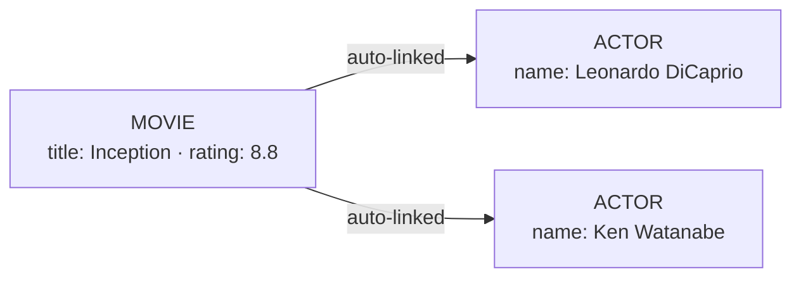

import Tabs from '@site/src/components/LanguageTabs'
import TabItem from '@theme/TabItem'

# Import Data

RushDB accepts raw data — JSON objects, nested trees, flat arrays, or CSV — and turns it into a fully typed, linked graph. No schema definitions, no migrations, no manual relationship wiring.

## How Nested Data Becomes a Graph

When you import a nested JSON object, RushDB walks the structure with a breadth-first search (BFS) algorithm. Each nested object becomes a separate record, linked to its parent by a relationship.

```json
{
  "title": "Inception",
  "rating": 8.8,
  "ACTOR": [
    { "name": "Leonardo DiCaprio", "country": "USA" },
    { "name": "Ken Watanabe", "country": "Japan" }
  ]
}
```

This single call produces **3 records** (`MOVIE` + `ACTOR` × 2) with relationships between them, plus typed properties on each — all inferred automatically.



### The ingestion pipeline

1. **Parse** — BFS walk. Each nested object becomes a separate record.
2. **Type inference** — Every value is classified as `string`, `number`, `boolean`, `datetime`, or `null`.
3. **Label assignment** — Top-level arrays and object records use the label you provide. Container objects can omit `label` when each top-level value is an object or an array of nested records; each top-level key becomes the label for its nested records. Nested objects derive their label from the parent key name (e.g., key `"engine"` → label `Engine`).
4. **Relationship creation** — Parent → child records are linked with default relationships (`__RUSHDB__RELATION__DEFAULT__`).

---

## Import Nested JSON

<Tabs groupId="programming-language">
  <TabItem value="python" label="Python" default>

`db.records.create_many()` — pass a dict with nested structure.

```python
db.records.create_many(
    label="MOVIE",
    data={
        "title": "Inception",
        "rating": 8.8,
        "ACTOR": [
            {"name": "Leonardo DiCaprio", "country": "USA"},
            {"name": "Ken Watanabe",      "country": "Japan"}
        ]
    }
)
# MOVIE → ACTOR × 2: all created and linked automatically
```

Infer labels from top-level container keys:

```python
db.records.create_many(
    data={
        "ITEM": [
            {"name": "Sprocket", "weight": 1.2},
            {"name": "Cog",      "weight": 0.7}
        ],
        "SUPPLIER": [
            {"name": "Acme Parts"}
        ]
    }
)
# labels inferred as 'ITEM' and 'SUPPLIER'
```

  </TabItem>
  <TabItem value="typescript" label="TypeScript">

`db.records.importJson()`

```typescript
const imported = await db.records.importJson({
  label: 'MOVIE',
  data: {
    title: 'Inception',
    rating: 8.8,
    ACTOR: [
      { name: 'Leonardo DiCaprio', country: 'USA' },
      { name: 'Ken Watanabe', country: 'Japan' }
    ]
  },
  options: { suggestTypes: true }
})
```

Infer labels from top-level container keys:

```typescript
await db.records.importJson({
  data: {
    ITEM: [
      { name: 'Sprocket', weight: 1.2 },
      { name: 'Cog', weight: 0.7 }
    ],
    SUPPLIER: [{ name: 'Acme Parts' }]
  }
})
// labels inferred as 'ITEM' and 'SUPPLIER'
```

:::warning When label is required
If you omit `label`, the top level must be a container object whose values are objects or arrays of nested records.
Top-level arrays, primitive arrays, and JSON objects with primitive top-level properties require `label`.
:::

  </TabItem>
  <TabItem value="shell" label="Shell">

`POST /api/v1/records/import/json`

```bash
curl -X POST https://api.rushdb.com/api/v1/records/import/json \
  -H "Authorization: Bearer $RUSHDB_API_KEY" \
  -H "Content-Type: application/json" \
  -d '{
    "label": "MOVIE",
    "data": {
      "title": "Inception",
      "rating": 8.8,
      "ACTOR": [
        {"name": "Leonardo DiCaprio", "country": "USA"},
        {"name": "Ken Watanabe", "country": "Japan"}
      ]
    },
    "options": {"suggestTypes": true}
  }'
```

  </TabItem>
</Tabs>

---

## Import Flat Arrays

Use this for flat, row-like data (no nested objects inside items). This is the fastest path for CSV-shaped data.

<Tabs groupId="programming-language">
  <TabItem value="python" label="Python" default>

`db.records.create_many()` — pass a list.

```python
db.records.create_many(
    label="ACTOR",
    data=[
        {"name": "Leonardo DiCaprio", "country": "USA"},
        {"name": "Ken Watanabe",      "country": "Japan"}
    ],
    options={"suggestTypes": True}
)
```

  </TabItem>
  <TabItem value="typescript" label="TypeScript">

`db.records.createMany()`

```typescript
await db.records.createMany({
  label: 'ACTOR',
  data: [
    { name: 'Leonardo DiCaprio', country: 'USA' },
    { name: 'Ken Watanabe', country: 'Japan' }
  ],
  options: { suggestTypes: true }
})
```

  </TabItem>
  <TabItem value="shell" label="Shell">

`POST /api/v1/records/import/json` — pass an array as `data`.

```bash
curl -X POST https://api.rushdb.com/api/v1/records/import/json \
  -H "Authorization: Bearer $RUSHDB_API_KEY" \
  -H "Content-Type: application/json" \
  -d '{
    "label": "ACTOR",
    "data": [
      {"name": "Leonardo DiCaprio", "country": "USA"},
      {"name": "Ken Watanabe", "country": "Japan"}
    ],
    "options": {"suggestTypes": true}
  }'
```

  </TabItem>
</Tabs>

---

## Import CSV

<Tabs groupId="programming-language">
  <TabItem value="python" label="Python" default>

`db.records.import_csv()`

```python
with open("actors.csv") as f:
    csv_content = f.read()

db.records.import_csv(
    label="ACTOR",
    data=csv_content,
    options={"suggestTypes": True, "returnResult": False},
    parse_config={"header": True, "dynamicTyping": True}
)
```

  </TabItem>
  <TabItem value="typescript" label="TypeScript">

`db.records.importCsv()`

```typescript
const csv = `name,email,age\nJohn Doe,john@example.com,30\nJane Smith,jane@example.com,25`

const result = await db.records.importCsv({
  label: 'CUSTOMER',
  data: csv,
  options: {
    suggestTypes: true,
    convertNumericValuesToNumbers: true,
    returnResult: true
  },
  parseConfig: {
    delimiter: ',',
    header: true,
    skipEmptyLines: true,
    dynamicTyping: true
  }
})
```

  </TabItem>
  <TabItem value="shell" label="Shell">

`POST /api/v1/records/import/csv`

```bash
curl -X POST https://api.rushdb.com/api/v1/records/import/csv \
  -H "Authorization: Bearer $RUSHDB_API_KEY" \
  -H "Content-Type: application/json" \
  -d '{
    "label": "ACTOR",
    "data": "name,country\nLeonardo DiCaprio,USA\nKen Watanabe,Japan",
    "options": {"suggestTypes": true},
    "parseConfig": {"header": true, "dynamicTyping": true}
  }'
```

  </TabItem>
</Tabs>

### CSV `parseConfig` options

| Option           | Default                      | Description                                                     |
| ---------------- | ---------------------------- | --------------------------------------------------------------- |
| `delimiter`      | `,`                          | Column separator                                                |
| `header`         | `true`                       | First row is header                                             |
| `skipEmptyLines` | `true`                       | Ignore blank rows (`"greedy"` also skips whitespace-only lines) |
| `dynamicTyping`  | inherits from `suggestTypes` | Auto-convert numbers and booleans                               |
| `quoteChar`      | `"`                          | Quote character                                                 |
| `escapeChar`     | `"`                          | Escape character                                                |
| `newline`        | auto                         | Explicit newline sequence override                              |

---

## Upsert by Property During Import

All import methods support native upsert-by-property via `mergeBy` and `mergeStrategy`.
Use `mergeBy` to name the property or properties that identify an existing record.
This makes repeated imports idempotent and prevents duplicate records when source data has a stable key such as `email`, `sku`, `mongoId`, or `externalId`.

Supported SDK and API surfaces:

| Input shape | TypeScript SDK       | Python SDK            | REST endpoint                      |
| ----------- | -------------------- | --------------------- | ---------------------------------- |
| Flat rows   | `records.createMany` | `records.create_many` | `POST /api/v1/records/import/json` |
| Nested JSON | `records.importJson` | `records.create_many` | `POST /api/v1/records/import/json` |
| CSV text    | `records.importCsv`  | `records.import_csv`  | `POST /api/v1/records/import/csv`  |
| Single row  | `records.upsert`     | `records.upsert`      | `POST /api/v1/records`             |

<Tabs groupId="programming-language">
  <TabItem value="python" label="Python" default>

```python
# Append — update matched records, preserve other fields
db.records.create_many(
    label="ACTOR",
    data=actors,
    options={"mergeBy": ["name"], "mergeStrategy": "append"}
)

# Rewrite — replace all properties for matched records
db.records.import_csv(
    label="ACTOR",
    data=csv_content,
    options={"mergeBy": ["name"], "mergeStrategy": "rewrite"}
)
```

  </TabItem>
  <TabItem value="typescript" label="TypeScript">

```typescript
// Flat-row import: upsert by email and preserve other fields
await db.records.createMany({
  label: 'AUTHOR',
  data: authors,
  options: { mergeBy: ['email'], mergeStrategy: 'append', suggestTypes: true }
})

// Nested JSON import: upsert by email and replace matched records
await db.records.importJson({
  label: 'AUTHOR',
  data: authors,
  options: { mergeBy: ['email'], mergeStrategy: 'rewrite' }
})

// CSV import: same options shape
await db.records.importCsv({
  label: 'AUTHOR',
  data: csvContent,
  options: { mergeBy: ['email'], mergeStrategy: 'append' }
})
```

  </TabItem>
  <TabItem value="shell" label="Shell">

```bash
curl -X POST https://api.rushdb.com/api/v1/records/import/json \
  -H "Authorization: Bearer $RUSHDB_API_KEY" \
  -H "Content-Type: application/json" \
  -d '{
    "label": "ACTOR",
    "data": [
      {"name": "Leonardo DiCaprio", "country": "USA"},
      {"name": "Ken Watanabe", "country": "Japan"}
    ],
    "options": {"mergeBy": ["name"], "mergeStrategy": "append"}
  }'
```

  </TabItem>
</Tabs>

### Merge strategies

| Strategy           | Behaviour                                                             |
| ------------------ | --------------------------------------------------------------------- |
| `append` (default) | Add / update incoming fields; preserve all other existing fields      |
| `rewrite`          | Replace all fields with incoming data; unmentioned fields are removed |

### `mergeBy` behaviour

| `mergeBy` value | Match behaviour                     |
| --------------- | ----------------------------------- |
| `["field"]`     | Match only on listed fields         |
| `[]` or omitted | Match on all incoming property keys |

---

## Import Options

| Option                          | Type       | Default                         | Description                                                                                                       |
| ------------------------------- | ---------- | ------------------------------- | ----------------------------------------------------------------------------------------------------------------- |
| `suggestTypes`                  | `boolean`  | `true`                          | Infer property types automatically. Set to `false` to store all values as strings.                                |
| `convertNumericValuesToNumbers` | `boolean`  | `false`                         | Convert string numbers to number type                                                                             |
| `capitalizeLabels`              | `boolean`  | `false`                         | Uppercase all auto-derived label names                                                                            |
| `relationshipType`              | `string`   | `__RUSHDB__RELATION__DEFAULT__` | Relationship type for nested links                                                                                |
| `returnResult`                  | `boolean`  | `false`                         | Return created records in the response. Ignored for imports >1 000 records (summary returned instead).            |
| `mergeBy`                       | `string[]` | `undefined`                     | Property names to match existing records on. If omitted with `mergeStrategy` present, all incoming keys are used. |
| `mergeStrategy`                 | `string`   | `append`                        | `append` or `rewrite`. Providing either option triggers upsert semantics.                                         |

---

## Method Quick Reference

| Scenario       | Python                          | TypeScript                       | REST                                |
| -------------- | ------------------------------- | -------------------------------- | ----------------------------------- |
| Flat rows      | `create_many(label, data=[…])`  | `createMany({label, data:[…]})`  | `POST /import/json` with array      |
| Nested JSON    | `create_many(label, data={…})`  | `importJson({label, data:{…}})`  | `POST /import/json` with object     |
| Container JSON | `create_many(data={KEY:[{…}]})` | `importJson({data:{KEY:[{…}]}})` | `POST /import/json` without `label` |
| CSV string     | `import_csv(label, data=csv)`   | `importCsv({label, data:csv})`   | `POST /import/csv`                  |

---

## See also

- [Store Records](/learn/records-and-queries/store-records) — flat record create / update / delete operations
- [Connect Records](/learn/relationships/connect-records) — manually attach/detach relationships
- [Write Records with Vectors](/learn/semantic-search/write-with-vectors) — attach embedding vectors at import time
