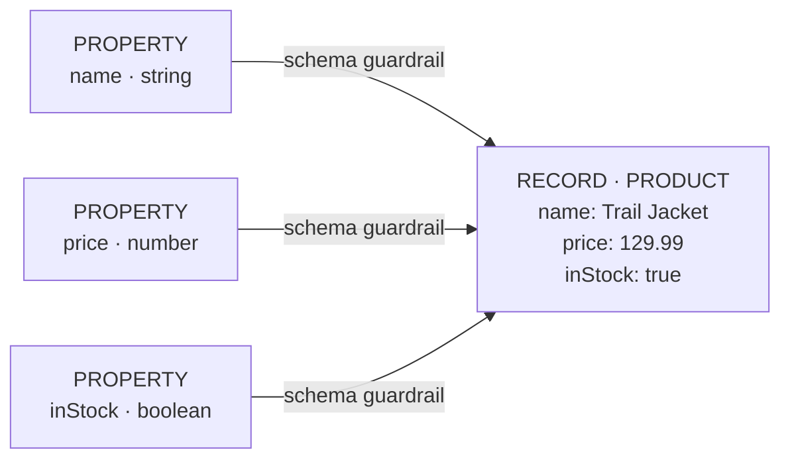

# Labeled Meta Property Graph

RushDB uses a **Labeled Meta Property Graph** model: application records remain flexible graph nodes, while their field definitions are represented as metadata nodes inside the same graph.

This page explains the internal model. You do not need to understand these implementation details to store or query data, but they explain why RushDB can accept evolving JSON, expose its live schema, and help agents reason over unknown datasets.

## The Short Version

When you write:

```json
{
  "label": "PRODUCT",
  "data": {
    "name": "Trail Jacket",
    "price": 129.99,
    "inStock": true
  }
}
```

RushDB stores one `PRODUCT` record with the values. As part of that same write path, it ensures schema metadata nodes exist for:

```text
(name, string)
(price, number)
(inStock, boolean)
```

Each successful write extends an emergent set of schema guardrails: metadata nodes are connected to records that carry the corresponding field and inferred type.



The values stay on the record. Property nodes store schema metadata, not duplicated application data. Internally, RushDB represents each guardrail with a `__RUSHDB__RELATION__VALUE__` edge. Despite its internal name, that edge indicates that a record carries a property definition; it is not the value's storage location.

## Why Property Nodes Exist

Most databases keep schema outside the data:

- relational databases define columns in table metadata;
- document stores often leave field discovery to application code or sampling;
- conventional property graphs store values directly on nodes but do not necessarily maintain a queryable field catalog.

RushDB keeps a compact, queryable metadata layer inside the graph. This provides:

| Capability               | Why the metadata layer helps                                                     |
| ------------------------ | -------------------------------------------------------------------------------- |
| Runtime schema discovery | RushDB can enumerate the fields that actually exist                              |
| Type-aware querying      | Agents and applications can inspect types before building filters                |
| Value exploration        | Property IDs provide a stable handle for distinct values and numeric/date ranges |
| Flexible ingestion       | New fields appear on write without a migration                                   |
| Schema evolution         | Old and new record shapes can coexist while the live ontology reflects both      |
| Semantic indexing        | Embedding policies attach to a label and property name discovered from the graph |

## Records, Labels, Properties, Relationships

| Layer         | Stores                                          | Example                            |
| ------------- | ----------------------------------------------- | ---------------------------------- |
| Record        | Application values and system metadata          | `PRODUCT { name, price, inStock }` |
| Label         | The record's entity type                        | `PRODUCT`, `ORDER`, `SESSION`      |
| Property node | A field definition identified by `(name, type)` | `(price, number)`                  |
| Relationship  | A directed edge between graph nodes             | `ORDER -[CONTAINS]-> PRODUCT`      |

Records remain the source of truth for values. The property layer describes the shape of those records.

## Identity Is Name Plus Type

Property identity includes both the field name and its inferred type. If different records send:

```json
[
  { "label": "PRODUCT", "data": { "size": "M" } },
  { "label": "PRODUCT", "data": { "size": 42 } }
]
```

RushDB can represent both definitions:

```text
(size, string)
(size, number)
```

This preserves information instead of forcing unrelated values into one rigid column. It also gives you a signal that upstream data may need normalization.

For predictable queries, keep a property's type consistent within an entity model whenever possible.

## How the Schema Emerges

Every write passes through the same conceptual pipeline:

1. **Accept JSON** — receive flat or nested input.
2. **Infer types** — classify scalar and array values.
3. **Create records** — store application values on record nodes.
4. **Upsert property metadata** — ensure each `(name, type)` definition exists.
5. **Attach schema guardrails** — connect property nodes to records carrying those fields and inferred types.
6. **Decompose nested objects** — create child records and parent-child relationships where needed.

No schema declaration is required before step 1. The schema emerges from successful writes.

## From Metadata Graph to Ontology

The ontology APIs turn the internal graph into an efficient runtime schema snapshot:

```text
getOntologyMarkdown()
  → labels and record counts
  → properties per label
  → inferred types
  → numeric and datetime ranges
  → sample string and boolean values
  → relationship directions
  → semantic index availability
```

Agents should call `getOntologyMarkdown` before constructing queries. Applications that need structured metadata for filters or admin interfaces can call `getOntology`.

For deeper inspection:

| API                 | Use                                                             |
| ------------------- | --------------------------------------------------------------- |
| `findProperties`    | List property definitions and their IDs                         |
| `propertyValues`    | Enumerate string/boolean values or retrieve numeric/date ranges |
| `findLabels`        | List labels and record counts                                   |
| `findRelationships` | Explore edges between record types                              |

## Adaptive Does Not Mean Uncontrolled

RushDB does not require upfront migrations, but production data still benefits from conventions:

- use stable labels for entity types;
- use consistent property names and types;
- use ISO 8601 timestamps;
- model state with fields such as `status`, not new labels;
- inspect ontology output during ingestion development;
- normalize accidental type drift at the source when possible.

The goal is not to eliminate structure. The goal is to let structure emerge from real data, remain inspectable, and evolve without blocking writes.

## Tradeoffs

The metadata layer is useful because it is explicit, but it is not free:

| Tradeoff                                    | Practical implication                                                                     |
| ------------------------------------------- | ----------------------------------------------------------------------------------------- |
| Type drift remains visible                  | Mixed `(name, type)` definitions can appear until data is normalized                      |
| Flexible records require disciplined naming | `userId` and `userID` are distinct fields                                                 |
| Discovery is runtime state                  | Ontology reflects what has been written, not an aspirational schema file                  |
| Internal metadata should stay internal      | Query application records through RushDB APIs rather than editing metadata nodes directly |

## Next Steps

- [Labels & Properties](/build/schema/labels-and-properties) — inspect and manage schema metadata through public APIs
- [Discover Your Schema](/build/schema/discover-your-schema) — retrieve the live ontology
- [Import Data](/build/data/import-data) — create records and relationships from nested JSON
- [Relationships](/build/graph/) — understand explicit and generated graph edges
