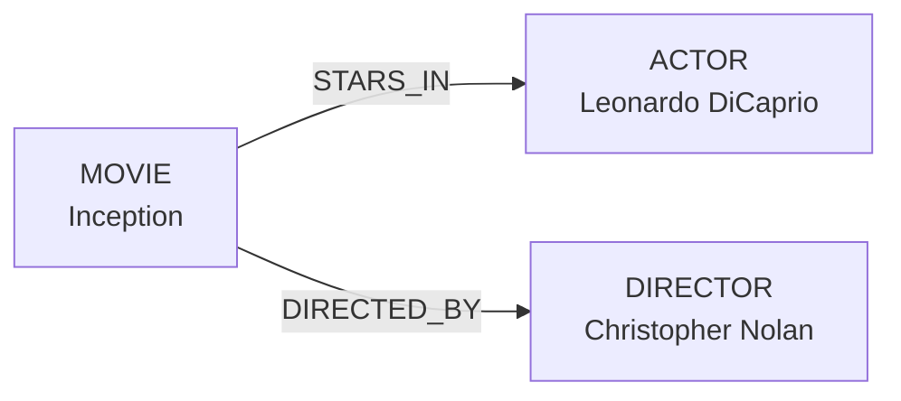
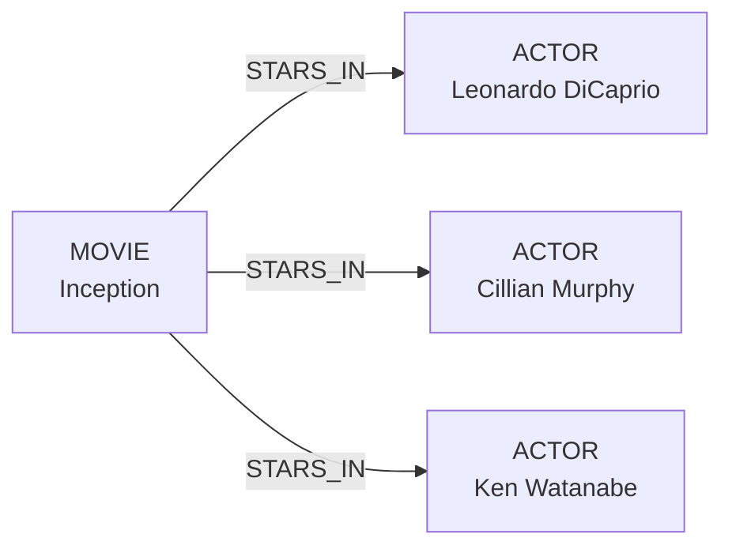
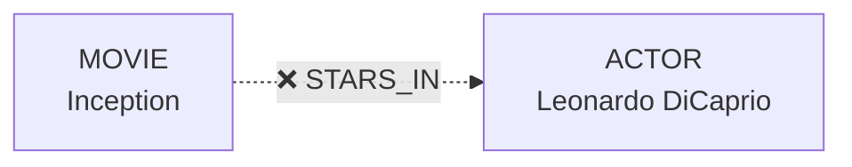
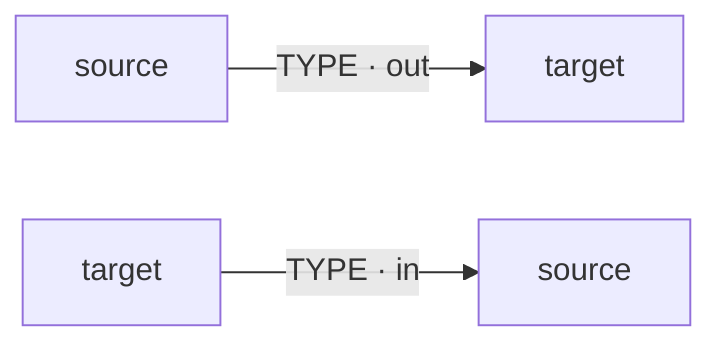
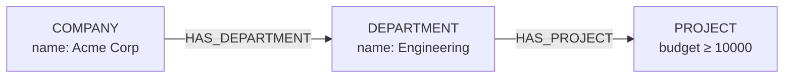

import Tabs from '@site/src/components/LanguageTabs'
import TabItem from '@theme/TabItem'

# Connect Records

Relationships are the connections that link records together, creating a graph structure. They have a **type** (a string label you define), a **direction**, and optional user-defined edge properties.

RushDB supports three categories of relationships:

| Type                                         | Created by       | Description                                         |
| -------------------------------------------- | ---------------- | --------------------------------------------------- |
| `__RUSHDB__RELATION__DEFAULT__`              | Auto, on import  | Links parent → child records in nested JSON         |
| `__RUSHDB__RELATION__VALUE__`                | Auto, internally | Connects property nodes to record nodes (read-only) |
| Custom (`"STARS_IN"`, `"DIRECTED_BY"`, etc.) | You              | Domain-specific, manually created                   |



---

## Attach Records

<Tabs groupId="programming-language">
  <TabItem value="python" label="Python" default>

`db.records.attach()`

```python
# Single target
db.records.attach(
    source=movie,
    target=actor,
    options={"type": "STARS_IN", "direction": "out", "properties": {"role": "lead"}}
)

# One-to-many (target list)
db.records.attach(
    source=movie,
    target=[actor1, actor2, actor3],
    options={"type": "STARS_IN"}
)
```

  </TabItem>
  <TabItem value="typescript" label="TypeScript">

`db.records.attach()`

```typescript
// Single target
await db.records.attach({
  source: 'movie-id-123',
  target: 'actor-id-456',
  options: { type: 'STARS_IN', direction: 'out', properties: { role: 'lead' } }
  // (MOVIE) -[:STARS_IN]-> (ACTOR)
})

// Multiple targets
await db.records.attach({
  source: 'movie-id-123',
  target: ['actor-id-1', 'actor-id-2'],
  options: { type: 'STARS_IN' }
})
```

`target` can be a single ID, an array of IDs, or a record instance.

  </TabItem>
  <TabItem value="shell" label="Shell">

`POST /api/v1/records/:entityId/relationships`

```bash
# Single target
curl -X POST https://api.rushdb.com/api/v1/records/$MOVIE_ID/relationships \
  -H "Authorization: Bearer $RUSHDB_API_KEY" \
  -H "Content-Type: application/json" \
  -d '{"targetIds": "$ACTOR_ID", "type": "STARS_IN", "direction": "out", "properties": {"role": "lead"}}'

# Multiple targets
curl -X POST https://api.rushdb.com/api/v1/records/$MOVIE_ID/relationships \
  -H "Authorization: Bearer $RUSHDB_API_KEY" \
  -H "Content-Type: application/json" \
  -d '{"targetIds": ["$ACTOR1_ID", "$ACTOR2_ID"], "type": "STARS_IN"}'
```

| Field        | Type                 | Description                                       |
| ------------ | -------------------- | ------------------------------------------------- |
| `targetIds`  | `string \| string[]` | Target record ID(s)                               |
| `type`       | `string`             | Relationship type                                 |
| `direction`  | `"in" \| "out"`      | Direction from source to target (`out` = default) |
| `properties` | `object`             | Optional user-defined edge properties             |

  </TabItem>
</Tabs>



---

## Detach Records

<Tabs groupId="programming-language">
  <TabItem value="python" label="Python" default>

`db.records.detach()`

```python
db.records.detach(
    source=movie,
    target=actor,
    options={"type": "STARS_IN"}
    # Omit "type" to detach all relationship types
)
```

  </TabItem>
  <TabItem value="typescript" label="TypeScript">

`db.records.detach()`

```typescript
await db.records.detach({
  source: 'movie-id-123',
  target: 'actor-id-456',
  options: { typeOrTypes: 'STARS_IN' } // omit to detach all types
})
```

  </TabItem>
  <TabItem value="shell" label="Shell">

`PUT /api/v1/records/:entityId/relationships`

```bash
curl -X PUT https://api.rushdb.com/api/v1/records/$MOVIE_ID/relationships \
  -H "Authorization: Bearer $RUSHDB_API_KEY" \
  -H "Content-Type: application/json" \
  -d '{"targetIds": "$ACTOR_ID", "typeOrTypes": ["STARS_IN"]}'
```

  </TabItem>
</Tabs>



---

## List Relationships

<Tabs groupId="programming-language">
  <TabItem value="python" label="Python" default>

`db.relationships.find()`

```python
# Relationship search: where filters edge type/properties
relationships = db.relationships.find(
    search_query={
        "source": {"labels": ["MOVIE"], "where": {"title": "Inception"}},
        "target": {"labels": ["ACTOR"], "where": {"country": "USA"}},
        "where": {"type": "STARS_IN", "role": "lead"}
    }
)

# With pagination
page = db.relationships.find(
    search_query={"source": {"labels": ["MOVIE"]}},
    pagination={"limit": 50, "skip": 0}
)
```

  </TabItem>
  <TabItem value="typescript" label="TypeScript">

`db.relationships.find()`

```typescript
const { data, total } = await db.relationships.find({
  source: { labels: ['MOVIE'], where: { title: 'Inception' } },
  target: { labels: ['ACTOR'], where: { country: 'USA' } },
  where: { type: 'STARS_IN', role: 'lead' }
})
```

  </TabItem>
  <TabItem value="shell" label="Shell">

`GET /api/v1/records/:entityId/relationships`

```bash
curl "https://api.rushdb.com/api/v1/records/$MOVIE_ID/relationships?limit=50" \
  -H "Authorization: Bearer $RUSHDB_API_KEY"
```

Search relationships across all records:

`POST /api/v1/relationships/search`

```bash
curl -X POST https://api.rushdb.com/api/v1/relationships/search \
  -H "Authorization: Bearer $RUSHDB_API_KEY" \
  -H "Content-Type: application/json" \
  -d '{
    "source": { "labels": ["MOVIE"], "where": { "title": "Inception" } },
    "target": { "labels": ["ACTOR"], "where": { "country": "USA" } },
    "where": { "type": "STARS_IN", "role": "lead" }
  }'
```

  </TabItem>
</Tabs>

`db.relationships.find().where` is edge-scoped. Use `source` and `target` for record predicates. To filter records by traversing relationships, use `db.records.find()` with `$relation` as shown below.

Edge properties are stored directly on relationship edges. They are filterable through `relationships.find()` and summarized in ontology relationship sections, but they are not promoted to Record Property nodes and are not semantically indexed. See [Relationship Properties](/learn/relationships/relationship-properties) for storage semantics, the full operator set, and modeling guidance.

---

## Direction Reference

| `direction` | Graph pattern                  |
| ----------- | ------------------------------ |
| `out`       | `(source) -[:TYPE]-> (target)` |
| `in`        | `(source) <-[:TYPE]- (target)` |



---

## Search by Relationship

Use `$relation` inside a `where` clause to filter records through their graph connections. The **nested key** is the label of the related record; `$relation` constrains which relationship edge to follow.

### Any relationship type

Omit `$relation` to traverse any edge connecting the two labels:

<Tabs groupId="programming-language">
  <TabItem value="python" label="Python" default>

```python
# Find MOVIEs connected to an ACTOR named "Timothée Chalamet" — any relationship type
result = db.records.find({
    "labels": ["MOVIE"],
    "where": {
        "ACTOR": {
            "name": "Timothée Chalamet"
        }
    }
})
```

  </TabItem>
  <TabItem value="typescript" label="TypeScript">

```typescript
// Find MOVIEs connected to an ACTOR named "Timothée Chalamet" — any relationship type
const { data } = await db.records.find({
  labels: ['MOVIE'],
  where: {
    ACTOR: {
      name: 'Timothée Chalamet'
    }
  }
})
```

  </TabItem>
  <TabItem value="shell" label="Shell">

```bash
curl -X POST https://api.rushdb.com/api/v1/records/search \
  -H "Authorization: Bearer $RUSHDB_API_KEY" \
  -H "Content-Type: application/json" \
  -d '{
    "labels": ["MOVIE"],
    "where": {
      "ACTOR": { "name": "Timothée Chalamet" }
    }
  }'
```

  </TabItem>
</Tabs>

### Filter by relationship type

Pass `$relation` as a string to restrict traversal to a specific relationship type. This produces a direction-agnostic Cypher pattern (`-[:TYPE]-`) that matches the edge regardless of its stored direction — use the full object form (below) to also constrain direction:

<Tabs groupId="programming-language">
  <TabItem value="python" label="Python" default>

```python
result = db.records.find({
    "labels": ["MOVIE"],
    "where": {
        "ACTOR": {
            "$relation": "STARS_IN",
            "country": "USA"
        }
    }
})
```

  </TabItem>
  <TabItem value="typescript" label="TypeScript">

```typescript
const { data } = await db.records.find({
  labels: ['MOVIE'],
  where: {
    ACTOR: {
      $relation: 'STARS_IN',
      country: 'USA'
    }
  }
})
```

  </TabItem>
  <TabItem value="shell" label="Shell">

```bash
curl -X POST https://api.rushdb.com/api/v1/records/search \
  -H "Authorization: Bearer $RUSHDB_API_KEY" \
  -H "Content-Type: application/json" \
  -d '{
    "labels": ["MOVIE"],
    "where": {
      "ACTOR": { "$relation": "STARS_IN", "country": "USA" }
    }
  }'
```

  </TabItem>
</Tabs>

### Filter by relationship type and direction

Use the full object form when direction matters:

| Field       | Type            | Description                                |
| ----------- | --------------- | ------------------------------------------ |
| `type`      | `string`        | Relationship type label                    |
| `direction` | `"in" \| "out"` | Edge direction relative to the root record |

<Tabs groupId="programming-language">
  <TabItem value="python" label="Python" default>

```python
# Find MOVIEs where an ACTOR is connected via an incoming STARS_IN edge
# i.e. (ACTOR) -[:STARS_IN]-> (MOVIE)
result = db.records.find({
    "labels": ["MOVIE"],
    "where": {
        "ACTOR": {
            "$relation": {"type": "STARS_IN", "direction": "in"},
            "country": "USA"
        }
    }
})
```

  </TabItem>
  <TabItem value="typescript" label="TypeScript">

```typescript
// (ACTOR) -[:STARS_IN]-> (MOVIE)  — direction "in" from MOVIE's perspective
const { data } = await db.records.find({
  labels: ['MOVIE'],
  where: {
    ACTOR: {
      $relation: { type: 'STARS_IN', direction: 'in' },
      country: 'USA'
    }
  }
})
```

  </TabItem>
  <TabItem value="shell" label="Shell">

```bash
curl -X POST https://api.rushdb.com/api/v1/records/search \
  -H "Authorization: Bearer $RUSHDB_API_KEY" \
  -H "Content-Type: application/json" \
  -d '{
    "labels": ["MOVIE"],
    "where": {
      "ACTOR": {
        "$relation": {"type": "STARS_IN", "direction": "in"},
        "country": "USA"
      }
    }
  }'
```

  </TabItem>
</Tabs>

### Multi-hop traversal

Nest `$relation` filters to traverse multiple relationship levels in a single query:

<Tabs groupId="programming-language">
  <TabItem value="python" label="Python" default>

```python
# Companies → Engineering departments → projects with budget over 10k
result = db.records.find({
    "labels": ["COMPANY"],
    "where": {
        "name": "Acme Corp",
        "DEPARTMENT": {
            "$relation": "HAS_DEPARTMENT",
            "name": "Engineering",
            "PROJECT": {
                "$relation": "HAS_PROJECT",
                "budget": {"$gte": 10000}
            }
        }
    }
})
```

  </TabItem>
  <TabItem value="typescript" label="TypeScript">

```typescript
const { data } = await db.records.find({
  labels: ['COMPANY'],
  where: {
    name: 'Acme Corp',
    DEPARTMENT: {
      $relation: 'HAS_DEPARTMENT',
      name: 'Engineering',
      PROJECT: {
        $relation: 'HAS_PROJECT',
        budget: { $gte: 10000 }
      }
    }
  }
})
```

  </TabItem>
  <TabItem value="shell" label="Shell">

```bash
curl -X POST https://api.rushdb.com/api/v1/records/search \
  -H "Authorization: Bearer $RUSHDB_API_KEY" \
  -H "Content-Type: application/json" \
  -d '{
    "labels": ["COMPANY"],
    "where": {
      "name": "Acme Corp",
      "DEPARTMENT": {
        "$relation": "HAS_DEPARTMENT",
        "name": "Engineering",
        "PROJECT": {
          "$relation": "HAS_PROJECT",
          "budget": {"$gte": 10000}
        }
      }
    }
  }'
```

  </TabItem>
</Tabs>



→ For the full operator reference including `$alias`, `$id`, and logical grouping, see [Where Operators — Relationship Queries](/learn/search-query/where-operators#relationship-queries).

---

## In a Transaction

<Tabs groupId="programming-language">
  <TabItem value="python" label="Python" default>

```python
tx = db.tx.begin()
try:
    movie = db.records.create(
        label="MOVIE", data={"title": "Dune"}, transaction=tx
    )
    actor = db.records.create(
        label="ACTOR", data={"name": "Timothée Chalamet"}, transaction=tx
    )
    db.records.attach(
        source=movie,
        target=actor,
        options={"type": "STARS_IN"},
        transaction=tx
    )
    tx.commit()
except Exception:
    tx.rollback()
    raise
```

  </TabItem>
  <TabItem value="typescript" label="TypeScript">

```typescript
const tx = await db.tx.begin()
try {
  const movie = await db.records.create({ label: 'MOVIE', data: { title: 'Dune' } }, tx)
  const actor = await db.records.create({ label: 'ACTOR', data: { name: 'Timothée Chalamet' } }, tx)
  await db.records.attach({ source: movie, target: actor, options: { type: 'STARS_IN' } }, tx)
  await tx.commit()
} catch (e) {
  await tx.rollback()
  throw e
}
```

  </TabItem>
  <TabItem value="shell" label="Shell">

```bash
curl -X POST https://api.rushdb.com/api/v1/records/$MOVIE_ID/relationships \
  -H "Authorization: Bearer $RUSHDB_API_KEY" \
  -H "Content-Type: application/json" \
  -H "X-Transaction-Id: $TX_ID" \
  -d '{"targetIds": "$ACTOR_ID", "type": "STARS_IN"}'
```

  </TabItem>
</Tabs>

---

## Via Record Instance

<Tabs groupId="programming-language">
  <TabItem value="python" label="Python" default>

```python
# Record instance methods — equivalent to db.records.attach/detach
movie.attach(
    target=actor,
    options={"type": "STARS_IN", "direction": "out"}
)

movie.detach(
    target=actor,
    options={"type": "STARS_IN"}
)
```

  </TabItem>
  <TabItem value="typescript" label="TypeScript">

```typescript
// DBRecordInstance methods — equivalent to db.records.attach/detach
await movie.attach(actor, { type: 'STARS_IN', direction: 'out' })

await movie.detach(actor, { typeOrTypes: 'STARS_IN' })
```

For TypeScript Models:

```typescript
await MovieModel.attach({
  source: 'movie-id-123',
  target: 'actor-id-456',
  options: { type: 'STARS_IN', direction: 'out' }
})

await MovieModel.detach({
  source: 'movie-id-123',
  target: 'actor-id-456',
  options: { typeOrTypes: 'STARS_IN' }
})
```

  </TabItem>
</Tabs>

---

## See also

- [Bulk Relationships](/learn/relationships/bulk-relationships) — connect/disconnect many records at once by key match or many-to-many
- [Import Data](/learn/records-and-queries/import-data) — nested JSON auto-creates relationships
- [Transactions](/learn/records-and-queries/transactions) — ACID guarantees for multi-step operations
