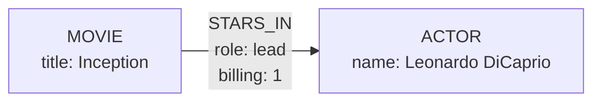
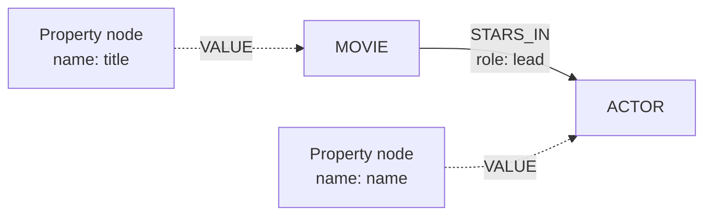

import Tabs from '@site/src/components/LanguageTabs'
import TabItem from '@theme/TabItem'

# Relationship Properties

Relationships can carry their own data. When you connect records, you can attach **properties to the edge itself** — the role of an actor in a movie, the confidence of an inferred link, the date a membership started. The connection stops being a bare pointer and becomes a fact in its own right.



Without edge properties, data _about the connection_ has nowhere natural to live — you would either denormalize it onto one of the records or mint an intermediate record just to hold it. Edge properties keep it where it belongs: on the relationship.

## Where Edge Properties Live

Record properties and relationship properties are stored differently, and the difference matters:

|                                    | Record properties                      | Relationship properties                              |
| ---------------------------------- | -------------------------------------- | ---------------------------------------------------- |
| Stored on                          | Property nodes linked to the record    | Directly on the relationship edge                    |
| Visible in schema                  | Yes — labels, types, ranges via schema | Yes — summarized per relationship type in the schema |
| Filterable via                     | `records.find()` `where`               | `relationships.find()` `where`                       |
| Semantic (vector) indexing         | Supported for string properties        | Not supported                                        |
| Aggregations (`select`, `groupBy`) | Supported                              | Not supported                                        |

In graph terms: a record's properties are part of RushDB's property-centric meta-graph, while edge properties are plain key-value pairs on the edge — lightweight, local to the connection, and read or filtered only when you query relationships.



## Attach with Properties

Pass `properties` alongside `type` and `direction` when connecting records. Every edge created by the call gets the same properties.

<Tabs groupId="programming-language">
  <TabItem value="python" label="Python" default>

`db.records.attach()`

```python
db.records.attach(
    source=movie,
    target=actor,
    options={
        "type": "STARS_IN",
        "direction": "out",
        "properties": {"role": "lead", "billing": 1, "scenes": ["opening", "finale"]}
    }
)
```

  </TabItem>
  <TabItem value="typescript" label="TypeScript">

`db.records.attach()`

```typescript
await db.records.attach({
  source: 'movie-id-123',
  target: 'actor-id-456',
  options: {
    type: 'STARS_IN',
    direction: 'out',
    properties: { role: 'lead', billing: 1, scenes: ['opening', 'finale'] }
  }
})
```

  </TabItem>
  <TabItem value="shell" label="Shell">

```bash
curl -X POST https://api.rushdb.com/api/v1/records/$MOVIE_ID/relationships \
  -H "Authorization: Bearer $RUSHDB_API_KEY" \
  -H "Content-Type: application/json" \
  -d '{
    "targetIds": "$ACTOR_ID",
    "type": "STARS_IN",
    "direction": "out",
    "properties": { "role": "lead", "billing": 1, "scenes": ["opening", "finale"] }
  }'
```

  </TabItem>
</Tabs>

Bulk creation accepts the same field — every edge created by the operation receives the shared properties. See [Bulk Relationships](/learn/relationships/bulk-relationships) for the matching semantics:

```bash
curl -X POST https://api.rushdb.com/api/v1/relationships/create-many \
  -H "Authorization: Bearer $RUSHDB_API_KEY" \
  -H "Content-Type: application/json" \
  -d '{
    "source": {"label": "MOVIE", "key": "id"},
    "target": {"label": "ACTOR", "key": "movieId"},
    "type": "STARS_IN",
    "properties": {"source": "imdb", "confidence": 0.98}
  }'
```

### Updating Properties

- **`attach`** replaces the edge: an existing relationship of the same type between the pair is recreated, so the new `properties` object is the complete new state. Re-attach with the full set of properties you want to keep.
- **Bulk `create-many`** merges into existing edges: keys you pass are written, keys you don't pass are preserved.

### Allowed Values and Reserved Names

Values must be primitives (`string`, `number`, `boolean`, `null`) or homogeneous arrays of primitives. Nested objects are rejected with a `400`.

These names are reserved and cannot be used as edge property keys: `type`, `direction`, `id`, `elementId`, `projectId`, `sourceId`, `targetId`, `sourceLabel`, `targetLabel`, and anything starting with `__RUSHDB__`.

## Search by Edge Properties

`relationships.find()` takes a relationship-scoped query: `where` filters the **edge**, while `source` and `target` filter the endpoint records. Inside `where`, `type` maps to the relationship type, `direction` constrains direction, and every other key is matched against edge properties.

<Tabs groupId="programming-language">
  <TabItem value="python" label="Python" default>

`db.relationships.find()`

```python
relationships = db.relationships.find(
    search_query={
        "source": {"labels": ["MOVIE"], "where": {"title": "Inception"}},
        "target": {"labels": ["ACTOR"]},
        "where": {
            "type": "STARS_IN",
            "role": "lead",                # edge property equality
            "billing": {"$lte": 3},        # edge property operator
        }
    },
    pagination={"limit": 50, "skip": 0}
)
```

  </TabItem>
  <TabItem value="typescript" label="TypeScript">

`db.relationships.find()`

```typescript
const { data, total } = await db.relationships.find({
  source: { labels: ['MOVIE'], where: { title: 'Inception' } },
  target: { labels: ['ACTOR'] },
  where: {
    type: 'STARS_IN',
    role: 'lead', // edge property equality
    billing: { $lte: 3 } // edge property operator
  }
})
```

  </TabItem>
  <TabItem value="shell" label="Shell">

```bash
curl -X POST https://api.rushdb.com/api/v1/relationships/search \
  -H "Authorization: Bearer $RUSHDB_API_KEY" \
  -H "Content-Type: application/json" \
  -d '{
    "source": { "labels": ["MOVIE"], "where": { "title": "Inception" } },
    "target": { "labels": ["ACTOR"] },
    "where": { "type": "STARS_IN", "role": "lead", "billing": { "$lte": 3 } },
    "limit": 50
  }'
```

  </TabItem>
</Tabs>

### Supported Operators

Edge property predicates support the familiar [SearchQuery operators](/learn/search-query/where-operators#relationship-queries):

| Category         | Operators                                                     |
| ---------------- | ------------------------------------------------------------- |
| Equality         | direct value, `$eq`, `$ne`                                    |
| Comparison       | `$gt`, `$gte`, `$lt`, `$lte` (numbers and ISO 8601 datetimes) |
| String           | `$contains`, `$startsWith`, `$endsWith`                       |
| Membership       | `$in`, `$nin`                                                 |
| Existence        | `$exists`                                                     |
| Type check       | `$type`                                                       |
| Logical grouping | `$and`, `$or`, `$not`, `$nor`, `$xor`                         |

The special `type` key supports the string operators too — e.g. `{"type": {"$in": ["STARS_IN", "DIRECTED"]}}`.

```typescript
// Inferred links that are either low-confidence or unreviewed
const { data } = await db.relationships.find({
  where: {
    $or: [{ confidence: { $lt: 0.8 } }, { reviewedAt: { $exists: false } }]
  }
})
```

### Response Shape

Each result is a relationship object — edge properties come back under `properties`:

```json
{
  "sourceId": "movie-id-123",
  "sourceLabel": "MOVIE",
  "targetId": "actor-id-456",
  "targetLabel": "ACTOR",
  "type": "STARS_IN",
  "direction": "out",
  "properties": { "role": "lead", "billing": 1 }
}
```

### Filtering Records vs Filtering Relationships

`relationships.find()` returns **edges**. To return **records** filtered through their connections, use `records.find()` with `$relation` — note that `$relation` matches by relationship `type` and `direction` only; edge-property predicates are available exclusively in `relationships.find()`:

```typescript
// Records: actors in movies (traversal — no edge property filters here)
await db.records.find({
  labels: ['ACTOR'],
  where: {
    MOVIE: { $relation: { type: 'STARS_IN', direction: 'in' }, title: 'Inception' }
  }
})

// Relationships: lead-role edges specifically
await db.relationships.find({
  target: { labels: ['MOVIE'], where: { title: 'Inception' } },
  where: { type: 'STARS_IN', role: 'lead' }
})
```

## Edge Properties in Your Schema

The project schema summarizes edge properties per relationship type — property names, inferred types, exact min/max for numbers and datetimes, and sample values — so both the dashboard and AI agents can discover them alongside the rest of your schema. See [Discover Your Schema](/learn/records-and-queries/discover-your-schema).

What edge properties are **not**: they are never promoted to Property nodes, they cannot be semantically (vector) indexed, and they don't participate in record aggregations. If a value needs full-text/semantic search or heavy aggregation, model it as a record property instead.

## When to Use Edge Properties

| Use edge properties for                                | Use record properties for                         |
| ------------------------------------------------------ | ------------------------------------------------- |
| Facts about the connection (`role`, `since`, `weight`) | Facts about the entity itself                     |
| Provenance of inferred links (`confidence`, `source`)  | Anything needing semantic search                  |
| Lightweight annotations read during traversal          | Values used in `select` aggregations or `groupBy` |
| N:M qualifiers that would otherwise need a join record | High-cardinality searchable text                  |
