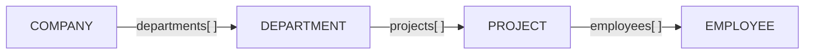

# Select Expressions

The `select` clause shapes the output of a SearchQuery: compute metrics, derive new metrics from other outputs, collect related records as arrays, and bucket datetime fields into calendar intervals — all in a single declarative map. The legacy `aggregate` clause is deprecated and should only be used for vector similarity until select supports it.

## Expression Placement

The `select` key sits at the same level as `where`, `limit`, `orderBy`, and `labels`:

```typescript
{
  labels: ['COMPANY'],
  where: { EMPLOYEE: { $alias: '$employee' } },
  select: {
    companyName: '$record.name',               // field reference
    totalWage:   { $sum: '$employee.salary' }, // sum
    headcount:   { $count: '*' },              // count distinct root records
    costPerHead: { $divide: [                  // derived metric
      { $ref: 'totalWage' },
      { $ref: 'headcount' }
    ]}
  }
}
```

> **Note**: `select` is evaluated only when fetching records.

## Expression Reference

| Expression                        | Description                                                           |
| --------------------------------- | --------------------------------------------------------------------- |
| `"$alias.field"`                  | Field reference — reads `field` from the record at `$alias`           |
| `"$alias"`                        | Alias-only reference — the record node itself                         |
| `number`                          | Literal number                                                        |
| `boolean`                         | Literal boolean                                                       |
| `{ $ref: "key" }`                 | Reference another output key in the same `select` map                 |
| `{ $sum: expr }`                  | Sum of a numeric expression                                           |
| `{ $avg: expr, $precision?: n }`  | Average; `$precision` controls decimal places (0 = integer)           |
| `{ $count: '*' \| expr }`         | `'*'` counts distinct root records; expression counts distinct values |
| `{ $min: expr }`                  | Minimum value                                                         |
| `{ $max: expr }`                  | Maximum value                                                         |
| `{ $divide: [expr, expr] }`       | Division                                                              |
| `{ $multiply: [expr, expr] }`     | Multiplication                                                        |
| `{ $add: [expr, expr] }`          | Addition                                                              |
| `{ $subtract: [expr, expr] }`     | Subtraction                                                           |
| `{ $collect: CollectExpr }`       | Collect related records into an array                                 |
| `{ $timeBucket: TimeBucketExpr }` | Bucket a datetime field into calendar intervals                       |

## Field References

Expressions reference record data using `"$alias.fieldName"` strings. The root record always uses `$record`; related records use aliases declared in `where` via `$alias`.

```typescript
{
  labels: ['COMPANY'],
  where: {
    EMPLOYEE: { $alias: '$employee' }
  },
  select: {
    companyName: '$record.name',          // field from root record
    topSalary:   { $max: '$employee.salary' }  // field from related record
  }
}
```

## Statistical Aggregations

All statistical expressions take a field reference (`"$alias.field"`) or another expression as their argument.

### `$sum`

```typescript
{
  labels: ['COMPANY'],
  where: { EMPLOYEE: { $alias: '$employee', salary: { $gte: 50000 } } },
  select: {
    totalWage: { $sum: '$employee.salary' }
  }
}
```

### `$avg`

Optional `$precision` controls decimal places (0 = integer result).

```typescript
{
  labels: ['COMPANY'],
  where: { EMPLOYEE: { $alias: '$employee' } },
  select: {
    avgSalary: { $avg: '$employee.salary', $precision: 2 }
  }
}
```

### `$count`

`{ $count: '*' }` counts distinct root records. `{ $count: '$alias' }` or `{ $count: '$alias.field' }` counts distinct values of that expression.

```typescript
{
  labels: ['COMPANY'],
  where: { EMPLOYEE: { $alias: '$employee' } },
  select: {
    total:     { $count: '*' },        // distinct root records
    headcount: { $count: '$employee' } // distinct employees
  }
}
```

### `$min` / `$max`

```typescript
{
  labels: ['COMPANY'],
  where: { EMPLOYEE: { $alias: '$employee' } },
  select: {
    minSalary: { $min: '$employee.salary' },
    maxSalary: { $max: '$employee.salary' }
  }
}
```

## Math & Derived Metrics

Use arithmetic operators to compute derived values inline. Each takes a two-element array of expressions.

```typescript
{
  labels: ['ORDER'],
  select: {
    revenue: { $sum: '$record.amount' },
    cost:    { $sum: '$record.cost' },
    profit:  { $subtract: [{ $ref: 'revenue' }, { $ref: 'cost' }] },
    margin:  { $divide:   [{ $ref: 'profit' },  { $ref: 'revenue' }] }
  }
}
```

Supported: `$add`, `$subtract`, `$multiply`, `$divide` — each accepts `[expr, expr]`.

### `$ref` — cross-expression references

`{ $ref: "key" }` reuses an output key already defined in the same `select` map. RushDB topologically sorts expressions so you can reference any key regardless of declaration order. Circular references throw a `400 Bad Request`.

```typescript
{
  select: {
    totalRevenue: { $sum: '$record.amount' },
    totalCost:    { $sum: '$record.cost' },
    profit:       { $subtract: [{ $ref: 'totalRevenue' }, { $ref: 'totalCost' }] },
    margin:       { $divide:   [{ $ref: 'profit' }, { $ref: 'totalRevenue' }] }
  }
}
```

## `$collect` — Related Records as Arrays

`$collect` gathers related records into an array. There are two forms:

- **`from`** — collects from an alias declared in `where` (flat, one hop)
- **`label`** — traverses inline to a named label, supports unlimited nesting via nested `select`, and optionally filters with `where`

```typescript
// Type reference
type CollectExpr = {
  // ── alias-based (requires $alias in where) ──
  from?: string // "$alias" declared in where

  // ── label-based (inline traversal — no alias required) ──
  label?: string // related record label to traverse to (e.g. 'DEPARTMENT')
  where?: object // flat property filter on the traversed level (label-based only)

  // ── common options ──
  select?: Record<string, string | CollectExpr> // field projection; nested $collect allowed (label-based)
  orderBy?: object // sort collected items
  limit?: number // cap array length
  skip?: number // skip N items
  unique?: boolean // deduplicate (default: true)
}
```

> `from` and `label` are mutually exclusive. Use `$self` in `select` to reference the current traversal level when using `label`.

### Collect full records (alias-based)

```typescript
{
  labels: ['COMPANY'],
  where: { EMPLOYEE: { $alias: '$employee' } },
  select: {
    employees: {
      $collect: {
        from: '$employee',
        orderBy: { salary: 'desc' },
        limit: 10
      }
    }
  }
}
```

### Collect with field projection (alias-based)

```typescript
{
  labels: ['COMPANY'],
  where: { EMPLOYEE: { $alias: '$employee' } },
  select: {
    employeeNames: {
      $collect: {
        from: '$employee',
        select: { name: '$employee.name' },
        orderBy: { name: 'asc' }
      }
    }
  }
}
```

### Label-based collect (no alias required)

Use `label` to traverse inline without declaring an `$alias` in `where`. The special alias `$self` refers to the current traversal level.

```typescript
{
  labels: ['COMPANY'],
  select: {
    employees: {
      $collect: {
        label: 'EMPLOYEE',
        select: { name: '$self.name', salary: '$self.salary' },
        orderBy: { salary: 'desc' },
        limit: 10
      }
    }
  }
}
```

### Label-based collect with `where` filter

Filter the traversed level with flat property conditions using `where`:

```typescript
{
  labels: ['COMPANY'],
  select: {
    seniorEmployees: {
      $collect: {
        label: 'EMPLOYEE',
        where: { salary: { $gte: 100000 } },
        select: { name: '$self.name', salary: '$self.salary' },
        orderBy: { salary: 'desc' },
        limit: 5
      }
    }
  }
}
```

### Multi-level nested collect

Nest `$collect` inside `select` to traverse multiple hops in a single query — no `$alias` declarations needed:

```typescript
{
  labels: ['COMPANY'],
  select: {
    departments: {
      $collect: {
        label: 'DEPARTMENT',
        select: {
          name: '$self.name',
          projects: {
            $collect: {
              label: 'PROJECT',
              select: {
                name: '$self.name',
                employees: {
                  $collect: {
                    label: 'EMPLOYEE',
                    orderBy: { salary: 'desc' },
                    limit: 3
                  }
                }
              }
            }
          }
        }
      }
    }
  }
}
```

This returns a tree of `COMPANY → DEPARTMENT → PROJECT → EMPLOYEE` with no extra `where` boilerplate.



<details>
<summary>Response shape example</summary>

```typescript
{
  data: [{
    __id: "018838b8-...",
    __label: "COMPANY",
    departments: [
      {
        __label: "DEPARTMENT",
        name: "Engineering",
        projects: [
          {
            __label: "PROJECT",
            name: "Platform",
            employees: [
              { __label: "EMPLOYEE", name: "Jane Smith", salary: 620000 },
              { __label: "EMPLOYEE", name: "John Doe",   salary: 580000 }
            ]
          }
        ]
      }
    ]
  }],
  total: 1,
  success: true
}
```

</details>

## `$timeBucket` — Calendar Grouping

`$timeBucket` buckets a datetime field into calendar intervals. Use with `groupBy` to produce time-series rows.

```typescript
// Type reference
type TimeBucketExpr = {
  field: string // "$alias.fieldName" — must be a datetime field
  unit: string // see unit table below
  size?: number // required for plural units
}
```

| `unit`      | Description                                    | `size?`  |
| ----------- | ---------------------------------------------- | -------- |
| `'day'`     | Calendar day                                   | —        |
| `'week'`    | ISO week                                       | —        |
| `'month'`   | Calendar month                                 | —        |
| `'quarter'` | 3-month quarter (starts at months 1, 4, 7, 10) | —        |
| `'year'`    | Calendar year                                  | —        |
| `'hour'`    | Clock hour                                     | —        |
| `'minute'`  | Clock minute                                   | —        |
| `'second'`  | Clock second                                   | —        |
| `'months'`  | N-month window                                 | required |
| `'hours'`   | N-hour window                                  | required |
| `'minutes'` | N-minute window                                | required |
| `'seconds'` | N-second window                                | required |
| `'years'`   | N-year window                                  | required |

Bucket value is the **start of the interval** as epoch milliseconds (suitable for `groupBy` comparison and sorting).

#### Example: Daily counts

```typescript
{
  labels: ['EVENT'],
  select: {
    day:   { $timeBucket: { field: '$record.createdAt', unit: 'day' } },
    count: { $count: '*' }
  },
  groupBy: ['day'],
  orderBy: { day: 'asc' }
}
```

#### Example: Quarterly revenue

```typescript
{
  labels: ['INVOICE'],
  select: {
    quarterStart:     { $timeBucket: { field: '$record.issuedAt', unit: 'quarter' } },
    quarterlyRevenue: { $sum: '$record.amount' }
  },
  groupBy: ['quarterStart'],
  orderBy: { quarterStart: 'asc' }
}
```

#### Example: Bi-monthly windows

```typescript
{
  labels: ['SESSION'],
  where: { status: 'active' },
  select: {
    periodStart:    { $timeBucket: { field: '$record.startedAt', unit: 'months', size: 2 } },
    activeSessions: { $count: '*' }
  },
  groupBy: ['periodStart'],
  orderBy: { periodStart: 'asc' }
}
```

#### Example: 6-hour windows

```typescript
{
  labels: ['EVENT'],
  select: {
    windowStart: { $timeBucket: { field: '$record.createdAt', unit: 'hours', size: 6 } },
    count:       { $count: '*' }
  },
  groupBy: ['windowStart'],
  orderBy: { windowStart: 'asc' }
}
```

#### Null buckets

If a record's field is not typed as `datetime` in RushDB metadata, its bucket value is `null`. Filter with a `where` condition on the field or exclude nulls client-side.

## Grouping Results (`groupBy`)

For full grouping semantics see the [Grouping guide](/reference/group-by). Quick reference:

```typescript
{
  labels: ['ORDER'],
  select: {
    count:    { $count: '*' },
    avgTotal: { $avg: '$record.total' }
  },
  groupBy: ['$record.status'],
  orderBy: { count: 'desc' }
}
```

**Self-group** — return aggregated totals only, no dimension breakdown:

```typescript
{
  labels: ['ORDER'],
  select: {
    totalRevenue: { $sum: '$record.total' },
    orderCount:   { $count: '*' }
  },
  groupBy: ['totalRevenue', 'orderCount']
}
```

This produces a single-row result array with both metrics. See the [Grouping guide](/reference/group-by#grouping-only-by-an-aggregated-value-self-group) for details.

## Ordering by `select` Keys (Late Order & Pagination)

When you reference a `select` output key in `orderBy`, RushDB defers `ORDER BY` and pagination until _after_ the aggregation step. This guarantees correct totals across the full matching record set.

If `orderBy` does not reference a `select` key, pagination happens _before_ aggregation and may produce underreported totals.

Example (ordering on an aggregated key — correct full aggregation):

```jsonc
{
  "labels": ["HS_DEAL"],
  "select": {
    "totalAmount": { "$sum": "$record.amount" }
  },
  "orderBy": { "totalAmount": "asc" },
  "groupBy": ["totalAmount"]
}
```

Produces Cypher (ORDER BY after aggregation):

```cypher
MATCH (record:__RUSHDB__LABEL__RECORD__:`HS_DEAL` { __RUSHDB__KEY__PROJECT__ID__: $projectId })
WITH sum(record.`amount`) AS `totalAmount`
ORDER BY `totalAmount` ASC SKIP 0 LIMIT 100
RETURN {`totalAmount`:`totalAmount`} as records
```

Guidelines:

- Always specify `orderBy` on a `select` key when using `groupBy` to get accurate totals across the entire match set.
- Omit it only if you intentionally want to aggregate over a pre-sliced subset of records.

See also: [Pagination & Order guide](/reference/pagination-order#ordering-with-aggregations).

## Complete Example

```typescript
{
  labels: ['COMPANY'],
  where: {
    EMPLOYEE: {
      $alias: '$employee',
      salary: { $gte: 50000 }
    }
  },
  select: {
    companyName:   '$record.name',
    headcount:     { $count: '$employee' },
    totalWage:     { $sum: '$employee.salary' },
    avgSalary:     { $avg: '$employee.salary', $precision: 0 },
    minSalary:     { $min: '$employee.salary' },
    maxSalary:     { $max: '$employee.salary' },
    employeeNames: {
      $collect: {
        from: '$employee',
        select: { name: '$employee.name' }
      }
    }
  }
}
```

<details>
<summary>Example data and response</summary>

```typescript
// Company record
{ __id: "018838b8-...-a293", __label: "COMPANY", name: "TechCorp" }

// Employee records
[
  { __id: "018838b8-...-b45f", __label: "EMPLOYEE", name: "John Doe",   salary: 550000 },
  { __id: "018838b8-...-c67d", __label: "EMPLOYEE", name: "Jane Smith", salary: 600000 }
]

// Query result:
{
  data: [{
    __id: "018838b8-...-a293",
    __label: "COMPANY",
    companyName:   "TechCorp",
    headcount:     2,
    totalWage:     1150000,
    avgSalary:     575000,
    minSalary:     550000,
    maxSalary:     600000,
    employeeNames: [{ name: "Jane Smith" }, { name: "John Doe" }]
  }],
  total: 1,
  success: true
}
```

</details>
