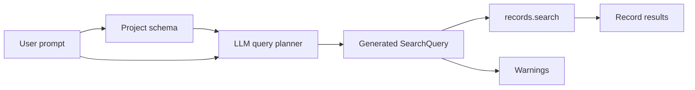

import Tabs from '@site/src/components/LanguageTabs'
import TabItem from '@theme/TabItem'

# Smart Search

Smart Search turns a natural-language request into a RushDB `SearchQuery`, executes it, and returns matching records.

Use it when the user asks for data in product language:

- "Who are piloting Falcon?"
- "Find planets 3-5 hops away from Tatooine"
- "Show active enterprise customers created last quarter"

Use [`records.vectorSearch()`](/learn/semantic-search) instead when you already know the indexed property and want direct vector similarity.

---

## How It Works



Under the hood, RushDB:

1. Reads the project schema: labels, properties, types, relationship map, and semantic index metadata.
2. Sends the schema plus your prompt to the query-planning model.
3. Receives a `SearchQuery`.
4. Executes that query with the normal records search endpoint.
5. Returns records plus the generated `SearchQuery` and any warnings.

Smart Search does **not** rank by embedding similarity unless the generated query itself uses a vector-capable pattern in a future version. Today it is primarily for schema-aware structured, relational, and filtered search.

---

## SDK Usage

<Tabs groupId="programming-language">
  <TabItem value="typescript" label="TypeScript" default>

```typescript
const results = await db.ai.search('Find active enterprise customers created last quarter')

console.log(results.searchQuery)
console.log(results.warnings)

for (const record of results.data) {
  console.log(record.data)
}
```

  </TabItem>
  <TabItem value="python" label="Python">

```python
results = db.ai.search("Find active enterprise customers created last quarter")

print(results.search_query)
print(results.warnings)

for record in results:
    print(record.data)
```

  </TabItem>
</Tabs>

You can pass the current query-builder state as context:

<Tabs groupId="programming-language">
  <TabItem value="typescript" label="TypeScript" default>

```typescript
const results = await db.ai.search('Only show records from Germany', {
  currentQuery: {
    labels: ['CUSTOMER'],
    where: { plan: 'enterprise' },
    limit: 50
  }
})
```

  </TabItem>
  <TabItem value="python" label="Python">

```python
results = db.ai.search(
    "Only show records from Germany",
    current_query={
        "labels": ["CUSTOMER"],
        "where": {"plan": "enterprise"},
        "limit": 50,
    },
)
```

  </TabItem>
</Tabs>

---

## Returned Result

Smart Search returns a normal record result with two extra pieces of metadata:

| Field                          | Description                                                                                     |
| ------------------------------ | ----------------------------------------------------------------------------------------------- |
| `data`                         | Matching records.                                                                               |
| `total`                        | Total matching records when available.                                                          |
| `searchQuery` / `search_query` | The generated `SearchQuery` that was executed.                                                  |
| `warnings`                     | Non-fatal issues from query generation, such as ambiguity or an unsupported part of the prompt. |

Always inspect the generated query when debugging:

```typescript
const results = await db.ai.search('recent risky accounts connected to Acme')
console.dir(results.searchQuery, { depth: null })
```

---

## Smart Search Vs Vector Search

| Need                                                                | Use                                                                  |
| ------------------------------------------------------------------- | -------------------------------------------------------------------- |
| Natural-language request over known schema                          | `db.ai.search(prompt)`                                               |
| Direct meaning-based retrieval over an indexed text/vector property | `db.records.vectorSearch({...})` / `db.records.vector_search({...})` |
| Exact filters, aggregations, graph traversal, pagination            | `db.records.find({...})`                                             |
| External embedding model / BYOV                                     | `db.records.vectorSearch({ queryVector, ... })`                      |

Examples:

```typescript
// Smart Search: generate SearchQuery from a user request
await db.ai.search('Find suppliers connected to delayed shipments')

// Vector Search: similarity over a known indexed property
await db.records.vectorSearch({
  labels: ['ARTICLE'],
  propertyName: 'body',
  query: 'database latency tuning',
  limit: 10
})
```

---

## Caveats And Limitations

Smart Search is a query-planning feature. Treat it like generated code:

- **Schema quality matters.** Ambiguous labels, generic property names, and missing relationships make generation less reliable.
- **The LLM can misunderstand intent.** Always display, log, or inspect the generated `SearchQuery` for important workflows.
- **It may return warnings.** Warnings mean RushDB generated a query but detected ambiguity, partial support, or a potentially surprising interpretation.
- **It is not a semantic vector ranking API.** Use vector search when you need embedding similarity and `__score`.
- **It depends on configured LLM credentials.** If the server has no query-planning model configured, Smart Search cannot generate a query.
- **Generated queries are bounded by SearchQuery capabilities.** Unsupported requests should be rewritten into labels, properties, relationships, filters, sorting, and pagination.
- **High-stakes workflows should require review.** For destructive actions, permissions, billing, legal, medical, or compliance flows, use Smart Search to draft a query and require human or application-level validation before acting on results.

---

## Recommended UI Pattern

For user-facing search boxes:

1. Call `db.ai.search(prompt)`.
2. Show the records.
3. Keep the generated `SearchQuery` available in an "Inspect query" panel.
4. Surface warnings near the result header.
5. Let users refine filters manually after the query is generated.

This gives users natural-language entry without hiding the actual query that ran.

---

## See Also

- [SearchQuery](/learn/search-query) — the query language Smart Search generates
- [Find & Query](/learn/records-and-queries/find-and-query) — execute exact queries directly
- [Semantic Search](/learn/semantic-search) — vector similarity over indexed properties
- [Discover Your Schema](/learn/records-and-queries/discover-your-schema) — see the schema context available to Smart Search
