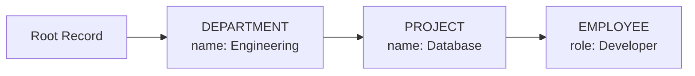

# Where

The `where` clause in SearchQuery is a powerful mechanism to filter records based on property values and relationships. It's one of the key elements that make RushDB queries flexible and expressive.

`where` is scoped by the resource you query. In `records.find`, exports, deletes, `labels.find`, and `properties.find`, it filters Records. In `relationships.find`, it filters relationship edges; use `source` and `target` to filter endpoint Records.

#### Where Placement in SearchQuery DTO

The `where` clause is defined in the `where` key of the SearchQuery DTO:

```typescript
// SearchQuery
{
  labels: ['COMPANY'],       // Record labels to search
  where: { /* conditions */ },  // Filtering conditions (this is what we focus on)
  limit: 10,                 // Results limit
  skip: 0,                   // Results offset
  orderBy: { name: 'asc' },  // Sorting
}
```

## Basic Operators

RushDB provides various operators for different data types to create precise conditions for filtering records.

### Primitive Value Matching

The simplest form of filtering is direct equality matching:

```typescript
{
  where: {
    name: "John Doe",          // Exact string match
    status: { $eq: "active" }, // Exact match using MongoDB-style operator syntax
    isActive: true,            // Boolean match
    age: 30,                   // Number match
    created: "2023-01-01T00:00:00Z"  // ISO 8601 datetime match
  }
}
```

`$eq` is an alias for direct equality. These two forms are equivalent:

```typescript
{
  where: {
    status: 'active'
  }
}
{
  where: {
    status: {
      $eq: 'active'
    }
  }
}
```

### String Operators

#### $contains

The `$contains` operator checks if a string field contains the specified substring.

```typescript
{
  where: {
    name: {
      $contains: 'John'
    } // Matches "John", "Johnny", "Johnson", etc.
  }
}
```

#### $startsWith

The `$startsWith` operator checks if a string field starts with the specified substring.

```typescript
{
  where: {
    name: {
      $startsWith: 'J'
    } // Matches "John", "Jane", "James", etc.
  }
}
```

#### $endsWith

The `$endsWith` operator checks if a string field ends with the specified substring.

```typescript
{
  where: {
    name: {
      $endsWith: 'son'
    } // Matches "Johnson", "Jackson", etc.
  }
}
```

#### $in

The `$in` operator checks if a string field matches any value in the specified array.

```typescript
{
  where: {
    status: {
      $in: ['active', 'pending']
    } // Matches "active" or "pending"
  }
}
```

#### $nin

The `$nin` operator checks if a string field does not match any value in the specified array.

```typescript
{
  where: {
    status: {
      $nin: ['deleted', 'archived']
    } // Matches anything except "deleted" or "archived"
  }
}
```

#### $ne

The `$ne` operator checks if a string field is not equal to the specified value.

```typescript
{
  where: {
    status: {
      $ne: 'deleted'
    } // Matches anything except "deleted"
  }
}
```

### Number Operators

#### $gt

The `$gt` (greater than) operator checks if a number field is greater than the specified value.

```typescript
{
  where: {
    age: {
      $gt: 18
    } // Matches age greater than 18
  }
}
```

#### $gte

The `$gte` (greater than or equal to) operator checks if a number field is greater than or equal to the specified value.

```typescript
{
  where: {
    age: {
      $gte: 21
    } // Matches age 21 or greater
  }
}
```

#### $lt

The `$lt` (less than) operator checks if a number field is less than the specified value.

```typescript
{
  where: {
    age: {
      $lt: 65
    } // Matches age less than 65
  }
}
```

#### $lte

The `$lte` (less than or equal to) operator checks if a number field is less than or equal to the specified value.

```typescript
{
  where: {
    age: {
      $lte: 64
    } // Matches age 64 or less
  }
}
```

#### $in

The `$in` operator checks if a number field matches any value in the specified array.

```typescript
{
  where: {
    age: {
      $in: [20, 30, 40]
    } // Matches age 20, 30, or 40
  }
}
```

#### $nin

The `$nin` operator checks if a number field does not match any value in the specified array.

```typescript
{
  where: {
    age: {
      $nin: [20, 30, 40]
    } // Matches any age except 20, 30, or 40
  }
}
```

#### $ne

The `$ne` operator checks if a number field is not equal to the specified value.

```typescript
{
  where: {
    age: {
      $ne: 18
    } // Matches any age except 18
  }
}
```

### Boolean Operators

#### Direct matching

```typescript
{
  where: {
    isActive: true // Matches records where isActive is true
  }
}
```

#### $ne

The `$ne` operator checks if a boolean field is not equal to the specified value.

```typescript
{
  where: {
    isActive: {
      $ne: false
    } // Matches records where isActive is not false (i.e., true or not set)
  }
}
```

### Datetime Operators

RushDB provides specialized operators for filtering records based on datetime values.

#### ISO 8601 string

You can match datetime values using ISO 8601 formatted strings:

```typescript
{
  where: {
    created: '2023-01-01T00:00:00Z' // Exact datetime match
  }
}
```

#### Datetime object components

You can also match based on specific datetime components:

```typescript
{
  where: {
    created: {
      $year: 2023,
      $month: 1,
      $day: 1
    }  // Matches January 1, 2023 (any time)
  }
}
```

Available datetime components:

- `$year`: Match by year
- `$month`: Match by month (1-12)
- `$day`: Match by day of month (1-31)
- `$hour`: Match by hour (0-23)
- `$minute`: Match by minute (0-59)
- `$second`: Match by second (0-59)
- `$millisecond`: Match by millisecond
- `$microsecond`: Match by microsecond
- `$nanosecond`: Match by nanosecond

#### Comparison operators

Datetime values support comparison operators:

```typescript
{
  where: {
    created: {
      $gte: '2023-01-01T00:00:00Z'
    } // Matches dates on or after January 1, 2023
  }
}
```

```typescript
{
  where: {
    created: {
      $gte: { $year: 2023, $month: 1, $day: 1 },
      $lt: { $year: 2024, $month: 1, $day: 1 }
    }  // Matches dates in the year 2023
  }
}
```

All number comparison operators (`$gt`, `$gte`, `$lt`, `$lte`, `$ne`) are supported for datetime values.

#### Array operators

You can also use array operators with datetime values:

```typescript
{
  where: {
    created: {
      $in: ['2023-01-01T00:00:00Z', '2023-02-01T00:00:00Z']
    } // Matches either of these two specific dates
  }
}
```

```typescript
{
  where: {
    created: {
      $nin: [
        { $year: 2020, $month: 1, $day: 1 },
        { $year: 2021, $month: 1, $day: 1 }
      ]
    } // Matches dates that are not January 1 of 2020 or 2021
  }
}
```

## Field Existence Operator

### $exists

The `$exists` operator checks whether a field exists in the record or not. This is useful for filtering records based on the presence or absence of specific fields.

#### Check if field exists

```typescript
{
  where: {
    phoneNumber: {
      $exists: true
    } // Only records that have a phoneNumber field
  }
}
```

#### Check if field does not exist

```typescript
{
  where: {
    phoneNumber: {
      $exists: false
    } // Only records that don't have a phoneNumber field
  }
}
```

The `$exists` operator works with all field types (string, number, boolean, datetime, null, arrays) and considers a field to:

- **Exist** (`$exists: true`) when the field is not null and not empty
- **Not exist** (`$exists: false`) when the field is null or empty

**Examples:**

```typescript
// Find users who have provided their email address
{
  where: {
    email: {
      $exists: true
    }
  }
}

// Find products that don't have a description
{
  where: {
    description: {
      $exists: false
    }
  }
}

// Combine with other operators
{
  where: {
    $and: [{ email: { $exists: true } }, { isActive: true }]
  }
}
```

### $type

The `$type` operator checks whether a field has a specific data type. This is useful for filtering records based on the data type of a field, especially when working with heterogeneous data or when you need to ensure type consistency.

```typescript
{
  where: {
    value: {
      $type: 'string'
    } // Only records where 'value' field is a string
  }
}
```

Available types:

- `"string"`: Text values
- `"number"`: Numeric values
- `"boolean"`: True/false values
- `"datetime"`: Date and time values
- `"null"`: Null values

**Examples:**

```typescript
// Find records where age is actually a number (not stored as string)
{
  where: {
    age: {
      $type: 'number'
    }
  }
}

// Find records where the status field is a boolean
{
  where: {
    status: {
      $type: 'boolean'
    }
  }
}

// Combine with other operators to find string fields that contain specific text
{
  where: {
    $and: [{ description: { $type: 'string' } }, { description: { $contains: 'important' } }]
  }
}
```

The `$type` operator is particularly useful when:

- Working with imported data that might have inconsistent types
- Validating data integrity across your records
- Building queries that need to handle fields that might contain different types of values
- Filtering records before applying type-specific operations

## Logical Grouping Operators

When you need to create complex conditions, logical grouping operators allow you to combine multiple conditions.

### $and

The `$and` operator combines multiple conditions and returns records that match all the conditions. This is the default behavior when listing multiple conditions.

```typescript
// Explicit $and
{
  where: {
    $and: [
      { name: { $startsWith: "J" } },
      { age: { $gte: 21 } }
    ]
  }
}

// Implicit $and (equivalent to above)
{
  where: {
    name: { $startsWith: "J" },
    age: { $gte: 21 }
  }
}
```

### $or

The `$or` operator returns records that match at least one of the specified conditions.

```typescript
{
  where: {
    $or: [{ name: { $startsWith: 'J' } }, { age: { $gte: 21 } }]
  }
}
```

### $not

The `$not` operator inverts the specified condition, returning records that don't match it.

```typescript
{
  where: {
    $not: {
      status: 'deleted'
    }
  }
}
```

### $nor

The `$nor` operator returns records that don't match any of the specified conditions.

```typescript
{
  where: {
    $nor: [{ status: 'deleted' }, { status: 'archived' }]
  }
}
```

### $xor

The `$xor` operator (exclusive OR) returns records that match exactly one of the specified conditions.

```typescript
{
  where: {
    $xor: [{ isPremium: true }, { hasFreeTrialAccess: true }]
  }
}
```

### Nested Logical Grouping

Logical operators can be nested to create complex conditions:

```typescript
{
  where: {
    $or: [
      { status: 'active' },
      {
        $and: [{ status: 'pending' }, { createdAt: { $gte: '2023-01-01T00:00:00Z' } }]
      }
    ]
  }
}
```

## Relationship Queries

One of the most powerful features of RushDB is its ability to query based on relationships between records.

> **Note:** The underlying mechanism in RushDB works as follows: when the SearchQuery parser encounters a nested object that is neither a flat object nor contains criteria operators (like $gt, $contains, etc.), it interprets this object as a related record reference, using the provided key as the desired label for the related record.

### Basic Relationship Queries

To filter records based on related records, use the label of the related record as a key:

```typescript
{
  where: {
    name: "Tech Corp",               // Property on the current record
    DEPARTMENT: {                    // Related record by label
      name: "Engineering",           // Property on the related record
      headcount: { $gte: 10 }        // Another property on the related record
    }
  }
}
```

This will find records named "Tech Corp" that are connected to at least one DEPARTMENT record named "Engineering" with a headcount of at least 10.

### Relationship Direction

You can specify the direction of the relationship using the `$relation` operator:

```typescript
{
  where: {
    POST: {
      $relation: {
        type: "AUTHORED",            // Relationship type
        direction: "in"              // Direction: "in" or "out"
      },
      title: { $contains: "Graph" }  // Property on the related record
    }
  }
}
```

You can also use a simplified syntax for specifying just the relationship type. This produces a direction-agnostic Cypher pattern (`-[:TYPE]-`) that traverses the edge regardless of its stored direction — it does not imply `direction: "out"`:

```typescript
{
  where: {
    POST: {
      $relation: "AUTHORED",         // Relationship type — direction-agnostic
      title: { $contains: "Graph" }  // Property on the related record
    }
  }
}
```

### Multi-Level Relationships

You can query through multiple levels of relationships:

```typescript
{
  where: {
    DEPARTMENT: {                    // First level relationship
      name: "Engineering",
      PROJECT: {                     // Second level relationship
        name: "Database",
        EMPLOYEE: {                  // Third level relationship
          role: "Developer"
        }
      }
    }
  }
}
```

This will find records connected to a DEPARTMENT named "Engineering" that has a PROJECT named "Database" with at least one EMPLOYEE with the role "Developer".



### Aliasing for Aggregations

When you need to reference related records in aggregations, use the `$alias` operator:

```typescript
{
  where: {
    DEPARTMENT: {
      $alias: "$department",         // Define alias for department records
      PROJECT: {
        $alias: "$project",          // Define alias for project records
        budget: { $gte: 10000 }
      }
    }
  }
}
```

> For more detailed information about aggregations, including available functions and advanced usage, see [Select Expressions](/learn/search-query/select-expressions).

### ID Filtering

You can filter by record ID using the special `$id` operator:

```typescript
{
  where: {
    $id: "123456",                   // Filter by ID of the current record
    DEPARTMENT: {
      $id: "789012"                  // Filter by ID of the related record
    }
  }
}
```

The `$id` operator supports all the string comparison operators:

```typescript
{
  where: {
    $id: {
      $in: ['123456', '789012']
    }
  }
}
```

## Logical Grouping with Relationships

You can combine logical operators with relationships to create powerful queries.

### $or with Relationships

```typescript
{
  where: {
    $or: [
      {
        DEPARTMENT: {
          name: 'Engineering'
        }
      },
      {
        DEPARTMENT: {
          name: 'Product'
        }
      }
    ]
  }
}
```

This will find records connected to either a DEPARTMENT named "Engineering" OR a DEPARTMENT named "Product".

### $and with Relationships

```typescript
{
  where: {
    $and: [
      {
        DEPARTMENT: {
          name: 'Engineering'
        }
      },
      {
        PROJECT: {
          budget: { $gte: 10000 }
        }
      }
    ]
  }
}
```

This will find records connected to both a DEPARTMENT named "Engineering" AND a PROJECT with a budget of at least 10000.

### Mixed Logical Operations

You can combine different logical operators:

```typescript
{
  where: {
    name: "Tech Corp",               // Implicit $and
    $or: [
      {
        DEPARTMENT: {
          name: "Engineering"
        }
      },
      {
        DEPARTMENT: {
          name: "Product",
          $not: {
            PROJECT: {               // No projects that are "Canceled"
              status: "Canceled"
            }
          }
        }
      }
    ]
  }
}
```

### Nested Logical Operations within Relationships

You can use logical operators inside relationship queries:

```typescript
{
  where: {
    DEPARTMENT: {
      $or: [
        { name: "Engineering" },
        { name: "Product" }
      ],
      PROJECT: {
        $and: [
          { budget: { $gte: 10000 } },
          { status: { $ne: "Canceled" } }
        ]
      }
    }
  }
}
```

## Complete Examples

<details>
<summary>Basic filtering with multiple conditions</summary>

```typescript
{
  where: {
    name: { $startsWith: "Tech" },
    foundingYear: { $gte: 2010 },
    active: true,
    industry: { $in: ["Software", "AI", "Cloud"] }
  }
}
```

This query finds records whose name starts with "Tech", founded in or after 2010, that are active, and are in the Software, AI, or Cloud industry.

</details>

<details>
<summary>Nested relationships with conditions</summary>

```typescript
{
  where: {
    COMPANY: {
      name: "Tech Corp",
      DEPARTMENT: {
        $relation: {
          type: "HAS_DEPARTMENT",
          direction: "out"
        },
        name: "Engineering",
        PROJECT: {
          budget: { $gte: 100000 },
          EMPLOYEE: {
            role: "Developer",
            skills: { $contains: "TypeScript" }
          }
        }
      }
    }
  }
}
```

This query traverses a complex relationship structure from COMPANY to DEPARTMENT to PROJECT to EMPLOYEE, applying filters at each level.

</details>

<details>
<summary>Complex logical grouping</summary>

```typescript
{
  where: {
    $or: [
      {
        $and: [
          { rating: { $gte: 4.5 } },
          { reviews: { $gte: 100 } }
        ]
      },
      {
        $and: [
          { rating: { $gte: 4.0 } },
          { reviews: { $gte: 1000 } },
          { featured: true }
        ]
      }
    ],
    $not: {
      status: "deprecated"
    }
  }
}
```

This query uses nested logical operators to find records that either have a high rating with moderate review count OR a slightly lower rating with high review count and are featured, but in either case are not deprecated.

</details>

<details>
<summary>Field existence filtering</summary>

```typescript
{
  where: {
    $and: [
      { email: { $exists: true } }, // Must have email
      { phoneNumber: { $exists: false } }, // Must not have phone number
      { isActive: true },
      {
        $or: [
          { lastLoginDate: { $exists: true } }, // Has logged in before
          { createdAt: { $gte: '2024-01-01T00:00:00Z' } } // Or is a recent signup
        ]
      }
    ]
  }
}
```

This query finds active users who have provided an email address but no phone number, and either have logged in before or are recent signups.

</details>

<details>
<summary>Multi-hop relationship filtering with text matching</summary>

```typescript
{
  where: {
    DOCUMENT: {
      title: { $contains: "Neural Networks" },
      CHUNK: {
        content: { $contains: "embedding" }
      }
    }
  }
}
```

This query finds records related to documents about neural networks that have chunks mentioning "embedding". For semantic (embedding-based) search, use the dedicated [AI search endpoint](/learn/reference/rest-api/ai-and-vectors/search).

</details>

<details>
<summary>Date range with related record filtering</summary>

```typescript
{
  where: {
    created: {
      $gte: { $year: 2023, $month: 1, $day: 1 },
      $lt: { $year: 2024, $month: 1, $day: 1 }
    },
    AUTHOR: {
      $relation: "CREATED_BY",
      reputation: { $gte: 100 },
      POST: {
        $not: {
          status: "deleted"
        }
      }
    }
  }
}
```

This query finds records created in 2023 by authors with a reputation of at least 100 who have at least one non-deleted post.

</details>

## Additional Notes

- Field names are case-sensitive.
- Missing fields are not included in the result. For example, searching for `{ active: true }` won't match records that don't have an `active` field.
- String comparison (`$contains`, `$startsWith`, `$endsWith`) is case-insensitive by default.
- When working with arrays in records, the conditions are satisfied if any element in the array matches. For example, `{ tags: "typescript" }` will match a record with `tags: ["javascript", "typescript", "react"]`.
- Logical operators can be used both at the root level and at any nested level, including inside relationship queries.
- Relationship queries are executed using `OPTIONAL MATCH` in Cypher, which means records will be included even if the related record doesn't exist unless you specifically filter for it.
