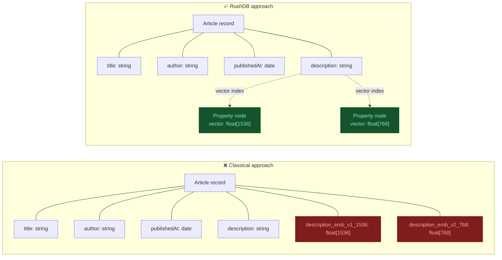

import Tabs from '@site/src/components/LanguageTabs'
import TabItem from '@theme/TabItem'

# Manage Embedding Indexes

An **embedding index** is a policy that tells RushDB to vectorize a specific string property for a label. Once `status` is `ready`, every record matching that label+property pair is searchable via [`db.records.vectorSearch()`](/learn/semantic-search).

Indexes are scoped to `(label, propertyName)` — `Book:description` and `Article:description` are completely independent with separate vector stores.

---

## How RushDB stores embeddings

Most databases store vectors directly on the record — polluting the schema with fields like `description_emb_v1_1536` alongside regular metadata. Agents retrieving records get back a mix of business fields and raw float arrays, making schemas noisy and hard to reason about.

RushDB stores each vector on a dedicated **Property node**, connected to the Record via an internal edge. Your record metadata stays clean and uniform; the vector index lives separately and is only accessed when you explicitly call `db.records.vectorSearch()`.



Decoupling vectors from record data means:

- **Agents see clean schemas** — no float arrays mixed with business fields
- **Multiple indexes on one property** — cosine + euclidean, different dimensions, side by side
- **Zero record writes on index create/delete** — vector policy changes don't touch your data nodes

---

## Create an Index

<Tabs groupId="programming-language">
  <TabItem value="python" label="Python" default>

`db.ai.indexes.create()`

```python
# Simplest form — uses server-configured model and dimensions
response = db.ai.indexes.create({
    "label": "Article",
    "propertyName": "description"
})
print(response.data["status"])  # 'pending' → backfill starts immediately

# With explicit parameters
response = db.ai.indexes.create({
    "label": "Article",
    "propertyName": "description",
    "similarityFunction": "cosine",
    "dimensions": 1536
})
```

  </TabItem>
  <TabItem value="typescript" label="TypeScript">

`db.ai.indexes.create()`

```typescript
// Simplest form — uses server-configured model and dimensions
const { data: index } = await db.ai.indexes.create({
  label: 'Book',
  propertyName: 'description'
})

console.log(index.status) // 'pending' → backfill starts immediately

// With explicit parameters
const { data: index } = await db.ai.indexes.create({
  label: 'Article',
  propertyName: 'body',
  similarityFunction: 'cosine',
  dimensions: 1536
})
```

  </TabItem>
  <TabItem value="shell" label="Shell">

`POST /api/v1/ai/indexes`

```bash
# Simplest form
curl -X POST https://api.rushdb.com/api/v1/ai/indexes \
  -H "Authorization: Bearer $RUSHDB_API_KEY" \
  -H "Content-Type: application/json" \
  -d '{"label": "Article", "propertyName": "description"}'

# With explicit parameters
curl -X POST https://api.rushdb.com/api/v1/ai/indexes \
  -H "Authorization: Bearer $RUSHDB_API_KEY" \
  -H "Content-Type: application/json" \
  -d '{
    "label": "Article",
    "propertyName": "description",
    "similarityFunction": "cosine",
    "dimensions": 1536
  }'
```

  </TabItem>
</Tabs>

### Create parameters

| Parameter            | Type     | Required | Description                                                                                                         |
| -------------------- | -------- | -------- | ------------------------------------------------------------------------------------------------------------------- |
| `label`              | `string` | **yes**  | Label to scope this index to (e.g. `"Article"`)                                                                     |
| `propertyName`       | `string` | **yes**  | Property to embed (e.g. `"description"`)                                                                            |
| `sourceType`         | `string` | no       | `"managed"` (default) or `"external"`. See [Bring Your Own Vectors](/learn/semantic-search/bring-your-own-vectors). |
| `similarityFunction` | `string` | no       | `"cosine"` (default) or `"euclidean"`                                                                               |
| `dimensions`         | `number` | no       | Vector dimensionality. Defaults to server `RUSHDB_EMBEDDING_DIMENSIONS`. **Required** for external indexes.         |

> Attempting to create a duplicate `(label, propertyName, sourceType, similarityFunction, dimensions)` tuple returns `409 Conflict`.

> **Model config is server-side.** The embedding model is set via `RUSHDB_EMBEDDING_MODEL` and `RUSHDB_EMBEDDING_DIMENSIONS` env vars.

### Index lifecycle

| Status             | Description                                            |
| ------------------ | ------------------------------------------------------ |
| `pending`          | Policy created, waiting for backfill scheduler         |
| `indexing`         | Backfill in progress                                   |
| `awaiting_vectors` | External index — waiting for client to push vectors    |
| `ready`            | All existing records have vectors; search is available |
| `error`            | Backfill failed; check server logs for the cause       |

---

## List Indexes

<Tabs groupId="programming-language">
  <TabItem value="python" label="Python" default>

`db.ai.indexes.find()`

```python
response = db.ai.indexes.find()
for index in response.data:
    print(f"{index['label']}.{index['propertyName']} — {index['status']}")
```

  </TabItem>
  <TabItem value="typescript" label="TypeScript">

`db.ai.indexes.find()`

```typescript
const { data: indexes } = await db.ai.indexes.find()
/*
[
  {
    id: "01jb...",
    label: "Book",
    propertyName: "description",
    sourceType: "managed",
    similarityFunction: "cosine",
    dimensions: 1536,
    status: "ready",
    modelKey: "text-embedding-3-small",
    ...
  }
]
*/
```

  </TabItem>
  <TabItem value="shell" label="Shell">

`GET /api/v1/ai/indexes`

```bash
curl https://api.rushdb.com/api/v1/ai/indexes \
  -H "Authorization: Bearer $RUSHDB_API_KEY"
```

```json
{
  "data": [
    {
      "id": "idx_abc123",
      "label": "Article",
      "propertyName": "description",
      "sourceType": "managed",
      "similarityFunction": "cosine",
      "dimensions": 1536,
      "status": "ready"
    }
  ],
  "success": true
}
```

  </TabItem>
</Tabs>

---

## Index Stats

Returns the fill rate for an index — useful for progress monitoring.

<Tabs groupId="programming-language">
  <TabItem value="python" label="Python" default>

`db.ai.indexes.stats(index_id)`

```python
response = db.ai.indexes.stats(index_id)
stats = response.data
print(f"{stats['indexedRecords']} / {stats['totalRecords']} records indexed")
```

  </TabItem>
  <TabItem value="typescript" label="TypeScript">

`db.ai.indexes.stats(id)`

```typescript
const { data: stats } = await db.ai.indexes.stats(index.id)
console.log(`${stats.indexedRecords} / ${stats.totalRecords} records indexed`)
```

```typescript
type EmbeddingIndexStats = {
  totalRecords: number
  indexedRecords: number
}
```

  </TabItem>
  <TabItem value="shell" label="Shell">

`GET /api/v1/ai/indexes/:id/stats`

```bash
curl https://api.rushdb.com/api/v1/ai/indexes/$INDEX_ID/stats \
  -H "Authorization: Bearer $RUSHDB_API_KEY"
```

  </TabItem>
</Tabs>

---

## Delete an Index

<Tabs groupId="programming-language">
  <TabItem value="python" label="Python" default>

`db.ai.indexes.delete(index_id)`

```python
db.ai.indexes.delete(index_id)
```

  </TabItem>
  <TabItem value="typescript" label="TypeScript">

`db.ai.indexes.delete(id)`

```typescript
await db.ai.indexes.delete(index.id)
```

  </TabItem>
  <TabItem value="shell" label="Shell">

`DELETE /api/v1/ai/indexes/:id`

```bash
curl -X DELETE https://api.rushdb.com/api/v1/ai/indexes/$INDEX_ID \
  -H "Authorization: Bearer $RUSHDB_API_KEY"
```

  </TabItem>
</Tabs>

The underlying Neo4j DDL vector index is only dropped when **zero embeddings remain** across the entire project — this avoids unnecessary rebuilds when multiple policies share the same `(dimensions, similarityFunction)`.

---

## Index Response Shape

```json
{
  "id": "idx_abc123",
  "projectId": "proj_xyz",
  "label": "Article",
  "propertyName": "description",
  "modelKey": "text-embedding-3-small",
  "sourceType": "managed",
  "similarityFunction": "cosine",
  "dimensions": 1536,
  "vectorPropertyName": "_emb_managed_cosine_1536",
  "enabled": true,
  "status": "ready",
  "createdAt": "2025-01-10T12:00:00.000Z",
  "updatedAt": "2025-01-10T12:05:00.000Z"
}
```

---

## Wait for Index Ready

For managed indexes, backfill runs asynchronously. Poll until `status` is `ready`:

<Tabs groupId="programming-language">
  <TabItem value="python" label="Python" default>

```python
import time

def wait_for_index_ready(db, index_id, timeout_s=90):
    deadline = time.time() + timeout_s
    while time.time() < deadline:
        response = db.ai.indexes.find()
        idx = next((i for i in response.data if i["id"] == index_id), None)
        if idx and idx["status"] == "ready":
            return
        if idx and idx["status"] == "error":
            raise RuntimeError("Index entered error state")
        time.sleep(3)
    raise TimeoutError("Index did not become ready in time")

response = db.ai.indexes.create({"label": "Book", "propertyName": "description"})
wait_for_index_ready(db, response.data["id"])
# now safe to call db.records.vectorSearch(...)
```

  </TabItem>
  <TabItem value="typescript" label="TypeScript">

```typescript
async function waitForIndexReady(db: RushDB, indexId: string, timeoutMs = 90_000): Promise<void> {
  const deadline = Date.now() + timeoutMs
  while (Date.now() < deadline) {
    const { data: indexes } = await db.ai.indexes.find()
    const idx = indexes.find((i) => i.id === indexId)
    if (idx?.status === 'ready') return
    if (idx?.status === 'error') throw new Error('Index entered error state')
    await new Promise((r) => setTimeout(r, 3_000))
  }
  throw new Error('Index did not become ready in time')
}

const { data: index } = await db.ai.indexes.create({
  label: 'Book',
  propertyName: 'description'
})
await waitForIndexReady(db, index.id)
// now safe to call db.records.vectorSearch(...)
```

  </TabItem>
  <TabItem value="shell" label="Shell">

```bash
# Poll until status == "ready"
while true; do
  STATUS=$(curl -s https://api.rushdb.com/api/v1/ai/indexes/$INDEX_ID \
    -H "Authorization: Bearer $RUSHDB_API_KEY" | jq -r '.data.status')
  echo "Status: $STATUS"
  [ "$STATUS" = "ready" ] && break
  sleep 3
done
```

  </TabItem>
</Tabs>

---

## Multiple Indexes on the Same Property

You can have more than one index per `(label, propertyName)` pair, provided the signature differs:

<Tabs groupId="programming-language">
  <TabItem value="python" label="Python" default>

```python
# Cosine index
db.ai.indexes.create({
    "label": "Product",
    "propertyName": "description",
    "similarityFunction": "cosine",
    "dimensions": 768,
})

# Euclidean index on the same property
db.ai.indexes.create({
    "label": "Product",
    "propertyName": "description",
    "similarityFunction": "euclidean",
    "dimensions": 768,
})
```

When searching or writing vectors against a property with multiple indexes, specify `similarityFunction` to disambiguate.

  </TabItem>
  <TabItem value="typescript" label="TypeScript">

```typescript
// Two indexes: Product:description/cosine and Product:description/euclidean
await db.records.vectorSearch({
  labels: ['Product'],
  propertyName: 'description',
  queryVector: vec,
  similarityFunction: 'cosine' // required — otherwise 422 Unprocessable Entity
})
```

  </TabItem>
  <TabItem value="shell" label="Shell">

```bash
curl -X POST https://api.rushdb.com/api/v1/ai/search \
  -H "Authorization: Bearer $RUSHDB_API_KEY" \
  -H "Content-Type: application/json" \
  -d '{
    "labels": ["Product"],
    "propertyName": "description",
    "queryVector": [0.1, 0.2, 0.3],
    "similarityFunction": "cosine"
  }'
```

  </TabItem>
</Tabs>

---

## Error Reference

| HTTP  | Cause                                                                                                      |
| ----- | ---------------------------------------------------------------------------------------------------------- |
| `404` | Property does not exist in the project graph                                                               |
| `409` | An index for this `(label, propertyName, sourceType, similarityFunction, dimensions)` tuple already exists |
| `422` | Property is not `string` type                                                                              |
| `422` | Embedding model is not configured on the server                                                            |

---

## See also

- [Semantic Search](/learn/semantic-search) — search using managed or external indexes
- [Write Records with Vectors](/learn/semantic-search/write-with-vectors) — attach vectors at write time
- [Bring Your Own Vectors](/learn/semantic-search/bring-your-own-vectors) — external embedding workflow
