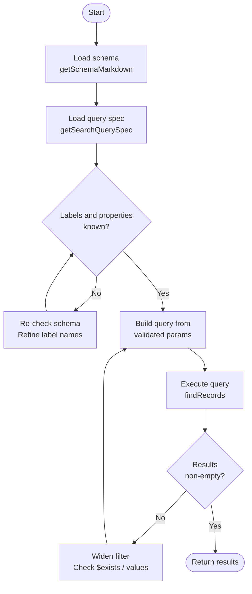

import Tabs from '@site/src/components/LanguageTabs'
import TabItem from '@theme/TabItem'

# Agent-Safe Query Planning with Schema First

LLMs that interact with databases without schema grounding make mistakes that are hard to catch: they invent label names, assume property shapes, and produce queries that return zero results or subtly wrong ones.

The fix is a disciplined execution loop: load the schema first, learn the query spec second, then build queries constrained to what actually exists. This tutorial teaches that loop in code and in the MCP server.

---

## The guarded execution loop



Every agent session that touches RushDB should follow this shape.

---

## Step 1: Load and ground on the schema

At the start of every agent session, fetch the schema and store the exact label and property names observed.

<Tabs groupId="programming-language">
<TabItem value="typescript" label="TypeScript">

```typescript
import RushDB from '@rushdb/javascript-sdk'

const db = new RushDB(process.env.RUSHDB_API_KEY!)

// The agent calls this at the start of every session
async function loadSchema() {
  const md = await db.ai.getSchemaMarkdown()
  // Pass this markdown to the LLM as part of its system context
  return md
}

const schemaContext = await loadSchema()
// console.log(schemaContext) — shows all labels, properties, types
```

</TabItem>
<TabItem value="python" label="Python">

```python
from rushdb import RushDB
import os

db = RushDB(os.environ["RUSHDB_API_KEY"], base_url="https://api.rushdb.com/api/v1")


def load_schema() -> str:
    """Returns schema markdown for injecting into agent system prompt."""
    return db.ai.get_schema_markdown()


schema_context = load_schema()
```

</TabItem>
<TabItem value="shell" label="Shell">

```bash
BASE="https://api.rushdb.com/api/v1"
TOKEN="RUSHDB_API_KEY"
H='Content-Type: application/json'

# Fetch markdown schema for LLM context
curl -s -X POST "$BASE/ai/schema/md" \
  -H "$H" -H "Authorization: Bearer $TOKEN" \
  -d '{}'
```

</TabItem>
</Tabs>

---

## Step 2: Validate label names before querying

When the agent generates a query, validate that every label in `labels` and `where` appears in the schema before executing.

<Tabs groupId="programming-language">
<TabItem value="typescript" label="TypeScript">

```typescript
type SchemaLabel = { name: string; properties: string[] }

function extractLabels(schema: any): Set<string> {
  // Schema structure varies — read the keys from getSchema() result
  const labelSet = new Set<string>()
  if (Array.isArray(schema)) {
    for (const entry of schema) {
      if (entry.label) labelSet.add(entry.label)
    }
  }
  return labelSet
}

async function safeFind(query: Parameters<typeof db.records.find>[0]) {
  const schemaResult = await db.ai.getSchema()
  const knownLabels = extractLabels(schemaResult)

  // Validate labels array
  const requestedLabels = query.labels ?? []
  const unknownLabels = requestedLabels.filter((l) => !knownLabels.has(l))
  if (unknownLabels.length > 0) {
    throw new Error(
      `Unknown labels: ${unknownLabels.join(', ')}. Known labels: ${[...knownLabels].join(', ')}`
    )
  }

  return db.records.find(query)
}

// Usage
try {
  const result = await safeFind({
    labels: ['CUSTOMER'], // validated against schema
    where: { status: 'active' },
    limit: 10
  })
  console.log(result.data)
} catch (err) {
  console.error(err)
  // Agent: re-check schema, pick correct label, retry
}
```

</TabItem>
<TabItem value="python" label="Python">

```python
def extract_labels(schema) -> set:
    labels = set()
    if isinstance(schema, list):
        for entry in schema:
            if "label" in entry:
                labels.add(entry["label"])
    return labels


def safe_find(query: dict) -> object:
    schema = db.ai.get_schema()
    known_labels = extract_labels(schema)

    requested_labels = query.get("labels", [])
    unknown = [l for l in requested_labels if l not in known_labels]
    if unknown:
        raise ValueError(
            f"Unknown labels: {unknown}. Known: {list(known_labels)}"
        )
    return db.records.find(query)


try:
    result = safe_find({"labels": ["CUSTOMER"], "where": {"status": "active"}, "limit": 10})
except ValueError as e:
    print(e)
    # Agent: re-check schema, pick correct label, retry
```

</TabItem>
<TabItem value="shell" label="Shell">

```bash
# Get schema to verify label before querying
LABELS=$(curl -s -X POST "$BASE/ai/schema" \
  -H "$H" -H "Authorization: Bearer $TOKEN" \
  -d '{}' | jq '[.[].label]')
echo "Known labels: $LABELS"

# Then query with validated label name
curl -s -X POST "$BASE/records/search" \
  -H "$H" -H "Authorization: Bearer $TOKEN" \
  -d '{"labels":["CUSTOMER"],"where":{"status":"active"},"limit":10}'
```

</TabItem>
</Tabs>

---

## Step 3: Handle zero-result queries without hallucinating

When a query returns zero results, the agent should widen the filter — not invent records or claim they exist.

<Tabs groupId="programming-language">
<TabItem value="typescript" label="TypeScript">

```typescript
async function queryWithFallback(label: string, filter: Record<string, unknown>) {
  // Try full filter
  let result = await db.records.find({
    labels: [label],
    where: filter,
    limit: 10
  })

  if (result.data.length === 0) {
    console.warn('Zero results with full filter. Checking each condition…')

    // Binary-search the filter to find which clause eliminates results
    for (const key of Object.keys(filter)) {
      const narrower = Object.fromEntries(Object.entries(filter).filter(([k]) => k !== key))
      const partial = await db.records.find({
        labels: [label],
        where: narrower,
        limit: 1
      })
      if (partial.total > 0) {
        console.warn(`Filter key "${key}" with value "${filter[key]}" eliminates all results`)
        // Check what values actually exist
        const dist = await db.records.find({
          labels: [label],
          select: {
            count: { $count: '*' },
            [key]: `$record.${key}`
          },
          groupBy: [key, 'count'],
          orderBy: { count: 'desc' },
          limit: 10
        })
        console.log(`Actual "${key}" values:`, dist.data)
        break
      }
    }
  }

  return result
}
```

</TabItem>
<TabItem value="python" label="Python">

```python
def query_with_fallback(label: str, filter_dict: dict) -> object:
    result = db.records.find({"labels": [label], "where": filter_dict, "limit": 10})

    if not result.data:
        print("Zero results. Diagnosing filter…")
        for key in list(filter_dict.keys()):
            partial_where = {k: v for k, v in filter_dict.items() if k != key}
            partial = db.records.find({"labels": [label], "where": partial_where, "limit": 1})
            if partial.total > 0:
                print(f'Key "{key}" = "{filter_dict[key]}" eliminates all results')
                dist = db.records.find({
                    "labels": [label],
                    "select": {
                        "count": {"$count": "*"},
                        key: f"$record.{key}"
                    },
                    "groupBy": [key, "count"],
                    "orderBy": {"count": "desc"},
                    "limit": 10
                })
                print(f'Actual "{key}" values:', dist.data)
                break

    return result
```

</TabItem>
<TabItem value="shell" label="Shell">

```bash
# If query returns empty, enumerate actual values of the suspect field
curl -s -X POST "$BASE/records/search" \
  -H "$H" -H "Authorization: Bearer $TOKEN" \
  -d '{
    "labels": ["CUSTOMER"],
    "select": {
      "count": {"$count": "*"},
      "status": "$record.status"
    },
    "groupBy": ["status", "count"],
    "orderBy": {"count": "desc"}
  }'
```

</TabItem>
</Tabs>

---

## Step 4: Use the MCP query builder prompt in agent sessions

RushDB's MCP server provides a `getQueryBuilderPrompt` tool that returns a system prompt enforcing schema-first behavior. Inject it into your agent's system message.

**In Claude or Cursor:**

```
Use the getQueryBuilderPrompt tool to load your operating instructions before making any queries.
```

**In code:**

<Tabs groupId="programming-language">
<TabItem value="typescript" label="TypeScript">

```typescript
// For agents that call the MCP server programmatically
// The query builder prompt is returned by the getQueryBuilderPrompt MCP tool
// Inject it as system context alongside the schema markdown

const systemPrompt = [
  queryBuilderPrompt, // from getQueryBuilderPrompt MCP tool
  '',
  '## Current Schema',
  schemaContext // from getSchemaMarkdown
].join('\n')
```

</TabItem>
<TabItem value="python" label="Python">

```python
# Same pattern in Python — build system context from both sources
system_prompt = "\n".join([
    query_builder_prompt,   # from getQueryBuilderPrompt MCP tool
    "",
    "## Current Schema",
    schema_context          # from get_schema_markdown()
])
```

</TabItem>
<TabItem value="shell" label="Shell">

```bash
# No MCP server call from shell — use the REST schema endpoint
# and combine with your own system prompt in the LLM call
```

</TabItem>
</Tabs>

---

## The five rules for agent-safe queries

These rules prevent the most common agent mistakes:

1. **Always call `getSchemaMarkdown` first** — never assume label names from memory or conversation history
2. **Use only labels that appear in the schema** — invented labels return zero results silently
3. **Use only property names that appear for those labels** — unknown properties in `where` are ignored without error, producing misleading results
4. **Enumerate categorical values before filtering** — never guess status/type/category strings
5. **Test direction before building traversal queries** — a wrong `direction` returns zero results instead of an error

---

## Production caveat

Schema grounding is a first-call overhead: one `getSchemaMarkdown` request per agent session. For high-throughput agents that execute many queries per session, cache the schema for the session duration and invalidate it if a query returns unexpected zero results (which may indicate a schema change mid-session).

---

## Next steps

- [Discovery Queries](/learn/tutorials/search-and-queries/discovery-queries) — interactive schema exploration in code
- [MCP Quickstart for Real Operators](/deploy/guides/mcp-operator-quickstart) — the same loop via MCP tools
- [Building Team Memory](/learn/tutorials/agent-memory/building-team-memory) — a real knowledge base for agents to query
