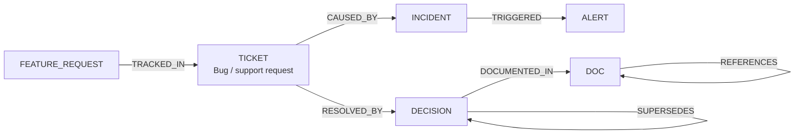

import Tabs from '@site/src/components/LanguageTabs'
import TabItem from '@theme/TabItem'

# Building Team Memory for Product and Support Workflows

A team accumulates context constantly: decisions made in Slack, bugs filed in Linear, docs written in Notion, post-mortems filed after incidents. That knowledge is scattered across tools and largely unretrievable — until someone needs it.

This tutorial shows how to build a connected team memory graph in RushDB where tickets, decisions, incidents, docs, and feature requests are first-class nodes, linked by causal and referential relationships. Once the graph exists, you can retrieve connected context instead of isolated documents.

---

## Graph shape



The key labels are:

| Label             | What it represents                                       |
| ----------------- | -------------------------------------------------------- |
| `TICKET`          | A bug report, support ticket, or task                    |
| `DECISION`        | An architectural or product decision, ADR-style          |
| `INCIDENT`        | A production incident or outage                          |
| `DOC`             | A piece of documentation, runbook, post-mortem, or RFC   |
| `FEATURE_REQUEST` | A request from customers, research, or internal feedback |
| `ALERT`           | A monitoring alert that triggered during an incident     |

---

## Step 1: Ingest existing tickets and docs

Start with a bulk import. Shape each entry before writing — assign `status`, `category`, and `createdAt` while the structure is fresh.

<Tabs groupId="programming-language">
<TabItem value="typescript" label="TypeScript">

```typescript
import RushDB from '@rushdb/javascript-sdk'

const db = new RushDB(process.env.RUSHDB_API_KEY!)

await db.records.importJson({
  label: 'TICKET',
  data: [
    {
      externalId: 'TICKET-1001',
      title: 'Login fails when SSO is enabled',
      status: 'open',
      category: 'auth',
      severity: 'high',
      source: 'linear',
      createdAt: '2025-03-01'
    },
    {
      externalId: 'TICKET-1002',
      title: 'Dashboard crashes on date range filter',
      status: 'resolved',
      category: 'ui',
      severity: 'medium',
      source: 'linear',
      createdAt: '2025-03-05'
    }
  ]
})

await db.records.importJson({
  label: 'DOC',
  data: [
    {
      externalId: 'DOC-007',
      title: 'SSO Integration Architecture',
      docType: 'adr',
      status: 'accepted',
      createdAt: '2025-01-10'
    },
    {
      externalId: 'DOC-201',
      title: 'Dashboard Date Filter Postmortem',
      docType: 'postmortem',
      status: 'published',
      createdAt: '2025-03-07'
    }
  ]
})
```

</TabItem>
<TabItem value="python" label="Python">

```python
from rushdb import RushDB
import os

db = RushDB(os.environ["RUSHDB_API_KEY"], base_url="https://api.rushdb.com/api/v1")

db.records.import_json({
    "label": "TICKET",
    "data": [
        {
            "externalId": "TICKET-1001",
            "title": "Login fails when SSO is enabled",
            "status": "open",
            "category": "auth",
            "severity": "high",
            "source": "linear",
            "createdAt": "2025-03-01"
        },
        {
            "externalId": "TICKET-1002",
            "title": "Dashboard crashes on date range filter",
            "status": "resolved",
            "category": "ui",
            "severity": "medium",
            "source": "linear",
            "createdAt": "2025-03-05"
        }
    ]
})

db.records.import_json({
    "label": "DOC",
    "data": [
        {
            "externalId": "DOC-007",
            "title": "SSO Integration Architecture",
            "docType": "adr",
            "status": "accepted",
            "createdAt": "2025-01-10"
        },
        {
            "externalId": "DOC-201",
            "title": "Dashboard Date Filter Postmortem",
            "docType": "postmortem",
            "status": "published",
            "createdAt": "2025-03-07"
        }
    ]
})
```

</TabItem>
<TabItem value="shell" label="Shell">

```bash
BASE="https://api.rushdb.com/api/v1"
TOKEN="RUSHDB_API_KEY"
H='Content-Type: application/json'

curl -s -X POST "$BASE/records/import/json" \
  -H "$H" -H "Authorization: Bearer $TOKEN" \
  -d '{
    "label": "TICKET",
    "data": [
      {"externalId":"TICKET-1001","title":"Login fails when SSO is enabled","status":"open","category":"auth","severity":"high","source":"linear","createdAt":"2025-03-01"},
      {"externalId":"TICKET-1002","title":"Dashboard crashes on date range filter","status":"resolved","category":"ui","severity":"medium","source":"linear","createdAt":"2025-03-05"}
    ]
  }'
```

</TabItem>
</Tabs>

---

## Step 2: Link related records

After ingestion, fetch the records by their external IDs and attach causal and reference relationships.

<Tabs groupId="programming-language">
<TabItem value="typescript" label="TypeScript">

```typescript
// Fetch records by externalId
const [ticketResult, docResult] = await Promise.all([
  db.records.find({ labels: ['TICKET'], where: { externalId: 'TICKET-1002' } }),
  db.records.find({ labels: ['DOC'], where: { externalId: 'DOC-201' } })
])

const ticket = ticketResult.data[0]
const doc = docResult.data[0]

// TICKET --RESOLVED_BY--> DOC (postmortem)
await db.records.attach({
  source: ticket,
  target: doc,
  options: { type: 'RESOLVED_BY', direction: 'out' }
})

// Also link the SSO ticket to the SSO ADR doc
const [ssoTicket, ssoDoc] = await Promise.all([
  db.records.find({ labels: ['TICKET'], where: { externalId: 'TICKET-1001' } }),
  db.records.find({ labels: ['DOC'], where: { externalId: 'DOC-007' } })
])

await db.records.attach({
  source: ssoTicket.data[0],
  target: ssoDoc.data[0],
  options: { type: 'REFERENCES', direction: 'out' }
})
```

</TabItem>
<TabItem value="python" label="Python">

```python
ticket_result = db.records.find({"labels": ["TICKET"], "where": {"externalId": "TICKET-1002"}})
doc_result    = db.records.find({"labels": ["DOC"],    "where": {"externalId": "DOC-201"}})

ticket = ticket_result.data[0]
doc    = doc_result.data[0]

db.records.attach(ticket.id, doc.id, {"type": "RESOLVED_BY", "direction": "out"})

# SSO ticket → SSO ADR
sso_ticket = db.records.find({"labels": ["TICKET"], "where": {"externalId": "TICKET-1001"}}).data[0]
sso_doc    = db.records.find({"labels": ["DOC"],    "where": {"externalId": "DOC-007"}}).data[0]

db.records.attach(sso_ticket.id, sso_doc.id, {"type": "REFERENCES", "direction": "out"})
```

</TabItem>
<TabItem value="shell" label="Shell">

```bash
# Fetch ticket and doc IDs first
TICKET_ID=$(curl -s -X POST "$BASE/records/search" \
  -H "$H" -H "Authorization: Bearer $TOKEN" \
  -d '{"labels":["TICKET"],"where":{"externalId":"TICKET-1002"}}' \
  | jq -r '.data[0].__id')

DOC_ID=$(curl -s -X POST "$BASE/records/search" \
  -H "$H" -H "Authorization: Bearer $TOKEN" \
  -d '{"labels":["DOC"],"where":{"externalId":"DOC-201"}}' \
  | jq -r '.data[0].__id')

# Attach relationship
curl -s -X POST "$BASE/records/$TICKET_ID/relations" \
  -H "$H" -H "Authorization: Bearer $TOKEN" \
  -d "{\"targets\":[\"$DOC_ID\"],\"options\":{\"type\":\"RESOLVED_BY\",\"direction\":\"out\"}}"
```

</TabItem>
</Tabs>

---

## Step 3: Query connected context around a ticket

Now retrieve all context relevant to an open ticket in one query.

<Tabs groupId="programming-language">
<TabItem value="typescript" label="TypeScript">

```typescript
// All open auth tickets that REFERENCES an ADR
const authTicketsWithDocs = await db.records.find({
  labels: ['TICKET'],
  where: {
    status: 'open',
    category: 'auth',
    DOC: {
      $relation: { type: 'REFERENCES', direction: 'out' }
    }
  }
})

for (const ticket of authTicketsWithDocs.data) {
  console.log(`${ticket.externalId}: ${ticket.title}`)
}
```

</TabItem>
<TabItem value="python" label="Python">

```python
auth_tickets_with_docs = db.records.find({
    "labels": ["TICKET"],
    "where": {
        "status": "open",
        "category": "auth",
        "DOC": {
            "$relation": {"type": "REFERENCES", "direction": "out"}
        }
    }
})

for ticket in auth_tickets_with_docs.data:
    print(f"{ticket.data.get('externalId')}: {ticket.data.get('title')}")
```

</TabItem>
<TabItem value="shell" label="Shell">

```bash
curl -s -X POST "$BASE/records/search" \
  -H "$H" -H "Authorization: Bearer $TOKEN" \
  -d '{
    "labels": ["TICKET"],
    "where": {
      "status": "open",
      "category": "auth",
      "DOC": {
        "$relation": {"type": "REFERENCES", "direction": "out"}
      }
    }
  }'
```

</TabItem>
</Tabs>

---

## Step 4: Semantic search over team knowledge

Enable semantic search on the `title` property of TICKET and DOC records to find related context when the exact terms are unknown.

<Tabs groupId="programming-language">
<TabItem value="typescript" label="TypeScript">

```typescript
// First create an index — run once, not on every query
await db.ai.indexes.create({
  label: 'TICKET',
  propertyName: 'title'
})

await db.ai.indexes.create({
  label: 'DOC',
  propertyName: 'title'
})

// Semantic search across both TICKET and DOC titles
const related = await db.ai.search({
  query: 'authentication failure after config change',
  propertyName: 'title',
  labels: ['TICKET', 'DOC']
})

for (const item of related.data) {
  console.log(`[${item.__labels}] ${item.title} — score: ${item.__score.toFixed(3)}`)
}
```

</TabItem>
<TabItem value="python" label="Python">

```python
# Create indexes once
db.ai.indexes.create({"label": "TICKET", "propertyName": "title"})
db.ai.indexes.create({"label": "DOC",    "propertyName": "title"})

# Search
related = db.ai.search({
    "query": "authentication failure after config change",
    "propertyName": "title",
    "labels": ["TICKET", "DOC"]
})

for item in related.data:
    print(f"[{item.get('__labels')}] {item.get('title')} — score: {item.score:.3f}")
```

</TabItem>
<TabItem value="shell" label="Shell">

```bash
# Create indexes (run once)
curl -s -X POST "$BASE/ai/indexes" \
  -H "$H" -H "Authorization: Bearer $TOKEN" \
  -d '{"label":"TICKET","propertyName":"title"}'

curl -s -X POST "$BASE/ai/indexes" \
  -H "$H" -H "Authorization: Bearer $TOKEN" \
  -d '{"label":"DOC","propertyName":"title"}'

# Search
curl -s -X POST "$BASE/ai/search" \
  -H "$H" -H "Authorization: Bearer $TOKEN" \
  -d '{
    "query": "authentication failure after config change",
    "propertyName": "title",
    "labels": ["TICKET", "DOC"]
  }'
```

</TabItem>
</Tabs>

---

## Step 5: Retrieve connected context for an agent prompt

When an agent needs to answer "what do we know about the SSO bug?", retrieve connected nodes and assemble a compact context block.

<Tabs groupId="programming-language">
<TabItem value="typescript" label="TypeScript">

```typescript
async function getTicketContext(externalId: string): Promise<string> {
  // 1. Find the ticket
  const ticketResult = await db.records.find({
    labels: ['TICKET'],
    where: { externalId }
  })
  const ticket = ticketResult.data[0]
  if (!ticket) return 'Ticket not found.'

  // 2. Find directly referenced docs
  const docs = await db.records.find({
    labels: ['DOC'],
    where: {
      TICKET: {
        $relation: { type: 'REFERENCES', direction: 'in' },
        __id: ticket.__id
      }
    }
  })

  // 3. Find semantically similar tickets
  const similarTickets = await db.ai.search({
    query: ticket.title as string,
    propertyName: 'title',
    labels: ['TICKET'],
    where: { status: 'resolved' },
    limit: 3
  })

  // 4. Assemble context
  const lines: string[] = [
    `## Ticket: ${ticket.externalId} — ${ticket.title}`,
    `Status: ${ticket.status} | Category: ${ticket.category} | Severity: ${ticket.severity}`,
    '',
    '### Referenced Documents'
  ]
  for (const doc of docs.data) {
    lines.push(`- [${doc.docType}] ${doc.title}`)
  }
  lines.push('')
  lines.push('### Similar Resolved Tickets')
  for (const t of similarTickets.data) {
    lines.push(`- ${t.externalId}: ${t.title} (score: ${t.__score.toFixed(2)})`)
  }

  return lines.join('\n')
}

const context = await getTicketContext('TICKET-1001')
console.log(context)
```

</TabItem>
<TabItem value="python" label="Python">

```python
def get_ticket_context(external_id: str) -> str:
    ticket_result = db.records.find({
        "labels": ["TICKET"],
        "where": {"externalId": external_id}
    })
    if not ticket_result.data:
        return "Ticket not found."
    ticket = ticket_result.data[0]

    docs = db.records.find({
        "labels": ["DOC"],
        "where": {
            "TICKET": {
                "$relation": {"type": "REFERENCES", "direction": "in"},
                "__id": ticket.id
            }
        }
    })

    similar = db.ai.search({
        "query": ticket.data.get("title", ""),
        "propertyName": "title",
        "labels": ["TICKET"],
        "where": {"status": "resolved"},
        "limit": 3
    })

    lines = [
        f"## Ticket: {ticket.data['externalId']} — {ticket.data['title']}",
        f"Status: {ticket.data.get('status')} | Category: {ticket.data.get('category')}",
        "",
        "### Referenced Documents"
    ]
    for doc in docs.data:
        lines.append(f"- [{doc.data.get('docType')}] {doc.data.get('title')}")
    lines.append("")
    lines.append("### Similar Resolved Tickets")
    for t in similar.data:
        lines.append(f"- {t.get('externalId')}: {t.get('title')} (score: {t.score:.2f})")

    return "\n".join(lines)


print(get_ticket_context("TICKET-1001"))
```

</TabItem>
<TabItem value="shell" label="Shell">

```bash
# Get ticket
TICKET_ID=$(curl -s -X POST "$BASE/records/search" \
  -H "$H" -H "Authorization: Bearer $TOKEN" \
  -d '{"labels":["TICKET"],"where":{"externalId":"TICKET-1001"}}' \
  | jq -r '.data[0].__id')

# Get referenced docs
curl -s -X POST "$BASE/records/search" \
  -H "$H" -H "Authorization: Bearer $TOKEN" \
  -d "{\"labels\":[\"DOC\"],\"where\":{\"TICKET\":{\"\$relation\":{\"type\":\"REFERENCES\",\"direction\":\"in\"},\"__id\":\"$TICKET_ID\"}}}"

# Semantic similar
curl -s -X POST "$BASE/ai/search" \
  -H "$H" -H "Authorization: Bearer $TOKEN" \
  -d '{"query":"Login fails when SSO is enabled","propertyName":"title","labels":["TICKET"],"where":{"status":"resolved"},"limit":3}'
```

</TabItem>
</Tabs>

---

## What to add next

Once the base graph is established, enrich it incrementally:

- **Webhooks from Linear/GitHub/PagerDuty** — auto-create TICKET and INCIDENT records on event (see [Event-Driven Ingestion](/learn/tutorials/working-with-data/event-driven-ingestion))
- **Decisions as first-class nodes** — when a team makes a decision, create a DECISION record and link it to the TICKET or INCIDENT it resolved
- **FEATURE_REQUEST linked to TICKET** — when a customer request drives a bug fix or feature, link the FEATURE_REQUEST to the TICKET so the team can see customer impact upstream of every change

---

## Production caveat

Team memory graphs grow unboundedly unless pruned. Define a retention policy for closed tickets and resolved incidents older than a threshold (90 days, 1 year) and archive them with a status update rather than deleting — relationships to other nodes remain valid for historical queries even when the original record is archived.

---

## Next steps

- [Agent-Safe Query Planning with Schema First](/learn/tutorials/agent-memory/agent-safe-query-planning) — run agents over this memory graph safely
- [Episodic Memory for Multi-Step Agents](/learn/tutorials/agent-memory/episodic-memory) — session-scoped context alongside persistent team memory
- [Data Lineage](/learn/tutorials/graph-modeling/data-lineage) — trace decisions back to source data
