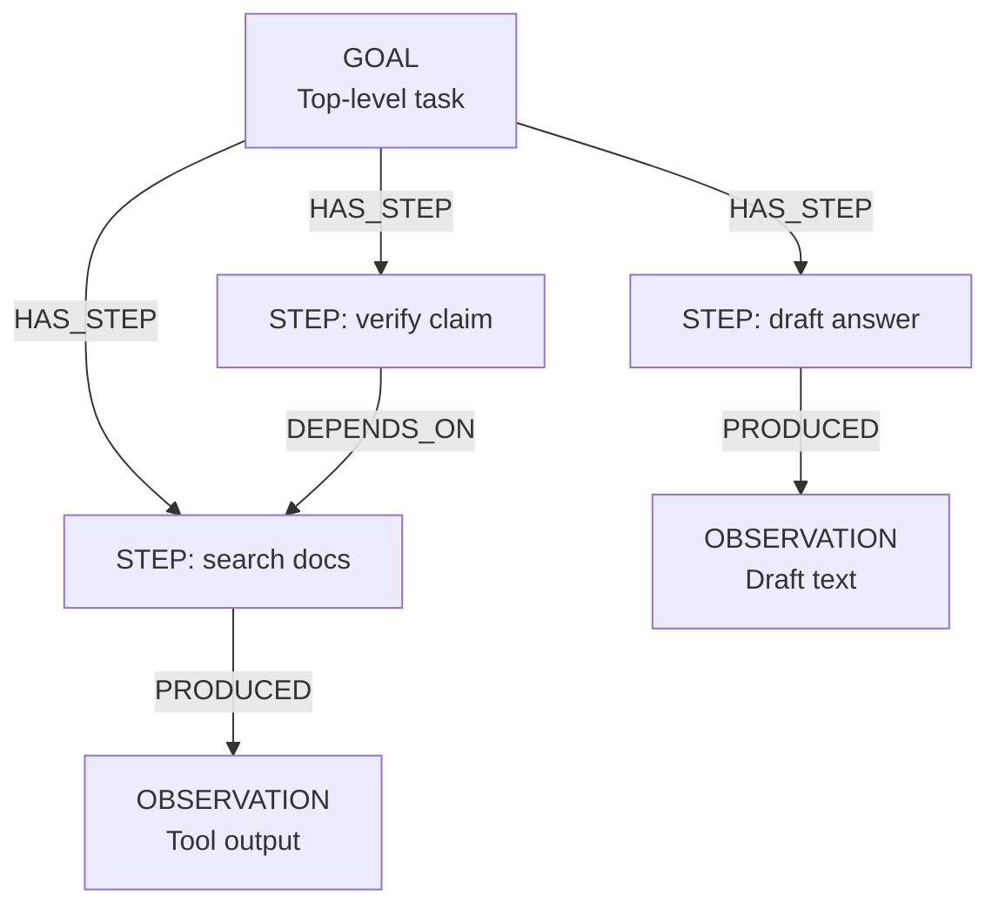

import Tabs from '@site/src/components/LanguageTabs'
import TabItem from '@theme/TabItem'

# Episodic Memory for Multi-Step Agents

A stateless agent that restarts a task from scratch every session wastes context. A long-running agent that can write its observations and decisions to a graph database — and read them back on resume — can pick up where it left off, avoid repeating work, and build compound reasoning over time.

This tutorial shows the episodic memory pattern: one GOAL record per task, linked STEP records capturing each intermediate action, and linked OBSERVATION records for tool outputs and discoveries.

---

## Graph shape



| Label         | What it represents                                                          |
| ------------- | --------------------------------------------------------------------------- |
| `GOAL`        | The agent's top-level objective for a session                               |
| `STEP`        | A single action the agent took (tool call, reasoning step, decision)        |
| `OBSERVATION` | The result or output of a step (tool output, search result, partial answer) |

---

## Step 1: Create a goal record when a session starts

<Tabs groupId="programming-language">
<TabItem value="typescript" label="TypeScript">

```typescript
import RushDB from '@rushdb/javascript-sdk'

const db = new RushDB(process.env.RUSHDB_API_KEY!)

async function startSession(taskDescription: string, agentId: string) {
  const goal = await db.records.create({
    label: 'GOAL',
    data: {
      task: taskDescription,
      agentId,
      status: 'in_progress',
      startedAt: new Date().toISOString()
    }
  })
  return goal
}

const goal = await startSession('Research RushDB graph query patterns and summarize the top 5', 'agent-001')
console.log('Session goal ID:', goal.id)
```

</TabItem>
<TabItem value="python" label="Python">

```python
from rushdb import RushDB
import os
from datetime import datetime, timezone

db = RushDB(os.environ["RUSHDB_API_KEY"], base_url="https://api.rushdb.com/api/v1")


def start_session(task: str, agent_id: str):
    goal = db.records.create("GOAL", {
        "task": task,
        "agentId": agent_id,
        "status": "in_progress",
        "startedAt": datetime.now(timezone.utc).isoformat()
    })
    return goal


goal = start_session(
    "Research RushDB graph query patterns and summarize the top 5",
    "agent-001"
)
print("Session goal ID:", goal.id)
```

</TabItem>
<TabItem value="shell" label="Shell">

```bash
BASE="https://api.rushdb.com/api/v1"
TOKEN="RUSHDB_API_KEY"
H='Content-Type: application/json'

GOAL_RESP=$(curl -s -X POST "$BASE/records" \
  -H "$H" -H "Authorization: Bearer $TOKEN" \
  -d '{
    "label": "GOAL",
    "data": {
      "task": "Research graph query patterns",
      "agentId": "agent-001",
      "status": "in_progress",
      "startedAt": "2025-04-01T10:00:00Z"
    }
  }')

GOAL_ID=$(echo "$GOAL_RESP" | jq -r '.data.__id')
echo "Goal ID: $GOAL_ID"
```

</TabItem>
</Tabs>

---

## Step 2: Record each step as the agent executes it

Each agent action — tool call, web search, or LLM reasoning step — becomes a STEP record linked to the GOAL.

<Tabs groupId="programming-language">
<TabItem value="typescript" label="TypeScript">

```typescript
async function recordStep(goalId: string, stepType: string, action: string, index: number) {
  const step = await db.records.create({
    label: 'STEP',
    data: {
      type: stepType,
      action,
      index,
      status: 'executing',
      startedAt: new Date().toISOString()
    }
  })

  // Fetch the goal record and link
  const goalResult = await db.records.find({
    labels: ['GOAL'],
    where: { $id: goalId }
  })

  await db.records.attach({
    source: goalResult.data[0],
    target: step,
    options: { type: 'HAS_STEP', direction: 'out' }
  })

  return step
}

const step1 = await recordStep(goal.id, 'tool_call', 'Search documentation: graph traversal patterns', 1)
```

</TabItem>
<TabItem value="python" label="Python">

```python
def record_step(goal_id: str, step_type: str, action: str, index: int):
    step = db.records.create("STEP", {
        "type": step_type,
        "action": action,
        "index": index,
        "status": "executing",
        "startedAt": datetime.now(timezone.utc).isoformat()
    })

    goal_result = db.records.find({"labels": ["GOAL"], "where": {"$id": goal_id}})
    db.records.attach(
        goal_result.data[0].id,
        step.id,
        {"type": "HAS_STEP", "direction": "out"}
    )
    return step


step1 = record_step(goal.id, "tool_call", "Search docs: graph traversal patterns", 1)
```

</TabItem>
<TabItem value="shell" label="Shell">

```bash
STEP_RESP=$(curl -s -X POST "$BASE/records" \
  -H "$H" -H "Authorization: Bearer $TOKEN" \
  -d '{
    "label": "STEP",
    "data": {
      "type": "tool_call",
      "action": "Search docs: graph traversal patterns",
      "index": 1,
      "status": "executing",
      "startedAt": "2025-04-01T10:01:00Z"
    }
  }')
STEP_ID=$(echo "$STEP_RESP" | jq -r '.data.__id')

# Link step to goal
curl -s -X POST "$BASE/records/$GOAL_ID/relations" \
  -H "$H" -H "Authorization: Bearer $TOKEN" \
  -d "{\"targets\":[\"$STEP_ID\"],\"options\":{\"type\":\"HAS_STEP\",\"direction\":\"out\"}}"
```

</TabItem>
</Tabs>

---

## Step 3: Store observations from tool outputs

When a tool returns results, store the output as an OBSERVATION linked to the STEP that produced it.

<Tabs groupId="programming-language">
<TabItem value="typescript" label="TypeScript">

```typescript
async function recordObservation(stepId: string, content: string, observationType: string) {
  const obs = await db.records.create({
    label: 'OBSERVATION',
    data: {
      content,
      type: observationType,
      recordedAt: new Date().toISOString()
    }
  })

  const stepResult = await db.records.find({
    labels: ['STEP'],
    where: { $id: stepId }
  })

  await db.records.attach({
    source: stepResult.data[0],
    target: obs,
    options: { type: 'PRODUCED', direction: 'out' }
  })

  // Mark step complete
  await db.records.update(stepId, { status: 'completed' })

  return obs
}

const obs1 = await recordObservation(
  step1.id,
  'Found 3 relevant tutorials: thinking-in-graphs, modeling-hierarchies, temporal-graphs',
  'search_result'
)
```

</TabItem>
<TabItem value="python" label="Python">

```python
def record_observation(step_id: str, content: str, obs_type: str):
    obs = db.records.create("OBSERVATION", {
        "content": content,
        "type": obs_type,
        "recordedAt": datetime.now(timezone.utc).isoformat()
    })

    step_result = db.records.find({"labels": ["STEP"], "where": {"$id": step_id}})
    db.records.attach(
        step_result.data[0].id,
        obs.id,
        {"type": "PRODUCED", "direction": "out"}
    )

    db.records.update(step_id, {"status": "completed"})
    return obs


obs1 = record_observation(
    step1.id,
    "Found 3 relevant tutorials: thinking-in-graphs, modeling-hierarchies, temporal-graphs",
    "search_result"
)
```

</TabItem>
<TabItem value="shell" label="Shell">

```bash
OBS_RESP=$(curl -s -X POST "$BASE/records" \
  -H "$H" -H "Authorization: Bearer $TOKEN" \
  -d '{
    "label": "OBSERVATION",
    "data": {
      "content": "Found 3 relevant tutorials",
      "type": "search_result",
      "recordedAt": "2025-04-01T10:02:00Z"
    }
  }')
OBS_ID=$(echo "$OBS_RESP" | jq -r '.data.__id')

curl -s -X POST "$BASE/records/$STEP_ID/relations" \
  -H "$H" -H "Authorization: Bearer $TOKEN" \
  -d "{\"targets\":[\"$OBS_ID\"],\"options\":{\"type\":\"PRODUCED\",\"direction\":\"out\"}}"

curl -s -X PATCH "$BASE/records/$STEP_ID" \
  -H "$H" -H "Authorization: Bearer $TOKEN" \
  -d '{"status":"completed"}'
```

</TabItem>
</Tabs>

---

## Step 4: Resume a session and retrieve accumulated context

When the agent resumes — or when a new session needs to continue where a prior one left off — retrieve the full context for the GOAL.

<Tabs groupId="programming-language">
<TabItem value="typescript" label="TypeScript">

```typescript
async function resumeSession(goalId: string) {
  // Get the goal
  const goalResult = await db.records.find({
    labels: ['GOAL'],
    where: { $id: goalId }
  })
  const goal = goalResult.data[0]

  // Get all steps in order
  const steps = await db.records.find({
    labels: ['STEP'],
    where: {
      GOAL: {
        $relation: { type: 'HAS_STEP', direction: 'in' },
        $id: goalId
      }
    },
    orderBy: { index: 'asc' }
  })

  // Get all observations across all steps
  const observations = await db.records.find({
    labels: ['OBSERVATION'],
    where: {
      STEP: {
        $relation: { type: 'PRODUCED', direction: 'in' },
        GOAL: {
          $relation: { type: 'HAS_STEP', direction: 'in' },
          $id: goalId
        }
      }
    }
  })

  return {
    goal: { task: goal.task, status: goal.status },
    completedSteps: steps.data.filter((s) => s.status === 'completed').length,
    totalSteps: steps.total,
    observations: observations.data.map((o) => o.content)
  }
}

const context = await resumeSession(goal.id)
console.log('Resumed context:', context)
```

</TabItem>
<TabItem value="python" label="Python">

```python
def resume_session(goal_id: str) -> dict:
    goal_result = db.records.find({"labels": ["GOAL"], "where": {"$id": goal_id}})
    goal_rec = goal_result.data[0]

    steps = db.records.find({
        "labels": ["STEP"],
        "where": {
            "GOAL": {
                "$relation": {"type": "HAS_STEP", "direction": "in"},
                "$id": goal_id
            }
        },
        "orderBy": {"index": "asc"}
    })

    observations = db.records.find({
        "labels": ["OBSERVATION"],
        "where": {
            "STEP": {
                "$relation": {"type": "PRODUCED", "direction": "in"},
                "GOAL": {
                    "$relation": {"type": "HAS_STEP", "direction": "in"},
                    "$id": goal_id
                }
            }
        }
    })

    completed = sum(1 for s in steps.data if s.data.get("status") == "completed")
    return {
        "goal": {"task": goal_rec.data.get("task"), "status": goal_rec.data.get("status")},
        "completedSteps": completed,
        "totalSteps": steps.total,
        "observations": [o.data.get("content") for o in observations.data]
    }


context = resume_session(goal.id)
print(context)
```

</TabItem>
<TabItem value="shell" label="Shell">

```bash
# Retrieve steps for a goal
curl -s -X POST "$BASE/records/search" \
  -H "$H" -H "Authorization: Bearer $TOKEN" \
  -d "{
    \"labels\": [\"STEP\"],
    \"where\": {
      \"GOAL\": {
        \"\$relation\": {\"type\": \"HAS_STEP\", \"direction\": \"in\"},
        \"$id\": \"$GOAL_ID\"
      }
    },
    \"orderBy\": {\"index\": \"asc\"}
  }"
```

</TabItem>
</Tabs>

---

## Step 5: Mark the goal complete

When the task finishes, update the GOAL record with its outcome.

<Tabs groupId="programming-language">
<TabItem value="typescript" label="TypeScript">

```typescript
await db.records.update(goal.id, {
  status: 'completed',
  completedAt: new Date().toISOString(),
  summary: 'Identified 5 top query patterns: traversal, aggregation, temporal, hierarchical, semantic'
})
```

</TabItem>
<TabItem value="python" label="Python">

```python
from datetime import datetime, timezone

db.records.update(goal.id, {
    "status": "completed",
    "completedAt": datetime.now(timezone.utc).isoformat(),
    "summary": "Identified 5 top query patterns"
})
```

</TabItem>
<TabItem value="shell" label="Shell">

```bash
curl -s -X PATCH "$BASE/records/$GOAL_ID" \
  -H "$H" -H "Authorization: Bearer $TOKEN" \
  -d '{"status":"completed","completedAt":"2025-04-01T11:00:00Z","summary":"Identified 5 top patterns"}'
```

</TabItem>
</Tabs>

---

## When to use episodic memory vs. team memory

| Pattern                                                                                  | Use case                                              |
| ---------------------------------------------------------------------------------------- | ----------------------------------------------------- |
| Episodic memory (this tutorial)                                                          | Per-session agent context: goals, steps, tool outputs |
| Team memory ([Building Team Memory](/learn/tutorials/agent-memory/building-team-memory)) | Shared persistent knowledge: tickets, docs, decisions |
| Fact memory ([RushDB as a Memory Layer](/learn/tutorials/agent-memory/memory-layer))     | Long-lived facts about entities across all sessions   |

These patterns compose: an agent can write episodic steps to its own GOAL graph while also reading from shared team memory for background knowledge.

---

## Production caveat

Episodic records accumulate quickly during active agent use. Define a cleanup policy: archive GOAL records after N days, compress older OBSERVATION content (store summaries instead of full tool outputs), or use a separate RushDB project for ephemeral agent memory versus persistent team knowledge.

---

## Next steps

- [RushDB as a Memory Layer](/learn/tutorials/agent-memory/memory-layer) — long-lived facts and entity profiles
- [Building Team Memory](/learn/tutorials/agent-memory/building-team-memory) — shared knowledge graph for agents
- [Agent-Safe Query Planning](/learn/tutorials/agent-memory/agent-safe-query-planning) — grounded query execution guard
