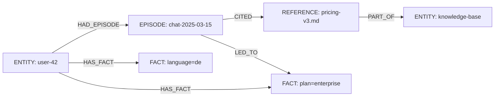

import Tabs from '@site/src/components/LanguageTabs'
import TabItem from '@theme/TabItem'

# RushDB as a Memory Layer: Facts, Episodes, and References

Stateless LLM calls forget everything between turns. Retrieval from flat vector stores returns similar chunks without regard for how pieces of information connect. Neither approach gives an agent the ability to reason over **connected context** — who said what, when, in response to what, tied to which entities they already know.

RushDB can act as a structured memory layer that stores and links three kinds of information:

| Memory type   | What it stores                                   | Example                                                            |
| ------------- | ------------------------------------------------ | ------------------------------------------------------------------ |
| **Fact**      | Durable properties of entities                   | Customer's plan tier, user's language preference, a product's spec |
| **Episode**   | Time-stamped interactions between entities       | A support conversation, a search session, a tool call result       |
| **Reference** | External documents or data linked into the graph | A knowledge-base article, a policy document, an API response       |

Connecting all three lets an agent answer: _"What did we decide last time this user asked about pricing, and what docs were cited in that conversation?"_

---

## Graph shape



The graph stores facts once and links episodes back to them. New facts can supersede old ones without deleting evidence.

---

## Step 1: Store durable facts about an entity

<Tabs groupId="programming-language">
<TabItem value="typescript" label="TypeScript">

```typescript
import RushDB from '@rushdb/javascript-sdk'

const db = new RushDB('RUSHDB_API_KEY')

// Create a user entity
const user = await db.records.create({
  label: 'ENTITY',
  data: { entityId: 'user-42', type: 'user', name: 'Lena Müller' }
})

// Attach standalone facts that can be updated independently
const planFact = await db.records.create({
  label: 'FACT',
  data: {
    key: 'plan',
    value: 'enterprise',
    setAt: new Date().toISOString(),
    source: 'billing-api'
  }
})

const langFact = await db.records.create({
  label: 'FACT',
  data: {
    key: 'language',
    value: 'de',
    setAt: new Date().toISOString(),
    source: 'profile'
  }
})

await Promise.all([
  db.records.attach({ source: user, target: planFact, options: { type: 'HAS_FACT' } }),
  db.records.attach({ source: user, target: langFact, options: { type: 'HAS_FACT' } })
])
```

</TabItem>
<TabItem value="python" label="Python">

```python
from datetime import datetime, timezone
from rushdb import RushDB

db = RushDB("RUSHDB_API_KEY", base_url="https://api.rushdb.com/api/v1")

now = datetime.now(timezone.utc).isoformat()

user = db.records.create("ENTITY", {
    "entityId": "user-42",
    "type": "user",
    "name": "Lena Müller"
})

plan_fact = db.records.create("FACT", {
    "key": "plan",
    "value": "enterprise",
    "setAt": now,
    "source": "billing-api"
})

lang_fact = db.records.create("FACT", {
    "key": "language",
    "value": "de",
    "setAt": now,
    "source": "profile"
})

db.records.attach(user.id, plan_fact.id, {"type": "HAS_FACT"})
db.records.attach(user.id, lang_fact.id, {"type": "HAS_FACT"})
```

</TabItem>
<TabItem value="shell" label="Shell">

```bash
BASE="https://api.rushdb.com/api/v1"
TOKEN="RUSHDB_API_KEY"
H='Content-Type: application/json'

USER_ID=$(curl -s -X POST "$BASE/records" \
  -H "$H" -H "Authorization: Bearer $TOKEN" \
  -d '{"label":"ENTITY","data":{"entityId":"user-42","type":"user","name":"Lena Müller"}}' \
  | jq -r '.data.__id')

FACT_ID=$(curl -s -X POST "$BASE/records" \
  -H "$H" -H "Authorization: Bearer $TOKEN" \
  -d "{\"label\":\"FACT\",\"data\":{\"key\":\"plan\",\"value\":\"enterprise\",\"setAt\":\"$(date -u +%Y-%m-%dT%H:%M:%SZ)\",\"source\":\"billing-api\"}}" \
  | jq -r '.data.__id')

curl -s -X POST "$BASE/records/$USER_ID/relations" \
  -H "$H" -H "Authorization: Bearer $TOKEN" \
  -d "{\"targets\":[\"$FACT_ID\"],\"options\":{\"type\":\"HAS_FACT\"}}"
```

</TabItem>
</Tabs>

---

## Step 2: Record an episodic interaction

Each conversation, tool call, or workflow run becomes an EPISODE node. This allows replaying history without re-embedding full transcripts.

<Tabs groupId="programming-language">
<TabItem value="typescript" label="TypeScript">

```typescript
const episode = await db.records.create({
  label: 'EPISODE',
  data: {
    episodeId: 'chat-2025-03-15',
    type: 'support-chat',
    startedAt: '2025-03-15T09:00:00Z',
    summary: 'User asked about upgrading from enterprise to unlimited plan. Agent cited pricing doc.',
    outcome: 'resolved'
  }
})

// Link the episode to the user
await db.records.attach({
  source: user,
  target: episode,
  options: { type: 'HAD_EPISODE' }
})

// Record that a fact was changed during this episode
await db.records.attach({
  source: episode,
  target: planFact,
  options: { type: 'LED_TO' }
})
```

</TabItem>
<TabItem value="python" label="Python">

```python
episode = db.records.create("EPISODE", {
    "episodeId": "chat-2025-03-15",
    "type": "support-chat",
    "startedAt": "2025-03-15T09:00:00Z",
    "summary": "User asked about upgrading. Agent cited pricing doc.",
    "outcome": "resolved"
})

db.records.attach(user.id, episode.id, {"type": "HAD_EPISODE"})
db.records.attach(episode.id, plan_fact.id, {"type": "LED_TO"})
```

</TabItem>
<TabItem value="shell" label="Shell">

```bash
EPISODE_ID=$(curl -s -X POST "$BASE/records" \
  -H "$H" -H "Authorization: Bearer $TOKEN" \
  -d '{"label":"EPISODE","data":{"episodeId":"chat-2025-03-15","type":"support-chat","startedAt":"2025-03-15T09:00:00Z","outcome":"resolved"}}' \
  | jq -r '.data.__id')

curl -s -X POST "$BASE/records/$USER_ID/relations" \
  -H "$H" -H "Authorization: Bearer $TOKEN" \
  -d "{\"targets\":[\"$EPISODE_ID\"],\"options\":{\"type\":\"HAD_EPISODE\"}}"
```

</TabItem>
</Tabs>

---

## Step 3: Link reference material

Reference nodes represent external documents, policy pages, or API responses that were cited during an episode. Link them to the episode so provenance is preserved.

<Tabs groupId="programming-language">
<TabItem value="typescript" label="TypeScript">

```typescript
// Create or find the knowledge-base root
const kb = await db.records.create({
  label: 'ENTITY',
  data: { entityId: 'kb-main', type: 'knowledge-base', name: 'Product Knowledge Base' }
})

// Create a reference document
const pricingRef = await db.records.create({
  label: 'REFERENCE',
  data: {
    referenceId: 'pricing-v3',
    title: 'Pricing and Plans (v3)',
    url: 'https://docs.example.com/pricing',
    version: '3.0',
    updatedAt: '2025-02-01T00:00:00Z'
  }
})

await Promise.all([
  db.records.attach({ source: pricingRef, target: kb, options: { type: 'PART_OF' } }),
  db.records.attach({ source: episode, target: pricingRef, options: { type: 'CITED' } })
])
```

</TabItem>
<TabItem value="python" label="Python">

```python
kb = db.records.create("ENTITY", {
    "entityId": "kb-main",
    "type": "knowledge-base",
    "name": "Product Knowledge Base"
})

pricing_ref = db.records.create("REFERENCE", {
    "referenceId": "pricing-v3",
    "title": "Pricing and Plans (v3)",
    "url": "https://docs.example.com/pricing",
    "version": "3.0",
    "updatedAt": "2025-02-01T00:00:00Z"
})

db.records.attach(pricing_ref.id, kb.id, {"type": "PART_OF"})
db.records.attach(episode.id, pricing_ref.id, {"type": "CITED"})
```

</TabItem>
<TabItem value="shell" label="Shell">

```bash
REF_ID=$(curl -s -X POST "$BASE/records" \
  -H "$H" -H "Authorization: Bearer $TOKEN" \
  -d '{"label":"REFERENCE","data":{"referenceId":"pricing-v3","title":"Pricing and Plans (v3)","version":"3.0"}}' \
  | jq -r '.data.__id')

curl -s -X POST "$BASE/records/$EPISODE_ID/relations" \
  -H "$H" -H "Authorization: Bearer $TOKEN" \
  -d "{\"targets\":[\"$REF_ID\"],\"options\":{\"type\":\"CITED\"}}"
```

</TabItem>
</Tabs>

---

## Step 4: Retrieve connected context for an agent turn

When the user returns, retrieve all three memory types in one query so the agent starts from full context.

<Tabs groupId="programming-language">
<TabItem value="typescript" label="TypeScript">

```typescript
// Retrieve this user's current facts
const facts = await db.records.find({
  labels: ['FACT'],
  where: {
    ENTITY: {
      $alias: '$user',
      $relation: { type: 'HAS_FACT', direction: 'in' },
      entityId: 'user-42'
    }
  },
  select: {
    key: '$record.key',
    value: '$record.value',
    setAt: '$record.setAt',
    source: '$record.source'
  }
})

// Retrieve the 5 most recent episodes
const recentEpisodes = await db.records.find({
  labels: ['EPISODE'],
  where: {
    ENTITY: {
      $relation: { type: 'HAD_EPISODE', direction: 'in' },
      entityId: 'user-42'
    }
  },
  orderBy: { startedAt: 'desc' },
  limit: 5
})

// Retrieve references cited in the most recent episode
const citedRefs = await db.records.find({
  labels: ['REFERENCE'],
  where: {
    EPISODE: {
      $relation: { type: 'CITED', direction: 'in' },
      episodeId: recentEpisodes.data[0]?.episodeId
    }
  }
})
```

</TabItem>
<TabItem value="python" label="Python">

```python
# Current facts
facts = db.records.find({
    "labels": ["FACT"],
    "where": {
        "ENTITY": {
            "$alias": "$user",
            "$relation": {"type": "HAS_FACT", "direction": "in"},
            "entityId": "user-42"
        }
    },
    "select": {
        "key": "$record.key",
        "value": "$record.value",
        "setAt": "$record.setAt"
    }
})

# Recent episodes
recent = db.records.find({
    "labels": ["EPISODE"],
    "where": {
        "ENTITY": {
            "$relation": {"type": "HAD_EPISODE", "direction": "in"},
            "entityId": "user-42"
        }
    },
    "orderBy": {"startedAt": "desc"},
    "limit": 5
})

# References from most recent episode
if recent.data:
    latest_id = recent.data[0].get("episodeId")
    cited = db.records.find({
        "labels": ["REFERENCE"],
        "where": {
            "EPISODE": {
                "$relation": {"type": "CITED", "direction": "in"},
                "episodeId": latest_id
            }
        }
    })
```

</TabItem>
<TabItem value="shell" label="Shell">

```bash
# Fetch current facts for user-42
curl -s -X POST "$BASE/records/search" \
  -H "$H" -H "Authorization: Bearer $TOKEN" \
  -d '{
    "labels": ["FACT"],
    "where": {
      "ENTITY": {
        "$relation": {"type": "HAS_FACT", "direction": "in"},
        "entityId": "user-42"
      }
    }
  }'

# Fetch 5 most recent episodes
curl -s -X POST "$BASE/records/search" \
  -H "$H" -H "Authorization: Bearer $TOKEN" \
  -d '{
    "labels": ["EPISODE"],
    "where": {
      "ENTITY": {
        "$relation": {"type": "HAD_EPISODE", "direction": "in"},
        "entityId": "user-42"
      }
    },
    "orderBy": {"startedAt": "desc"},
    "limit": 5
  }'
```

</TabItem>
</Tabs>

---

## Step 5: Update a fact without deleting history

When a fact changes, create a new FACT node, link it with `HAS_FACT`, and optionally mark the old one superseded. This preserves the history chain.

<Tabs groupId="programming-language">
<TabItem value="typescript" label="TypeScript">

```typescript
// New episode triggers a plan upgrade
const upgradeEpisode = await db.records.create({
  label: 'EPISODE',
  data: {
    episodeId: 'chat-2025-03-20',
    type: 'billing',
    startedAt: '2025-03-20T14:00:00Z',
    summary: 'User upgraded from enterprise to unlimited.',
    outcome: 'resolved'
  }
})

await db.records.attach({
  source: user,
  target: upgradeEpisode,
  options: { type: 'HAD_EPISODE' }
})

// Create updated fact
const newPlanFact = await db.records.create({
  label: 'FACT',
  data: {
    key: 'plan',
    value: 'unlimited',
    setAt: new Date().toISOString(),
    source: 'billing-api'
  }
})

await Promise.all([
  db.records.attach({ source: user, target: newPlanFact, options: { type: 'HAS_FACT' } }),
  db.records.attach({ source: upgradeEpisode, target: newPlanFact, options: { type: 'LED_TO' } }),
  // Mark old fact as superseded (optional but enables temporal queries)
  db.records.update(planFact.__id, { supersededAt: new Date().toISOString() })
])
```

</TabItem>
<TabItem value="python" label="Python">

```python
upgrade_episode = db.records.create("EPISODE", {
    "episodeId": "chat-2025-03-20",
    "type": "billing",
    "startedAt": "2025-03-20T14:00:00Z",
    "outcome": "resolved"
})

db.records.attach(user.id, upgrade_episode.id, {"type": "HAD_EPISODE"})

new_plan = db.records.create("FACT", {
    "key": "plan",
    "value": "unlimited",
    "setAt": datetime.now(timezone.utc).isoformat(),
    "source": "billing-api"
})

db.records.attach(user.id, new_plan.id, {"type": "HAS_FACT"})
db.records.attach(upgrade_episode.id, new_plan.id, {"type": "LED_TO"})

# Mark old fact superseded
db.records.update(plan_fact.id, {"supersededAt": datetime.now(timezone.utc).isoformat()})
```

</TabItem>
<TabItem value="shell" label="Shell">

```bash
NEW_FACT_ID=$(curl -s -X POST "$BASE/records" \
  -H "$H" -H "Authorization: Bearer $TOKEN" \
  -d "{\"label\":\"FACT\",\"data\":{\"key\":\"plan\",\"value\":\"unlimited\",\"setAt\":\"$(date -u +%Y-%m-%dT%H:%M:%SZ)\",\"source\":\"billing-api\"}}" \
  | jq -r '.data.__id')

curl -s -X POST "$BASE/records/$USER_ID/relations" \
  -H "$H" -H "Authorization: Bearer $TOKEN" \
  -d "{\"targets\":[\"$NEW_FACT_ID\"],\"options\":{\"type\":\"HAS_FACT\"}}"

# Mark old fact superseded
curl -s -X PATCH "$BASE/records/$FACT_ID" \
  -H "$H" -H "Authorization: Bearer $TOKEN" \
  -d "{\"supersededAt\":\"$(date -u +%Y-%m-%dT%H:%M:%SZ)\"}"
```

</TabItem>
</Tabs>

---

## Step 6: Retrieve only current (non-superseded) facts

<Tabs groupId="programming-language">
<TabItem value="typescript" label="TypeScript">

```typescript
const currentFacts = await db.records.find({
  labels: ['FACT'],
  where: {
    supersededAt: { $exists: false },
    ENTITY: {
      $relation: { type: 'HAS_FACT', direction: 'in' },
      entityId: 'user-42'
    }
  }
})
```

</TabItem>
<TabItem value="python" label="Python">

```python
current_facts = db.records.find({
    "labels": ["FACT"],
    "where": {
        "supersededAt": {"$exists": False},
        "ENTITY": {
            "$relation": {"type": "HAS_FACT", "direction": "in"},
            "entityId": "user-42"
        }
    }
})
```

</TabItem>
<TabItem value="shell" label="Shell">

```bash
curl -s -X POST "$BASE/records/search" \
  -H "$H" -H "Authorization: Bearer $TOKEN" \
  -d '{
    "labels": ["FACT"],
    "where": {
      "supersededAt": {"$exists": false},
      "ENTITY": {
        "$relation": {"type": "HAS_FACT", "direction": "in"},
        "entityId": "user-42"
      }
    }
  }'
```

</TabItem>
</Tabs>

---

## Production caveat

History-preserving fact graphs grow unbounded. Apply a retention policy: periodically archive `EPISODE` nodes older than your SLA window, and prune `FACT` nodes where `supersededAt` is more than N days old. Use `db.records.delete` with a `where` filter rather than record-by-record deletion for scale.

---

## Next steps

- [Episodic Memory for Multi-Step Agents](/tutorials/episodic-memory) — storing intermediate observations, tool outputs, and decisions in a resume-capable graph
- [End-to-End Data Lineage](/tutorials/data-lineage) — applying the same Event + Reference pattern to data pipeline provenance
- [Semantic Search for Multi-Tenant Products](/tutorials/semantic-search-multitenant) — combining graph facts with vector retrieval
