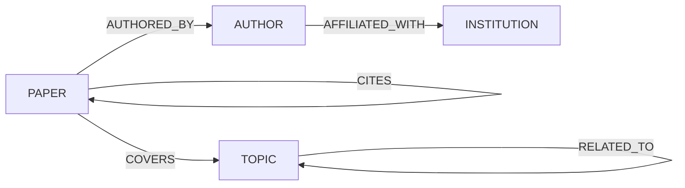

import Tabs from '@site/src/components/LanguageTabs'
import TabItem from '@theme/TabItem'

# Research Knowledge Graph: Papers, Authors, Topics, Citations

Academic research is inherently graph-shaped. A paper has authors. Authors belong to institutions. Papers cite other papers. Papers cover topics. Topics overlap. A flat document store loses all of that structure.

This tutorial builds a scholarly knowledge graph that enables citation traversal, co-author discovery, topical clustering, and semantic retrieval.

---

## Graph shape



| Label         | What it represents                               |
| ------------- | ------------------------------------------------ |
| `PAPER`       | A research paper with title, abstract, year, DOI |
| `AUTHOR`      | A researcher or collaborator                     |
| `INSTITUTION` | University, lab, or company                      |
| `TOPIC`       | A subject area or keyword cluster                |

---

## Step 1: Ingest papers and authors

<Tabs groupId="programming-language">
<TabItem value="typescript" label="TypeScript">

```typescript
import RushDB from '@rushdb/javascript-sdk'

const db = new RushDB(process.env.RUSHDB_API_KEY!)

await db.records.importJson({
  label: 'PAPER',
  data: [
    {
      doi: '10.1000/xyz001',
      title: 'Graph Databases for Scientific Knowledge Representation',
      abstract:
        'This paper surveys the use of graph databases in representing and querying scientific knowledge, including citation networks, ontologies, and experimental results.',
      year: 2023,
      venue: 'VLDB',
      citationCount: 47
    },
    {
      doi: '10.1000/xyz002',
      title: 'Neural Retrieval Augmentation with Knowledge Graphs',
      abstract:
        'We propose a retrieval augmentation framework that combines dense vector search with structured graph traversal to improve factual precision in language model outputs.',
      year: 2024,
      venue: 'NeurIPS',
      citationCount: 112
    },
    {
      doi: '10.1000/xyz003',
      title: 'Scalable Graph Construction from Unstructured Text',
      abstract:
        'A pipeline for extracting entities and relationships from scientific text and constructing queryable knowledge graphs at scale.',
      year: 2024,
      venue: 'ACL',
      citationCount: 29
    }
  ]
})

await db.records.importJson({
  label: 'AUTHOR',
  data: [
    { name: 'Dr. Yuki Tanaka', email: 'y.tanaka@uni.edu', hIndex: 18 },
    { name: 'Prof. Lena Müller', email: 'l.muller@institute.de', hIndex: 34 },
    { name: 'Dr. Carlos Reyes', email: 'c.reyes@lab.com', hIndex: 12 }
  ]
})

await db.records.importJson({
  label: 'TOPIC',
  data: [
    { name: 'graph databases', category: 'systems' },
    { name: 'knowledge representation', category: 'ai' },
    { name: 'retrieval augmented generation', category: 'nlp' },
    { name: 'information extraction', category: 'nlp' }
  ]
})
```

</TabItem>
<TabItem value="python" label="Python">

```python
from rushdb import RushDB
import os

db = RushDB(os.environ["RUSHDB_API_KEY"], base_url="https://api.rushdb.com/api/v1")

db.records.import_json({
    "label": "PAPER",
    "data": [
        {
            "doi": "10.1000/xyz001",
            "title": "Graph Databases for Scientific Knowledge Representation",
            "abstract": "This paper surveys the use of graph databases in representing and querying scientific knowledge.",
            "year": 2023, "venue": "VLDB", "citationCount": 47
        },
        {
            "doi": "10.1000/xyz002",
            "title": "Neural Retrieval Augmentation with Knowledge Graphs",
            "abstract": "We propose a retrieval augmentation framework combining dense vector search with graph traversal.",
            "year": 2024, "venue": "NeurIPS", "citationCount": 112
        },
        {
            "doi": "10.1000/xyz003",
            "title": "Scalable Graph Construction from Unstructured Text",
            "abstract": "A pipeline for extracting entities and relationships from scientific text.",
            "year": 2024, "venue": "ACL", "citationCount": 29
        }
    ]
})

db.records.import_json({
    "label": "AUTHOR",
    "data": [
        {"name": "Dr. Yuki Tanaka",  "email": "y.tanaka@uni.edu",      "hIndex": 18},
        {"name": "Prof. Lena Müller", "email": "l.muller@institute.de", "hIndex": 34},
        {"name": "Dr. Carlos Reyes", "email": "c.reyes@lab.com",        "hIndex": 12}
    ]
})

db.records.import_json({
    "label": "TOPIC",
    "data": [
        {"name": "graph databases",               "category": "systems"},
        {"name": "knowledge representation",       "category": "ai"},
        {"name": "retrieval augmented generation", "category": "nlp"},
        {"name": "information extraction",          "category": "nlp"}
    ]
})
```

</TabItem>
<TabItem value="shell" label="Shell">

```bash
BASE="https://api.rushdb.com/api/v1"
TOKEN="RUSHDB_API_KEY"
H='Content-Type: application/json'

curl -s -X POST "$BASE/records/import/json" \
  -H "$H" -H "Authorization: Bearer $TOKEN" \
  -d '{"label":"PAPER","data":[{"doi":"10.1000/xyz001","title":"Graph Databases for Scientific Knowledge Representation","year":2023,"venue":"VLDB","citationCount":47},{"doi":"10.1000/xyz002","title":"Neural Retrieval Augmentation with Knowledge Graphs","year":2024,"venue":"NeurIPS","citationCount":112}]}'
```

</TabItem>
</Tabs>

---

## Step 2: Build the relationship graph

<Tabs groupId="programming-language">
<TabItem value="typescript" label="TypeScript">

```typescript
// Fetch all records
const [papers, authors, topics] = await Promise.all([
  db.records.find({ labels: ['PAPER'] }),
  db.records.find({ labels: ['AUTHOR'] }),
  db.records.find({ labels: ['TOPIC'] })
])

const paperMap = Object.fromEntries(papers.data.map((p) => [p.doi, p]))
const authorMap = Object.fromEntries(authors.data.map((a) => [a.email, a]))
const topicMap = Object.fromEntries(topics.data.map((t) => [t.name, t]))

// Paper xyz001: authored by Yuki Tanaka and Lena Müller
await db.records.attach({
  source: paperMap['10.1000/xyz001'],
  target: authorMap['y.tanaka@uni.edu'],
  options: { type: 'AUTHORED_BY', direction: 'out' }
})
await db.records.attach({
  source: paperMap['10.1000/xyz001'],
  target: authorMap['l.muller@institute.de'],
  options: { type: 'AUTHORED_BY', direction: 'out' }
})

// Paper xyz002: authored by Lena Müller and Carlos Reyes, cites xyz001
await db.records.attach({
  source: paperMap['10.1000/xyz002'],
  target: authorMap['l.muller@institute.de'],
  options: { type: 'AUTHORED_BY', direction: 'out' }
})
await db.records.attach({
  source: paperMap['10.1000/xyz002'],
  target: authorMap['c.reyes@lab.com'],
  options: { type: 'AUTHORED_BY', direction: 'out' }
})
await db.records.attach({
  source: paperMap['10.1000/xyz002'],
  target: paperMap['10.1000/xyz001'],
  options: { type: 'CITES', direction: 'out' }
})

// Topics
await db.records.attach({
  source: paperMap['10.1000/xyz001'],
  target: topicMap['graph databases'],
  options: { type: 'COVERS', direction: 'out' }
})
await db.records.attach({
  source: paperMap['10.1000/xyz002'],
  target: topicMap['retrieval augmented generation'],
  options: { type: 'COVERS', direction: 'out' }
})
await db.records.attach({
  source: paperMap['10.1000/xyz002'],
  target: topicMap['knowledge representation'],
  options: { type: 'COVERS', direction: 'out' }
})
```

</TabItem>
<TabItem value="python" label="Python">

```python
papers  = db.records.find({"labels": ["PAPER"]})
authors = db.records.find({"labels": ["AUTHOR"]})
topics  = db.records.find({"labels": ["TOPIC"]})

paper_map  = {p.data["doi"]:   p for p in papers.data}
author_map = {a.data["email"]: a for a in authors.data}
topic_map  = {t.data["name"]:  t for t in topics.data}

db.records.attach(paper_map["10.1000/xyz001"].id, author_map["y.tanaka@uni.edu"].id,       {"type": "AUTHORED_BY", "direction": "out"})
db.records.attach(paper_map["10.1000/xyz001"].id, author_map["l.muller@institute.de"].id,  {"type": "AUTHORED_BY", "direction": "out"})

db.records.attach(paper_map["10.1000/xyz002"].id, author_map["l.muller@institute.de"].id,  {"type": "AUTHORED_BY", "direction": "out"})
db.records.attach(paper_map["10.1000/xyz002"].id, author_map["c.reyes@lab.com"].id,         {"type": "AUTHORED_BY", "direction": "out"})
db.records.attach(paper_map["10.1000/xyz002"].id, paper_map["10.1000/xyz001"].id,            {"type": "CITES",       "direction": "out"})

db.records.attach(paper_map["10.1000/xyz001"].id, topic_map["graph databases"].id,                {"type": "COVERS", "direction": "out"})
db.records.attach(paper_map["10.1000/xyz002"].id, topic_map["retrieval augmented generation"].id,  {"type": "COVERS", "direction": "out"})
```

</TabItem>
<TabItem value="shell" label="Shell">

```bash
# Get paper IDs, then attach
P1=$(curl -s -X POST "$BASE/records/search" -H "$H" -H "Authorization: Bearer $TOKEN" \
  -d '{"labels":["PAPER"],"where":{"doi":"10.1000/xyz001"}}' | jq -r '.data[0].__id')
P2=$(curl -s -X POST "$BASE/records/search" -H "$H" -H "Authorization: Bearer $TOKEN" \
  -d '{"labels":["PAPER"],"where":{"doi":"10.1000/xyz002"}}' | jq -r '.data[0].__id')

# P2 cites P1
curl -s -X POST "$BASE/records/$P2/relations" \
  -H "$H" -H "Authorization: Bearer $TOKEN" \
  -d "{\"targets\":[\"$P1\"],\"options\":{\"type\":\"CITES\",\"direction\":\"out\"}}"
```

</TabItem>
</Tabs>

---

## Step 3: Citation traversal queries

<Tabs groupId="programming-language">
<TabItem value="typescript" label="TypeScript">

```typescript
// Papers that cite xyz001
const citingPapers = await db.records.find({
  labels: ['PAPER'],
  where: {
    PAPER: {
      $relation: { type: 'CITES', direction: 'out' },
      doi: '10.1000/xyz001'
    }
  },
  orderBy: { citationCount: 'desc' }
})

// All papers by Lena Müller
const mullerPapers = await db.records.find({
  labels: ['PAPER'],
  where: {
    AUTHOR: {
      $relation: { type: 'AUTHORED_BY', direction: 'out' },
      email: 'l.muller@institute.de'
    }
  },
  orderBy: { year: 'desc' }
})

// Co-authors of Lena Müller (authors who share a paper)
const coAuthors = await db.records.find({
  labels: ['AUTHOR'],
  where: {
    PAPER: {
      $relation: { type: 'AUTHORED_BY', direction: 'in' },
      AUTHOR: {
        $relation: { type: 'AUTHORED_BY', direction: 'out' },
        email: 'l.muller@institute.de'
      }
    },
    email: { $ne: 'l.muller@institute.de' } // exclude Lena herself
  }
})

console.log(
  'Co-authors:',
  coAuthors.data.map((a) => a.name)
)
```

</TabItem>
<TabItem value="python" label="Python">

```python
# Papers citing xyz001
citing = db.records.find({
    "labels": ["PAPER"],
    "where": {
        "PAPER": {
            "$relation": {"type": "CITES", "direction": "out"},
            "doi": "10.1000/xyz001"
        }
    },
    "orderBy": {"citationCount": "desc"}
})

# All papers by Lena Müller
muller_papers = db.records.find({
    "labels": ["PAPER"],
    "where": {
        "AUTHOR": {
            "$relation": {"type": "AUTHORED_BY", "direction": "out"},
            "email": "l.muller@institute.de"
        }
    },
    "orderBy": {"year": "desc"}
})

# Co-authors
co_authors = db.records.find({
    "labels": ["AUTHOR"],
    "where": {
        "PAPER": {
            "$relation": {"type": "AUTHORED_BY", "direction": "in"},
            "AUTHOR": {
                "$relation": {"type": "AUTHORED_BY", "direction": "out"},
                "email": "l.muller@institute.de"
            }
        },
        "email": {"$ne": "l.muller@institute.de"}
    }
})
print("Co-authors:", [a.data.get("name") for a in co_authors.data])
```

</TabItem>
<TabItem value="shell" label="Shell">

```bash
# Papers by specific author
AUTHOR_ID=$(curl -s -X POST "$BASE/records/search" \
  -H "$H" -H "Authorization: Bearer $TOKEN" \
  -d '{"labels":["AUTHOR"],"where":{"email":"l.muller@institute.de"}}' \
  | jq -r '.data[0].__id')

curl -s -X POST "$BASE/records/search" \
  -H "$H" -H "Authorization: Bearer $TOKEN" \
  -d "{\"labels\":[\"PAPER\"],\"where\":{\"AUTHOR\":{\"\$relation\":{\"type\":\"AUTHORED_BY\",\"direction\":\"out\"},\"$id\":\"$AUTHOR_ID\"}},\"orderBy\":{\"year\":\"desc\"}}"
```

</TabItem>
</Tabs>

---

## Step 4: Semantic search over abstracts

Enable semantic search to retrieve papers by conceptual relevance rather than keyword matching.

<Tabs groupId="programming-language">
<TabItem value="typescript" label="TypeScript">

```typescript
// Create index on abstract (run once)
await db.ai.indexes.create({
  label: 'PAPER',
  propertyName: 'abstract'
})

// Poll until ready (simplified)
let ready = false
while (!ready) {
  const stats = await db.ai.indexes.stats('PAPER')
  ready = stats.data.indexedRecords === stats.data.totalRecords
  if (!ready) await new Promise((r) => setTimeout(r, 2000))
}

// Semantic search — hybrid: conceptual query + structured year filter
const results = await db.records.vectorSearch({
  query: 'combining structured graphs with neural retrieval',
  propertyName: 'abstract',
  labels: ['PAPER'],
  where: { year: { $gte: 2023 } },
  limit: 5
})

for (const paper of results.data) {
  console.log(`[${paper.year}] ${paper.title} — score: ${paper.score.toFixed(3)}`)
}
```

</TabItem>
<TabItem value="python" label="Python">

```python
import time

db.ai.indexes.create({"label": "PAPER", "propertyName": "abstract"})

while True:
    stats = db.ai.indexes.stats("PAPER")
    if stats.data.get("indexedRecords") == stats.data.get("totalRecords"):
        break
    time.sleep(2)

results = db.records.vector_search({
    "query": "combining structured graphs with neural retrieval",
    "propertyName": "abstract",
    "labels": ["PAPER"],
    "where": {"year": {"$gte": 2023}},
    "limit": 5
})

for paper in results.data:
    print(f"[{paper.get('year')}] {paper.get('title')} — score: {paper.score:.3f}")
```

</TabItem>
<TabItem value="shell" label="Shell">

```bash
# Create index
curl -s -X POST "$BASE/ai/indexes" \
  -H "$H" -H "Authorization: Bearer $TOKEN" \
  -d '{"label":"PAPER","propertyName":"abstract"}'

# Search
curl -s -X POST "$BASE/ai/search" \
  -H "$H" -H "Authorization: Bearer $TOKEN" \
  -d '{"query":"combining structured graphs with neural retrieval","propertyName":"abstract","labels":["PAPER"],"where":{"year":{"$gte":2023}},"limit":5}'
```

</TabItem>
</Tabs>

---

## Production caveat

Citation graphs become highly connected over time. Deep traversal queries (papers that cite papers that cite papers) fan out exponentially. All queries in these examples traverse at most two hops. Design your search queries to bound depth by using intermediate label filters rather than chaining open-ended relationship traversals.

---

## Next steps

- [Hybrid Retrieval](/learn/tutorials/ai-and-rag/hybrid-retrieval) — filter + semantic rank in one call
- [Modeling Hierarchies, Networks, and Feedback Loops](/learn/tutorials/graph-modeling/modeling-hierarchies) — structural patterns for citation networks
- [Data Lineage](/learn/tutorials/graph-modeling/data-lineage) — trace derived knowledge back to source papers
