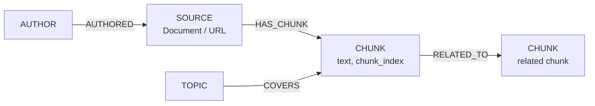

import Tabs from '@site/src/components/LanguageTabs'
import TabItem from '@theme/TabItem'

# GraphRAG — Graph-Enriched Retrieval Augmented Generation

Standard RAG retrieves the top-k most similar text chunks and pastes them into a prompt. GraphRAG does the same retrieval step, then traverses the knowledge graph to collect related entities — authors, topics, source documents, citations — and includes them as structured context. The LLM call is identical; the difference is what you put in the context window.

```
Flat RAG context                GraphRAG context
─────────────────────           ──────────────────────────────────
Chunk 1 text                    Chunk 1 text
Chunk 2 text                    └─ from: architecture.md
Chunk 3 text                    └─ author: Jane Smith (Platform)
                                └─ topics: distributed systems, caching
                                Chunk 2 text
                                └─ from: api-reference.md
                                └─ cited by: 3 other documents
```

---

## Graph shape



| Label    | What it represents                                         |
| -------- | ---------------------------------------------------------- |
| `SOURCE` | A document, web page, or data export (the original source) |
| `CHUNK`  | A text fragment from a source, with overlap                |
| `AUTHOR` | A person or team that authored the source                  |
| `TOPIC`  | A concept tag associated with a chunk                      |

---

## Step 1: Ingest sources and chunks

<Tabs groupId="programming-language">
<TabItem value="typescript" label="TypeScript">

```typescript
import RushDB from '@rushdb/javascript-sdk'
import fs from 'fs'

const db = new RushDB(process.env.RUSHDB_API_KEY!)

const CHUNK_SIZE = 500
const CHUNK_OVERLAP = 80

function chunkText(text: string): string[] {
  const chunks: string[] = []
  let start = 0
  while (start < text.length) {
    chunks.push(text.slice(start, Math.min(start + CHUNK_SIZE, text.length)).trim())
    start += CHUNK_SIZE - CHUNK_OVERLAP
  }
  return chunks.filter(Boolean)
}

interface SourceMeta {
  filename: string
  author: string
  topics: string[]
}

async function ingestSource(meta: SourceMeta, content: string) {
  const tx = await db.tx.begin()
  try {
    // Create the SOURCE record
    const source = await db.records.create(
      {
        label: 'SOURCE',
        data: { filename: meta.filename, ingestedAt: new Date().toISOString() }
      },
      tx
    )

    // Create AUTHOR if not already present (find-then-create)
    const existingAuthor = await db.records.find({ labels: ['AUTHOR'], where: { name: meta.author } })
    const author =
      existingAuthor.data.length > 0 ?
        existingAuthor.data[0]
      : await db.records.create({ label: 'AUTHOR', data: { name: meta.author } }, tx)

    await db.records.attach(
      { source: author, target: source, options: { type: 'AUTHORED', direction: 'out' } },
      tx
    )

    // Create chunks and link to source
    const texts = chunkText(content)
    const chunks = await db.records.importJson({
      label: 'CHUNK',
      data: texts.map((text, i) => ({ text, chunkIndex: i, sourceFile: meta.filename }))
    }) // Note: importJson doesn't support tx — do in a follow-up pass for link

    // Link chunks to source (outside transaction — importJson is atomic on its own)
    await db.tx.commit(tx)

    // Attach chunks to source record after importJson committed
    const chunkRecords = await db.records.find({
      labels: ['CHUNK'],
      where: { sourceFile: meta.filename },
      orderBy: { chunkIndex: 'asc' }
    })

    for (const chunk of chunkRecords.data) {
      await db.records.attach({ source, target: chunk, options: { type: 'HAS_CHUNK', direction: 'out' } })
    }

    // Attach topics
    for (const topicName of meta.topics) {
      const existingTopic = await db.records.find({ labels: ['TOPIC'], where: { name: topicName } })
      const topic =
        existingTopic.data.length > 0 ?
          existingTopic.data[0]
        : await db.records.create({ label: 'TOPIC', data: { name: topicName } })
      for (const chunk of chunkRecords.data) {
        await db.records.attach({
          source: topic,
          target: chunk,
          options: { type: 'COVERS', direction: 'out' }
        })
      }
    }

    console.log(`Ingested ${texts.length} chunks from ${meta.filename}`)
  } catch (err) {
    await db.tx.rollback(tx)
    throw err
  }
}

// Example usage
await ingestSource(
  { filename: 'architecture.md', author: 'Jane Smith', topics: ['distributed systems', 'caching'] },
  fs.readFileSync('./docs/architecture.md', 'utf8')
)
```

</TabItem>
<TabItem value="python" label="Python">

```python
from rushdb import RushDB
import os

db = RushDB(os.environ['RUSHDB_API_KEY'], base_url='https://api.rushdb.com/api/v1')

CHUNK_SIZE = 500
CHUNK_OVERLAP = 80

def chunk_text(text: str) -> list[str]:
    chunks, start = [], 0
    while start < len(text):
        chunks.append(text[start:start + CHUNK_SIZE].strip())
        start += CHUNK_SIZE - CHUNK_OVERLAP
    return [c for c in chunks if c]

def ingest_source(filename: str, author: str, topics: list[str], content: str):
    # Create SOURCE
    source = db.records.create('SOURCE', {
        'filename': filename,
        'ingestedAt': '2025-01-01T00:00:00Z'
    })

    # Find or create AUTHOR
    existing = db.records.find({'labels': ['AUTHOR'], 'where': {'name': author}})
    author_rec = existing.data[0] if existing.data else db.records.create('AUTHOR', {'name': author})
    db.records.attach(author_rec.id, source.id, {'type': 'AUTHORED', 'direction': 'out'})

    # Create chunks
    texts = chunk_text(content)
    db.records.import_json({
        'label': 'CHUNK',
        'data': [{'text': t, 'chunkIndex': i, 'sourceFile': filename} for i, t in enumerate(texts)]
    })

    # Link chunks to source
    chunk_records = db.records.find({
        'labels': ['CHUNK'],
        'where': {'sourceFile': filename},
        'orderBy': {'chunkIndex': 'asc'}
    })
    for chunk in chunk_records.data:
        db.records.attach(source.id, chunk.id, {'type': 'HAS_CHUNK', 'direction': 'out'})

    # Attach topics to all chunks
    for topic_name in topics:
        existing_topic = db.records.find({'labels': ['TOPIC'], 'where': {'name': topic_name}})
        topic = existing_topic.data[0] if existing_topic.data else db.records.create('TOPIC', {'name': topic_name})
        for chunk in chunk_records.data:
            db.records.attach(topic.id, chunk.id, {'type': 'COVERS', 'direction': 'out'})

    print(f'Ingested {len(texts)} chunks from {filename}')
```

</TabItem>
</Tabs>

---

## Step 2: Create an embedding index on chunks

<Tabs groupId="programming-language">
<TabItem value="typescript" label="TypeScript">

```typescript
await db.ai.indexes.create({ label: 'CHUNK', propertyName: 'text' })

// Poll until ready
let stats = await db.ai.indexes.stats('your-index-id')
while (stats.data.indexedRecords < stats.data.totalRecords) {
  await new Promise((r) => setTimeout(r, 3000))
  stats = await db.ai.indexes.stats('your-index-id')
}
console.log('Index ready')
```

</TabItem>
<TabItem value="python" label="Python">

```python
import time

index = db.ai.indexes.create({'label': 'CHUNK', 'propertyName': 'text'})
index_id = index['id']

while True:
    stats = db.ai.indexes.stats(index_id)
    if stats['data']['indexedRecords'] >= stats['data']['totalRecords']:
        break
    time.sleep(3)
print('Index ready')
```

</TabItem>
</Tabs>

---

## Step 3: GraphRAG retrieval — chunks + graph context

<Tabs groupId="programming-language">
<TabItem value="typescript" label="TypeScript">

```typescript
interface ChunkWithContext {
  text: string
  source: string
  author: string | null
  topics: string[]
  score: number
}

async function graphRagRetrieve(userQuery: string, k = 5): Promise<ChunkWithContext[]> {
  // 1. Semantic search for top-k chunks
  const results = await db.records.vectorSearch({
    query: userQuery,
    propertyName: 'text',
    labels: ['CHUNK'],
    limit: k
  })

  // 2. Enrich each chunk with graph context in parallel
  return Promise.all(
    results.data.map(async (chunk) => {
      const [sourceResult, topicResult] = await Promise.all([
        db.records.find({
          labels: ['SOURCE'],
          where: {
            CHUNK: {
              $relation: { type: 'HAS_CHUNK', direction: 'out' },
              __id: chunk.__id
            }
          }
        }),
        db.records.find({
          labels: ['TOPIC'],
          where: {
            CHUNK: {
              $relation: { type: 'COVERS', direction: 'out' },
              __id: chunk.__id
            }
          }
        })
      ])

      const source = sourceResult.data[0]
      const authorResult =
        source ?
          await db.records.find({
            labels: ['AUTHOR'],
            where: {
              SOURCE: {
                $relation: { type: 'AUTHORED', direction: 'out' },
                __id: source.__id
              }
            }
          })
        : { data: [] }

      return {
        text: chunk.text as string,
        source: (source?.filename as string) ?? 'unknown',
        author: (authorResult.data[0]?.name as string) ?? null,
        topics: topicResult.data.map((t) => t.name as string),
        score: chunk.__score as number
      }
    })
  )
}

function buildGraphRagPrompt(userQuery: string, chunks: ChunkWithContext[]): string {
  const contextBlocks = chunks
    .map((c, i) =>
      [
        `[${i + 1}] (score: ${c.score.toFixed(2)}, source: ${c.source}, author: ${c.author ?? 'unknown'})`,
        `Topics: ${c.topics.join(', ') || 'none'}`,
        c.text
      ].join('\n')
    )
    .join('\n\n---\n\n')

  return [
    'You are a helpful assistant. Answer using the provided context.',
    'Context:',
    contextBlocks,
    '',
    `Question: ${userQuery}`
  ].join('\n')
}

// Full pipeline
const chunks = await graphRagRetrieve('How does the caching layer handle invalidation?')
const prompt = buildGraphRagPrompt('How does the caching layer handle invalidation?', chunks)

// Pass prompt to your LLM of choice
console.log(prompt)
```

</TabItem>
<TabItem value="python" label="Python">

```python
from concurrent.futures import ThreadPoolExecutor

def graph_rag_retrieve(user_query: str, k: int = 5) -> list[dict]:
    results = db.records.vector_search({
        'query': user_query,
        'propertyName': 'text',
        'labels': ['CHUNK'],
        'limit': k
    })

    def enrich(chunk):
        chunk_id = chunk.id

        source_result = db.records.find({
            'labels': ['SOURCE'],
            'where': {'CHUNK': {'$relation': {'type': 'HAS_CHUNK', 'direction': 'out'}, '__id': chunk_id}}
        })
        topic_result = db.records.find({
            'labels': ['TOPIC'],
            'where': {'CHUNK': {'$relation': {'type': 'COVERS', 'direction': 'out'}, '__id': chunk_id}}
        })

        source = source_result.data[0] if source_result.data else None
        author_name = None
        if source:
            author_result = db.records.find({
                'labels': ['AUTHOR'],
                'where': {'SOURCE': {'$relation': {'type': 'AUTHORED', 'direction': 'out'}, '__id': source.id}}
            })
            author_name = author_result.data[0].get('name') if author_result.data else None

        return {
            'text': chunk.get('text'),
            'source': source.get('filename') if source else 'unknown',
            'author': author_name,
            'topics': [t.get('name') for t in topic_result.data],
            'score': chunk.score
        }

    with ThreadPoolExecutor(max_workers=5) as pool:
        return list(pool.map(enrich, results.data))

def build_graph_rag_prompt(user_query: str, chunks: list[dict]) -> str:
    blocks = []
    for i, c in enumerate(chunks, 1):
        blocks.append(
            f"[{i}] (score: {c['score']:.2f}, source: {c['source']}, author: {c['author'] or 'unknown'})\n"
            f"Topics: {', '.join(c['topics']) or 'none'}\n"
            f"{c['text']}"
        )
    context = '\n\n---\n\n'.join(blocks)
    return f"You are a helpful assistant. Answer using the provided context.\n\nContext:\n{context}\n\nQuestion: {user_query}"

chunks = graph_rag_retrieve('How does the caching layer handle invalidation?')
prompt = build_graph_rag_prompt('How does the caching layer handle invalidation?', chunks)
print(prompt)
```

</TabItem>
</Tabs>

---

## GraphRAG vs flat RAG — what changes in the prompt

**Flat RAG prompt fragment:**

```
[1] The cache layer uses a time-based TTL of 300 seconds. Stale entries
    are invalidated on next read by comparing the stored timestamp...
```

**GraphRAG prompt fragment:**

```
[1] (score: 0.91, source: architecture.md, author: Jane Smith)
Topics: distributed systems, caching
The cache layer uses a time-based TTL of 300 seconds. Stale entries
are invalidated on next read by comparing the stored timestamp...
```

The LLM now knows _where this knowledge came from_, _who wrote it_, and _what domain it belongs to_. This enables citation-aware answers and reduces hallucination on ambiguous questions.

---

## Production caveat

Each retrieved chunk triggers two additional queries for source and topic enrichment. For `k=10` that is 20 extra roundtrips. Run enrichment in parallel (as above) and cache per-chunk context if the same chunk appears across multiple queries in a session.

---

## Next steps

- [BYOV External Embeddings](/learn/tutorials/ai-and-rag/byov-external-embeddings) — supply your own vectors instead of relying on managed embeddings
- [Multi-Source RAG](/learn/tutorials/ai-and-rag/rag-multi-source) — combine PDFs, web pages, and database exports in one semantic search
- [RAG Evaluation](/learn/tutorials/ai-and-rag/rag-evaluation) — measure precision and recall before deploying GraphRAG to production
