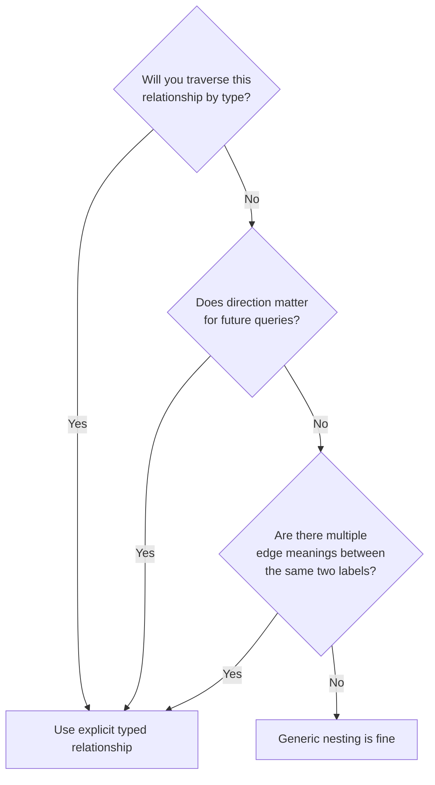

import Tabs from '@site/src/components/LanguageTabs'
import TabItem from '@theme/TabItem'

# Choosing Relationship Types That Age Well

Every time you attach two records in RushDB, you pick a relationship type. This choice feels minor in the moment and becomes significant three months later — when another developer reads your graph, or when a query needs to traverse it in a direction you didn't anticipate.

This tutorial covers the tradeoffs clearly so you can make the right call up front.

---

## Two strategies

### Strategy A: Generic nesting

You let RushDB's automatic nesting create edges by importing JSON with deeply nested objects. The resulting relationship type is a generated name derived from the parent label.

<Tabs groupId="programming-language">
<TabItem value="typescript" label="TypeScript">

```typescript
await db.records.importJson({
  label: 'ORDER',
  data: [
    {
      total: 149.0,
      PRODUCT: [{ name: 'Lens Cap 58mm', price: 12.99 }]
    }
  ]
})
```

</TabItem>
<TabItem value="python" label="Python">

```python
db.records.import_json(
    label="ORDER",
    data=[{
        "total": 149.00,
        "PRODUCT": [{"name": "Lens Cap 58mm", "price": 12.99}]
    }]
)
```

</TabItem>
<TabItem value="shell" label="Shell">

```bash
curl -s -X POST "$BASE/records/import" \
  -H "$H" -H "Authorization: Bearer $TOKEN" \
  -d '{
    "label": "ORDER",
    "data": [{
      "total": 149.00,
      "PRODUCT": [{"name": "Lens Cap 58mm", "price": 12.99}]
    }]
  }'
```

</TabItem>
</Tabs>

This creates `ORDER` → `PRODUCT` records connected by an edge RushDB names after the child label. The relationship type exists but carries no semantic meaning beyond the structural parent-child edge.

### Strategy B: Explicit typed relationships

You create records independently and attach them with a named relationship type:

<Tabs groupId="programming-language">
<TabItem value="typescript" label="TypeScript">

```typescript
const order = await db.records.create({ label: 'ORDER', data: { total: 149.0 } })
const product = await db.records.create({ label: 'PRODUCT', data: { name: 'Lens Cap 58mm', price: 12.99 } })

await db.records.attach({
  source: order,
  target: product,
  options: { type: 'CONTAINS', direction: 'out' }
})
```

</TabItem>
<TabItem value="python" label="Python">

```python
order = db.records.create("ORDER", {"total": 149.00})
product = db.records.create("PRODUCT", {"name": "Lens Cap 58mm", "price": 12.99})

db.records.attach(
    source=order,
    target=product,
    options={"type": "CONTAINS", "direction": "out"}
)
```

</TabItem>
<TabItem value="shell" label="Shell">

```bash
BASE="https://api.rushdb.com/api/v1"
TOKEN="RUSHDB_API_KEY"
H='Content-Type: application/json'

ORDER_ID=$(curl -s -X POST "$BASE/records" \
  -H "$H" -H "Authorization: Bearer $TOKEN" \
  -d '{"label":"ORDER","data":{"total":149.00}}' | jq -r '.data.__id')

PRODUCT_ID=$(curl -s -X POST "$BASE/records" \
  -H "$H" -H "Authorization: Bearer $TOKEN" \
  -d '{"label":"PRODUCT","data":{"name":"Lens Cap 58mm","price":12.99}}' | jq -r '.data.__id')

curl -s -X POST "$BASE/records/$ORDER_ID/relations" \
  -H "$H" -H "Authorization: Bearer $TOKEN" \
  -d "{\"targets\":[\"$PRODUCT_ID\"],\"options\":{\"type\":\"CONTAINS\",\"direction\":\"out\"}}"
```

</TabItem>
</Tabs>

The edge now carries meaning: an `ORDER` _contains_ a `PRODUCT`.

---

## When to use each strategy



Use **explicit typed relationships** when:

- You need to filter traversal by edge type (`$relation: { type: 'AUTHORED' }`)
- Two records can be connected in multiple ways (a user can both `AUTHORED` and `REVIEWED` a document)
- The direction of the relationship matters for different query perspectives
- You want the relationship to be self-documenting for other developers or agents reading the ontology

Use **generic nesting** when:

- The structure is purely hierarchical and the relationship type adds no meaning
- You are ingesting denormalized data (CSV rows, API responses) and the parent-child is implicit
- Speed of ingest matters more than traversal precision

---

## The readability problem with generic edges

Consider a graph where `USER` records are linked to `DOCUMENT` records. With generic edges:

<Tabs groupId="programming-language">
<TabItem value="typescript" label="TypeScript">

```typescript
const result = await db.records.find({
  labels: ['DOCUMENT'],
  where: {
    USER: { name: 'Lena Müller' }
  }
})
```

</TabItem>
<TabItem value="python" label="Python">

```python
result = db.records.find({
    "labels": ["DOCUMENT"],
    "where": {
        "USER": {"name": "Lena Müller"}
    }
})
```

</TabItem>
<TabItem value="shell" label="Shell">

```bash
curl -s -X POST "$BASE/records/search" \
  -H "$H" -H "Authorization: Bearer $TOKEN" \
  -d '{
    "labels": ["DOCUMENT"],
    "where": {
      "USER": {"name": "Lena Müller"}
    }
  }'
```

</TabItem>
</Tabs>

This query returns documents connected to Lena — but connected _how_? Did she write them? Read them? Approve them? The graph cannot answer that question.

With typed relationships, the intent is explicit:

<Tabs groupId="programming-language">
<TabItem value="typescript" label="TypeScript">

```typescript
// Documents Lena authored
const authored = await db.records.find({
  labels: ['DOCUMENT'],
  where: {
    USER: {
      $alias: '$author',
      $relation: { type: 'AUTHORED', direction: 'in' },
      name: 'Lena Müller'
    }
  }
})

// Documents Lena reviewed
const reviewed = await db.records.find({
  labels: ['DOCUMENT'],
  where: {
    USER: {
      $alias: '$reviewer',
      $relation: { type: 'REVIEWED', direction: 'in' },
      name: 'Lena Müller'
    }
  }
})

// Documents Lena authored OR reviewed
const involved = await db.records.find({
  labels: ['DOCUMENT'],
  where: {
    $or: [
      { USER: { $relation: { type: 'AUTHORED', direction: 'in' }, name: 'Lena Müller' } },
      { USER: { $relation: { type: 'REVIEWED', direction: 'in' }, name: 'Lena Müller' } }
    ]
  }
})
```

</TabItem>
<TabItem value="python" label="Python">

```python
# Documents authored
authored = db.records.find({
    "labels": ["DOCUMENT"],
    "where": {
        "USER": {
            "$alias": "$author",
            "$relation": {"type": "AUTHORED", "direction": "in"},
            "name": "Lena Müller"
        }
    }
})

# Documents reviewed
reviewed = db.records.find({
    "labels": ["DOCUMENT"],
    "where": {
        "USER": {
            "$alias": "$reviewer",
            "$relation": {"type": "REVIEWED", "direction": "in"},
            "name": "Lena Müller"
        }
    }
})
```

</TabItem>
<TabItem value="shell" label="Shell">

```bash
BASE="https://api.rushdb.com/api/v1"
TOKEN="RUSHDB_API_KEY"
H='Content-Type: application/json'

# Documents authored by Lena
curl -s -X POST "$BASE/records/search" \
  -H "$H" -H "Authorization: Bearer $TOKEN" \
  -d '{
    "labels": ["DOCUMENT"],
    "where": {
      "USER": {
        "$relation": {"type": "AUTHORED", "direction": "in"},
        "name": "Lena Müller"
      }
    }
  }'
```

</TabItem>
</Tabs>

---

## The analytics problem with generic edges

Generic edges make dimensional aggregations ambiguous. With typed edges you can count distinct relationship types as separate metrics:

<Tabs groupId="programming-language">
<TabItem value="typescript" label="TypeScript">

```typescript
const userStats = await db.records.find({
  labels: ['USER'],
  where: {
    DOCUMENT: {
      $alias: '$authored',
      $relation: { type: 'AUTHORED', direction: 'out' }
    }
  },
  select: {
    userName: '$record.name',
    documentsAuthored: { $count: '$authored' }
  },
  groupBy: ['userName', 'documentsAuthored'],
  orderBy: { documentsAuthored: 'desc' },
  limit: 20
})
```

</TabItem>
<TabItem value="python" label="Python">

```python
user_stats = db.records.find({
    "labels": ["USER"],
    "where": {
        "DOCUMENT": {
            "$alias": "$authored",
            "$relation": {"type": "AUTHORED", "direction": "out"}
        }
    },
    "select": {
        "userName": "$record.name",
        "documentsAuthored": {"$count": "$authored"}
    },
    "groupBy": ["userName", "documentsAuthored"],
    "orderBy": {"documentsAuthored": "desc"},
    "limit": 20
})
```

</TabItem>
<TabItem value="shell" label="Shell">

```bash
curl -s -X POST "$BASE/records/search" \
  -H "$H" -H "Authorization: Bearer $TOKEN" \
  -d '{
    "labels": ["USER"],
    "where": {
      "DOCUMENT": {
        "$alias": "$authored",
        "$relation": {"type": "AUTHORED", "direction": "out"}
      }
    },
    "select": {
      "userName": "$record.name",
      "documentsAuthored": {"$count": "$authored"}
    },
    "groupBy": ["userName", "documentsAuthored"],
    "orderBy": {"documentsAuthored": "desc"},
    "limit": 20
  }'
```

</TabItem>
</Tabs>

---

## Migrating from generic to typed edges

If you imported data with generic nesting and now need typed relationships:

1. Query the existing records using the generic traversal to find both endpoint IDs.
2. Attach new typed relationships between them.
3. Optionally detach the generic edges if your queries no longer need them.

<Tabs groupId="programming-language">
<TabItem value="typescript" label="TypeScript">

```typescript
// Find all USER-DOCUMENT pairs connected by any edge
const pairs = await db.records.find({
  labels: ['DOCUMENT'],
  where: {
    USER: { $alias: '$user' }
  },
  select: {
    documentId: '$record.__id',
    userId: '$user.__id'
  }
})

// Re-attach with typed relationship
for (const pair of pairs.data) {
  await db.records.attach({
    source: { __id: pair.userId as string },
    target: { __id: pair.documentId as string },
    options: { type: 'AUTHORED', direction: 'out' }
  })
}
```

</TabItem>
<TabItem value="python" label="Python">

```python
pairs = db.records.find({
    "labels": ["DOCUMENT"],
    "where": {"USER": {"$alias": "$user"}},
    "select": {"documentId": "$record.__id", "userId": "$user.__id"}
})

for pair in pairs.data:
    db.records.attach(
        pair["userId"],
        pair["documentId"],
        {"type": "AUTHORED", "direction": "out"}
    )
```

</TabItem>
<TabItem value="shell" label="Shell">

```bash
# Fetch pairs, then loop to attach (illustrative — use SDK for bulk work)
PAIRS=$(curl -s -X POST "$BASE/records/search" \
  -H "$H" -H "Authorization: Bearer $TOKEN" \
  -d '{"labels":["DOCUMENT"],"where":{"USER":{"$alias":"$user"}},"select":{"documentId":"$record.__id","userId":"$user.__id"}}')

echo "$PAIRS" | jq -c '.data[]' | while read -r pair; do
  USER_ID=$(echo "$pair" | jq -r '.userId')
  DOC_ID=$(echo "$pair" | jq -r '.documentId')
  curl -s -X POST "$BASE/records/$USER_ID/relations" \
    -H "$H" -H "Authorization: Bearer $TOKEN" \
    -d "{\"targets\":[\"$DOC_ID\"],\"options\":{\"type\":\"AUTHORED\",\"direction\":\"out\"}}"
done
```

</TabItem>
</Tabs>

---

## Naming conventions that age well

Relationship types that age well share a few properties:

- **Verb-first**: `AUTHORED`, `CONTAINS`, `DEPENDS_ON`, `ASSIGNED_TO` — not `USER_DOCUMENT` or `LINK`
- **Direction-aware**: the verb should read correctly in the `out` direction: USER --`AUTHORED`--> DOCUMENT
- **Domain-specific**: prefer business verbs (`PURCHASED`, `APPROVED`) over generic ones (`HAS`, `RELATED_TO`)
- **Uppercase**: consistent with Neo4j conventions and easier to scan in query code

Avoid:

- `HAS` — does not indicate what the relationship means
- `LINKED` — directionally ambiguous
- `REL_USER_DOCUMENT` — table-join style naming

---

## Production caveat

You cannot rename or change a relationship type after records are attached using it. If you need to change a relationship type at scale, you must query the existing edges, attach new ones, and detach the old ones as a bulk operation. Plan your types before ingestion, not after.

---

## Next steps

- [Modeling Hierarchies, Networks, and Feedback Loops](/learn/tutorials/graph-modeling/modeling-hierarchies) — three common graph shapes and how to query each
- [Thinking in Graphs: From Tables to Traversals](/learn/tutorials/graph-modeling/thinking-in-graphs) — the full mental model shift
- [SearchQuery Deep Dive](/learn/tutorials/search-and-queries/searchquery-advanced-patterns) — `$relation`, `$alias`, and aggregation patterns
