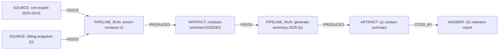

import Tabs from '@site/src/components/LanguageTabs'
import TabItem from '@theme/TabItem'

# End-to-End Data Lineage: From Source to Answer

When a dashboard shows a number, a sales rep acts on it. When a model generates a recommendation, an engineer ships it. Lineage answers the question that always follows: _where did this come from?_

This tutorial models a data pipeline as a graph:

- **SOURCE** nodes represent raw data origins (database dumps, API responses, uploaded files)
- **ARTIFACT** nodes represent transformed or derived outputs (cleaned datasets, enriched records, summaries)
- **PIPELINE_RUN** nodes capture when and how a transformation happened
- **ANSWER** nodes represent final outputs — responses, reports, or decisions — along with the artifacts they drew from

Every node is connected by typed relationships, so any output can be traced back to its origin in a single traversal query.

---

## Lineage graph shape



---

## Step 1: Register source records

<Tabs groupId="programming-language">
<TabItem value="typescript" label="TypeScript">

```typescript
import RushDB from '@rushdb/javascript-sdk'

const db = new RushDB('RUSHDB_API_KEY')

const crmExport = await db.records.create({
  label: 'SOURCE',
  data: {
    name: 'crm-export-2025-03-01',
    origin: 'Salesforce',
    format: 'csv',
    rowCount: 14200,
    capturedAt: '2025-03-01T00:00:00Z',
    checksum: 'sha256:abc123'
  }
})

const billingSnapshot = await db.records.create({
  label: 'SOURCE',
  data: {
    name: 'billing-snapshot-Q1',
    origin: 'Stripe',
    format: 'json',
    rowCount: 3800,
    capturedAt: '2025-03-31T23:59:59Z',
    checksum: 'sha256:def456'
  }
})
```

</TabItem>
<TabItem value="python" label="Python">

```python
from rushdb import RushDB

db = RushDB("RUSHDB_API_KEY", base_url="https://api.rushdb.com/api/v1")

crm_export = db.records.create("SOURCE", {
    "name": "crm-export-2025-03-01",
    "origin": "Salesforce",
    "format": "csv",
    "rowCount": 14200,
    "capturedAt": "2025-03-01T00:00:00Z",
    "checksum": "sha256:abc123"
})

billing_snapshot = db.records.create("SOURCE", {
    "name": "billing-snapshot-Q1",
    "origin": "Stripe",
    "format": "json",
    "rowCount": 3800,
    "capturedAt": "2025-03-31T23:59:59Z",
    "checksum": "sha256:def456"
})
```

</TabItem>
<TabItem value="shell" label="Shell">

```bash
BASE="https://api.rushdb.com/api/v1"
TOKEN="RUSHDB_API_KEY"
H='Content-Type: application/json'

CRM_ID=$(curl -s -X POST "$BASE/records" \
  -H "$H" -H "Authorization: Bearer $TOKEN" \
  -d '{"label":"SOURCE","data":{"name":"crm-export-2025-03-01","origin":"Salesforce","format":"csv","rowCount":14200,"capturedAt":"2025-03-01T00:00:00Z"}}' \
  | jq -r '.data.__id')

BILLING_ID=$(curl -s -X POST "$BASE/records" \
  -H "$H" -H "Authorization: Bearer $TOKEN" \
  -d '{"label":"SOURCE","data":{"name":"billing-snapshot-Q1","origin":"Stripe","format":"json","rowCount":3800,"capturedAt":"2025-03-31T23:59:59Z"}}' \
  | jq -r '.data.__id')
```

</TabItem>
</Tabs>

---

## Step 2: Record a pipeline run

A `PIPELINE_RUN` captures the job identity, code version, and run metadata. It connects upstream sources to downstream artifacts.

<Tabs groupId="programming-language">
<TabItem value="typescript" label="TypeScript">

```typescript
const enrichRun = await db.records.create({
  label: 'PIPELINE_RUN',
  data: {
    runId: 'enrich-contacts-v2-20250301',
    pipelineName: 'enrich-contacts',
    version: 'v2.4.1',
    startedAt: '2025-03-01T01:00:00Z',
    finishedAt: '2025-03-01T01:47:23Z',
    status: 'success',
    triggeredBy: 'scheduler'
  }
})

// Link sources into this run
await Promise.all([
  db.records.attach({ source: crmExport, target: enrichRun, options: { type: 'FEEDS' } }),
  db.records.attach({ source: billingSnapshot, target: enrichRun, options: { type: 'FEEDS' } })
])
```

</TabItem>
<TabItem value="python" label="Python">

```python
enrich_run = db.records.create("PIPELINE_RUN", {
    "runId": "enrich-contacts-v2-20250301",
    "pipelineName": "enrich-contacts",
    "version": "v2.4.1",
    "startedAt": "2025-03-01T01:00:00Z",
    "finishedAt": "2025-03-01T01:47:23Z",
    "status": "success",
    "triggeredBy": "scheduler"
})

db.records.attach(crm_export.id, enrich_run.id, {"type": "FEEDS"})
db.records.attach(billing_snapshot.id, enrich_run.id, {"type": "FEEDS"})
```

</TabItem>
<TabItem value="shell" label="Shell">

```bash
RUN_ID=$(curl -s -X POST "$BASE/records" \
  -H "$H" -H "Authorization: Bearer $TOKEN" \
  -d '{"label":"PIPELINE_RUN","data":{"runId":"enrich-contacts-v2-20250301","pipelineName":"enrich-contacts","version":"v2.4.1","status":"success"}}' \
  | jq -r '.data.__id')

curl -s -X POST "$BASE/records/$CRM_ID/relations" \
  -H "$H" -H "Authorization: Bearer $TOKEN" \
  -d "{\"targets\":[\"$RUN_ID\"],\"options\":{\"type\":\"FEEDS\"}}"

curl -s -X POST "$BASE/records/$BILLING_ID/relations" \
  -H "$H" -H "Authorization: Bearer $TOKEN" \
  -d "{\"targets\":[\"$RUN_ID\"],\"options\":{\"type\":\"FEEDS\"}}"
```

</TabItem>
</Tabs>

---

## Step 3: Register the produced artifact

<Tabs groupId="programming-language">
<TabItem value="typescript" label="TypeScript">

```typescript
const enrichedArtifact = await db.records.create({
  label: 'ARTIFACT',
  data: {
    name: 'contacts-enriched-20250301',
    type: 'dataset',
    rowCount: 13940,
    storagePath: 's3://data-lake/enriched/contacts-2025-03-01.parquet',
    createdAt: '2025-03-01T01:47:23Z',
    schema: 'contacts-enriched-v3'
  }
})

await db.records.attach({
  source: enrichRun,
  target: enrichedArtifact,
  options: { type: 'PRODUCED' }
})
```

</TabItem>
<TabItem value="python" label="Python">

```python
enriched = db.records.create("ARTIFACT", {
    "name": "contacts-enriched-20250301",
    "type": "dataset",
    "rowCount": 13940,
    "storagePath": "s3://data-lake/enriched/contacts-2025-03-01.parquet",
    "createdAt": "2025-03-01T01:47:23Z",
    "schema": "contacts-enriched-v3"
})

db.records.attach(enrich_run.id, enriched.id, {"type": "PRODUCED"})
```

</TabItem>
<TabItem value="shell" label="Shell">

```bash
ART_ID=$(curl -s -X POST "$BASE/records" \
  -H "$H" -H "Authorization: Bearer $TOKEN" \
  -d '{"label":"ARTIFACT","data":{"name":"contacts-enriched-20250301","type":"dataset","rowCount":13940,"schema":"contacts-enriched-v3"}}' \
  | jq -r '.data.__id')

curl -s -X POST "$BASE/records/$RUN_ID/relations" \
  -H "$H" -H "Authorization: Bearer $TOKEN" \
  -d "{\"targets\":[\"$ART_ID\"],\"options\":{\"type\":\"PRODUCED\"}}"
```

</TabItem>
</Tabs>

---

## Step 4: Chain another pipeline run on top

A second pipeline reads the enriched artifact and produces a summary.

<Tabs groupId="programming-language">
<TabItem value="typescript" label="TypeScript">

```typescript
const summaryRun = await db.records.create({
  label: 'PIPELINE_RUN',
  data: {
    runId: 'summary-q1-20250401',
    pipelineName: 'generate-summary',
    version: 'v1.2.0',
    startedAt: '2025-04-01T08:00:00Z',
    finishedAt: '2025-04-01T08:11:42Z',
    status: 'success',
    triggeredBy: 'manual'
  }
})

const summaryArtifact = await db.records.create({
  label: 'ARTIFACT',
  data: {
    name: 'q1-contact-summary',
    type: 'report',
    storagePath: 's3://reports/q1-2025/contact-summary.json',
    createdAt: '2025-04-01T08:11:42Z'
  }
})

await Promise.all([
  db.records.attach({ source: enrichedArtifact, target: summaryRun, options: { type: 'FEEDS' } }),
  db.records.attach({ source: summaryRun, target: summaryArtifact, options: { type: 'PRODUCED' } })
])
```

</TabItem>
<TabItem value="python" label="Python">

```python
summary_run = db.records.create("PIPELINE_RUN", {
    "runId": "summary-q1-20250401",
    "pipelineName": "generate-summary",
    "version": "v1.2.0",
    "status": "success",
    "triggeredBy": "manual"
})

summary_artifact = db.records.create("ARTIFACT", {
    "name": "q1-contact-summary",
    "type": "report",
    "storagePath": "s3://reports/q1-2025/contact-summary.json",
    "createdAt": "2025-04-01T08:11:42Z"
})

db.records.attach(enriched.id, summary_run.id, {"type": "FEEDS"})
db.records.attach(summary_run.id, summary_artifact.id, {"type": "PRODUCED"})
```

</TabItem>
<TabItem value="shell" label="Shell">

```bash
SUMRUN_ID=$(curl -s -X POST "$BASE/records" \
  -H "$H" -H "Authorization: Bearer $TOKEN" \
  -d '{"label":"PIPELINE_RUN","data":{"runId":"summary-q1-20250401","pipelineName":"generate-summary","version":"v1.2.0","status":"success"}}' \
  | jq -r '.data.__id')

SUMART_ID=$(curl -s -X POST "$BASE/records" \
  -H "$H" -H "Authorization: Bearer $TOKEN" \
  -d '{"label":"ARTIFACT","data":{"name":"q1-contact-summary","type":"report"}}' \
  | jq -r '.data.__id')

curl -s -X POST "$BASE/records/$ART_ID/relations" \
  -H "$H" -H "Authorization: Bearer $TOKEN" \
  -d "{\"targets\":[\"$SUMRUN_ID\"],\"options\":{\"type\":\"FEEDS\"}}"

curl -s -X POST "$BASE/records/$SUMRUN_ID/relations" \
  -H "$H" -H "Authorization: Bearer $TOKEN" \
  -d "{\"targets\":[\"$SUMART_ID\"],\"options\":{\"type\":\"PRODUCED\"}}"
```

</TabItem>
</Tabs>

---

## Step 5: Link an answer to the artifacts it used

An `ANSWER` is the final output — an LLM response, a dashboard stat, or a filed report — linked to the artifacts it drew from.

<Tabs groupId="programming-language">
<TabItem value="typescript" label="TypeScript">

```typescript
const answer = await db.records.create({
  label: 'ANSWER',
  data: {
    answerId: 'report-q1-retention',
    type: 'retention-report',
    generatedAt: '2025-04-02T09:00:00Z',
    generatedBy: 'analytics-agent-v3',
    content: 'Q1 2025: churn rate dropped 4.2% YoY driven by enterprise segment growth.'
  }
})

await db.records.attach({
  source: summaryArtifact,
  target: answer,
  options: { type: 'CITED_BY' }
})
```

</TabItem>
<TabItem value="python" label="Python">

```python
answer = db.records.create("ANSWER", {
    "answerId": "report-q1-retention",
    "type": "retention-report",
    "generatedAt": "2025-04-02T09:00:00Z",
    "generatedBy": "analytics-agent-v3",
    "content": "Q1 2025: churn rate dropped 4.2% YoY."
})

db.records.attach(summary_artifact.id, answer.id, {"type": "CITED_BY"})
```

</TabItem>
<TabItem value="shell" label="Shell">

```bash
ANS_ID=$(curl -s -X POST "$BASE/records" \
  -H "$H" -H "Authorization: Bearer $TOKEN" \
  -d '{"label":"ANSWER","data":{"answerId":"report-q1-retention","type":"retention-report","generatedAt":"2025-04-02T09:00:00Z"}}' \
  | jq -r '.data.__id')

curl -s -X POST "$BASE/records/$SUMART_ID/relations" \
  -H "$H" -H "Authorization: Bearer $TOKEN" \
  -d "{\"targets\":[\"$ANS_ID\"],\"options\":{\"type\":\"CITED_BY\"}}"
```

</TabItem>
</Tabs>

---

## Step 6: Trace an answer back to its raw sources

Given an answer ID, walk the full lineage chain to recover all upstream sources.

<Tabs groupId="programming-language">
<TabItem value="typescript" label="TypeScript">

```typescript
// Find all sources two hops upstream from a given answer
const lineage = await db.records.find({
  labels: ['SOURCE'],
  where: {
    PIPELINE_RUN: {
      $alias: '$run',
      $relation: { type: 'FEEDS', direction: 'out' },
      ARTIFACT: {
        $alias: '$artifact',
        $relation: { type: 'PRODUCED', direction: 'in' },
        PIPELINE_RUN: {
          $alias: '$run2',
          ARTIFACT: {
            $alias: '$finalArt',
            $relation: { type: 'PRODUCED', direction: 'in' },
            ANSWER: {
              answerId: 'report-q1-retention'
            }
          }
        }
      }
    }
  },
  select: {
    sourceName: '$record.name',
    origin: '$record.origin',
    capturedAt: '$record.capturedAt',
    checksum: '$record.checksum',
    runId: '$run.runId',
    finalArtifact: '$finalArt.name'
  }
})
```

</TabItem>
<TabItem value="python" label="Python">

```python
lineage = db.records.find({
    "labels": ["SOURCE"],
    "where": {
        "PIPELINE_RUN": {
            "$alias": "$run",
            "$relation": {"type": "FEEDS", "direction": "out"},
            "ARTIFACT": {
                "$alias": "$artifact",
                "$relation": {"type": "PRODUCED", "direction": "in"},
                "PIPELINE_RUN": {
                    "ARTIFACT": {
                        "$alias": "$finalArt",
                        "$relation": {"type": "PRODUCED", "direction": "in"},
                        "ANSWER": {
                            "answerId": "report-q1-retention"
                        }
                    }
                }
            }
        }
    },
    "select": {
        "sourceName": "$record.name",
        "origin": "$record.origin",
        "capturedAt": "$record.capturedAt",
        "runId": "$run.runId"
    }
})
```

</TabItem>
<TabItem value="shell" label="Shell">

```bash
curl -s -X POST "$BASE/records/search" \
  -H "$H" -H "Authorization: Bearer $TOKEN" \
  -d '{
    "labels": ["SOURCE"],
    "where": {
      "PIPELINE_RUN": {
        "$alias": "$run",
        "$relation": {"type": "FEEDS", "direction": "out"},
        "ARTIFACT": {
          "$relation": {"type": "PRODUCED", "direction": "in"},
          "PIPELINE_RUN": {
            "ARTIFACT": {
              "$alias": "$finalArt",
              "$relation": {"type": "PRODUCED", "direction": "in"},
              "ANSWER": {"answerId": "report-q1-retention"}
            }
          }
        }
      }
    },
    "select": {
      "sourceName": "$record.name",
      "origin": "$record.origin",
      "capturedAt": "$record.capturedAt"
    }
  }'
```

</TabItem>
</Tabs>

---

## Step 7: Find all failed pipeline runs and their downstream artifacts

<Tabs groupId="programming-language">
<TabItem value="typescript" label="TypeScript">

```typescript
const failedDownstream = await db.records.find({
  labels: ['ARTIFACT'],
  where: {
    PIPELINE_RUN: {
      $alias: '$run',
      $relation: { type: 'PRODUCED', direction: 'in' },
      status: 'failed'
    }
  },
  select: {
    artifactName: '$record.name',
    artifactType: '$record.type',
    failedRunId: '$run.runId',
    failedAt: '$run.finishedAt'
  },
  orderBy: { failedAt: 'desc' }
})
```

</TabItem>
<TabItem value="python" label="Python">

```python
failed_downstream = db.records.find({
    "labels": ["ARTIFACT"],
    "where": {
        "PIPELINE_RUN": {
            "$alias": "$run",
            "$relation": {"type": "PRODUCED", "direction": "in"},
            "status": "failed"
        }
    },
    "select": {
        "artifactName": "$record.name",
        "failedRunId": "$run.runId",
        "failedAt": "$run.finishedAt"
    },
    "orderBy": {"failedAt": "desc"}
})
```

</TabItem>
<TabItem value="shell" label="Shell">

```bash
curl -s -X POST "$BASE/records/search" \
  -H "$H" -H "Authorization: Bearer $TOKEN" \
  -d '{
    "labels": ["ARTIFACT"],
    "where": {
      "PIPELINE_RUN": {
        "$alias": "$run",
        "$relation": {"type": "PRODUCED", "direction": "in"},
        "status": "failed"
      }
    },
    "select": {
      "artifactName": "$record.name",
      "failedRunId": "$run.runId"
    },
    "orderBy": {"failedAt": "desc"}
  }'
```

</TabItem>
</Tabs>

---

## Production caveat

Multi-hop lineage queries will scan the entire reachable subgraph unless you scope them. Always filter by a narrow property on the starting label — `answerId`, `runId`, or a date range on `capturedAt` — before the traversal starts. Deep chains (more than four hops) can be expensive. For very long chains, consider materializing intermediate lineage summaries as ARTIFACT metadata instead of relying on traversal alone.

---

## Next steps

- [Audit Trails with Immutable Events](/tutorials/audit-trails) — separate event log from current state for reconstructible history
- [Versioning Records Without Losing Queryability](/tutorials/versioning-records) — keeping historical state queryable alongside current state
- [RushDB as a Memory Layer](/tutorials/memory-layer) — using the same EPISODE + REFERENCE pattern for agent memory
