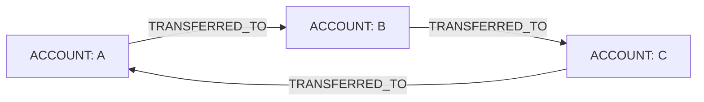
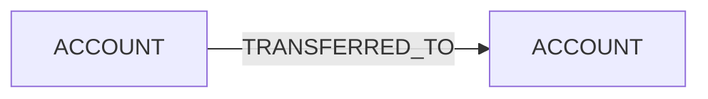
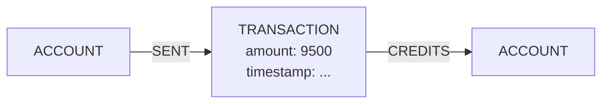

import Tabs from '@site/src/components/LanguageTabs'
import TabItem from '@theme/TabItem'

# Detecting Fraud Rings

Money laundering has a geometric signature. Legitimate money flows are mostly acyclic: salaries fan out to merchants, merchants pay suppliers, suppliers pay employees. Laundering schemes need the money to come **back** — pushed through a chain of mule accounts and returned, cleaned, to somewhere the originator controls. That closing of the loop is the tell:



Relational systems struggle here because "is this account on a directed cycle of length 2–6?" is a recursive question. In a graph it is a single query. This tutorial shows how to model transfers in RushDB and how to run cycle detection with [`$cycle`](/learn/search-query/where-operators#cycle-detection-cycle) and [variable-length traversal (`hops`)](/learn/search-query/where-operators#variable-length-traversal-hops).

---

## Two ways to model transfers

**Model A — direct transfer edges.** Each transfer is a typed relationship between accounts:



Minimal and fast to traverse, but the transfer itself carries no data. RushDB relationships are typed edges — amount, currency, and timestamp have nowhere to live.

**Model B — transactions as records.** Each transfer is a `TRANSACTION` record between two accounts:



This is the RushDB-idiomatic shape: properties live on records, so `amount` and `timestamp` become first-class, filterable, aggregatable data. The trade-off is that every money movement is now **two hops** instead of one.

Use Model A when you only need topology (who pays whom). Use Model B when you need to query the transfers themselves. Both support cycle detection — the queries just count hops differently, as you'll see below.

---

## Step 1: Create a sample dataset (Model A)

Five accounts. Three of them (`acct-a`, `acct-b`, `acct-c`) form a directed ring; the other two exchange an innocent one-way payment.

<Tabs groupId="programming-language">
<TabItem value="typescript" label="TypeScript">

```typescript
import RushDB from '@rushdb/javascript-sdk'

const db = new RushDB(process.env.RUSHDB_API_KEY!)

const accA = await db.records.create({
  label: 'ACCOUNT',
  data: { accountId: 'acct-a', country: 'CY', riskTier: 'high' }
})
const accB = await db.records.create({
  label: 'ACCOUNT',
  data: { accountId: 'acct-b', country: 'LV', riskTier: 'medium' }
})
const accC = await db.records.create({
  label: 'ACCOUNT',
  data: { accountId: 'acct-c', country: 'CY', riskTier: 'high' }
})
const accD = await db.records.create({
  label: 'ACCOUNT',
  data: { accountId: 'acct-d', country: 'DE', riskTier: 'low' }
})
const accE = await db.records.create({
  label: 'ACCOUNT',
  data: { accountId: 'acct-e', country: 'DE', riskTier: 'low' }
})

// The ring: A → B → C → A
await Promise.all([
  db.records.attach({ source: accA, target: accB, options: { type: 'TRANSFERRED_TO' } }),
  db.records.attach({ source: accB, target: accC, options: { type: 'TRANSFERRED_TO' } }),
  db.records.attach({ source: accC, target: accA, options: { type: 'TRANSFERRED_TO' } })
])

// Innocent one-way payment: D → E
await db.records.attach({ source: accD, target: accE, options: { type: 'TRANSFERRED_TO' } })
```

</TabItem>
<TabItem value="python" label="Python">

```python
from rushdb import RushDB
import os

db = RushDB(os.environ["RUSHDB_API_KEY"], base_url="https://api.rushdb.com/api/v1")

acc_a = db.records.create("ACCOUNT", {"accountId": "acct-a", "country": "CY", "riskTier": "high"})
acc_b = db.records.create("ACCOUNT", {"accountId": "acct-b", "country": "LV", "riskTier": "medium"})
acc_c = db.records.create("ACCOUNT", {"accountId": "acct-c", "country": "CY", "riskTier": "high"})
acc_d = db.records.create("ACCOUNT", {"accountId": "acct-d", "country": "DE", "riskTier": "low"})
acc_e = db.records.create("ACCOUNT", {"accountId": "acct-e", "country": "DE", "riskTier": "low"})

# The ring: A → B → C → A
db.records.attach(acc_a.id, acc_b.id, {"type": "TRANSFERRED_TO"})
db.records.attach(acc_b.id, acc_c.id, {"type": "TRANSFERRED_TO"})
db.records.attach(acc_c.id, acc_a.id, {"type": "TRANSFERRED_TO"})

# Innocent one-way payment: D → E
db.records.attach(acc_d.id, acc_e.id, {"type": "TRANSFERRED_TO"})
```

</TabItem>
<TabItem value="shell" label="Shell">

```bash
BASE="https://api.rushdb.com/api/v1"
TOKEN="RUSHDB_API_KEY"
H='Content-Type: application/json'

A_ID=$(curl -s -X POST "$BASE/records" -H "$H" -H "Authorization: Bearer $TOKEN" \
  -d '{"label":"ACCOUNT","data":{"accountId":"acct-a","country":"CY","riskTier":"high"}}' | jq -r '.data.__id')
B_ID=$(curl -s -X POST "$BASE/records" -H "$H" -H "Authorization: Bearer $TOKEN" \
  -d '{"label":"ACCOUNT","data":{"accountId":"acct-b","country":"LV","riskTier":"medium"}}' | jq -r '.data.__id')
C_ID=$(curl -s -X POST "$BASE/records" -H "$H" -H "Authorization: Bearer $TOKEN" \
  -d '{"label":"ACCOUNT","data":{"accountId":"acct-c","country":"CY","riskTier":"high"}}' | jq -r '.data.__id')

# The ring: A → B → C → A
curl -s -X POST "$BASE/records/$A_ID/relations" -H "$H" -H "Authorization: Bearer $TOKEN" \
  -d "{\"targets\":[\"$B_ID\"],\"options\":{\"type\":\"TRANSFERRED_TO\"}}"
curl -s -X POST "$BASE/records/$B_ID/relations" -H "$H" -H "Authorization: Bearer $TOKEN" \
  -d "{\"targets\":[\"$C_ID\"],\"options\":{\"type\":\"TRANSFERRED_TO\"}}"
curl -s -X POST "$BASE/records/$C_ID/relations" -H "$H" -H "Authorization: Bearer $TOKEN" \
  -d "{\"targets\":[\"$A_ID\"],\"options\":{\"type\":\"TRANSFERRED_TO\"}}"
```

</TabItem>
</Tabs>

For Model B you would create a `TRANSACTION` record per movement (`{ amount: 9500, currency: 'EUR', timestamp: '2025-11-03T14:22:00Z' }`) and attach it with `SENT` from the sender and `CREDITS` to the receiver.

---

## Step 2: Find ring participants with `$cycle`

### Model A: typed, directed hops

<Tabs groupId="programming-language">
<TabItem value="typescript" label="TypeScript">

```typescript
const ringParticipants = await db.records.find({
  labels: ['ACCOUNT'],
  where: {
    RING: {
      // Display name — NOT matched as a label
      $cycle: true,
      $relation: {
        type: 'TRANSFERRED_TO', // Every hop is a transfer
        direction: 'out', // Money always flows forward
        hops: { min: 2, max: 6 } // Ring length in transfers
      }
    }
  }
})
// → acct-a, acct-b, acct-c. Not acct-d or acct-e.
```

</TabItem>
<TabItem value="python" label="Python">

```python
ring_participants = db.records.find({
    "labels": ["ACCOUNT"],
    "where": {
        "RING": {
            "$cycle": True,
            "$relation": {
                "type": "TRANSFERRED_TO",
                "direction": "out",
                "hops": {"min": 2, "max": 6}
            }
        }
    }
})
```

</TabItem>
<TabItem value="shell" label="Shell">

```bash
curl -s -X POST "$BASE/records/search" \
  -H "$H" -H "Authorization: Bearer $TOKEN" \
  -d '{
    "labels": ["ACCOUNT"],
    "where": {
      "RING": {
        "$cycle": true,
        "$relation": {"type": "TRANSFERRED_TO", "direction": "out", "hops": {"min": 2, "max": 6}}
      }
    }
  }'
```

</TabItem>
</Tabs>

The rules of a `$cycle` block, briefly:

- It requires `$relation` with `hops` (`min` ≥ 2, defaulting to 2 — a 1-hop "cycle" would be a self-loop) and accepts **nothing else**: no `$alias`, no property criteria, no nested labels. Both ends of the path are the root record, so filter the root instead.
- The key (`RING`) is a display name, not a label; it just has to be unique among its siblings.
- `type` and `direction` apply to every hop; `hops` bounds the ring length.

### Model B: untyped, directed hops — with doubled counts

In Model B the path alternates `ACCOUNT -[SENT]-> TRANSACTION -[CREDITS]-> ACCOUNT`, so each money movement costs **two hops**. A ring of 2–6 transfers is a closed path of 4–12 hops. And because the hops alternate between two relationship types, omit `type` — untyped traversal allows a different type on each hop (RushDB automatically excludes its internal property metadata edges, so this never leaves your data model):

<Tabs groupId="programming-language">
<TabItem value="typescript" label="TypeScript">

```typescript
const ringParticipants = await db.records.find({
  labels: ['ACCOUNT'],
  where: {
    RING: {
      $cycle: true,
      $relation: {
        direction: 'out', // SENT and CREDITS both point "downstream"
        hops: { min: 4, max: 12 } // 2–6 transfers × 2 hops each
      }
    }
  }
})
```

</TabItem>
<TabItem value="python" label="Python">

```python
ring_participants = db.records.find({
    "labels": ["ACCOUNT"],
    "where": {
        "RING": {
            "$cycle": True,
            "$relation": {"direction": "out", "hops": {"min": 4, "max": 12}}
        }
    }
})
```

</TabItem>
<TabItem value="shell" label="Shell">

```bash
curl -s -X POST "$BASE/records/search" \
  -H "$H" -H "Authorization: Bearer $TOKEN" \
  -d '{
    "labels": ["ACCOUNT"],
    "where": {
      "RING": {
        "$cycle": true,
        "$relation": {"direction": "out", "hops": {"min": 4, "max": 12}}
      }
    }
  }'
```

</TabItem>
</Tabs>

You might expect to need "even hops only" — the range `4..12` also admits 5, 7, 9, 11. It doesn't matter: the graph is **bipartite**. Every hop switches between `ACCOUNT` and `TRANSACTION`, and a cycle must land back on the root `ACCOUNT`, so any closed path necessarily has an even length. Odd lengths simply never match.

---

## Why direction matters

Drop `direction` and the query means "any closed trail, edges followed either way". That matches completely innocent shapes:

- **Repayment pairs**: A pays B, later B pays A back (a loan and its repayment). Undirected, `A ⇄ B` closes a 2-hop loop.
- **Parallel transfers**: A pays B twice. Undirected, the two edges form a closed trail `A–B–A` even though money only ever moved one way.

With `direction: 'out'`, a match means money flowed **forward through every hop and returned to its origin** — the laundering signature, not the bookkeeping noise.

One refinement: even directed, `min: 2` matches a genuine two-party loop `A → B → A`, which is often legitimate churn (refunds, settlements). If two-party loops drown your results, raise the floor:

```typescript
hops: { min: 3, max: 6 }   // rings of 3+ accounts only
```

---

## Step 3: Combine with root filters

A `$cycle` block cannot carry criteria — but the **root** record can. Scope candidate detection to the accounts your analysts actually care about:

<Tabs groupId="programming-language">
<TabItem value="typescript" label="TypeScript">

```typescript
// High-risk accounts in specific jurisdictions that sit on a transfer ring
const suspects = await db.records.find({
  labels: ['ACCOUNT'],
  where: {
    country: { $in: ['CY', 'LV', 'MT'] },
    riskTier: 'high',
    RING: {
      $cycle: true,
      $relation: { type: 'TRANSFERRED_TO', direction: 'out', hops: { min: 2, max: 6 } }
    }
  }
})

// The inverse: accounts provably NOT on any short transfer ring
const cleanAccounts = await db.records.find({
  labels: ['ACCOUNT'],
  where: {
    $not: {
      RING: {
        $cycle: true,
        $relation: { type: 'TRANSFERRED_TO', direction: 'out', hops: { min: 2, max: 6 } }
      }
    }
  }
})
```

</TabItem>
<TabItem value="python" label="Python">

```python
suspects = db.records.find({
    "labels": ["ACCOUNT"],
    "where": {
        "country": {"$in": ["CY", "LV", "MT"]},
        "riskTier": "high",
        "RING": {
            "$cycle": True,
            "$relation": {"type": "TRANSFERRED_TO", "direction": "out", "hops": {"min": 2, "max": 6}}
        }
    }
})

clean_accounts = db.records.find({
    "labels": ["ACCOUNT"],
    "where": {
        "$not": {
            "RING": {
                "$cycle": True,
                "$relation": {"type": "TRANSFERRED_TO", "direction": "out", "hops": {"min": 2, "max": 6}}
            }
        }
    }
})
```

</TabItem>
<TabItem value="shell" label="Shell">

```bash
curl -s -X POST "$BASE/records/search" \
  -H "$H" -H "Authorization: Bearer $TOKEN" \
  -d '{
    "labels": ["ACCOUNT"],
    "where": {
      "country": {"$in": ["CY", "LV", "MT"]},
      "riskTier": "high",
      "RING": {
        "$cycle": true,
        "$relation": {"type": "TRANSFERRED_TO", "direction": "out", "hops": {"min": 2, "max": 6}}
      }
    }
  }'
```

</TabItem>
</Tabs>

Root filters also matter for performance: `country` and `riskTier` prune the candidate set **before** any traversal starts, so the expensive cycle check only runs against a shortlist.

---

## Step 4: From participants to rings

`$cycle` answers "which accounts sit on a ring?" — it returns **participants**, not the rings themselves. If three separate rings share an account, you get one flat list of every account involved. To reconstruct a specific ring's membership, walk outward from a flagged account with cheap, bounded one-hop queries and keep only neighbors that are also flagged:

<Tabs groupId="programming-language">
<TabItem value="typescript" label="TypeScript">

```typescript
const flagged = new Set(ringParticipants.data.map((r) => r.id))

// Who did this participant send money to?
async function nextHops(accountRecordId: string) {
  const recipients = await db.records.find({
    labels: ['ACCOUNT'],
    where: {
      ACCOUNT: {
        // Edge points from the nested record to the root: direction 'in'
        $relation: { type: 'TRANSFERRED_TO', direction: 'in' },
        $id: accountRecordId
      }
    }
  })
  // Only stay inside the flagged set
  return recipients.data.filter((r) => flagged.has(r.id))
}

// Depth-limited walk: follow flagged recipients until you return to the start
async function traceRing(startId: string, maxLength = 6): Promise<string[] | null> {
  const stack: string[][] = [[startId]]
  while (stack.length > 0) {
    const path = stack.pop()!
    if (path.length > maxLength) continue
    const current = path[path.length - 1]
    for (const next of await nextHops(current)) {
      if (next.id === startId && path.length >= 2) return path // ring closed
      if (!path.includes(next.id)) stack.push([...path, next.id])
    }
  }
  return null
}
```

</TabItem>
<TabItem value="python" label="Python">

```python
flagged = {record.id for record in ring_participants.data}

def next_hops(account_record_id):
    recipients = db.records.find({
        "labels": ["ACCOUNT"],
        "where": {
            "ACCOUNT": {
                "$relation": {"type": "TRANSFERRED_TO", "direction": "in"},
                "$id": account_record_id
            }
        }
    })
    return [r for r in recipients.data if r.id in flagged]

def trace_ring(start_id, max_length=6):
    stack = [[start_id]]
    while stack:
        path = stack.pop()
        if len(path) > max_length:
            continue
        for nxt in next_hops(path[-1]):
            if nxt.id == start_id and len(path) >= 2:
                return path  # ring closed
            if nxt.id not in path:
                stack.append(path + [nxt.id])
    return None
```

</TabItem>
</Tabs>

Each step is a one-hop, ID-anchored query — cheap and index-friendly. In practice you'd batch these lookups and score each reconstructed ring (total volume, velocity, jurisdiction mix) before raising a case.

### Honest limitations

- **No per-hop predicates.** You cannot express "every transfer along the path exceeds $10,000". In Model A the amounts don't exist at all; in Model B the intermediate `TRANSACTION` records inside a `hops` traversal are anonymous and unconstrained — only the endpoint can be filtered, and a `$cycle`block can't even do that. Amount-aware ring scoring belongs in the reconstruction step, where each`TRANSACTION` is a normal record you can filter and aggregate.
- **Trail semantics.** Each _relationship_ is used at most once per path, but records may repeat — a figure-eight through a shared mule account counts as one cycle. Treat `$cycle` as a candidate generator, not a verdict.

---

## Performance notes

- **Keep `max` small.** Variable-length traversal explores every matching path, and each extra hop multiplies the path count. Real laundering rings are short (3–6 parties); start there and widen only with evidence. Remember that in Model B the hop budget spends twice as fast — 12 hops is only 6 transfers.
- **Always set `direction`.** It halves the expansion at every hop _and_ it is what makes the result mean "circular flow". An undirected, untyped `hops` query is the most expensive shape SearchQuery can produce.
- **Mind the hop cap.** `hops.max` is capped per deployment (`RUSHDB_MAX_TRAVERSAL_HOPS`, default 25) on shared cloud. Unbounded traversal (omitting `max`) is only available on self-hosted deployments and projects with a custom Neo4j instance, bounded there by the transaction timeout.
- **Filter the root first.** Property criteria on the root (`country`, `riskTier`, activity flags) run before traversal and shrink the candidate set the cycle check has to cover.

---

## Next steps

- [Where Operators — Variable-Length Traversal and Cycle Detection](/learn/search-query/where-operators#variable-length-traversal-hops) — the full `hops` and `$cycle` reference
- [Modeling Hierarchies, Networks, and Feedback Loops](/learn/tutorials/graph-modeling/modeling-hierarchies) — the three graph shapes, including cyclic dependency graphs
- [Temporal Graphs: Modeling State and Event Time Together](/learn/tutorials/graph-modeling/temporal-graphs) — adding time to transaction records for velocity-based scoring
