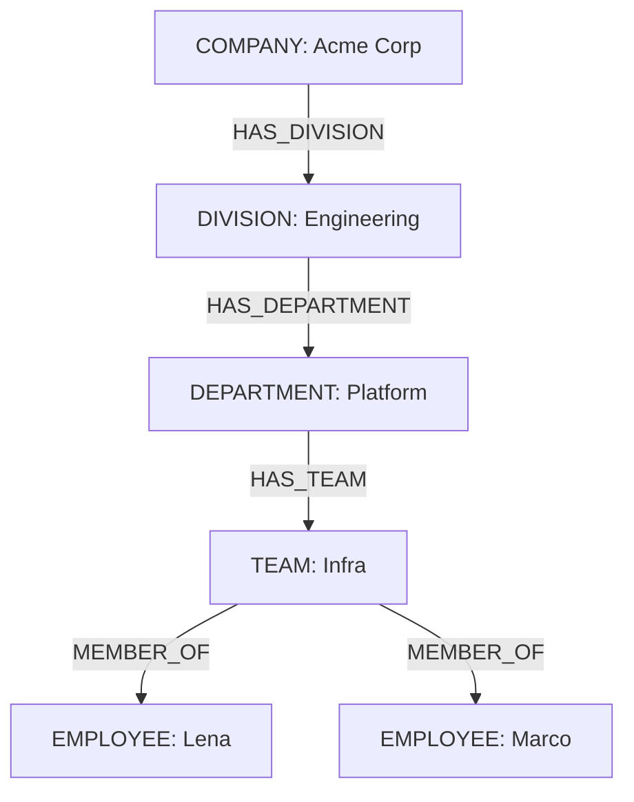
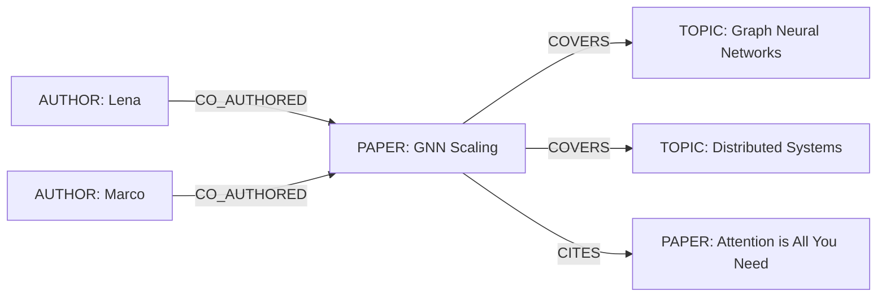
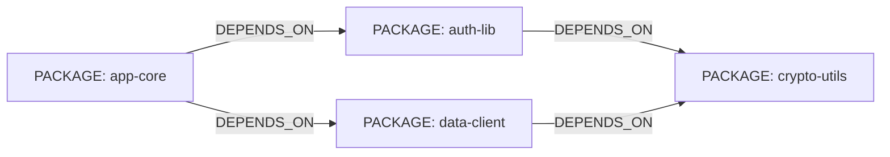

import Tabs from '@site/src/components/LanguageTabs'
import TabItem from '@theme/TabItem'

# Modeling Hierarchies, Networks, and Feedback Loops

Not all graphs are the same shape. A file system is a tree. A social network is many-to-many. A supply chain with feedback has cycles. Each shape has different query patterns, different failure modes, and different production constraints.

This tutorial covers all three so you can recognize which shape your domain needs and choose the right query approach from the start.

---

## Shape 1: Hierarchies (trees)

**Example domain:** Organizational chart — COMPANY → DIVISION → DEPARTMENT → TEAM → EMPLOYEE



### Ingesting the tree

<Tabs groupId="programming-language">
<TabItem value="typescript" label="TypeScript">

```typescript
import RushDB from '@rushdb/javascript-sdk'

const db = new RushDB('RUSHDB_API_KEY')

const company = await db.records.create({ label: 'COMPANY', data: { name: 'Acme Corp' } })
const division = await db.records.create({ label: 'DIVISION', data: { name: 'Engineering' } })
const dept = await db.records.create({ label: 'DEPARTMENT', data: { name: 'Platform', budget: 2000000 } })
const teamInfra = await db.records.create({ label: 'TEAM', data: { name: 'Infra', size: 6 } })
const lena = await db.records.create({
  label: 'EMPLOYEE',
  data: { name: 'Lena Müller', role: 'Lead SRE', level: 'L5' }
})
const marco = await db.records.create({
  label: 'EMPLOYEE',
  data: { name: 'Marco Rossi', role: 'Engineer', level: 'L4' }
})

await db.records.attach({ source: company, target: division, options: { type: 'HAS_DIVISION' } })
await db.records.attach({ source: division, target: dept, options: { type: 'HAS_DEPARTMENT' } })
await db.records.attach({ source: dept, target: teamInfra, options: { type: 'HAS_TEAM' } })
await db.records.attach({ source: teamInfra, target: lena, options: { type: 'MEMBER_OF', direction: 'in' } })
await db.records.attach({ source: teamInfra, target: marco, options: { type: 'MEMBER_OF', direction: 'in' } })
```

</TabItem>
<TabItem value="python" label="Python">

```python
from rushdb import RushDB

db = RushDB("RUSHDB_API_KEY", base_url="https://api.rushdb.com/api/v1")

company = db.records.create("COMPANY", {"name": "Acme Corp"})
division = db.records.create("DIVISION", {"name": "Engineering"})
dept = db.records.create("DEPARTMENT", {"name": "Platform", "budget": 2000000})
team_infra = db.records.create("TEAM", {"name": "Infra", "size": 6})
lena = db.records.create("EMPLOYEE", {"name": "Lena Müller", "role": "Lead SRE", "level": "L5"})
marco = db.records.create("EMPLOYEE", {"name": "Marco Rossi", "role": "Engineer", "level": "L4"})

db.records.attach(company.id, division.id, {"type": "HAS_DIVISION"})
db.records.attach(division.id, dept.id, {"type": "HAS_DEPARTMENT"})
db.records.attach(dept.id, team_infra.id, {"type": "HAS_TEAM"})
db.records.attach(team_infra.id, lena.id, {"type": "MEMBER_OF", "direction": "in"})
db.records.attach(team_infra.id, marco.id, {"type": "MEMBER_OF", "direction": "in"})
```

</TabItem>
<TabItem value="shell" label="Shell">

```bash
BASE="https://api.rushdb.com/api/v1"
TOKEN="RUSHDB_API_KEY"
H='Content-Type: application/json'

COMPANY_ID=$(curl -s -X POST "$BASE/records" -H "$H" -H "Authorization: Bearer $TOKEN" \
  -d '{"label":"COMPANY","data":{"name":"Acme Corp"}}' | jq -r '.data.__id')
DIV_ID=$(curl -s -X POST "$BASE/records" -H "$H" -H "Authorization: Bearer $TOKEN" \
  -d '{"label":"DIVISION","data":{"name":"Engineering"}}' | jq -r '.data.__id')

curl -s -X POST "$BASE/records/$COMPANY_ID/relations" -H "$H" -H "Authorization: Bearer $TOKEN" \
  -d "{\"targets\":[\"$DIV_ID\"],\"options\":{\"type\":\"HAS_DIVISION\"}}"
```

</TabItem>
</Tabs>

### Querying the tree: all employees with their full org path

<Tabs groupId="programming-language">
<TabItem value="typescript" label="TypeScript">

```typescript
const headcount = await db.records.find({
  labels: ['EMPLOYEE'],
  where: {
    TEAM: {
      $alias: '$team',
      $relation: { type: 'MEMBER_OF', direction: 'out' },
      DEPARTMENT: {
        $alias: '$dept',
        DIVISION: {
          $alias: '$div',
          COMPANY: { name: 'Acme Corp' }
        }
      }
    }
  },
  select: {
    employeeName: '$record.name',
    role: '$record.role',
    teamName: '$team.name',
    deptName: '$dept.name',
    divisionName: '$div.name'
  },
  orderBy: { employeeName: 'asc' }
})
```

</TabItem>
<TabItem value="python" label="Python">

```python
headcount = db.records.find({
    "labels": ["EMPLOYEE"],
    "where": {
        "TEAM": {
            "$alias": "$team",
            "$relation": {"type": "MEMBER_OF", "direction": "out"},
            "DEPARTMENT": {
                "$alias": "$dept",
                "DIVISION": {
                    "$alias": "$div",
                    "COMPANY": {"name": "Acme Corp"}
                }
            }
        }
    },
    "select": {
        "employeeName": "$record.name",
        "role": "$record.role",
        "teamName": "$team.name",
        "deptName": "$dept.name"
    },
    "orderBy": {"employeeName": "asc"}
})
```

</TabItem>
<TabItem value="shell" label="Shell">

```bash
curl -s -X POST "$BASE/records/search" \
  -H "$H" -H "Authorization: Bearer $TOKEN" \
  -d '{
    "labels": ["EMPLOYEE"],
    "where": {
      "TEAM": {
        "$alias": "$team",
        "$relation": {"type": "MEMBER_OF", "direction": "out"},
        "DEPARTMENT": {"DIVISION": {"COMPANY": {"name": "Acme Corp"}}}
      }
    },
    "select": {"employeeName": "$record.name", "teamName": "$team.name"}
  }'
```

</TabItem>
</Tabs>

### Tree query: headcount per department

<Tabs groupId="programming-language">
<TabItem value="typescript" label="TypeScript">

```typescript
const deptHeadcount = await db.records.find({
  labels: ['DEPARTMENT'],
  where: {
    TEAM: {
      EMPLOYEE: { $alias: '$emp', $relation: { type: 'MEMBER_OF', direction: 'out' } }
    },
    DIVISION: { COMPANY: { name: 'Acme Corp' } }
  },
  select: {
    deptName: '$record.name',
    headcount: { $count: '$emp' }
  },
  groupBy: ['deptName', 'headcount'],
  orderBy: { headcount: 'desc' }
})
```

</TabItem>
<TabItem value="python" label="Python">

```python
dept_headcount = db.records.find({
    "labels": ["DEPARTMENT"],
    "where": {
        "TEAM": {
            "EMPLOYEE": {"$alias": "$emp", "$relation": {"type": "MEMBER_OF", "direction": "out"}}
        },
        "DIVISION": {"COMPANY": {"name": "Acme Corp"}}
    },
    "select": {
        "deptName": "$record.name",
        "headcount": {"$count": "$emp"}
    },
    "groupBy": ["deptName", "headcount"],
    "orderBy": {"headcount": "desc"}
})
```

</TabItem>
<TabItem value="shell" label="Shell">

```bash
curl -s -X POST "$BASE/records/search" \
  -H "$H" -H "Authorization: Bearer $TOKEN" \
  -d '{
    "labels": ["DEPARTMENT"],
    "where": {
      "TEAM": {"EMPLOYEE": {"$alias": "$emp", "$relation": {"type": "MEMBER_OF", "direction": "out"}}},
      "DIVISION": {"COMPANY": {"name": "Acme Corp"}}
    },
    "select": {
      "deptName": "$record.name",
      "headcount": {"$count": "$emp"}
    },
    "groupBy": ["deptName", "headcount"],
    "orderBy": {"headcount": "desc"}
  }'
```

</TabItem>
</Tabs>

### Same-label trees: variable-length traversal with `hops`

The org chart above mixes labels — every level is a different label, so every level gets its own nested block. That manual nesting is exactly right for mixed-label paths: it lets you alias and filter each level independently.

But many trees repeat **one label and one relationship type** at every level: category trees (`CATEGORY -[HAS_CHILD]-> CATEGORY`), folder trees, management chains. Nesting the same block once per level hard-codes the depth and gets verbose fast. For those, use variable-length traversal: add [`hops` to `$relation`](/learn/search-query/where-operators#variable-length-traversal-hops) and cover N levels in a single block.

All descendants of the "Electronics" category, up to 4 levels deep:

<Tabs groupId="programming-language">
<TabItem value="typescript" label="TypeScript">

```typescript
const descendants = await db.records.find({
  labels: ['CATEGORY'],
  where: {
    CATEGORY: {
      // type and direction apply to EVERY hop; hops sets the depth range
      $relation: { type: 'HAS_CHILD', direction: 'in', hops: { min: 1, max: 4 } },
      // criteria filter only the FINAL record — here, the ancestor
      name: 'Electronics'
    }
  }
})
```

</TabItem>
<TabItem value="python" label="Python">

```python
descendants = db.records.find({
    "labels": ["CATEGORY"],
    "where": {
        "CATEGORY": {
            "$relation": {"type": "HAS_CHILD", "direction": "in", "hops": {"min": 1, "max": 4}},
            "name": "Electronics"
        }
    }
})
```

</TabItem>
<TabItem value="shell" label="Shell">

```bash
curl -s -X POST "$BASE/records/search" \
  -H "$H" -H "Authorization: Bearer $TOKEN" \
  -d '{
    "labels": ["CATEGORY"],
    "where": {
      "CATEGORY": {
        "$relation": {"type": "HAS_CHILD", "direction": "in", "hops": {"min": 1, "max": 4}},
        "name": "Electronics"
      }
    }
  }'
```

</TabItem>
</Tabs>

How `hops` behaves:

- `hops: 3` matches exactly 3 hops; `hops: { min, max }` matches a range (`min` defaults to `1`).
- `type` and `direction` constrain **every hop**; the nested label and its criteria constrain only the **endpoint** record. Intermediate records are anonymous and unconstrained.
- `hops.max` is capped per deployment (`RUSHDB_MAX_TRAVERSAL_HOPS`, default 25). Omitting `max` requests unbounded traversal, which is only allowed on self-hosted deployments and projects with a custom Neo4j instance.

Keep manual nesting when levels carry different labels, or when you need to alias or filter intermediate levels — `hops` cannot express per-level criteria.

---

## Shape 2: Many-to-many networks

**Example domain:** Research graph — AUTHOR ↔ PAPER ↔ TOPIC, PAPER → PAPER (citations)



### Ingesting the network

<Tabs groupId="programming-language">
<TabItem value="typescript" label="TypeScript">

```typescript
const lenaAuthor = await db.records.create({ label: 'AUTHOR', data: { name: 'Lena Müller', hIndex: 14 } })
const marcoAuthor = await db.records.create({ label: 'AUTHOR', data: { name: 'Marco Rossi', hIndex: 9 } })
const topicGNN = await db.records.create({ label: 'TOPIC', data: { name: 'Graph Neural Networks' } })
const topicDistrib = await db.records.create({ label: 'TOPIC', data: { name: 'Distributed Systems' } })
const paper1 = await db.records.create({
  label: 'PAPER',
  data: { title: 'GNN Scaling Strategies', year: 2024, citations: 87 }
})
const paper2 = await db.records.create({
  label: 'PAPER',
  data: { title: 'Attention is All You Need', year: 2017, citations: 90000 }
})

await Promise.all([
  db.records.attach({ source: lenaAuthor, target: paper1, options: { type: 'CO_AUTHORED' } }),
  db.records.attach({ source: marcoAuthor, target: paper1, options: { type: 'CO_AUTHORED' } }),
  db.records.attach({ source: paper1, target: topicGNN, options: { type: 'COVERS' } }),
  db.records.attach({ source: paper1, target: topicDistrib, options: { type: 'COVERS' } }),
  db.records.attach({ source: paper1, target: paper2, options: { type: 'CITES' } })
])
```

</TabItem>
<TabItem value="python" label="Python">

```python
lena_author = db.records.create("AUTHOR", {"name": "Lena Müller", "hIndex": 14})
marco_author = db.records.create("AUTHOR", {"name": "Marco Rossi", "hIndex": 9})
topic_gnn = db.records.create("TOPIC", {"name": "Graph Neural Networks"})
paper1 = db.records.create("PAPER", {"title": "GNN Scaling Strategies", "year": 2024, "citations": 87})
paper2 = db.records.create("PAPER", {"title": "Attention is All You Need", "year": 2017, "citations": 90000})

db.records.attach(lena_author.id, paper1.id, {"type": "CO_AUTHORED"})
db.records.attach(marco_author.id, paper1.id, {"type": "CO_AUTHORED"})
db.records.attach(paper1.id, topic_gnn.id, {"type": "COVERS"})
db.records.attach(paper1.id, paper2.id, {"type": "CITES"})
```

</TabItem>
<TabItem value="shell" label="Shell">

```bash
LENA_ID=$(curl -s -X POST "$BASE/records" -H "$H" -H "Authorization: Bearer $TOKEN" \
  -d '{"label":"AUTHOR","data":{"name":"Lena Müller","hIndex":14}}' | jq -r '.data.__id')
PAPER_ID=$(curl -s -X POST "$BASE/records" -H "$H" -H "Authorization: Bearer $TOKEN" \
  -d '{"label":"PAPER","data":{"title":"GNN Scaling Strategies","year":2024}}' | jq -r '.data.__id')

curl -s -X POST "$BASE/records/$LENA_ID/relations" -H "$H" -H "Authorization: Bearer $TOKEN" \
  -d "{\"targets\":[\"$PAPER_ID\"],\"options\":{\"type\":\"CO_AUTHORED\"}}"
```

</TabItem>
</Tabs>

### Network query: co-authors on a topic

<Tabs groupId="programming-language">
<TabItem value="typescript" label="TypeScript">

```typescript
const coAuthors = await db.records.find({
  labels: ['AUTHOR'],
  where: {
    PAPER: {
      $alias: '$paper',
      $relation: { type: 'CO_AUTHORED', direction: 'out' },
      TOPIC: { name: 'Graph Neural Networks' }
    }
  },
  select: {
    authorName: '$record.name',
    hIndex: '$record.hIndex',
    paperCount: { $count: '$paper' }
  },
  groupBy: ['authorName', 'hIndex', 'paperCount'],
  orderBy: { paperCount: 'desc' }
})
```

</TabItem>
<TabItem value="python" label="Python">

```python
co_authors = db.records.find({
    "labels": ["AUTHOR"],
    "where": {
        "PAPER": {
            "$alias": "$paper",
            "$relation": {"type": "CO_AUTHORED", "direction": "out"},
            "TOPIC": {"name": "Graph Neural Networks"}
        }
    },
    "select": {
        "authorName": "$record.name",
        "hIndex": "$record.hIndex",
        "paperCount": {"$count": "$paper"}
    },
    "groupBy": ["authorName", "hIndex", "paperCount"],
    "orderBy": {"paperCount": "desc"}
})
```

</TabItem>
<TabItem value="shell" label="Shell">

```bash
curl -s -X POST "$BASE/records/search" \
  -H "$H" -H "Authorization: Bearer $TOKEN" \
  -d '{
    "labels": ["AUTHOR"],
    "where": {
      "PAPER": {
        "$alias": "$paper",
        "$relation": {"type": "CO_AUTHORED", "direction": "out"},
        "TOPIC": {"name": "Graph Neural Networks"}
      }
    },
    "select": {
      "authorName": "$record.name",
      "paperCount": {"$count": "$paper"}
    },
    "groupBy": ["authorName", "paperCount"],
    "orderBy": {"paperCount": "desc"}
  }'
```

</TabItem>
</Tabs>

---

## Shape 3: Cyclic systems (dependency graphs)

**Example domain:** Package dependency graph — PACKAGE depends on other PACKAGEs through transitive chains.



SearchQuery supports variable-length traversal natively: add [`hops` to `$relation`](/learn/search-query/where-operators#variable-length-traversal-hops) to follow a relationship pattern up to N hops in a single block. Traversal depth is bounded by a per-deployment cap (`RUSHDB_MAX_TRAVERSAL_HOPS`, default 25); truly unbounded traversal (omitting `max`) is available only on self-hosted deployments and projects with a custom Neo4j instance. Explicitly scoping traversal to the depth your product requires remains good practice — for blast-radius analysis (which packages are affected if `crypto-utils` has a CVE?), traverse up to a known safe depth.

### Ingesting the dependency graph

<Tabs groupId="programming-language">
<TabItem value="typescript" label="TypeScript">

```typescript
const appCore = await db.records.create({ label: 'PACKAGE', data: { name: 'app-core', version: '2.1.0' } })
const authLib = await db.records.create({ label: 'PACKAGE', data: { name: 'auth-lib', version: '1.4.2' } })
const dataClient = await db.records.create({
  label: 'PACKAGE',
  data: { name: 'data-client', version: '3.0.1' }
})
const cryptoUtils = await db.records.create({
  label: 'PACKAGE',
  data: { name: 'crypto-utils', version: '0.9.8' }
})

await Promise.all([
  db.records.attach({ source: appCore, target: authLib, options: { type: 'DEPENDS_ON' } }),
  db.records.attach({ source: appCore, target: dataClient, options: { type: 'DEPENDS_ON' } }),
  db.records.attach({ source: authLib, target: cryptoUtils, options: { type: 'DEPENDS_ON' } }),
  db.records.attach({ source: dataClient, target: cryptoUtils, options: { type: 'DEPENDS_ON' } })
])
```

</TabItem>
<TabItem value="python" label="Python">

```python
app_core = db.records.create("PACKAGE", {"name": "app-core", "version": "2.1.0"})
auth_lib = db.records.create("PACKAGE", {"name": "auth-lib", "version": "1.4.2"})
data_client = db.records.create("PACKAGE", {"name": "data-client", "version": "3.0.1"})
crypto_utils = db.records.create("PACKAGE", {"name": "crypto-utils", "version": "0.9.8"})

db.records.attach(app_core.id, auth_lib.id, {"type": "DEPENDS_ON"})
db.records.attach(app_core.id, data_client.id, {"type": "DEPENDS_ON"})
db.records.attach(auth_lib.id, crypto_utils.id, {"type": "DEPENDS_ON"})
db.records.attach(data_client.id, crypto_utils.id, {"type": "DEPENDS_ON"})
```

</TabItem>
<TabItem value="shell" label="Shell">

```bash
CORE_ID=$(curl -s -X POST "$BASE/records" -H "$H" -H "Authorization: Bearer $TOKEN" \
  -d '{"label":"PACKAGE","data":{"name":"app-core","version":"2.1.0"}}' | jq -r '.data.__id')
AUTH_ID=$(curl -s -X POST "$BASE/records" -H "$H" -H "Authorization: Bearer $TOKEN" \
  -d '{"label":"PACKAGE","data":{"name":"auth-lib","version":"1.4.2"}}' | jq -r '.data.__id')
CRYPTO_ID=$(curl -s -X POST "$BASE/records" -H "$H" -H "Authorization: Bearer $TOKEN" \
  -d '{"label":"PACKAGE","data":{"name":"crypto-utils","version":"0.9.8"}}' | jq -r '.data.__id')

curl -s -X POST "$BASE/records/$CORE_ID/relations" -H "$H" -H "Authorization: Bearer $TOKEN" \
  -d "{\"targets\":[\"$AUTH_ID\"],\"options\":{\"type\":\"DEPENDS_ON\"}}"
curl -s -X POST "$BASE/records/$AUTH_ID/relations" -H "$H" -H "Authorization: Bearer $TOKEN" \
  -d "{\"targets\":[\"$CRYPTO_ID\"],\"options\":{\"type\":\"DEPENDS_ON\"}}"
```

</TabItem>
</Tabs>

### Cyclic query: two-hop blast radius for a vulnerable package

Find all packages that depend on `crypto-utils` directly (hop 1) or through one intermediate package (hop 2):

<Tabs groupId="programming-language">
<TabItem value="typescript" label="TypeScript">

```typescript
// Hop 1: direct dependents
const direct = await db.records.find({
  labels: ['PACKAGE'],
  where: {
    PACKAGE: {
      $alias: '$dep',
      $relation: { type: 'DEPENDS_ON', direction: 'out' },
      name: 'crypto-utils'
    }
  },
  select: {
    packageName: '$record.name',
    version: '$record.version',
    hop: { $count: '$dep' }
  },
  groupBy: ['packageName', 'version', 'hop']
})

// Hop 2: packages whose dependencies depend on crypto-utils
const indirect = await db.records.find({
  labels: ['PACKAGE'],
  where: {
    PACKAGE: {
      $alias: '$mid',
      $relation: { type: 'DEPENDS_ON', direction: 'out' },
      PACKAGE: {
        $relation: { type: 'DEPENDS_ON', direction: 'out' },
        name: 'crypto-utils'
      }
    }
  },
  select: {
    packageName: '$record.name',
    version: '$record.version',
    via: '$mid.name'
  }
})
```

</TabItem>
<TabItem value="python" label="Python">

```python
# Direct dependents of crypto-utils
direct = db.records.find({
    "labels": ["PACKAGE"],
    "where": {
        "PACKAGE": {
            "$alias": "$dep",
            "$relation": {"type": "DEPENDS_ON", "direction": "out"},
            "name": "crypto-utils"
        }
    },
    "select": {
        "packageName": "$record.name",
        "version": "$record.version"
    }
})

# Two-hop: packages that depend on a package that depends on crypto-utils
indirect = db.records.find({
    "labels": ["PACKAGE"],
    "where": {
        "PACKAGE": {
            "$alias": "$mid",
            "$relation": {"type": "DEPENDS_ON", "direction": "out"},
            "PACKAGE": {
                "$relation": {"type": "DEPENDS_ON", "direction": "out"},
                "name": "crypto-utils"
            }
        }
    },
    "select": {
        "packageName": "$record.name",
        "via": "$mid.name"
    }
})
```

</TabItem>
<TabItem value="shell" label="Shell">

```bash
# Direct dependents
curl -s -X POST "$BASE/records/search" \
  -H "$H" -H "Authorization: Bearer $TOKEN" \
  -d '{
    "labels": ["PACKAGE"],
    "where": {
      "PACKAGE": {
        "$relation": {"type": "DEPENDS_ON", "direction": "out"},
        "name": "crypto-utils"
      }
    },
    "select": {"packageName": "$record.name", "version": "$record.version"}
  }'
```

</TabItem>
</Tabs>

Manual nesting like this is still useful when you want to name and select the intermediate package (`via: '$mid.name'`). But when you only need the affected set, one variable-length block replaces the whole ladder.

### Cyclic query: N-hop blast radius with `hops`

All packages that depend on `crypto-utils` directly or transitively, up to 4 hops, in a single query:

<Tabs groupId="programming-language">
<TabItem value="typescript" label="TypeScript">

```typescript
const blastRadius = await db.records.find({
  labels: ['PACKAGE'],
  where: {
    PACKAGE: {
      $relation: { type: 'DEPENDS_ON', direction: 'out', hops: { min: 1, max: 4 } },
      name: 'crypto-utils'
    }
  },
  select: {
    packageName: '$record.name',
    version: '$record.version'
  }
})
```

</TabItem>
<TabItem value="python" label="Python">

```python
blast_radius = db.records.find({
    "labels": ["PACKAGE"],
    "where": {
        "PACKAGE": {
            "$relation": {"type": "DEPENDS_ON", "direction": "out", "hops": {"min": 1, "max": 4}},
            "name": "crypto-utils"
        }
    },
    "select": {
        "packageName": "$record.name",
        "version": "$record.version"
    }
})
```

</TabItem>
<TabItem value="shell" label="Shell">

```bash
curl -s -X POST "$BASE/records/search" \
  -H "$H" -H "Authorization: Bearer $TOKEN" \
  -d '{
    "labels": ["PACKAGE"],
    "where": {
      "PACKAGE": {
        "$relation": {"type": "DEPENDS_ON", "direction": "out", "hops": {"min": 1, "max": 4}},
        "name": "crypto-utils"
      }
    },
    "select": {"packageName": "$record.name", "version": "$record.version"}
  }'
```

</TabItem>
</Tabs>

`type` and `direction` apply to every hop, so this only walks `DEPENDS_ON` edges in the dependency direction. The `name: 'crypto-utils'` criterion filters the endpoint of the path — intermediate packages stay anonymous.

One caveat when aggregating over multihop matches: the traversal produces one row per _path_. `$count` and `$collect` deduplicate by default, but `$sum`/`$avg` over a multihop alias will count an endpoint once per path leading to it.

### Cyclic query: detecting circular dependencies with `$cycle`

Cyclic graphs raise a question tree-shaped data never does: does anything depend on itself, directly or transitively? [`$cycle: true`](/learn/search-query/where-operators#cycle-detection-cycle) finds records that sit on a closed path back to themselves:

<Tabs groupId="programming-language">
<TabItem value="typescript" label="TypeScript">

```typescript
const cyclicPackages = await db.records.find({
  labels: ['PACKAGE'],
  where: {
    DEPENDENCY_CYCLE: {
      // Display name — NOT matched as a label
      $cycle: true,
      $relation: { type: 'DEPENDS_ON', direction: 'out', hops: { min: 2, max: 6 } }
    }
  }
})

// The inverse: packages guaranteed NOT to be on a dependency cycle
const acyclicPackages = await db.records.find({
  labels: ['PACKAGE'],
  where: {
    $not: {
      DEPENDENCY_CYCLE: {
        $cycle: true,
        $relation: { type: 'DEPENDS_ON', direction: 'out', hops: { min: 2, max: 6 } }
      }
    }
  }
})
```

</TabItem>
<TabItem value="python" label="Python">

```python
cyclic_packages = db.records.find({
    "labels": ["PACKAGE"],
    "where": {
        "DEPENDENCY_CYCLE": {
            "$cycle": True,
            "$relation": {"type": "DEPENDS_ON", "direction": "out", "hops": {"min": 2, "max": 6}}
        }
    }
})
```

</TabItem>
<TabItem value="shell" label="Shell">

```bash
curl -s -X POST "$BASE/records/search" \
  -H "$H" -H "Authorization: Bearer $TOKEN" \
  -d '{
    "labels": ["PACKAGE"],
    "where": {
      "DEPENDENCY_CYCLE": {
        "$cycle": true,
        "$relation": {"type": "DEPENDS_ON", "direction": "out", "hops": {"min": 2, "max": 6}}
      }
    }
  }'
```

</TabItem>
</Tabs>

`$cycle` rules:

- The block requires `$relation` with `hops` (`min` ≥ 2, and it defaults to 2 — a 1-hop "cycle" would be a self-loop) and accepts **nothing else**: no `$alias`, no property criteria, no nested labels. Both ends of the path are the root record, so filter the root instead.
- The block's key (`DEPENDENCY_CYCLE` here) is a display name, not a label — it just needs to be unique among its siblings.
- `direction: 'out'` matters: it makes the query mean "A depends on B depends on … depends on A". An undirected cycle would also match harmless mutual pairs.
- Trail semantics apply: each relationship is used once per path, but records may repeat — figure-eight shapes count as cycles.
- The query returns cycle **participants**, not the rings themselves. To reconstruct which packages form a specific cycle, walk outward from a participant with bounded one-hop queries.

---

## Comparison of the three shapes

| Shape        | Key property                               | Query pattern                                                    | Ambush                                                                  |
| ------------ | ------------------------------------------ | ---------------------------------------------------------------- | ----------------------------------------------------------------------- |
| Tree         | Single parent per node                     | Nested blocks for mixed-label paths; `hops` for same-label depth | Per-level filters/aliases need manual nesting — `hops` skips the middle |
| Many-to-many | Nodes can appear in multiple relationships | Aggregation by relationship type                                 | Fan-out can be large without limit                                      |
| Cyclic       | Loops are possible                         | `hops` for blast radius, `$cycle` for loop detection             | `hops.max` is capped per deployment (default 25); keep it small anyway  |

---

## Production caveat

Each shape has a fan-out risk. In trees, deep hierarchies multiply candidates at every hop. In networks, highly-connected hubs (an author with 200 papers) inflate traversal cost. In cyclic graphs, even a two-hop traversal can cover thousands of paths in large dependency graphs.

Variable-length traversal explores every matching path, so treat `hops.max` as a budget: keep it as small as your use case allows, and always set `type` and `direction` — an undirected, untyped `hops` query is the most expensive shape. `hops.max` is capped per deployment (`RUSHDB_MAX_TRAVERSAL_HOPS`, default 25); unbounded traversal is only available on self-hosted deployments and custom Neo4j instances, bounded there by the transaction timeout.

Apply `limit` conservatively and filter early on high-selectivity properties (e.g. `name`, `status`, `version`). Measure response times before and after adding hops to your query.

---

## Next steps

- [Detecting Fraud Rings](/learn/tutorials/graph-modeling/fraud-rings) — `$cycle` and `hops` applied to money-laundering circle detection
- [Choosing Relationship Types That Age Well](/learn/tutorials/graph-modeling/choosing-relationship-types) — when generic vs. typed edges matter
- [Temporal Graphs: Modeling State and Event Time Together](/learn/tutorials/graph-modeling/temporal-graphs) — adding time dimension to any of these shapes
- [SearchQuery Deep Dive](/learn/tutorials/search-and-queries/searchquery-advanced-patterns) — `$relation`, `$alias`, and `collect` patterns
