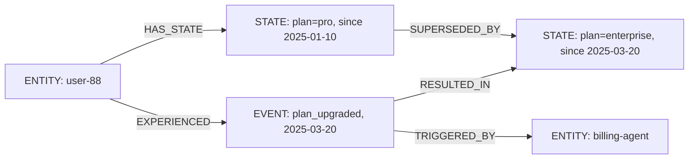

import Tabs from '@site/src/components/LanguageTabs'
import TabItem from '@theme/TabItem'

# Temporal Graphs: Modeling State and Event Time Together

Most business questions have two modes:

- **Current state**: what is a customer's plan right now?
- **History**: what changed, when, and what caused it?

A flat record answers the first question. It cannot answer the second — a single `PATCH` replaces what was there before and leaves no trace.

A temporal graph models both. The entity holds its current state. Events describe each change, when it happened, and what triggered it. Relationships between entities and events let you answer both questions with the same query engine.

---

## The pattern



- `STATE` nodes carry the actual field values with a `since` timestamp
- `EVENT` nodes record what happened and when, without storing the full state
- The `SUPERSEDED_BY` chain lets you reconstruct history at any point in time

---

## Step 1: Create the entity with initial state

<Tabs groupId="programming-language">
<TabItem value="typescript" label="TypeScript">

```typescript
import RushDB from '@rushdb/javascript-sdk'

const db = new RushDB('RUSHDB_API_KEY')

// Create the entity
const user = await db.records.create({
  label: 'ENTITY',
  data: {
    entityId: 'user-88',
    type: 'customer',
    name: 'Priya Kapoor',
    email: 'priya@example.com'
  }
})

// Create initial state node
const state1 = await db.records.create({
  label: 'STATE',
  data: {
    plan: 'pro',
    monthlyLimit: 50000,
    since: '2025-01-10T00:00:00Z',
    isCurrent: true
  }
})

await db.records.attach({
  source: user,
  target: state1,
  options: { type: 'HAS_STATE' }
})
```

</TabItem>
<TabItem value="python" label="Python">

```python
from rushdb import RushDB

db = RushDB("RUSHDB_API_KEY", base_url="https://api.rushdb.com/api/v1")

user = db.records.create("ENTITY", {
    "entityId": "user-88",
    "type": "customer",
    "name": "Priya Kapoor",
    "email": "priya@example.com"
})

state1 = db.records.create("STATE", {
    "plan": "pro",
    "monthlyLimit": 50000,
    "since": "2025-01-10T00:00:00Z",
    "isCurrent": True
})

db.records.attach(user.id, state1.id, {"type": "HAS_STATE"})
```

</TabItem>
<TabItem value="shell" label="Shell">

```bash
BASE="https://api.rushdb.com/api/v1"
TOKEN="RUSHDB_API_KEY"
H='Content-Type: application/json'

USER_ID=$(curl -s -X POST "$BASE/records" -H "$H" -H "Authorization: Bearer $TOKEN" \
  -d '{"label":"ENTITY","data":{"entityId":"user-88","type":"customer","name":"Priya Kapoor"}}' \
  | jq -r '.data.__id')

STATE1_ID=$(curl -s -X POST "$BASE/records" -H "$H" -H "Authorization: Bearer $TOKEN" \
  -d '{"label":"STATE","data":{"plan":"pro","monthlyLimit":50000,"since":"2025-01-10T00:00:00Z","isCurrent":true}}' \
  | jq -r '.data.__id')

curl -s -X POST "$BASE/records/$USER_ID/relations" -H "$H" -H "Authorization: Bearer $TOKEN" \
  -d "{\"targets\":[\"$STATE1_ID\"],\"options\":{\"type\":\"HAS_STATE\"}}"
```

</TabItem>
</Tabs>

---

## Step 2: Record a state change as an event

Use a transaction to atomically create the new state and the event, then update the old state in the same operation.

<Tabs groupId="programming-language">
<TabItem value="typescript" label="TypeScript">

```typescript
import { Transaction } from '@rushdb/javascript-sdk'

const tx = await db.tx.begin()

try {
  // Mark old state as no longer current
  await db.records.update(state1.__id, { isCurrent: false }, tx)

  // Create new state node
  const state2 = await db.records.create(
    {
      label: 'STATE',
      data: {
        plan: 'enterprise',
        monthlyLimit: 500000,
        since: '2025-03-20T14:00:00Z',
        isCurrent: true
      }
    },
    tx
  )

  // Create the event
  const event1 = await db.records.create(
    {
      label: 'EVENT',
      data: {
        type: 'plan_upgraded',
        occurredAt: '2025-03-20T14:00:00Z',
        previousPlan: 'pro',
        newPlan: 'enterprise',
        triggeredBy: 'billing-agent'
      }
    },
    tx
  )

  await Promise.all([
    // Chain old state to new state
    db.records.attach({ source: state1, target: state2, options: { type: 'SUPERSEDED_BY' } }, tx),
    // Link entity to new state
    db.records.attach({ source: user, target: state2, options: { type: 'HAS_STATE' } }, tx),
    // Link entity to event
    db.records.attach({ source: user, target: event1, options: { type: 'EXPERIENCED' } }, tx),
    // Link event to resulting state
    db.records.attach({ source: event1, target: state2, options: { type: 'RESULTED_IN' } }, tx)
  ])

  await db.tx.commit(tx)
} catch (err) {
  await db.tx.rollback(tx)
  throw err
}
```

</TabItem>
<TabItem value="python" label="Python">

```python
tx = db.tx.begin()

try:
    # Mark old state
    db.records.update(state1.id, {"isCurrent": False}, tx)

    # New state
    state2 = db.records.create("STATE", {
        "plan": "enterprise",
        "monthlyLimit": 500000,
        "since": "2025-03-20T14:00:00Z",
        "isCurrent": True
    }, transaction=tx)

    # Event
    event1 = db.records.create("EVENT", {
        "type": "plan_upgraded",
        "occurredAt": "2025-03-20T14:00:00Z",
        "previousPlan": "pro",
        "newPlan": "enterprise",
        "triggeredBy": "billing-agent"
    }, transaction=tx)

    db.records.attach(state1.id, state2.id, {"type": "SUPERSEDED_BY"}, transaction=tx)
    db.records.attach(user.id, state2.id, {"type": "HAS_STATE"}, transaction=tx)
    db.records.attach(user.id, event1.id, {"type": "EXPERIENCED"}, transaction=tx)
    db.records.attach(event1.id, state2.id, {"type": "RESULTED_IN"}, transaction=tx)

    db.tx.commit(tx)
except Exception:
    db.tx.rollback(tx)
    raise
```

</TabItem>
<TabItem value="shell" label="Shell">

```bash
# Begin transaction
TX_ID=$(curl -s -X POST "$BASE/tx" \
  -H "$H" -H "Authorization: Bearer $TOKEN" | jq -r '.data.id')

# Mark old state not current
curl -s -X PATCH "$BASE/records/$STATE1_ID" \
  -H "$H" -H "Authorization: Bearer $TOKEN" \
  -H "x-transaction-id: $TX_ID" \
  -d '{"isCurrent":false}'

# Create new state in transaction
STATE2_ID=$(curl -s -X POST "$BASE/records" \
  -H "$H" -H "Authorization: Bearer $TOKEN" \
  -H "x-transaction-id: $TX_ID" \
  -d '{"label":"STATE","data":{"plan":"enterprise","monthlyLimit":500000,"since":"2025-03-20T14:00:00Z","isCurrent":true}}' \
  | jq -r '.data.__id')

# Create event in transaction
EVENT_ID=$(curl -s -X POST "$BASE/records" \
  -H "$H" -H "Authorization: Bearer $TOKEN" \
  -H "x-transaction-id: $TX_ID" \
  -d '{"label":"EVENT","data":{"type":"plan_upgraded","occurredAt":"2025-03-20T14:00:00Z","newPlan":"enterprise"}}' \
  | jq -r '.data.__id')

# Chain relationships
curl -s -X POST "$BASE/records/$STATE1_ID/relations" \
  -H "$H" -H "Authorization: Bearer $TOKEN" \
  -H "x-transaction-id: $TX_ID" \
  -d "{\"targets\":[\"$STATE2_ID\"],\"options\":{\"type\":\"SUPERSEDED_BY\"}}"

# Commit
curl -s -X POST "$BASE/tx/$TX_ID/commit" \
  -H "Authorization: Bearer $TOKEN"
```

</TabItem>
</Tabs>

---

## Step 3: Query current state

<Tabs groupId="programming-language">
<TabItem value="typescript" label="TypeScript">

```typescript
const currentState = await db.records.find({
  labels: ['STATE'],
  where: {
    isCurrent: true,
    ENTITY: {
      $relation: { type: 'HAS_STATE', direction: 'in' },
      entityId: 'user-88'
    }
  },
  limit: 1
})
```

</TabItem>
<TabItem value="python" label="Python">

```python
current_state = db.records.find({
    "labels": ["STATE"],
    "where": {
        "isCurrent": True,
        "ENTITY": {
            "$relation": {"type": "HAS_STATE", "direction": "in"},
            "entityId": "user-88"
        }
    },
    "limit": 1
})
```

</TabItem>
<TabItem value="shell" label="Shell">

```bash
curl -s -X POST "$BASE/records/search" \
  -H "$H" -H "Authorization: Bearer $TOKEN" \
  -d '{
    "labels": ["STATE"],
    "where": {
      "isCurrent": true,
      "ENTITY": {
        "$relation": {"type": "HAS_STATE", "direction": "in"},
        "entityId": "user-88"
      }
    },
    "limit": 1
  }'
```

</TabItem>
</Tabs>

---

## Step 4: Query full event history for an entity

<Tabs groupId="programming-language">
<TabItem value="typescript" label="TypeScript">

```typescript
const history = await db.records.find({
  labels: ['EVENT'],
  where: {
    ENTITY: {
      $relation: { type: 'EXPERIENCED', direction: 'in' },
      entityId: 'user-88'
    }
  },
  orderBy: { occurredAt: 'asc' }
})
```

</TabItem>
<TabItem value="python" label="Python">

```python
history = db.records.find({
    "labels": ["EVENT"],
    "where": {
        "ENTITY": {
            "$relation": {"type": "EXPERIENCED", "direction": "in"},
            "entityId": "user-88"
        }
    },
    "orderBy": {"occurredAt": "asc"}
})
```

</TabItem>
<TabItem value="shell" label="Shell">

```bash
curl -s -X POST "$BASE/records/search" \
  -H "$H" -H "Authorization: Bearer $TOKEN" \
  -d '{
    "labels": ["EVENT"],
    "where": {
      "ENTITY": {
        "$relation": {"type": "EXPERIENCED", "direction": "in"},
        "entityId": "user-88"
      }
    },
    "orderBy": {"occurredAt": "asc"}
  }'
```

</TabItem>
</Tabs>

---

## Step 5: Reconstruct state at a point in time

Find the state that was current on a given date by checking which state node was created before that date and had not yet been superseded (or has no `SUPERSEDED_BY` link).

<Tabs groupId="programming-language">
<TabItem value="typescript" label="TypeScript">

```typescript
// What was user-88's state on 2025-02-15?
const stateOnDate = await db.records.find({
  labels: ['STATE'],
  where: {
    since: {
      $lte: { $year: 2025, $month: 2, $day: 15 }
    },
    ENTITY: {
      $relation: { type: 'HAS_STATE', direction: 'in' },
      entityId: 'user-88'
    }
  },
  orderBy: { since: 'desc' },
  limit: 1
})
// Returns the state that was active as of Feb 15 (the most recent one before that date)
```

</TabItem>
<TabItem value="python" label="Python">

```python
state_on_date = db.records.find({
    "labels": ["STATE"],
    "where": {
        "since": {"$lte": {"$year": 2025, "$month": 2, "$day": 15}},
        "ENTITY": {
            "$relation": {"type": "HAS_STATE", "direction": "in"},
            "entityId": "user-88"
        }
    },
    "orderBy": {"since": "desc"},
    "limit": 1
})
```

</TabItem>
<TabItem value="shell" label="Shell">

```bash
curl -s -X POST "$BASE/records/search" \
  -H "$H" -H "Authorization: Bearer $TOKEN" \
  -d '{
    "labels": ["STATE"],
    "where": {
      "since": {"$lte": {"$year": 2025, "$month": 2, "$day": 15}},
      "ENTITY": {
        "$relation": {"type": "HAS_STATE", "direction": "in"},
        "entityId": "user-88"
      }
    },
    "orderBy": {"since": "desc"},
    "limit": 1
  }'
```

</TabItem>
</Tabs>

---

## Step 6: Compute event metrics by type over a time window

<Tabs groupId="programming-language">
<TabItem value="typescript" label="TypeScript">

```typescript
const upgrades = await db.records.find({
  labels: ['EVENT'],
  where: {
    type: 'plan_upgraded',
    occurredAt: {
      $gte: { $year: 2025, $month: 1, $day: 1 },
      $lt: { $year: 2026, $month: 1, $day: 1 }
    }
  },
  select: {
    eventCount: { $count: '*' },
    firstUpgrade: { $min: '$record.occurredAt' },
    lastUpgrade: { $max: '$record.occurredAt' }
  },
  groupBy: ['eventCount', 'firstUpgrade', 'lastUpgrade']
})
```

</TabItem>
<TabItem value="python" label="Python">

```python
upgrades = db.records.find({
    "labels": ["EVENT"],
    "where": {
        "type": "plan_upgraded",
        "occurredAt": {
            "$gte": {"$year": 2025, "$month": 1, "$day": 1},
            "$lt": {"$year": 2026, "$month": 1, "$day": 1}
        }
    },
    "select": {
        "eventCount":   {"$count": "*"},
        "firstUpgrade": {"$min": "$record.occurredAt"},
        "lastUpgrade":  {"$max": "$record.occurredAt"}
    },
    "groupBy": ["eventCount", "firstUpgrade", "lastUpgrade"]
})
```

</TabItem>
<TabItem value="shell" label="Shell">

```bash
curl -s -X POST "$BASE/records/search" \
  -H "$H" -H "Authorization: Bearer $TOKEN" \
  -d '{
    "labels": ["EVENT"],
    "where": {
      "type": "plan_upgraded",
      "occurredAt": {
        "$gte": {"$year": 2025, "$month": 1, "$day": 1},
        "$lt": {"$year": 2026, "$month": 1, "$day": 1}
      }
    },
    "select": {
      "eventCount": {"$count": "*"}
    },
    "groupBy": ["eventCount"]
  }'
```

</TabItem>
</Tabs>

---

## When to use this pattern vs. simple field updates

| Scenario                                       | Approach                                      |
| ---------------------------------------------- | --------------------------------------------- |
| Only current state matters                     | Update the field in-place with `PATCH`        |
| You need to know what changed and when         | Temporal graph with EVENT nodes               |
| You need to reconstruct state at any past date | STATE chain with `since` and `isCurrent`      |
| Compliance requires immutable audit trail      | Append-only STATE + EVENT nodes; never delete |

---

## Production caveat

State and event chains grow indefinitely. Set a retention horizon: archive or delete `STATE` nodes where `isCurrent = false` and `since` is older than your compliance window. Use `db.records.delete` with a `where` filter for bulk archival. Keep at least one historical `STATE` per entity per quarter if you need YoY comparisons.

---

## Next steps

- [Audit Trails with Immutable Events and Derived State](/tutorials/audit-trails) — extending this pattern for compliance use cases
- [RushDB as a Memory Layer](/tutorials/memory-layer) — using the same FACT/EPISODE pattern for agent memory
- [SearchQuery Deep Dive](/tutorials/searchquery-advanced-patterns) — date filter syntax and aggregation patterns
