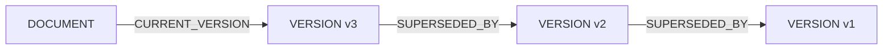

import Tabs from '@site/src/components/LanguageTabs'
import TabItem from '@theme/TabItem'

# Versioning Records Without Losing Queryability

Any mutable record in your system has a versioning question: what do you do when it changes and you still need to answer questions about the past?

Three approaches work in RushDB:

1. **In-place mutation** — update the record; accept that history is lost
2. **Append-only versions** — create a new VERSION record on every change; link with `CURRENT_VERSION` and `PREVIOUS_VERSION`
3. **Hybrid** — in-place mutation for queryable mutable state plus an append-only EVENT log for history

This tutorial shows all three and explains when to use each.

---

## Approach 1: In-place mutation (PATCH)

`db.records.update` sends a `PATCH` — it merges your new fields over the existing record. This is the simplest approach and the one to default to when history is not required.

<Tabs groupId="programming-language">
<TabItem value="typescript" label="TypeScript">

```typescript
import RushDB from '@rushdb/javascript-sdk'

const db = new RushDB(process.env.RUSHDB_API_KEY!)

// Create a document
const doc = await db.records.create({
  label: 'DOCUMENT',
  data: {
    title: 'System Design Guide',
    body: 'Initial draft content.',
    version: 1,
    updatedAt: new Date().toISOString()
  }
})

// Update in place — history is overwritten
await db.records.update(doc.__id, {
  body: 'Revised content with better examples.',
  version: 2,
  updatedAt: new Date().toISOString()
})

// Full replace — use set() for PUT semantics
await db.records.set(doc.__id, {
  title: 'System Design Guide v2',
  body: 'Complete rewrite.',
  version: 3,
  updatedAt: new Date().toISOString()
})
```

</TabItem>
<TabItem value="python" label="Python">

```python
from rushdb import RushDB
import os
from datetime import datetime, timezone

db = RushDB(os.environ["RUSHDB_API_KEY"], base_url="https://api.rushdb.com/api/v1")

doc = db.records.create("DOCUMENT", {
    "title": "System Design Guide",
    "body": "Initial draft content.",
    "version": 1,
    "updatedAt": datetime.now(timezone.utc).isoformat()
})

# Partial update (PATCH)
db.records.update(doc.id, {
    "body": "Revised content with better examples.",
    "version": 2,
    "updatedAt": datetime.now(timezone.utc).isoformat()
})

# Full replace (PUT)
db.records.set(doc.id, {
    "title": "System Design Guide v2",
    "body": "Complete rewrite.",
    "version": 3,
    "updatedAt": datetime.now(timezone.utc).isoformat()
})
```

</TabItem>
<TabItem value="shell" label="Shell">

```bash
BASE="https://api.rushdb.com/api/v1"
TOKEN="RUSHDB_API_KEY"
H='Content-Type: application/json'

DOC_ID=$(curl -s -X POST "$BASE/records" \
  -H "$H" -H "Authorization: Bearer $TOKEN" \
  -d '{"label":"DOCUMENT","data":{"title":"System Design Guide","body":"Initial draft.","version":1}}' \
  | jq -r '.data.__id')

# Partial update (PATCH)
curl -s -X PATCH "$BASE/records/$DOC_ID" \
  -H "$H" -H "Authorization: Bearer $TOKEN" \
  -d '{"body":"Revised content.","version":2}'

# Full set (PUT)
curl -s -X PUT "$BASE/records/$DOC_ID" \
  -H "$H" -H "Authorization: Bearer $TOKEN" \
  -d '{"title":"System Design Guide v2","body":"Complete rewrite.","version":3}'
```

</TabItem>
</Tabs>

**When to use:** simple records with no history requirement — settings, profiles, catalog items.

---

## Approach 2: Append-only versions (VERSION chain)

Every change creates a new VERSION record. A `CURRENT_VERSION` edge from the root DOCUMENT always points to the latest version. `SUPERSEDED_BY` links the chain.



<Tabs groupId="programming-language">
<TabItem value="typescript" label="TypeScript">

```typescript
async function createDocumentWithVersion(title: string, body: string, authorId: string) {
  const tx = await db.tx.begin()
  try {
    const doc = await db.records.create({ label: 'DOCUMENT', data: { title, authorId } }, tx)

    const v1 = await db.records.create(
      {
        label: 'VERSION',
        data: {
          versionNumber: 1,
          body,
          authorId,
          createdAt: new Date().toISOString(),
          isCurrent: true
        }
      },
      tx
    )

    await db.records.attach(
      { source: doc, target: v1, options: { type: 'CURRENT_VERSION', direction: 'out' } },
      tx
    )

    await db.tx.commit(tx)
    return { doc, version: v1 }
  } catch (err) {
    await db.tx.rollback(tx)
    throw err
  }
}

async function addVersion(docId: string, newBody: string, authorId: string) {
  // Get current version
  const currentResult = await db.records.find({
    labels: ['VERSION'],
    where: {
      DOCUMENT: {
        $relation: { type: 'CURRENT_VERSION', direction: 'in' },
        __id: docId
      },
      isCurrent: true
    }
  })
  const current = currentResult.data[0]

  const tx = await db.tx.begin()
  try {
    // Demote old current
    await db.records.update(current.__id, { isCurrent: false }, tx)

    // Create new version
    const docResult = await db.records.find({ labels: ['DOCUMENT'], where: { __id: docId } })
    const newVersion = await db.records.create(
      {
        label: 'VERSION',
        data: {
          versionNumber: (current.versionNumber as number) + 1,
          body: newBody,
          authorId,
          createdAt: new Date().toISOString(),
          isCurrent: true
        }
      },
      tx
    )

    // Move CURRENT_VERSION edge
    await db.records.detach(
      {
        source: docResult.data[0],
        target: current,
        options: { type: 'CURRENT_VERSION' }
      },
      tx
    )
    await db.records.attach(
      {
        source: docResult.data[0],
        target: newVersion,
        options: { type: 'CURRENT_VERSION', direction: 'out' }
      },
      tx
    )

    // Chain to previous
    await db.records.attach(
      { source: newVersion, target: current, options: { type: 'SUPERSEDED_BY', direction: 'out' } },
      tx
    )

    await db.tx.commit(tx)
    return newVersion
  } catch (err) {
    await db.tx.rollback(tx)
    throw err
  }
}

const { doc } = await createDocumentWithVersion('Architecture Overview', 'First draft.', 'user-5')

const v2 = await addVersion(doc.__id, 'Improved with diagrams.', 'user-5')
```

</TabItem>
<TabItem value="python" label="Python">

```python
def create_document_with_version(title: str, body: str, author_id: str):
    tx = db.tx.begin()
    try:
        doc = db.records.create("DOCUMENT", {"title": title, "authorId": author_id}, transaction=tx)
        v1 = db.records.create("VERSION", {
            "versionNumber": 1,
            "body": body,
            "authorId": author_id,
            "createdAt": datetime.now(timezone.utc).isoformat(),
            "isCurrent": True
        }, transaction=tx)
        db.records.attach(doc.id, v1.id, {"type": "CURRENT_VERSION", "direction": "out"}, transaction=tx)
        db.tx.commit(tx)
        return doc, v1
    except Exception:
        db.tx.rollback(tx)
        raise


def add_version(doc_id: str, new_body: str, author_id: str):
    current_result = db.records.find({
        "labels": ["VERSION"],
        "where": {
            "DOCUMENT": {
                "$relation": {"type": "CURRENT_VERSION", "direction": "in"},
                "__id": doc_id
            },
            "isCurrent": True
        }
    })
    current = current_result.data[0]

    tx = db.tx.begin()
    try:
        db.records.update(current.id, {"isCurrent": False}, transaction=tx)
        new_version = db.records.create("VERSION", {
            "versionNumber": current.data["versionNumber"] + 1,
            "body": new_body,
            "authorId": author_id,
            "createdAt": datetime.now(timezone.utc).isoformat(),
            "isCurrent": True
        }, transaction=tx)

        doc_result = db.records.find({"labels": ["DOCUMENT"], "where": {"__id": doc_id}})
        db.records.detach(doc_result.data[0].id, current.id, {"type": "CURRENT_VERSION"}, transaction=tx)
        db.records.attach(doc_result.data[0].id, new_version.id, {"type": "CURRENT_VERSION", "direction": "out"}, transaction=tx)
        db.records.attach(new_version.id, current.id, {"type": "SUPERSEDED_BY", "direction": "out"}, transaction=tx)

        db.tx.commit(tx)
        return new_version
    except Exception:
        db.tx.rollback(tx)
        raise
```

</TabItem>
<TabItem value="shell" label="Shell">

```bash
# Query current version of a document
curl -s -X POST "$BASE/records/search" \
  -H "$H" -H "Authorization: Bearer $TOKEN" \
  -d "{
    \"labels\": [\"VERSION\"],
    \"where\": {
      \"DOCUMENT\": {
        \"\$relation\": {\"type\": \"CURRENT_VERSION\", \"direction\": \"in\"},
        \"__id\": \"$DOC_ID\"
      },
      \"isCurrent\": true
    }
  }"

# Query full version history (ordered by version number)
curl -s -X POST "$BASE/records/search" \
  -H "$H" -H "Authorization: Bearer $TOKEN" \
  -d "{
    \"labels\": [\"VERSION\"],
    \"where\": {
      \"DOCUMENT\": {
        \"\$relation\": {\"type\": \"CURRENT_VERSION\", \"direction\": \"in\"},
        \"__id\": \"$DOC_ID\"
      }
    },
    \"orderBy\": {\"versionNumber\": \"desc\"}
  }"
```

</TabItem>
</Tabs>

**When to use:** documents, configurations, contracts, or any record where historical content must be retrievable and comparable.

---

## Approach 3: Hybrid (mutable state + immutable events)

Keep the entity's current state queryable in one record while logging all changes as immutable EVENT records. This is the pattern from [Audit Trails](/tutorials/audit-trails) and [Temporal Graphs](/tutorials/temporal-graphs). Choose this when:

- You need efficient current-state queries (no traversal to find latest version)
- You need a history log (who changed what, when)
- You do not need to serve the full historical content on demand

---

## Choosing the right approach

| Requirement                                   | Best approach                               |
| --------------------------------------------- | ------------------------------------------- |
| No history needed                             | In-place mutation (PATCH/PUT)               |
| Full historical content retrieval             | Append-only VERSION chain                   |
| Audit log only (who / when / what changed)    | Hybrid: mutable state + EVENT log           |
| Point-in-time query (what was the state at T) | Append-only VERSION or Temporal STATE chain |
| High write throughput                         | In-place mutation                           |

---

## Production caveat

Append-only VERSION chains grow linearly with edit frequency. If documents are edited frequently (wiki-style), consider capping the chain at N versions and archiving older ones to a separate project or record-level storage. Always benchmark query performance against version count: traversals over a 500-version chain behave differently than traversals over a 10-version chain.

---

## Next steps

- [Audit Trails](/tutorials/audit-trails) — immutable event log alongside mutable state
- [Temporal Graphs](/tutorials/temporal-graphs) — point-in-time reconstruction
- [Compliance and Retention Patterns](/tutorials/compliance-retention) — archival and deletion
