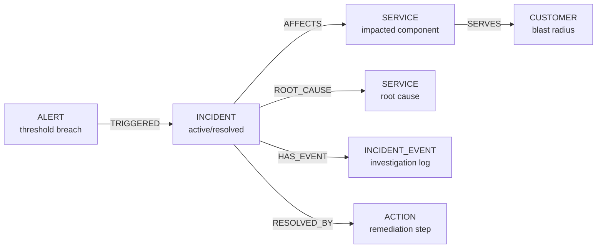

import Tabs from '@site/src/components/LanguageTabs'
import TabItem from '@theme/TabItem'

# Incident Response Graphs

When something breaks in production, you need to answer four questions quickly:

1. **What is failing?** — which services and components are affected
2. **Why?** — the root cause and the causal chain to the symptom
3. **Who is affected?** — impacted customers or downstream systems
4. **What happened during the response?** — the investigation and resolution timeline

A flat alert table can answer the first question. It cannot answer the rest. A graph can answer all four from a single traversal.

---

## Graph shape



| Label            | What it represents                                               |
| ---------------- | ---------------------------------------------------------------- |
| `ALERT`          | A threshold breach or anomaly detection signal                   |
| `INCIDENT`       | The declared incident record — owns status, severity, timestamps |
| `SERVICE`        | A component in your infrastructure or application graph          |
| `INCIDENT_EVENT` | An ordered entry in the investigation timeline                   |
| `ACTION`         | A remediation step taken to resolve the incident                 |
| `CUSTOMER`       | An end-user or tenant affected by the incident                   |

---

## Step 1: Declare an incident from an alert

When an alert fires, create an INCIDENT record and link it to the alert and all known affected services in a single transaction.

<Tabs groupId="programming-language">
<TabItem value="typescript" label="TypeScript">

```typescript
import RushDB from '@rushdb/javascript-sdk'

const db = new RushDB(process.env.RUSHDB_API_KEY!)

async function declareIncident({
  alertId,
  affectedServiceIds,
  severity,
  summary,
  ownerId
}: {
  alertId: string
  affectedServiceIds: string[]
  severity: 'P1' | 'P2' | 'P3'
  summary: string
  ownerId: string
}) {
  const tx = await db.tx.begin()
  try {
    const incident = await db.records.create(
      {
        label: 'INCIDENT',
        data: {
          summary,
          severity,
          status: 'active',
          ownerId,
          declaredAt: new Date().toISOString(),
          resolvedAt: null,
          rootCauseId: null
        }
      },
      tx
    )

    // Link to the triggering alert
    await db.records.attach(
      {
        source: { __id: alertId, __label: 'ALERT' },
        target: incident,
        options: { type: 'TRIGGERED', direction: 'out' }
      },
      tx
    )

    // Link to all affected services
    for (const serviceId of affectedServiceIds) {
      await db.records.attach(
        {
          source: incident,
          target: { __id: serviceId, __label: 'SERVICE' },
          options: { type: 'AFFECTS', direction: 'out' }
        },
        tx
      )
    }

    // Log the opening event
    const openEvent = await db.records.create(
      {
        label: 'INCIDENT_EVENT',
        data: {
          type: 'declared',
          note: `Incident declared. Severity: ${severity}. Owner: ${ownerId}`,
          actorId: ownerId,
          occurredAt: new Date().toISOString()
        }
      },
      tx
    )
    await db.records.attach(
      {
        source: incident,
        target: openEvent,
        options: { type: 'HAS_EVENT', direction: 'out' }
      },
      tx
    )

    await db.tx.commit(tx)
    console.log(`Incident ${incident.id} declared (${severity})`)
    return incident
  } catch (err) {
    await db.tx.rollback(tx)
    throw err
  }
}

const incident = await declareIncident({
  alertId: 'alert-9f3a',
  affectedServiceIds: ['svc-api-gateway', 'svc-checkout'],
  severity: 'P1',
  summary: 'Checkout service returning 503s — payment flow unavailable',
  ownerId: 'oncall-eng-007'
})
```

</TabItem>
<TabItem value="python" label="Python">

```python
import os
from datetime import datetime, timezone
from rushdb import RushDB

db = RushDB(os.environ["RUSHDB_API_KEY"], base_url="https://api.rushdb.com/api/v1")


def declare_incident(
    alert_id: str,
    affected_service_ids: list[str],
    severity: str,
    summary: str,
    owner_id: str
):
    tx = db.tx.begin()
    try:
        incident = db.records.create("INCIDENT", {
            "summary": summary,
            "severity": severity,
            "status": "active",
            "ownerId": owner_id,
            "declaredAt": datetime.now(timezone.utc).isoformat(),
            "resolvedAt": None,
            "rootCauseId": None
        }, transaction=tx)

        db.records.attach(alert_id, incident.id, {"type": "TRIGGERED", "direction": "out"}, transaction=tx)

        for service_id in affected_service_ids:
            db.records.attach(incident.id, service_id, {"type": "AFFECTS", "direction": "out"}, transaction=tx)

        open_event = db.records.create("INCIDENT_EVENT", {
            "type": "declared",
            "note": f"Incident declared. Severity: {severity}. Owner: {owner_id}",
            "actorId": owner_id,
            "occurredAt": datetime.now(timezone.utc).isoformat()
        }, transaction=tx)
        db.records.attach(incident.id, open_event.id, {"type": "HAS_EVENT", "direction": "out"}, transaction=tx)

        db.tx.commit(tx)
        print(f"Incident {incident.id} declared ({severity})")
        return incident
    except Exception:
        db.tx.rollback(tx)
        raise


incident = declare_incident(
    alert_id="alert-9f3a",
    affected_service_ids=["svc-api-gateway", "svc-checkout"],
    severity="P1",
    summary="Checkout service returning 503s — payment flow unavailable",
    owner_id="oncall-eng-007"
)
```

</TabItem>
<TabItem value="shell" label="Shell">

```bash
BASE="https://api.rushdb.com/api/v1"
TOKEN="RUSHDB_API_KEY"
H='Content-Type: application/json'

TX_ID=$(curl -s -X POST "$BASE/tx" -H "$H" -H "Authorization: Bearer $TOKEN" | jq -r '.data.id')

INC_RESP=$(curl -s -X POST "$BASE/records" \
  -H "$H" -H "Authorization: Bearer $TOKEN" -H "x-transaction-id: $TX_ID" \
  -d "{
    \"label\": \"INCIDENT\",
    \"data\": {
      \"summary\": \"Checkout 503s\",
      \"severity\": \"P1\",
      \"status\": \"active\",
      \"ownerId\": \"oncall-eng-007\",
      \"declaredAt\": \"$(date -u +%Y-%m-%dT%H:%M:%SZ)\"
    }
  }")
INC_ID=$(echo "$INC_RESP" | jq -r '.data.__id')

# Link alert
curl -s -X POST "$BASE/records/$ALERT_ID/relations" \
  -H "$H" -H "Authorization: Bearer $TOKEN" -H "x-transaction-id: $TX_ID" \
  -d "{\"targets\":[\"$INC_ID\"],\"options\":{\"type\":\"TRIGGERED\",\"direction\":\"out\"}}"

curl -s -X POST "$BASE/tx/$TX_ID/commit" -H "$H" -H "Authorization: Bearer $TOKEN"
```

</TabItem>
</Tabs>

---

## Step 2: Record the investigation timeline

As the incident evolves, append INCIDENT_EVENT records for every significant update — hypothesis formed, action taken, escalation. This creates an ordered, queryable timeline.

<Tabs groupId="programming-language">
<TabItem value="typescript" label="TypeScript">

```typescript
async function logIncidentEvent(incidentId: string, type: string, note: string, actorId: string) {
  const tx = await db.tx.begin()
  try {
    const event = await db.records.create(
      {
        label: 'INCIDENT_EVENT',
        data: {
          type,
          note,
          actorId,
          occurredAt: new Date().toISOString()
        }
      },
      tx
    )

    await db.records.attach(
      {
        source: { __id: incidentId, __label: 'INCIDENT' },
        target: event,
        options: { type: 'HAS_EVENT', direction: 'out' }
      },
      tx
    )

    await db.tx.commit(tx)
    return event
  } catch (err) {
    await db.tx.rollback(tx)
    throw err
  }
}

await logIncidentEvent(
  incident.id,
  'hypothesis',
  'Suspect database connection pool exhaustion on checkout-db',
  'oncall-eng-007'
)
await logIncidentEvent(
  incident.id,
  'action_taken',
  'Increased connection pool limit from 50 to 200 and restarted checkout service',
  'oncall-eng-007'
)
await logIncidentEvent(
  incident.id,
  'escalation',
  'Escalated to DBA team for root cause confirmation',
  'oncall-eng-007'
)
```

</TabItem>
<TabItem value="python" label="Python">

```python
def log_incident_event(incident_id: str, event_type: str, note: str, actor_id: str):
    tx = db.tx.begin()
    try:
        event = db.records.create("INCIDENT_EVENT", {
            "type": event_type,
            "note": note,
            "actorId": actor_id,
            "occurredAt": datetime.now(timezone.utc).isoformat()
        }, transaction=tx)
        db.records.attach(incident_id, event.id, {"type": "HAS_EVENT", "direction": "out"}, transaction=tx)
        db.tx.commit(tx)
        return event
    except Exception:
        db.tx.rollback(tx)
        raise


log_incident_event(incident.id, "hypothesis", "Suspect database connection pool exhaustion on checkout-db", "oncall-eng-007")
log_incident_event(incident.id, "action_taken", "Increased connection pool limit and restarted checkout service", "oncall-eng-007")
log_incident_event(incident.id, "escalation", "Escalated to DBA team for root cause confirmation", "oncall-eng-007")
```

</TabItem>
<TabItem value="shell" label="Shell">

```bash
TX_ID=$(curl -s -X POST "$BASE/tx" -H "$H" -H "Authorization: Bearer $TOKEN" | jq -r '.data.id')

EVENT_ID=$(curl -s -X POST "$BASE/records" \
  -H "$H" -H "Authorization: Bearer $TOKEN" -H "x-transaction-id: $TX_ID" \
  -d "{
    \"label\": \"INCIDENT_EVENT\",
    \"data\": {
      \"type\": \"hypothesis\",
      \"note\": \"Suspect DB connection pool exhaustion\",
      \"actorId\": \"oncall-eng-007\",
      \"occurredAt\": \"$(date -u +%Y-%m-%dT%H:%M:%SZ)\"
    }
  }" | jq -r '.data.__id')

curl -s -X POST "$BASE/records/$INC_ID/relations" \
  -H "$H" -H "Authorization: Bearer $TOKEN" -H "x-transaction-id: $TX_ID" \
  -d "{\"targets\":[\"$EVENT_ID\"],\"options\":{\"type\":\"HAS_EVENT\",\"direction\":\"out\"}}"

curl -s -X POST "$BASE/tx/$TX_ID/commit" -H "$H" -H "Authorization: Bearer $TOKEN"
```

</TabItem>
</Tabs>

---

## Step 3: Identify root cause and measure blast radius

Mark the root cause service and traverse the graph to find which customers are downstream of the affected services.

<Tabs groupId="programming-language">
<TabItem value="typescript" label="TypeScript">

```typescript
// Mark root cause
async function setRootCause(incidentId: string, rootCauseServiceId: string, note: string, actorId: string) {
  const tx = await db.tx.begin()
  try {
    await db.records.update(incidentId, { rootCauseId: rootCauseServiceId }, tx)

    await db.records.attach(
      {
        source: { __id: incidentId, __label: 'INCIDENT' },
        target: { __id: rootCauseServiceId, __label: 'SERVICE' },
        options: { type: 'ROOT_CAUSE', direction: 'out' }
      },
      tx
    )

    await db.tx.commit(tx)
    await logIncidentEvent(incidentId, 'root_cause_identified', note, actorId)
  } catch (err) {
    await db.tx.rollback(tx)
    throw err
  }
}

await setRootCause(
  incident.id,
  'svc-checkout-db',
  'Root cause confirmed: connection pool exhaustion on checkout-db due to slow query backlog',
  'dba-lead'
)

// Blast radius: customers served by any affected service
const blastRadius = await db.records.find({
  labels: ['CUSTOMER'],
  where: {
    SERVICE: {
      $relation: { type: 'SERVES', direction: 'in' },
      INCIDENT: {
        $relation: { type: 'AFFECTS', direction: 'in' },
        $id: incident.id
      }
    }
  },
  select: { count: { $count: '*' } }
})

console.log(`Blast radius: ${blastRadius.data[0]?.count ?? 0} customers affected`)
```

</TabItem>
<TabItem value="python" label="Python">

```python
def set_root_cause(incident_id: str, root_cause_service_id: str, note: str, actor_id: str):
    tx = db.tx.begin()
    try:
        db.records.update(incident_id, {"rootCauseId": root_cause_service_id}, transaction=tx)
        db.records.attach(
            incident_id, root_cause_service_id,
            {"type": "ROOT_CAUSE", "direction": "out"},
            transaction=tx
        )
        db.tx.commit(tx)
        log_incident_event(incident_id, "root_cause_identified", note, actor_id)
    except Exception:
        db.tx.rollback(tx)
        raise


set_root_cause(
    incident.id,
    "svc-checkout-db",
    "Root cause: connection pool exhaustion on checkout-db due to slow query backlog",
    "dba-lead"
)

# Blast radius
blast_radius = db.records.find({
    "labels": ["CUSTOMER"],
    "where": {
        "SERVICE": {
            "$relation": {"type": "SERVES", "direction": "in"},
            "INCIDENT": {
                "$relation": {"type": "AFFECTS", "direction": "in"},
                "$id": incident.id
            }
        }
    },
    "select": {"count": {"$count": "*"}}
})

print(f"Blast radius: {blast_radius.data[0].data.get('count', 0)} customers affected")
```

</TabItem>
<TabItem value="shell" label="Shell">

```bash
# Query blast radius — customers reached through affected services
curl -s -X POST "$BASE/records/search" \
  -H "$H" -H "Authorization: Bearer $TOKEN" \
  -d "{
    \"labels\": [\"CUSTOMER\"],
    \"where\": {
      \"SERVICE\": {
        \"\$relation\": {\"type\": \"SERVES\", \"direction\": \"in\"},
        \"INCIDENT\": {
          \"\$relation\": {\"type\": \"AFFECTS\", \"direction\": \"in\"},
          \"$id\": \"$INC_ID\"
        }
      }
    },
    \"select\": {\"count\": {\"\$count\": \"*\"}}
  }"
```

</TabItem>
</Tabs>

---

## Step 4: Resolve the incident and attach the post-mortem action

When the incident is resolved, update its status, record resolution time, and link the remediation action.

<Tabs groupId="programming-language">
<TabItem value="typescript" label="TypeScript">

```typescript
async function resolveIncident(
  incidentId: string,
  resolution: { summary: string; actionsTaken: string[]; preventionSteps: string[] },
  actorId: string
) {
  const resolvedAt = new Date().toISOString()

  const tx = await db.tx.begin()
  try {
    await db.records.update(incidentId, { status: 'resolved', resolvedAt }, tx)

    const action = await db.records.create(
      {
        label: 'ACTION',
        data: {
          summary: resolution.summary,
          actionsTaken: resolution.actionsTaken.join('; '),
          preventionSteps: resolution.preventionSteps.join('; '),
          createdAt: resolvedAt,
          createdBy: actorId
        }
      },
      tx
    )

    await db.records.attach(
      {
        source: { __id: incidentId, __label: 'INCIDENT' },
        target: action,
        options: { type: 'RESOLVED_BY', direction: 'out' }
      },
      tx
    )

    await db.tx.commit(tx)
    await logIncidentEvent(incidentId, 'resolved', resolution.summary, actorId)
    console.log(`Incident ${incidentId} resolved at ${resolvedAt}`)
  } catch (err) {
    await db.tx.rollback(tx)
    throw err
  }
}

await resolveIncident(
  incident.id,
  {
    summary: 'Increased DB connection pool, optimised slow query, deployed fix',
    actionsTaken: ['Increased pool limit to 200', 'Killed blocking queries', 'Deployed query index'],
    preventionSteps: ['Add connection pool alert at 80% utilisation', 'Weekly slow query review']
  },
  'oncall-eng-007'
)
```

</TabItem>
<TabItem value="python" label="Python">

```python
def resolve_incident(incident_id: str, resolution: dict, actor_id: str):
    resolved_at = datetime.now(timezone.utc).isoformat()
    tx = db.tx.begin()
    try:
        db.records.update(incident_id, {"status": "resolved", "resolvedAt": resolved_at}, transaction=tx)

        action = db.records.create("ACTION", {
            "summary": resolution["summary"],
            "actionsTaken": "; ".join(resolution["actionsTaken"]),
            "preventionSteps": "; ".join(resolution["preventionSteps"]),
            "createdAt": resolved_at,
            "createdBy": actor_id
        }, transaction=tx)

        db.records.attach(incident_id, action.id, {"type": "RESOLVED_BY", "direction": "out"}, transaction=tx)
        db.tx.commit(tx)
        log_incident_event(incident_id, "resolved", resolution["summary"], actor_id)
        print(f"Incident {incident_id} resolved")
    except Exception:
        db.tx.rollback(tx)
        raise


resolve_incident(incident.id, {
    "summary": "Increased DB connection pool, optimised slow query, deployed fix",
    "actionsTaken": ["Increased pool limit to 200", "Killed blocking queries", "Deployed query index"],
    "preventionSteps": ["Add pool alert at 80%", "Weekly slow query review"]
}, "oncall-eng-007")
```

</TabItem>
<TabItem value="shell" label="Shell">

```bash
TX_ID=$(curl -s -X POST "$BASE/tx" -H "$H" -H "Authorization: Bearer $TOKEN" | jq -r '.data.id')

curl -s -X PATCH "$BASE/records/$INC_ID" \
  -H "$H" -H "Authorization: Bearer $TOKEN" -H "x-transaction-id: $TX_ID" \
  -d "{\"status\":\"resolved\",\"resolvedAt\":\"$(date -u +%Y-%m-%dT%H:%M:%SZ)\"}"

ACTION_ID=$(curl -s -X POST "$BASE/records" \
  -H "$H" -H "Authorization: Bearer $TOKEN" -H "x-transaction-id: $TX_ID" \
  -d '{
    "label": "ACTION",
    "data": {
      "summary": "Increased DB connection pool and deployed query index"
    }
  }' | jq -r '.data.__id')

curl -s -X POST "$BASE/records/$INC_ID/relations" \
  -H "$H" -H "Authorization: Bearer $TOKEN" -H "x-transaction-id: $TX_ID" \
  -d "{\"targets\":[\"$ACTION_ID\"],\"options\":{\"type\":\"RESOLVED_BY\",\"direction\":\"out\"}}"

curl -s -X POST "$BASE/tx/$TX_ID/commit" -H "$H" -H "Authorization: Bearer $TOKEN"
```

</TabItem>
</Tabs>

---

## Step 5: Query the full incident timeline

Reconstruct the complete investigation log ordered by occurrence time — useful for post-mortems and SLA reporting.

<Tabs groupId="programming-language">
<TabItem value="typescript" label="TypeScript">

```typescript
const timeline = await db.records.find({
  labels: ['INCIDENT_EVENT'],
  where: {
    INCIDENT: {
      $relation: { type: 'HAS_EVENT', direction: 'in' },
      $id: incident.id
    }
  },
  orderBy: { occurredAt: 'asc' }
})

console.log(`\nIncident timeline (${timeline.data.length} events):`)
for (const event of timeline.data) {
  console.log(`  [${event.occurredAt}] ${event.type.toUpperCase()} — ${event.note}`)
}

// Time to resolve (TTR)
const incidentRecord = await db.records.find({
  labels: ['INCIDENT'],
  where: { $id: incident.id }
})
const { declaredAt, resolvedAt } = incidentRecord.data[0]
const ttrMinutes = (new Date(resolvedAt).getTime() - new Date(declaredAt).getTime()) / 60_000
console.log(`\nTime to resolve: ${Math.round(ttrMinutes)} minutes`)
```

</TabItem>
<TabItem value="python" label="Python">

```python
timeline = db.records.find({
    "labels": ["INCIDENT_EVENT"],
    "where": {
        "INCIDENT": {
            "$relation": {"type": "HAS_EVENT", "direction": "in"},
            "$id": incident.id
        }
    },
    "orderBy": {"occurredAt": "asc"}
})

print(f"\nIncident timeline ({len(timeline.data)} events):")
for event in timeline.data:
    print(f"  [{event.data.get('occurredAt')}] {event.data.get('type', '').upper()} — {event.data.get('note')}")
```

</TabItem>
<TabItem value="shell" label="Shell">

```bash
curl -s -X POST "$BASE/records/search" \
  -H "$H" -H "Authorization: Bearer $TOKEN" \
  -d "{
    \"labels\": [\"INCIDENT_EVENT\"],
    \"where\": {
      \"INCIDENT\": {
        \"\$relation\": {\"type\": \"HAS_EVENT\", \"direction\": \"in\"},
        \"$id\": \"$INC_ID\"
      }
    },
    \"orderBy\": {\"occurredAt\": \"asc\"}
  }"
```

</TabItem>
</Tabs>

---

## Design rules

1. **Declare incidents immediately, refine later** — create the INCIDENT record as soon as an alert fires; add ROOT_CAUSE and resolution details as they are discovered
2. **Log every decision as an INCIDENT_EVENT** — hypotheses, actions taken, and escalations are part of the post-mortem record; do not rely on Slack or memory
3. **Use transactions for declaration** — the incident + its initial events and service links must land atomically or not at all
4. **Store `rootCauseId` as a field** — this enables simple cross-incident root cause aggregations without graph traversal
5. **Link `AFFECTS` broadly, refine to `ROOT_CAUSE` narrowly** — at declaration time you may not know the root cause; `AFFECTS` edges are cheap to add as more services are confirmed impacted
6. **Never delete INCIDENT records** — historical incidents are a training set for prevention; archive instead of delete

---

## Next steps

- [Supply Chain Traceability](/learn/tutorials/use-cases/supply-chain-traceability) — end-to-end causal chain tracing across complex pipelines
- [Audit Trails with Immutable Events](/learn/tutorials/use-cases/audit-trails) — append-only event log for every state change
- [Data Lineage](/learn/tutorials/graph-modeling/data-lineage) — tracking data origin and transformation through a system
