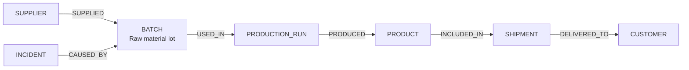

import Tabs from '@site/src/components/LanguageTabs'
import TabItem from '@theme/TabItem'

# Supply Chain Traceability and Recall Analysis

When a product defect is discovered, two questions need immediate answers:

1. **Upstream impact**: which raw materials, batches, and suppliers contributed to the affected product?
2. **Downstream blast radius**: which shipments, orders, and customers received products from this batch?

These questions cross multiple hops in a causal chain. A graph database handles them naturally. A set of JOIN-heavy relational tables does not — not at the speed required during a recall incident.

---

## Graph shape



| Label            | What it represents                          |
| ---------------- | ------------------------------------------- |
| `SUPPLIER`       | A vendor or raw material source             |
| `BATCH`          | A specific lot of raw material or component |
| `PRODUCTION_RUN` | A manufacturing run that consumed batches   |
| `PRODUCT`        | A finished product unit or SKU              |
| `SHIPMENT`       | A delivery fulfillment                      |
| `CUSTOMER`       | A receiving customer or distribution center |
| `INCIDENT`       | A quality or safety report                  |

---

## Step 1: Ingest supply chain records

<Tabs groupId="programming-language">
<TabItem value="typescript" label="TypeScript">

```typescript
import RushDB from '@rushdb/javascript-sdk'

const db = new RushDB(process.env.RUSHDB_API_KEY!)

await db.records.importJson({
  label: 'SUPPLIER',
  data: [
    { name: 'Chem Solutions Ltd', country: 'DE', approved: true },
    { name: 'Alloy Partners Inc', country: 'US', approved: true }
  ]
})

await db.records.importJson({
  label: 'BATCH',
  data: [
    { lotId: 'LOT-2025-001', material: 'polymer-Z', producedAt: '2025-01-10', quantity: 5000 },
    { lotId: 'LOT-2025-002', material: 'polymer-Z', producedAt: '2025-01-17', quantity: 4800 },
    { lotId: 'LOT-2025-003', material: 'alloy-X', producedAt: '2025-01-20', quantity: 2000 }
  ]
})

await db.records.importJson({
  label: 'PRODUCTION_RUN',
  data: [
    { runId: 'RUN-A1', startedAt: '2025-02-01', completedAt: '2025-02-03', facilityId: 'FAC-Berlin' },
    { runId: 'RUN-A2', startedAt: '2025-02-05', completedAt: '2025-02-07', facilityId: 'FAC-Berlin' }
  ]
})

await db.records.importJson({
  label: 'PRODUCT',
  data: [
    { sku: 'PROD-001', name: 'Widget Alpha', serialRange: 'WA-10001:WA-11000' },
    { sku: 'PROD-002', name: 'Widget Beta', serialRange: 'WB-20001:WB-20500' }
  ]
})

await db.records.importJson({
  label: 'SHIPMENT',
  data: [
    { trackingId: 'SHIP-4001', shippedAt: '2025-02-15', status: 'delivered' },
    { trackingId: 'SHIP-4002', shippedAt: '2025-02-18', status: 'in_transit' }
  ]
})
```

</TabItem>
<TabItem value="python" label="Python">

```python
from rushdb import RushDB
import os

db = RushDB(os.environ["RUSHDB_API_KEY"], base_url="https://api.rushdb.com/api/v1")

db.records.import_json({
    "label": "BATCH",
    "data": [
        {"lotId": "LOT-2025-001", "material": "polymer-Z", "producedAt": "2025-01-10", "quantity": 5000},
        {"lotId": "LOT-2025-002", "material": "polymer-Z", "producedAt": "2025-01-17", "quantity": 4800},
        {"lotId": "LOT-2025-003", "material": "alloy-X",   "producedAt": "2025-01-20", "quantity": 2000}
    ]
})

db.records.import_json({
    "label": "PRODUCTION_RUN",
    "data": [
        {"runId": "RUN-A1", "startedAt": "2025-02-01", "completedAt": "2025-02-03", "facilityId": "FAC-Berlin"},
        {"runId": "RUN-A2", "startedAt": "2025-02-05", "completedAt": "2025-02-07", "facilityId": "FAC-Berlin"}
    ]
})

db.records.import_json({
    "label": "PRODUCT",
    "data": [
        {"sku": "PROD-001", "name": "Widget Alpha", "serialRange": "WA-10001:WA-11000"},
        {"sku": "PROD-002", "name": "Widget Beta",  "serialRange": "WB-20001:WB-20500"}
    ]
})

db.records.import_json({
    "label": "SHIPMENT",
    "data": [
        {"trackingId": "SHIP-4001", "shippedAt": "2025-02-15", "status": "delivered"},
        {"trackingId": "SHIP-4002", "shippedAt": "2025-02-18", "status": "in_transit"}
    ]
})
```

</TabItem>
<TabItem value="shell" label="Shell">

```bash
BASE="https://api.rushdb.com/api/v1"
TOKEN="RUSHDB_API_KEY"
H='Content-Type: application/json'

curl -s -X POST "$BASE/records/import/json" \
  -H "$H" -H "Authorization: Bearer $TOKEN" \
  -d '{"label":"BATCH","data":[{"lotId":"LOT-2025-001","material":"polymer-Z","producedAt":"2025-01-10","quantity":5000},{"lotId":"LOT-2025-002","material":"polymer-Z","producedAt":"2025-01-17","quantity":4800}]}'
```

</TabItem>
</Tabs>

---

## Step 2: Link the supply chain

<Tabs groupId="programming-language">
<TabItem value="typescript" label="TypeScript">

```typescript
const [batches, runs, products, shipments] = await Promise.all([
  db.records.find({ labels: ['BATCH'] }),
  db.records.find({ labels: ['PRODUCTION_RUN'] }),
  db.records.find({ labels: ['PRODUCT'] }),
  db.records.find({ labels: ['SHIPMENT'] })
])

const batchMap = Object.fromEntries(batches.data.map((b) => [b.lotId, b]))
const runMap = Object.fromEntries(runs.data.map((r) => [r.runId, r]))
const productMap = Object.fromEntries(products.data.map((p) => [p.sku, p]))

// LOT-001 USED_IN RUN-A1
await db.records.attach({
  source: batchMap['LOT-2025-001'],
  target: runMap['RUN-A1'],
  options: { type: 'USED_IN', direction: 'out' }
})
// LOT-002 USED_IN RUN-A2
await db.records.attach({
  source: batchMap['LOT-2025-002'],
  target: runMap['RUN-A2'],
  options: { type: 'USED_IN', direction: 'out' }
})

// RUN-A1 PRODUCED PROD-001
await db.records.attach({
  source: runMap['RUN-A1'],
  target: productMap['PROD-001'],
  options: { type: 'PRODUCED', direction: 'out' }
})
// RUN-A2 PRODUCED PROD-002
await db.records.attach({
  source: runMap['RUN-A2'],
  target: productMap['PROD-002'],
  options: { type: 'PRODUCED', direction: 'out' }
})

// Products INCLUDED_IN shipments
await db.records.attach({
  source: productMap['PROD-001'],
  target: shipments.data[0],
  options: { type: 'INCLUDED_IN', direction: 'out' }
})
await db.records.attach({
  source: productMap['PROD-002'],
  target: shipments.data[1],
  options: { type: 'INCLUDED_IN', direction: 'out' }
})
```

</TabItem>
<TabItem value="python" label="Python">

```python
batches  = db.records.find({"labels": ["BATCH"]})
runs     = db.records.find({"labels": ["PRODUCTION_RUN"]})
products = db.records.find({"labels": ["PRODUCT"]})
shipments = db.records.find({"labels": ["SHIPMENT"]})

batch_map   = {b.data["lotId"]:  b for b in batches.data}
run_map     = {r.data["runId"]:  r for r in runs.data}
product_map = {p.data["sku"]:    p for p in products.data}

db.records.attach(batch_map["LOT-2025-001"].id, run_map["RUN-A1"].id,     {"type": "USED_IN",     "direction": "out"})
db.records.attach(batch_map["LOT-2025-002"].id, run_map["RUN-A2"].id,     {"type": "USED_IN",     "direction": "out"})
db.records.attach(run_map["RUN-A1"].id,         product_map["PROD-001"].id, {"type": "PRODUCED",  "direction": "out"})
db.records.attach(run_map["RUN-A2"].id,         product_map["PROD-002"].id, {"type": "PRODUCED",  "direction": "out"})
db.records.attach(product_map["PROD-001"].id,   shipments.data[0].id,       {"type": "INCLUDED_IN","direction": "out"})
db.records.attach(product_map["PROD-002"].id,   shipments.data[1].id,       {"type": "INCLUDED_IN","direction": "out"})
```

</TabItem>
<TabItem value="shell" label="Shell">

```bash
# Fetch IDs then link
BATCH_ID=$(curl -s -X POST "$BASE/records/search" -H "$H" -H "Authorization: Bearer $TOKEN" \
  -d '{"labels":["BATCH"],"where":{"lotId":"LOT-2025-001"}}' | jq -r '.data[0].__id')
RUN_ID=$(curl -s -X POST "$BASE/records/search" -H "$H" -H "Authorization: Bearer $TOKEN" \
  -d '{"labels":["PRODUCTION_RUN"],"where":{"runId":"RUN-A1"}}' | jq -r '.data[0].__id')

curl -s -X POST "$BASE/records/$BATCH_ID/relations" \
  -H "$H" -H "Authorization: Bearer $TOKEN" \
  -d "{\"targets\":[\"$RUN_ID\"],\"options\":{\"type\":\"USED_IN\",\"direction\":\"out\"}}"
```

</TabItem>
</Tabs>

---

## Step 3: Downstream blast radius — all shipments from a contaminated batch

Given a defective batch, find every shipment that could contain affected product.

<Tabs groupId="programming-language">
<TabItem value="typescript" label="TypeScript">

```typescript
const affectedShipments = await db.records.find({
  labels: ['SHIPMENT'],
  where: {
    PRODUCT: {
      $relation: { type: 'INCLUDED_IN', direction: 'in' },
      PRODUCTION_RUN: {
        $relation: { type: 'PRODUCED', direction: 'in' },
        BATCH: {
          $relation: { type: 'USED_IN', direction: 'in' },
          lotId: 'LOT-2025-001'
        }
      }
    }
  }
})

console.log(`Affected shipments: ${affectedShipments.total}`)
for (const shipment of affectedShipments.data) {
  console.log(`  ${shipment.trackingId} — ${shipment.status}`)
}
```

</TabItem>
<TabItem value="python" label="Python">

```python
affected_shipments = db.records.find({
    "labels": ["SHIPMENT"],
    "where": {
        "PRODUCT": {
            "$relation": {"type": "INCLUDED_IN", "direction": "in"},
            "PRODUCTION_RUN": {
                "$relation": {"type": "PRODUCED", "direction": "in"},
                "BATCH": {
                    "$relation": {"type": "USED_IN", "direction": "in"},
                    "lotId": "LOT-2025-001"
                }
            }
        }
    }
})

print(f"Affected shipments: {affected_shipments.total}")
for s in affected_shipments.data:
    print(f"  {s.data.get('trackingId')} — {s.data.get('status')}")
```

</TabItem>
<TabItem value="shell" label="Shell">

```bash
curl -s -X POST "$BASE/records/search" \
  -H "$H" -H "Authorization: Bearer $TOKEN" \
  -d '{
    "labels": ["SHIPMENT"],
    "where": {
      "PRODUCT": {
        "$relation": {"type": "INCLUDED_IN", "direction": "in"},
        "PRODUCTION_RUN": {
          "$relation": {"type": "PRODUCED", "direction": "in"},
          "BATCH": {
            "$relation": {"type": "USED_IN", "direction": "in"},
            "lotId": "LOT-2025-001"
          }
        }
      }
    }
  }'
```

</TabItem>
</Tabs>

---

## Step 4: Upstream impact — which batches contributed to an affected product?

Given a known-bad product SKU, trace back to every batch that could have contributed.

<Tabs groupId="programming-language">
<TabItem value="typescript" label="TypeScript">

```typescript
const sourceBatches = await db.records.find({
  labels: ['BATCH'],
  where: {
    PRODUCTION_RUN: {
      $relation: { type: 'USED_IN', direction: 'in' },
      PRODUCT: {
        $relation: { type: 'PRODUCED', direction: 'out' },
        sku: 'PROD-001'
      }
    }
  }
})

console.log(`Source batches for PROD-001: ${sourceBatches.total}`)
for (const batch of sourceBatches.data) {
  console.log(`  ${batch.lotId} — ${batch.material} — qty: ${batch.quantity}`)
}
```

</TabItem>
<TabItem value="python" label="Python">

```python
source_batches = db.records.find({
    "labels": ["BATCH"],
    "where": {
        "PRODUCTION_RUN": {
            "$relation": {"type": "USED_IN", "direction": "in"},
            "PRODUCT": {
                "$relation": {"type": "PRODUCED", "direction": "out"},
                "sku": "PROD-001"
            }
        }
    }
})

print(f"Source batches for PROD-001: {source_batches.total}")
for batch in source_batches.data:
    print(f"  {batch.data.get('lotId')} — {batch.data.get('material')}")
```

</TabItem>
<TabItem value="shell" label="Shell">

```bash
curl -s -X POST "$BASE/records/search" \
  -H "$H" -H "Authorization: Bearer $TOKEN" \
  -d '{
    "labels": ["BATCH"],
    "where": {
      "PRODUCTION_RUN": {
        "$relation": {"type": "USED_IN", "direction": "in"},
        "PRODUCT": {
          "$relation": {"type": "PRODUCED", "direction": "out"},
          "sku": "PROD-001"
        }
      }
    }
  }'
```

</TabItem>
</Tabs>

---

## Step 5: Incident report — log a quality incident linked to a batch

<Tabs groupId="programming-language">
<TabItem value="typescript" label="TypeScript">

```typescript
const incident = await db.records.create({
  label: 'INCIDENT',
  data: {
    title: 'Polymer degradation detected in lot LOT-2025-001',
    severity: 'critical',
    reportedAt: new Date().toISOString(),
    status: 'open'
  }
})

const batchResult = await db.records.find({
  labels: ['BATCH'],
  where: { lotId: 'LOT-2025-001' }
})

await db.records.attach({
  source: incident,
  target: batchResult.data[0],
  options: { type: 'CAUSED_BY', direction: 'out' }
})
```

</TabItem>
<TabItem value="python" label="Python">

```python
from datetime import datetime, timezone

incident = db.records.create("INCIDENT", {
    "title": "Polymer degradation detected in lot LOT-2025-001",
    "severity": "critical",
    "reportedAt": datetime.now(timezone.utc).isoformat(),
    "status": "open"
})

batch_result = db.records.find({"labels": ["BATCH"], "where": {"lotId": "LOT-2025-001"}})
db.records.attach(incident.id, batch_result.data[0].id, {"type": "CAUSED_BY", "direction": "out"})
```

</TabItem>
<TabItem value="shell" label="Shell">

```bash
INCIDENT_ID=$(curl -s -X POST "$BASE/records" \
  -H "$H" -H "Authorization: Bearer $TOKEN" \
  -d '{"label":"INCIDENT","data":{"title":"Polymer degradation LOT-001","severity":"critical","status":"open","reportedAt":"2025-03-15T09:00:00Z"}}' \
  | jq -r '.data.__id')

curl -s -X POST "$BASE/records/$INCIDENT_ID/relations" \
  -H "$H" -H "Authorization: Bearer $TOKEN" \
  -d "{\"targets\":[\"$BATCH_ID\"],\"options\":{\"type\":\"CAUSED_BY\",\"direction\":\"out\"}}"
```

</TabItem>
</Tabs>

---

## Production caveat

Real supply chains are many-to-many: a production run may consume dozens of batches; a shipment may contain hundreds of products. The traversal queries above traverse exactly three hops. Adding more hops increases execution cost proportionally. If your supply chain has more than three levels of indirection between primary inputs and customer delivery, benchmark traversal performance against your production data volume before deploying to incident response workflows.

---

## Next steps

- [Data Lineage](/tutorials/data-lineage) — end-to-end causal chain from sources to answers
- [Audit Trails](/tutorials/audit-trails) — append immutable events to supply chain records
- [Incident Response Graphs](/tutorials/incident-response) — operational incident root cause analysis
