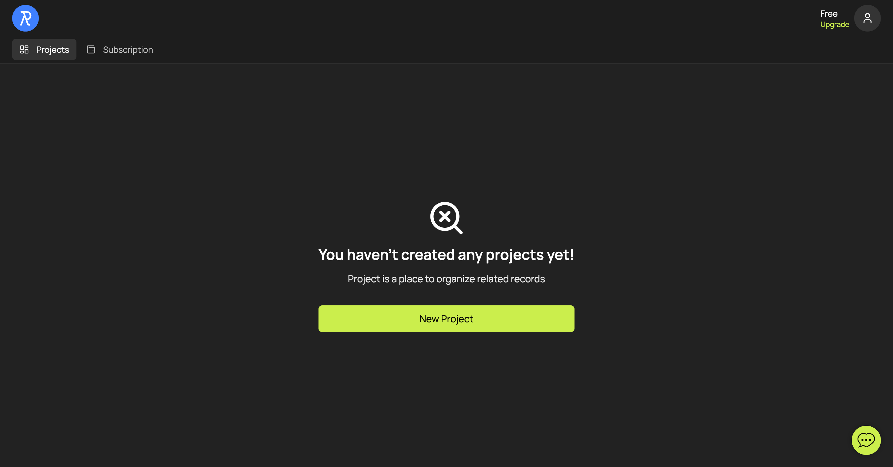
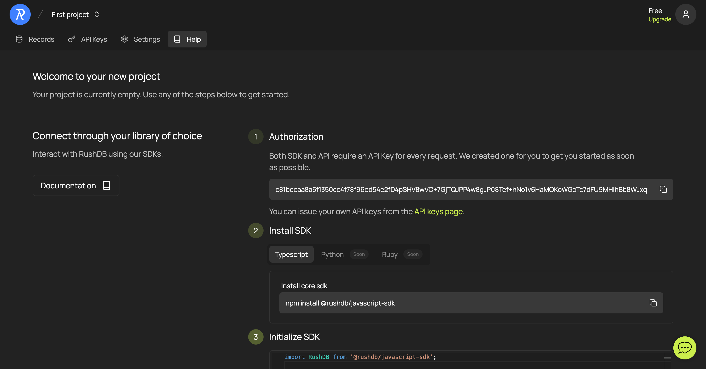

# Get API Token
In this section, we'll walk through the process of registering for RushDB and generating an API token necessary for using the RushDB SDK. This token is essential for authenticating your application's requests to the RushDB backend.

## Step 1: Sign Up for RushDB

First, you need to create a RushDB account. Go to the [RushDB sign-up page](https://app.rushdb.com/signup) and register using your email address or via third-party authentication providers.

## Step 2: Create a Project

Once signed in, you'll be directed to the dashboard. To start working with RushDB, you need to create a project where your records will be stored and managed.

- Click on the **Create Project** button to set up a new project. You might need to provide some basic information about your project, such as its name.

## Step 3: Copy an API Token

After you create your project, you’ll be taken to its Help page, where an API key will already be available. If needed, you can create additional API tokens on the **API Keys** tab.

- In the Authorization section, click the automatically generated API token to copy it. This token will be used to authenticate your SDK instances and allow them to interact with your RushDB project.

**Important:** Keep your API token secure and do not share it publicly. This token provides access to your RushDB project and the data within it.

With your API token generated, you're now ready to initialize the RushDB SDK in your application and begin creating and managing Records programmatically. Proceed to the next section to learn about integrating the SDK into your project.
