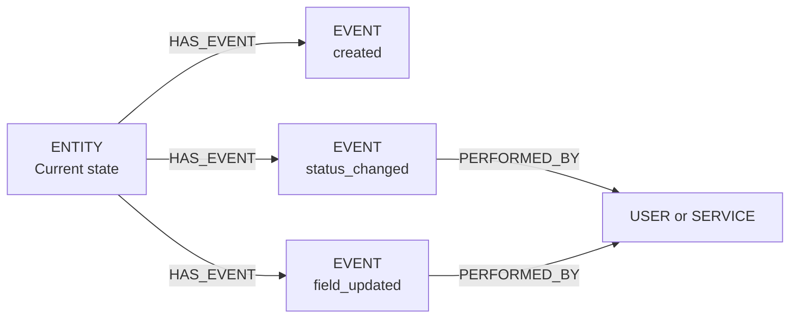

import Tabs from '@site/src/components/LanguageTabs';
import TabItem from '@theme/TabItem';

# Audit Trails with Immutable Events and Derived State

Current-state records are useful for answering "what is true now?". They are not useful for answering "what happened, and when, and who did it?"

An audit trail separates the two concerns. Events are immutable — append-only records that capture intent, actor, and timestamp. The current state record is derived from events but is mutable. Both live in the graph; only events form the log.

---

## Graph shape



| Label | What it represents |
|---|---|
| `ENTITY` | The mutable record reflecting current state |
| `EVENT` | An immutable fact: what changed, when, and who triggered it |
| `ACTOR` | The user or service that performed the action |

---

## Step 1: Create an entity with its first event atomically

Use a transaction to guarantee entity creation and the corresponding `created` event land together or not at all.

<Tabs groupId="programming-language">
<TabItem value="typescript" label="TypeScript">

```typescript
import RushDB from '@rushdb/javascript-sdk'

const db = new RushDB(process.env.RUSHDB_API_KEY!)

async function createOrderWithAudit(
  orderData: Record<string, unknown>,
  actorId: string
) {
  const tx = await db.tx.begin()

  try {
    const order = await db.records.create(
      { label: 'ORDER', data: { ...orderData, status: 'pending' } },
      tx
    )

    const event = await db.records.create(
      {
        label: 'EVENT',
        data: {
          type: 'created',
          actorId,
          entityId: order.__id,
          occurredAt: new Date().toISOString(),
          snapshot: JSON.stringify(orderData)
        }
      },
      tx
    )

    await db.records.attach(
      { source: order, target: event, options: { type: 'HAS_EVENT', direction: 'out' } },
      tx
    )

    await db.tx.commit(tx)
    return order
  } catch (err) {
    await db.tx.rollback(tx)
    throw err
  }
}

const order = await createOrderWithAudit(
  { customerId: 'cust-42', amount: 299.99, currency: 'USD' },
  'user-101'
)
```

</TabItem>
<TabItem value="python" label="Python">

```python
import json, os
from datetime import datetime, timezone
from rushdb import RushDB

db = RushDB(os.environ["RUSHDB_API_KEY"], base_url="https://api.rushdb.com/api/v1")


def create_order_with_audit(order_data: dict, actor_id: str):
    tx = db.transactions.begin()
    try:
        order = db.records.create("ORDER", {**order_data, "status": "pending"}, transaction=tx)

        event = db.records.create("EVENT", {
            "type": "created",
            "actorId": actor_id,
            "entityId": order.id,
            "occurredAt": datetime.now(timezone.utc).isoformat(),
            "snapshot": json.dumps(order_data)
        }, transaction=tx)

        db.records.attach(order.id, event.id, {"type": "HAS_EVENT", "direction": "out"}, transaction=tx)

        db.transactions.commit(tx)
        return order
    except Exception as e:
        db.transactions.rollback(tx)
        raise


order = create_order_with_audit(
    {"customerId": "cust-42", "amount": 299.99, "currency": "USD"},
    "user-101"
)
```

</TabItem>
<TabItem value="shell" label="Shell">

```bash
BASE="https://api.rushdb.com/api/v1"
TOKEN="RUSHDB_API_KEY"
H='Content-Type: application/json'

# Begin transaction
TX_ID=$(curl -s -X POST "$BASE/tx" \
  -H "$H" -H "Authorization: Bearer $TOKEN" \
  | jq -r '.data.id')

# Create order
ORDER_RESP=$(curl -s -X POST "$BASE/records" \
  -H "$H" -H "Authorization: Bearer $TOKEN" \
  -H "x-transaction-id: $TX_ID" \
  -d '{"label":"ORDER","data":{"customerId":"cust-42","amount":299.99,"currency":"USD","status":"pending"}}')
ORDER_ID=$(echo "$ORDER_RESP" | jq -r '.data.__id')

# Create event
EVENT_RESP=$(curl -s -X POST "$BASE/records" \
  -H "$H" -H "Authorization: Bearer $TOKEN" \
  -H "x-transaction-id: $TX_ID" \
  -d "{\"label\":\"EVENT\",\"data\":{\"type\":\"created\",\"actorId\":\"user-101\",\"entityId\":\"$ORDER_ID\",\"occurredAt\":\"$(date -u +%Y-%m-%dT%H:%M:%SZ)\"}}")
EVENT_ID=$(echo "$EVENT_RESP" | jq -r '.data.__id')

# Link
curl -s -X POST "$BASE/records/$ORDER_ID/relations" \
  -H "$H" -H "Authorization: Bearer $TOKEN" \
  -H "x-transaction-id: $TX_ID" \
  -d "{\"targets\":[\"$EVENT_ID\"],\"options\":{\"type\":\"HAS_EVENT\",\"direction\":\"out\"}}"

# Commit
curl -s -X POST "$BASE/tx/$TX_ID/commit" \
  -H "$H" -H "Authorization: Bearer $TOKEN"
```

</TabItem>
</Tabs>

---

## Step 2: Record a state change with its audit event

When the order status changes, update the entity and append a new EVENT — all in one transaction.

<Tabs groupId="programming-language">
<TabItem value="typescript" label="TypeScript">

```typescript
async function changeStatus(
  orderId: string,
  newStatus: string,
  actorId: string,
  reason?: string
) {
  // Read current state first (outside transaction — read-then-write pattern)
  const current = await db.records.find({
    labels: ['ORDER'],
    where: { __id: orderId }
  })
  const prevStatus = current.data[0]?.status

  const tx = await db.tx.begin()
  try {
    await db.records.update(orderId, { status: newStatus }, tx)

    const event = await db.records.create(
      {
        label: 'EVENT',
        data: {
          type: 'status_changed',
          actorId,
          entityId: orderId,
          from: prevStatus,
          to: newStatus,
          reason: reason ?? null,
          occurredAt: new Date().toISOString()
        }
      },
      tx
    )

    await db.records.attach(
      {
        source: current.data[0],
        target: event,
        options: { type: 'HAS_EVENT', direction: 'out' }
      },
      tx
    )

    await db.tx.commit(tx)
  } catch (err) {
    await db.tx.rollback(tx)
    throw err
  }
}

await changeStatus(order.__id, 'shipped', 'service-fulfillment', 'Dispatched from warehouse')
```

</TabItem>
<TabItem value="python" label="Python">

```python
def change_status(order_id: str, new_status: str, actor_id: str, reason: str | None = None):
    current = db.records.find({"labels": ["ORDER"], "where": {"__id": order_id}})
    prev_status = current.data[0].get("status") if current.data else None

    tx = db.transactions.begin()
    try:
        db.records.update(order_id, {"status": new_status}, transaction=tx)

        event = db.records.create("EVENT", {
            "type": "status_changed",
            "actorId": actor_id,
            "entityId": order_id,
            "from": prev_status,
            "to": new_status,
            "reason": reason,
            "occurredAt": datetime.now(timezone.utc).isoformat()
        }, transaction=tx)

        db.records.attach(
            current.data[0].id,
            event.id,
            {"type": "HAS_EVENT", "direction": "out"},
            transaction=tx
        )
        db.transactions.commit(tx)
    except Exception as e:
        db.transactions.rollback(tx)
        raise


change_status(order.id, "shipped", "service-fulfillment", "Dispatched from warehouse")
```

</TabItem>
<TabItem value="shell" label="Shell">

```bash
TX_ID=$(curl -s -X POST "$BASE/tx" \
  -H "$H" -H "Authorization: Bearer $TOKEN" | jq -r '.data.id')

# Update entity
curl -s -X PATCH "$BASE/records/$ORDER_ID" \
  -H "$H" -H "Authorization: Bearer $TOKEN" \
  -H "x-transaction-id: $TX_ID" \
  -d '{"status":"shipped"}'

# Create event
EVENT_RESP=$(curl -s -X POST "$BASE/records" \
  -H "$H" -H "Authorization: Bearer $TOKEN" \
  -H "x-transaction-id: $TX_ID" \
  -d "{\"label\":\"EVENT\",\"data\":{\"type\":\"status_changed\",\"from\":\"pending\",\"to\":\"shipped\",\"actorId\":\"service-fulfillment\",\"entityId\":\"$ORDER_ID\",\"occurredAt\":\"$(date -u +%Y-%m-%dT%H:%M:%SZ)\"}}")
EVENT_ID=$(echo "$EVENT_RESP" | jq -r '.data.__id')

curl -s -X POST "$BASE/records/$ORDER_ID/relations" \
  -H "$H" -H "Authorization: Bearer $TOKEN" \
  -H "x-transaction-id: $TX_ID" \
  -d "{\"targets\":[\"$EVENT_ID\"],\"options\":{\"type\":\"HAS_EVENT\",\"direction\":\"out\"}}"

curl -s -X POST "$BASE/tx/$TX_ID/commit" \
  -H "$H" -H "Authorization: Bearer $TOKEN"
```

</TabItem>
</Tabs>

---

## Step 3: Query the full event history

Retrieve all events for an entity ordered by occurrence time.

<Tabs groupId="programming-language">
<TabItem value="typescript" label="TypeScript">

```typescript
const history = await db.records.find({
  labels: ['EVENT'],
  where: {
    ORDER: {
      $relation: { type: 'HAS_EVENT', direction: 'in' },
      __id: order.__id
    }
  },
  orderBy: { occurredAt: 'asc' }
})

for (const event of history.data) {
  console.log(`[${event.occurredAt}] ${event.type} by ${event.actorId}`)
  if (event.from) {
    console.log(`  ${event.from} → ${event.to}`)
  }
}
```

</TabItem>
<TabItem value="python" label="Python">

```python
history = db.records.find({
    "labels": ["EVENT"],
    "where": {
        "ORDER": {
            "$relation": {"type": "HAS_EVENT", "direction": "in"},
            "__id": order.id
        }
    },
    "orderBy": {"occurredAt": "asc"}
})

for event in history.data:
    print(f"[{event.data.get('occurredAt')}] {event.data.get('type')} by {event.data.get('actorId')}")
    if event.data.get("from"):
        print(f"  {event.data['from']} → {event.data['to']}")
```

</TabItem>
<TabItem value="shell" label="Shell">

```bash
curl -s -X POST "$BASE/records/search" \
  -H "$H" -H "Authorization: Bearer $TOKEN" \
  -d "{
    \"labels\": [\"EVENT\"],
    \"where\": {
      \"ORDER\": {
        \"\$relation\": {\"type\": \"HAS_EVENT\", \"direction\": \"in\"},
        \"__id\": \"$ORDER_ID\"
      }
    },
    \"orderBy\": {\"occurredAt\": \"asc\"}
  }"
```

</TabItem>
</Tabs>

---

## Step 4: Aggregate events for a compliance report

Count events by type and actor across a time window.

<Tabs groupId="programming-language">
<TabItem value="typescript" label="TypeScript">

```typescript
const complianceReport = await db.records.find({
  labels: ['EVENT'],
  where: {
    occurredAt: { $gte: '2025-01-01', $lte: '2025-03-31' },
    type: 'status_changed'
  },
  aggregate: {
    count: { fn: 'count', alias: '$record' },
    actorId: '$record.actorId'
  },
  groupBy: ['actorId', 'count'],
  orderBy: { count: 'desc' }
})

console.log('State changes by actor (Q1):')
for (const row of complianceReport.data) {
  console.log(`  ${row.actorId}: ${row.count}`)
}
```

</TabItem>
<TabItem value="python" label="Python">

```python
report = db.records.find({
    "labels": ["EVENT"],
    "where": {
        "occurredAt": {"$gte": "2025-01-01", "$lte": "2025-03-31"},
        "type": "status_changed"
    },
    "aggregate": {
        "count": {"fn": "count", "alias": "$record"},
        "actorId": "$record.actorId"
    },
    "groupBy": ["actorId", "count"],
    "orderBy": {"count": "desc"}
})

print("State changes by actor (Q1):")
for row in report.data:
    print(f"  {row.data.get('actorId')}: {row.data.get('count')}")
```

</TabItem>
<TabItem value="shell" label="Shell">

```bash
curl -s -X POST "$BASE/records/search" \
  -H "$H" -H "Authorization: Bearer $TOKEN" \
  -d '{
    "labels": ["EVENT"],
    "where": {
      "occurredAt": {"$gte": "2025-01-01", "$lte": "2025-03-31"},
      "type": "status_changed"
    },
    "aggregate": {
      "count": {"fn": "count", "alias": "$record"},
      "actorId": "$record.actorId"
    },
    "groupBy": ["actorId", "count"],
    "orderBy": {"count": "desc"}
  }'
```

</TabItem>
</Tabs>

---

## Design rules for immutable audit trails

1. **Never update or delete EVENT records** — they are the immutable log; treat them as write-once
2. **Always write entity update + event in a single transaction** — no partial audit trails
3. **Store `from` and `to` on every state-change event** — makes reconstruction possible without replaying all prior events
4. **Store `actorId` on every event** — automated services have service IDs, not just human users
5. **Store `occurredAt` as an ISO 8601 string** — enables `$gte`/`$lte` filtering on dates

---

## Production caveat

Audit trails grow with every write. For high-write systems (thousands of events per hour), plan for periodic archival of old events. A safe pattern: copy events older than 90 days into a separate RushDB project (`archive-{year}`) and mark them as archived in the source project. This preserves queryability while keeping the primary project lean.

---

## Next steps

- [Versioning Records Without Losing Queryability](./versioning-records.mdx) — complement to audit trails
- [Compliance and Retention Patterns](./compliance-retention.mdx) — expiration, archival, and redaction
- [Temporal Graphs](./temporal-graphs.mdx) — point-in-time reconstruction from state chains
