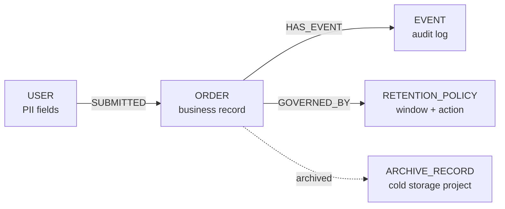

import Tabs from '@site/src/components/LanguageTabs'
import TabItem from '@theme/TabItem'

# Compliance and Retention Patterns

Data that enters your system eventually needs to leave it — or have its sensitive fields erased. Compliance frameworks like GDPR, CCPA, and HIPAA impose three distinct obligations:

1. **Expiration** — records older than a retention window must be deleted
2. **Archival** — records must be moved to cold storage before deletion to satisfy audit requirements
3. **Redaction** — PII fields must be blanked on request (right to erasure) without deleting the record or breaking the graph

Each obligation maps to a concrete RushDB pattern. This tutorial covers all three.

---

## Graph shape



| Label              | What it represents                                    |
| ------------------ | ----------------------------------------------------- |
| `USER`             | Record that may hold PII subject to erasure           |
| `ORDER`            | Business record with a retention window               |
| `RETENTION_POLICY` | Shared node encoding retention rules (window, action) |
| `EVENT`            | Immutable audit log entry                             |

---

## Step 1: Tag records with retention metadata at creation

Stamp every record with `expiresAt` and `retentionPolicy` at write time. This avoids a later migration and enables index-driven expiry queries.

<Tabs groupId="programming-language">
<TabItem value="typescript" label="TypeScript">

```typescript
import RushDB from '@rushdb/javascript-sdk'

const db = new RushDB(process.env.RUSHDB_API_KEY!)

const RETENTION_DAYS = 365 * 7 // 7-year retention for financial records

function expiryDate(days: number) {
  const d = new Date()
  d.setDate(d.getDate() + days)
  return d.toISOString()
}

const order = await db.records.create({
  label: 'ORDER',
  data: {
    customerId: 'cust-42',
    amount: 499.99,
    currency: 'USD',
    status: 'completed',
    createdAt: new Date().toISOString(),
    expiresAt: expiryDate(RETENTION_DAYS),
    retentionPolicy: 'financial-7yr',
    archived: false,
    redacted: false
  }
})
```

</TabItem>
<TabItem value="python" label="Python">

```python
import os
from datetime import datetime, timezone, timedelta
from rushdb import RushDB

db = RushDB(os.environ["RUSHDB_API_KEY"], base_url="https://api.rushdb.com/api/v1")

RETENTION_DAYS = 365 * 7

def expiry_date(days: int) -> str:
    return (datetime.now(timezone.utc) + timedelta(days=days)).isoformat()

order = db.records.create("ORDER", {
    "customerId": "cust-42",
    "amount": 499.99,
    "currency": "USD",
    "status": "completed",
    "createdAt": datetime.now(timezone.utc).isoformat(),
    "expiresAt": expiry_date(RETENTION_DAYS),
    "retentionPolicy": "financial-7yr",
    "archived": False,
    "redacted": False
})
```

</TabItem>
<TabItem value="shell" label="Shell">

```bash
BASE="https://api.rushdb.com/api/v1"
TOKEN="RUSHDB_API_KEY"
H='Content-Type: application/json'
EXPIRES=$(date -u -v+7y +%Y-%m-%dT%H:%M:%SZ 2>/dev/null || date -u -d '+7 years' +%Y-%m-%dT%H:%M:%SZ)

curl -s -X POST "$BASE/records" \
  -H "$H" -H "Authorization: Bearer $TOKEN" \
  -d "{
    \"label\": \"ORDER\",
    \"data\": {
      \"customerId\": \"cust-42\",
      \"amount\": 499.99,
      \"currency\": \"USD\",
      \"status\": \"completed\",
      \"createdAt\": \"$(date -u +%Y-%m-%dT%H:%M:%SZ)\",
      \"expiresAt\": \"$EXPIRES\",
      \"retentionPolicy\": \"financial-7yr\",
      \"archived\": false,
      \"redacted\": false
    }
  }"
```

</TabItem>
</Tabs>

---

## Step 2: Find and archive records approaching expiry

Run this query on a schedule (daily cron or queue worker) to find records whose `expiresAt` is within the next 30 days and mark them as archived before deletion.

<Tabs groupId="programming-language">
<TabItem value="typescript" label="TypeScript">

```typescript
function daysFromNow(days: number) {
  const d = new Date()
  d.setDate(d.getDate() + days)
  return d.toISOString()
}

async function archiveExpiringRecords(label: string) {
  const expiring = await db.records.find({
    labels: [label],
    where: {
      expiresAt: { $lte: daysFromNow(30) },
      archived: false
    },
    limit: 100
  })

  for (const record of expiring.data) {
    await db.records.update(record.__id, {
      archived: true,
      archivedAt: new Date().toISOString()
    })
    console.log(`Archived ${record.__id} (expires ${record.expiresAt})`)
  }

  return expiring.data.length
}

await archiveExpiringRecords('ORDER')
```

</TabItem>
<TabItem value="python" label="Python">

```python
def days_from_now(days: int) -> str:
    return (datetime.now(timezone.utc) + timedelta(days=days)).isoformat()


def archive_expiring_records(label: str) -> int:
    expiring = db.records.find({
        "labels": [label],
        "where": {
            "expiresAt": {"$lte": days_from_now(30)},
            "archived": False
        },
        "limit": 100
    })

    for record in expiring.data:
        db.records.update(record.id, {
            "archived": True,
            "archivedAt": datetime.now(timezone.utc).isoformat()
        })
        print(f"Archived {record.id} (expires {record.data.get('expiresAt')})")

    return len(expiring.data)


archive_expiring_records("ORDER")
```

</TabItem>
<TabItem value="shell" label="Shell">

```bash
CUTOFF=$(date -u -v+30d +%Y-%m-%dT%H:%M:%SZ 2>/dev/null || date -u -d '+30 days' +%Y-%m-%dT%H:%M:%SZ)

curl -s -X POST "$BASE/records/search" \
  -H "$H" -H "Authorization: Bearer $TOKEN" \
  -d "{
    \"labels\": [\"ORDER\"],
    \"where\": {
      \"expiresAt\": {\"\\$lte\": \"$CUTOFF\"},
      \"archived\": false
    },
    \"limit\": 100
  }"
```

</TabItem>
</Tabs>

---

## Step 3: Delete expired records

After the archival window has passed (e.g., 30 days after `archivedAt`), hard-delete the records. Query for archived records whose `archivedAt` is past the grace period.

<Tabs groupId="programming-language">
<TabItem value="typescript" label="TypeScript">

```typescript
async function deleteExpiredRecords(label: string, graceDays = 30) {
  const cutoff = new Date()
  cutoff.setDate(cutoff.getDate() - graceDays)

  const expired = await db.records.find({
    labels: [label],
    where: {
      archived: true,
      archivedAt: { $lte: cutoff.toISOString() }
    },
    limit: 100
  })

  if (expired.data.length === 0) {
    console.log('Nothing to delete.')
    return 0
  }

  const ids = expired.data.map((r) => r.__id)
  await db.records.delete({ ids })
  console.log(`Deleted ${ids.length} expired ${label} records`)
  return ids.length
}

await deleteExpiredRecords('ORDER')
```

</TabItem>
<TabItem value="python" label="Python">

```python
def delete_expired_records(label: str, grace_days: int = 30) -> int:
    cutoff = (datetime.now(timezone.utc) - timedelta(days=grace_days)).isoformat()

    expired = db.records.find({
        "labels": [label],
        "where": {
            "archived": True,
            "archivedAt": {"$lte": cutoff}
        },
        "limit": 100
    })

    if not expired.data:
        print("Nothing to delete.")
        return 0

    ids = [r.id for r in expired.data]
    db.records.delete({"ids": ids})
    print(f"Deleted {len(ids)} expired {label} records")
    return len(ids)


delete_expired_records("ORDER")
```

</TabItem>
<TabItem value="shell" label="Shell">

```bash
CUTOFF=$(date -u -v-30d +%Y-%m-%dT%H:%M:%SZ 2>/dev/null || date -u -d '-30 days' +%Y-%m-%dT%H:%M:%SZ)

# Find IDs then delete
IDS=$(curl -s -X POST "$BASE/records/search" \
  -H "$H" -H "Authorization: Bearer $TOKEN" \
  -d "{
    \"labels\": [\"ORDER\"],
    \"where\": {\"archived\": true, \"archivedAt\": {\"\\$lte\": \"$CUTOFF\"}},
    \"select\": {\"id\": \"$record.__id\"},
    \"limit\": 100
  }" | jq -r '[.data[].__id]')

curl -s -X DELETE "$BASE/records" \
  -H "$H" -H "Authorization: Bearer $TOKEN" \
  -d "{\"ids\": $IDS}"
```

</TabItem>
</Tabs>

---

## Step 4: Redact PII fields (right to erasure)

GDPR Article 17 and CCPA require erasing personal data on request. The requirement is to erase the _data_, not necessarily the _record_ — the record may need to stay for accounting or relationship integrity. Replace PII fields with `null` and stamp `redactedAt`.

<Tabs groupId="programming-language">
<TabItem value="typescript" label="TypeScript">

```typescript
const PII_FIELDS_BY_LABEL: Record<string, string[]> = {
  USER: ['email', 'phone', 'dateOfBirth', 'ipAddress', 'fullName'],
  ORDER: ['shippingAddress', 'billingAddress']
}

async function redactUser(userId: string) {
  const tx = await db.tx.begin()
  try {
    // Redact USER record
    const userNulls = Object.fromEntries(PII_FIELDS_BY_LABEL['USER'].map((f) => [f, null]))
    await db.records.update(
      userId,
      { ...userNulls, redacted: true, redactedAt: new Date().toISOString() },
      tx
    )

    // Redact PII on all linked ORDER records
    const orders = await db.records.find({
      labels: ['ORDER'],
      where: {
        USER: {
          $relation: { type: 'SUBMITTED', direction: 'in' },
          __id: userId
        }
      }
    })

    for (const order of orders.data) {
      const orderNulls = Object.fromEntries(PII_FIELDS_BY_LABEL['ORDER'].map((f) => [f, null]))
      await db.records.update(order.__id, orderNulls, tx)
    }

    await db.tx.commit(tx)
    console.log(`Redacted user ${userId} and ${orders.data.length} associated orders`)
  } catch (err) {
    await db.tx.rollback(tx)
    throw err
  }
}

await redactUser('user-42')
```

</TabItem>
<TabItem value="python" label="Python">

```python
PII_FIELDS_BY_LABEL = {
    "USER": ["email", "phone", "dateOfBirth", "ipAddress", "fullName"],
    "ORDER": ["shippingAddress", "billingAddress"]
}


def redact_user(user_id: str):
    tx = db.tx.begin()
    try:
        user_nulls = {f: None for f in PII_FIELDS_BY_LABEL["USER"]}
        db.records.update(user_id, {
            **user_nulls,
            "redacted": True,
            "redactedAt": datetime.now(timezone.utc).isoformat()
        }, transaction=tx)

        orders = db.records.find({
            "labels": ["ORDER"],
            "where": {
                "USER": {
                    "$relation": {"type": "SUBMITTED", "direction": "in"},
                    "__id": user_id
                }
            }
        })

        for order in orders.data:
            order_nulls = {f: None for f in PII_FIELDS_BY_LABEL["ORDER"]}
            db.records.update(order.id, order_nulls, transaction=tx)

        db.tx.commit(tx)
        print(f"Redacted user {user_id} and {len(orders.data)} associated orders")
    except Exception:
        db.tx.rollback(tx)
        raise


redact_user("user-42")
```

</TabItem>
<TabItem value="shell" label="Shell">

```bash
# Redact a USER record's PII fields
curl -s -X PATCH "$BASE/records/$USER_ID" \
  -H "$H" -H "Authorization: Bearer $TOKEN" \
  -d '{
    "email": null,
    "phone": null,
    "dateOfBirth": null,
    "ipAddress": null,
    "fullName": null,
    "redacted": true,
    "redactedAt": "'"$(date -u +%Y-%m-%dT%H:%M:%SZ)"'"
  }'
```

</TabItem>
</Tabs>

:::note Relationships survive redaction
Redaction nulls field values but does not delete the record or its edges. Downstream records that traverse `SUBMITTED` relationships still reach the USER record — they just find nulled PII fields. This preserves graph integrity while complying with erasure obligations.
:::

---

## Step 5: Compliance reporting

Use `select` aggregations to produce a retention health report: how many records are compliant (not yet expired), archived pending deletion, or already redacted.

<Tabs groupId="programming-language">
<TabItem value="typescript" label="TypeScript">

```typescript
const report = await db.records.find({
  labels: ['ORDER'],
  select: {
    total: { $count: '*' },
    archived: { $sum: { $cond: [{ $eq: ['$record.archived', true] }, 1, 0] } },
    redacted: { $sum: { $cond: [{ $eq: ['$record.redacted', true] }, 1, 0] } },
    policy: '$record.retentionPolicy'
  },
  groupBy: ['policy']
})

for (const row of report.data) {
  console.log(
    `Policy: ${row.policy} | Total: ${row.total} | Archived: ${row.archived} | Redacted: ${row.redacted}`
  )
}
```

</TabItem>
<TabItem value="python" label="Python">

```python
report = db.records.find({
    "labels": ["ORDER"],
    "select": {
        "total":    {"$count": "*"},
        "archived": {"$sum": {"$cond": [{"$eq": ["$record.archived", True]}, 1, 0]}},
        "redacted": {"$sum": {"$cond": [{"$eq": ["$record.redacted", True]}, 1, 0]}},
        "policy":   "$record.retentionPolicy"
    },
    "groupBy": ["policy"]
})

for row in report.data:
    print(
        f"Policy: {row.data.get('policy')} | "
        f"Total: {row.data.get('total')} | "
        f"Archived: {row.data.get('archived')} | "
        f"Redacted: {row.data.get('redacted')}"
    )
```

</TabItem>
<TabItem value="shell" label="Shell">

```bash
curl -s -X POST "$BASE/records/search" \
  -H "$H" -H "Authorization: Bearer $TOKEN" \
  -d '{
    "labels": ["ORDER"],
    "select": {
      "total":   {"$count": "*"},
      "policy":  "$record.retentionPolicy"
    },
    "groupBy": ["policy"]
  }'
```

</TabItem>
</Tabs>

---

## Design rules

1. **Stamp `expiresAt` at write time** — never try to derive expiry from `createdAt` later; policies change, and a stored date is unambiguous
2. **Archive before deleting** — a two-phase expiry (archive → grace period → delete) satisfies audit requirements and gives you a rollback window if a record is flagged in error
3. **Redact, do not delete, when relationships matter** — deleting a USER record breaks every edge pointing to it; nulling PII fields preserves graph integrity
4. **Run expiry jobs idempotently** — use `archived: false` and date filters so re-runs are safe
5. **Keep a separate immutable EVENT record for each redaction action** — the redaction itself is an auditable fact; see [Audit Trails](./audit-trails)
6. **Never expose `redacted: false` records in user-facing APIs without authorization checks** — filter by `redacted: false` in all end-user queries

---

## Next steps

- [Audit Trails with Immutable Events](./audit-trails) — append-only event log for every state change
- [Versioning Records Without Losing Queryability](./versioning-records) — keeping historical state alongside current state
- [Temporal Graphs](./temporal-graphs) — point-in-time graph reconstruction
