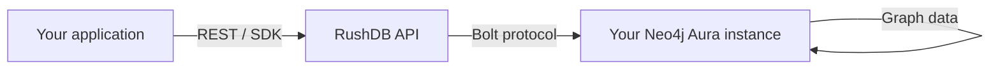

import Tabs from '@site/src/components/LanguageTabs';
import TabItem from '@theme/TabItem';

# Connecting a Neo4j Aura Instance (BYOC)

**BYOC** (Bring Your Own Cloud) means RushDB's API and query layer runs on RushDB infrastructure while your Neo4j or Aura instance is the actual data store. Your graph data never leaves your cloud account.

This is available on every plan including Free.

---

## How it works



RushDB stores:
- **In your Neo4j/Aura** — all record nodes, relationship edges, and vector embeddings
- **In RushDB's Postgres** — project config, API keys, embedding index metadata, and billing records only

---

## Step 1: Get your Neo4j Aura connection details

1. Open [console.neo4j.io](https://console.neo4j.io) and select your instance.
2. Click **Connect** → **Drivers** to find your connection URI. It will look like:
   ```
   neo4j+s://xxxxxxxx.databases.neo4j.io
   ```
3. Note the **username** (typically `neo4j`) and the **password** you set when creating the instance.

:::tip Free Aura tier
Neo4j AuraDB Free (1 GB) is sufficient for development and small production workloads. Create one at [console.neo4j.io](https://console.neo4j.io) if you do not already have an account.
:::

---

## Step 2: Create a BYOC project in the RushDB dashboard

1. Sign in to [app.rushdb.com](https://app.rushdb.com) (or your self-hosted dashboard).
2. Click **New Project**.
3. Enable **Use my own Neo4j instance** (toggle in the project creation dialog).
4. Enter your connection details:
   - **Connection URI** — `neo4j+s://xxxxxxxx.databases.neo4j.io`
   - **Username** — `neo4j`
   - **Password** — your Aura password
5. Click **Verify Connection**. RushDB performs a lightweight Bolt handshake to confirm credentials.
6. Click **Create Project**.

RushDB creates the project entry in its own Postgres, but **all graph writes will go to your Aura instance**.

---

## Step 3: Get your API key

After the project is created, go to the **API Keys** tab and copy the generated key. This key authenticates requests to the RushDB API and is stored encrypted — RushDB never stores it in plaintext.

---

## Step 4: Verify the connection

<Tabs groupId="programming-language">
<TabItem value="typescript" label="TypeScript">

```typescript
import RushDB from '@rushdb/javascript-sdk'

const db = new RushDB('YOUR_API_KEY')
// For self-hosted RushDB:
// const db = new RushDB('YOUR_API_KEY', { url: 'https://your-rushdb-host/api/v1' })

await db.records.create({ label: 'CONNECTION_TEST', data: { ok: true } })
const result = await db.records.find({ labels: ['CONNECTION_TEST'] })
console.log(result.total) // 1 — written to your Aura instance
```

</TabItem>
<TabItem value="python" label="Python">

```python
from rushdb import RushDB

db = RushDB('YOUR_API_KEY', base_url='https://api.rushdb.com/api/v1')

db.records.create('CONNECTION_TEST', {'ok': True})
result = db.records.find({'labels': ['CONNECTION_TEST']})
print(result.total)  # 1 — written to your Aura instance
```

</TabItem>
<TabItem value="shell" label="Shell">

```bash
# Create a test record
curl -X POST https://api.rushdb.com/api/v1/records \
  -H "Authorization: Bearer YOUR_API_KEY" \
  -H "Content-Type: application/json" \
  -d '{"label":"CONNECTION_TEST","data":{"ok":true}}'

# Read it back
curl -X POST https://api.rushdb.com/api/v1/records/search \
  -H "Authorization: Bearer YOUR_API_KEY" \
  -H "Content-Type: application/json" \
  -d '{"labels":["CONNECTION_TEST"]}'
```

</TabItem>
</Tabs>

---

## Step 5: Validate with a raw Cypher query (optional)

BYOC and self-hosted projects have access to `POST /api/v1/query/raw`. Use it to confirm data is landing in Aura directly.

```bash
curl -X POST https://api.rushdb.com/api/v1/query/raw \
  -H "Authorization: Bearer YOUR_API_KEY" \
  -H "Content-Type: application/json" \
  -d '{
    "query": "MATCH (n) RETURN labels(n) AS labels, count(n) AS count GROUP BY labels(n) LIMIT 20"
  }'
```

You can also open the Aura console's built-in Browser and run the same Cypher query directly to confirm the same nodes appear.

---

## BYOC with a self-hosted RushDB instance

If you are running RushDB on your own infrastructure and want to point it at an Aura instance, set the Neo4j env vars in your `docker-compose.yml` to your Aura URI instead of `bolt://neo4j:7687`:

```yaml
environment:
  NEO4J_URL: neo4j+s://xxxxxxxx.databases.neo4j.io:7687
  NEO4J_USERNAME: neo4j
  NEO4J_PASSWORD: your-aura-password
```

See [Self-Hosting RushDB](./deployment.mdx) for the complete Docker Compose setup.

---

## What changes with BYOC vs managed

| | Managed (default) | BYOC |
|---|---|---|
| Data location | RushDB-managed Neo4j | Your Aura / Neo4j |
| Raw Cypher access | No | Yes — `POST /query/raw` |
| Billing | KU-based | KU-based (same) |
| Wipe / restore | Via RushDB dashboard | Full Neo4j backup tools available |
| SLA for the graph | RushDB SLA | Your Neo4j Aura SLA |

See [BYOC vs Managed vs Self-Hosted](./byoc-vs-managed.mdx) for a full comparison.

---

## Next steps

- [BYOC vs Managed vs Self-Hosted](./byoc-vs-managed.mdx) — choose the right topology
- [Self-Hosting RushDB](./deployment.mdx) — run both RushDB and the graph on your own infra
- [Project Setup After Deployment](./self-hosted-project-setup.mdx) — configure embedding models and team access per project
