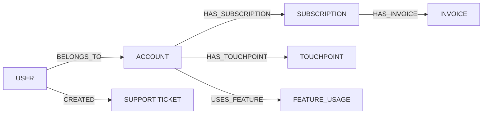

import Tabs from '@site/src/components/LanguageTabs';
import TabItem from '@theme/TabItem';

# Customer 360 as a Connected Graph

Customer context typically lives in five or more separated systems: CRM, billing, support, product analytics, and marketing automation. Getting a complete picture of one customer requires manual cross-referencing across all of them.

A connected graph collapses that. Put every customer-related record into RushDB — accounts, subscriptions, invoices, touchpoints, support tickets, feature usage — and you can answer complex, cross-domain questions with one query.

---

## Graph shape



| Label | What it represents |
|---|---|
| `USER` | An individual user with login/profile data |
| `ACCOUNT` | An organization or company |
| `SUBSCRIPTION` | An active or cancelled plan |
| `INVOICE` | A billing invoice |
| `TOUCHPOINT` | A marketing or sales interaction (email, call, demo) |
| `SUPPORT_TICKET` | An inbound support request |
| `FEATURE_USAGE` | A log of which product features are used and how often |

---

## Step 1: Ingest account and user data

<Tabs groupId="programming-language">
<TabItem value="typescript" label="TypeScript">

```typescript
import RushDB from '@rushdb/javascript-sdk'

const db = new RushDB(process.env.RUSHDB_API_KEY!)

// Create account
const account = await db.records.create({
  label: 'ACCOUNT',
  data: {
    name: 'Acme Corp',
    plan: 'enterprise',
    region: 'EU',
    mrr: 1200,
    createdAt: '2024-01-15'
  }
})

// Create users and link them to the account
await db.records.importJson({
  label: 'USER',
  data: [
    { email: 'alice@acme.com', name: 'Alice', role: 'admin', lastActiveAt: '2025-03-01' },
    { email: 'bob@acme.com',   name: 'Bob',   role: 'member', lastActiveAt: '2025-02-20' }
  ]
})

const users = await db.records.find({
  labels: ['USER'],
  where: { email: { $in: ['alice@acme.com', 'bob@acme.com'] } }
})

for (const user of users.data) {
  await db.records.attach({
    source: user,
    target: account,
    options: { type: 'BELONGS_TO', direction: 'out' }
  })
}
```

</TabItem>
<TabItem value="python" label="Python">

```python
from rushdb import RushDB
import os

db = RushDB(os.environ["RUSHDB_API_KEY"], base_url="https://api.rushdb.com/api/v1")

account = db.records.create("ACCOUNT", {
    "name": "Acme Corp",
    "plan": "enterprise",
    "region": "EU",
    "mrr": 1200,
    "createdAt": "2024-01-15"
})

db.records.import_json({
    "label": "USER",
    "data": [
        {"email": "alice@acme.com", "name": "Alice", "role": "admin", "lastActiveAt": "2025-03-01"},
        {"email": "bob@acme.com",   "name": "Bob",   "role": "member", "lastActiveAt": "2025-02-20"}
    ]
})

users = db.records.find({
    "labels": ["USER"],
    "where": {"email": {"$in": ["alice@acme.com", "bob@acme.com"]}}
})

for user in users.data:
    db.records.attach(user.id, account.id, {"type": "BELONGS_TO", "direction": "out"})
```

</TabItem>
<TabItem value="shell" label="Shell">

```bash
BASE="https://api.rushdb.com/api/v1"
TOKEN="RUSHDB_API_KEY"
H='Content-Type: application/json'

ACCOUNT_ID=$(curl -s -X POST "$BASE/records" \
  -H "$H" -H "Authorization: Bearer $TOKEN" \
  -d '{"label":"ACCOUNT","data":{"name":"Acme Corp","plan":"enterprise","region":"EU","mrr":1200,"createdAt":"2024-01-15"}}' \
  | jq -r '.data.__id')

curl -s -X POST "$BASE/records/import/json" \
  -H "$H" -H "Authorization: Bearer $TOKEN" \
  -d '{"label":"USER","data":[{"email":"alice@acme.com","name":"Alice","role":"admin"},{"email":"bob@acme.com","name":"Bob","role":"member"}]}'
```

</TabItem>
</Tabs>

---

## Step 2: Add subscription and invoice history

<Tabs groupId="programming-language">
<TabItem value="typescript" label="TypeScript">

```typescript
const subscription = await db.records.create({
  label: 'SUBSCRIPTION',
  data: {
    plan: 'enterprise',
    status: 'active',
    startedAt: '2024-01-15',
    renewsAt: '2026-01-15',
    seats: 25
  }
})

await db.records.attach({
  source: account,
  target: subscription,
  options: { type: 'HAS_SUBSCRIPTION', direction: 'out' }
})

// Monthly invoices
await db.records.importJson({
  label: 'INVOICE',
  data: [
    { month: '2025-01', amount: 1200, status: 'paid', paidAt: '2025-01-05' },
    { month: '2025-02', amount: 1200, status: 'paid', paidAt: '2025-02-05' },
    { month: '2025-03', amount: 1200, status: 'overdue', paidAt: null }
  ]
})

const invoices = await db.records.find({ labels: ['INVOICE'] })
for (const invoice of invoices.data) {
  await db.records.attach({
    source: subscription,
    target: invoice,
    options: { type: 'HAS_INVOICE', direction: 'out' }
  })
}
```

</TabItem>
<TabItem value="python" label="Python">

```python
subscription = db.records.create("SUBSCRIPTION", {
    "plan": "enterprise",
    "status": "active",
    "startedAt": "2024-01-15",
    "renewsAt": "2026-01-15",
    "seats": 25
})

db.records.attach(account.id, subscription.id, {"type": "HAS_SUBSCRIPTION", "direction": "out"})

db.records.import_json({
    "label": "INVOICE",
    "data": [
        {"month": "2025-01", "amount": 1200, "status": "paid", "paidAt": "2025-01-05"},
        {"month": "2025-02", "amount": 1200, "status": "paid", "paidAt": "2025-02-05"},
        {"month": "2025-03", "amount": 1200, "status": "overdue", "paidAt": None}
    ]
})

invoices = db.records.find({"labels": ["INVOICE"]})
for invoice in invoices.data:
    db.records.attach(subscription.id, invoice.id, {"type": "HAS_INVOICE", "direction": "out"})
```

</TabItem>
<TabItem value="shell" label="Shell">

```bash
curl -s -X POST "$BASE/records/import/json" \
  -H "$H" -H "Authorization: Bearer $TOKEN" \
  -d '{"label":"INVOICE","data":[{"month":"2025-01","amount":1200,"status":"paid"},{"month":"2025-03","amount":1200,"status":"overdue"}]}'
```

</TabItem>
</Tabs>

---

## Step 3: Query accounts with overdue invoices

Find enterprise accounts that have at least one overdue invoice — the churn-risk signal.

<Tabs groupId="programming-language">
<TabItem value="typescript" label="TypeScript">

```typescript
const overdueAccounts = await db.records.find({
  labels: ['ACCOUNT'],
  where: {
    plan: 'enterprise',
    SUBSCRIPTION: {
      $relation: { type: 'HAS_SUBSCRIPTION', direction: 'out' },
      INVOICE: {
        $relation: { type: 'HAS_INVOICE', direction: 'out' },
        status: 'overdue'
      }
    }
  }
})

console.log(`Accounts with overdue invoices: ${overdueAccounts.total}`)
for (const acct of overdueAccounts.data) {
  console.log(`  ${acct.name} — MRR: ${acct.mrr}`)
}
```

</TabItem>
<TabItem value="python" label="Python">

```python
overdue_accounts = db.records.find({
    "labels": ["ACCOUNT"],
    "where": {
        "plan": "enterprise",
        "SUBSCRIPTION": {
            "$relation": {"type": "HAS_SUBSCRIPTION", "direction": "out"},
            "INVOICE": {
                "$relation": {"type": "HAS_INVOICE", "direction": "out"},
                "status": "overdue"
            }
        }
    }
})

print(f"Accounts with overdue invoices: {overdue_accounts.total}")
for acct in overdue_accounts.data:
    print(f"  {acct.get('name')} — MRR: {acct.get('mrr')}")
```

</TabItem>
<TabItem value="shell" label="Shell">

```bash
curl -s -X POST "$BASE/records/search" \
  -H "$H" -H "Authorization: Bearer $TOKEN" \
  -d '{
    "labels": ["ACCOUNT"],
    "where": {
      "plan": "enterprise",
      "SUBSCRIPTION": {
        "$relation": {"type": "HAS_SUBSCRIPTION", "direction": "out"},
        "INVOICE": {
          "$relation": {"type": "HAS_INVOICE", "direction": "out"},
          "status": "overdue"
        }
      }
    }
  }'
```

</TabItem>
</Tabs>

---

## Step 4: MRR by region (select expressions)

<Tabs groupId="programming-language">
<TabItem value="typescript" label="TypeScript">

```typescript
const mrrByRegion = await db.records.find({
  labels: ['ACCOUNT'],
  where: { SUBSCRIPTION: { $relation: { type: 'HAS_SUBSCRIPTION', direction: 'out' }, status: 'active' } },
  select: {
    totalMrr: { $sum: '$record.mrr' },
    region: '$record.region'
  },
  groupBy: ['region', 'totalMrr'],
  orderBy: { totalMrr: 'desc' }
})

for (const row of mrrByRegion.data) {
  console.log(`${row.region}: $${row.totalMrr}`)
}
```

</TabItem>
<TabItem value="python" label="Python">

```python
mrr_by_region = db.records.find({
    "labels": ["ACCOUNT"],
    "where": {
        "SUBSCRIPTION": {
            "$relation": {"type": "HAS_SUBSCRIPTION", "direction": "out"},
            "status": "active"
        }
    },
    "select": {
        "totalMrr": {"$sum": "$record.mrr"},
        "region": "$record.region"
    },
    "groupBy": ["region", "totalMrr"],
    "orderBy": {"totalMrr": "desc"}
})

for row in mrr_by_region.data:
    print(f"{row.data.get('region')}: ${row.data.get('totalMrr')}")
```

</TabItem>
<TabItem value="shell" label="Shell">

```bash
curl -s -X POST "$BASE/records/search" \
  -H "$H" -H "Authorization: Bearer $TOKEN" \
  -d '{
    "labels": ["ACCOUNT"],
    "select": {
      "totalMrr": {"$sum": "$record.mrr"},
      "region": "$record.region"
    },
    "groupBy": ["region", "totalMrr"],
    "orderBy": {"totalMrr": "desc"}
  }'
```

</TabItem>
</Tabs>

---

## Step 5: Full context for a support ticket

When a support ticket comes in, retrieve the full account context automatically — plan, MRR, open invoices, and recent touchpoints — so the agent or support rep starts with the complete picture.

<Tabs groupId="programming-language">
<TabItem value="typescript" label="TypeScript">

```typescript
async function getAccountContext(accountId: string) {
  const [accountResult, subscriptionResult, overdueInvoices, recentTickets] = await Promise.all([
    db.records.find({ labels: ['ACCOUNT'], where: { __id: accountId } }),
    db.records.find({
      labels: ['SUBSCRIPTION'],
      where: {
        ACCOUNT: { $relation: { type: 'HAS_SUBSCRIPTION', direction: 'in' }, __id: accountId },
        status: 'active'
      }
    }),
    db.records.find({
      labels: ['INVOICE'],
      where: {
        SUBSCRIPTION: {
          $relation: { type: 'HAS_INVOICE', direction: 'in' },
          ACCOUNT: { $relation: { type: 'HAS_SUBSCRIPTION', direction: 'in' }, __id: accountId }
        },
        status: 'overdue'
      }
    }),
    db.records.find({
      labels: ['SUPPORT_TICKET'],
      where: {
        USER: {
          $relation: { type: 'CREATED', direction: 'in' },
          ACCOUNT: { $relation: { type: 'BELONGS_TO', direction: 'in' }, __id: accountId }
        }
      },
      orderBy: { createdAt: 'desc' },
      limit: 5
    })
  ])

  return {
    account: accountResult.data[0],
    activeSubscription: subscriptionResult.data[0],
    overdueCount: overdueInvoices.total,
    recentTickets: recentTickets.data
  }
}
```

</TabItem>
<TabItem value="python" label="Python">

```python
from concurrent.futures import ThreadPoolExecutor


def get_account_context(account_id: str) -> dict:
    with ThreadPoolExecutor(max_workers=4) as executor:
        fut_acct  = executor.submit(db.records.find, {"labels": ["ACCOUNT"], "where": {"__id": account_id}})
        fut_sub   = executor.submit(db.records.find, {"labels": ["SUBSCRIPTION"], "where": {"ACCOUNT": {"$relation": {"type": "HAS_SUBSCRIPTION", "direction": "in"}, "__id": account_id}, "status": "active"}})
        fut_inv   = executor.submit(db.records.find, {"labels": ["INVOICE"], "where": {"SUBSCRIPTION": {"$relation": {"type": "HAS_INVOICE", "direction": "in"}, "ACCOUNT": {"$relation": {"type": "HAS_SUBSCRIPTION", "direction": "in"}, "__id": account_id}}, "status": "overdue"}})
        fut_tick  = executor.submit(db.records.find, {"labels": ["SUPPORT_TICKET"], "where": {"USER": {"$relation": {"type": "CREATED", "direction": "in"}, "ACCOUNT": {"$relation": {"type": "BELONGS_TO", "direction": "in"}, "__id": account_id}}}, "orderBy": {"createdAt": "desc"}, "limit": 5})

    return {
        "account": fut_acct.result().data[0].data if fut_acct.result().data else None,
        "activeSubscription": fut_sub.result().data[0].data if fut_sub.result().data else None,
        "overdueCount": fut_inv.result().total,
        "recentTickets": [t.data for t in fut_tick.result().data]
    }
```

</TabItem>
<TabItem value="shell" label="Shell">

```bash
# Account overdue invoices check
curl -s -X POST "$BASE/records/search" \
  -H "$H" -H "Authorization: Bearer $TOKEN" \
  -d "{
    \"labels\": [\"INVOICE\"],
    \"where\": {
      \"SUBSCRIPTION\": {
        \"\$relation\": {\"type\": \"HAS_INVOICE\", \"direction\": \"in\"},
        \"ACCOUNT\": {
          \"\$relation\": {\"type\": \"HAS_SUBSCRIPTION\", \"direction\": \"in\"},
          \"__id\": \"$ACCOUNT_ID\"
        }
      },
      \"status\": \"overdue\"
    }
  }"
```

</TabItem>
</Tabs>

---

## Production caveat

Customer graphs grow with every activity event. Feature usage logs and touchpoints can reach millions of records for enterprise accounts. Use `limit` and `orderBy` on time-sorted fields (`occurredAt`, `createdAt`) to bound retrieval, and compute feature usage counts with `select`/`groupBy` rather than surfacing every raw log entry.

---

## Next steps

- [Incident Response Graphs](./incident-response) — add operational context to account graphs
- [Hybrid Retrieval](./hybrid-retrieval.mdx) — semantic search within a specific account's records
- [Building a Graph-Backed API Layer](./graph-backed-api.mdx) — expose this graph through a production API
