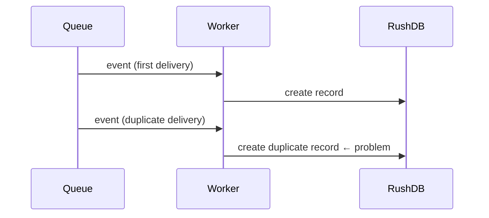

import Tabs from '@site/src/components/LanguageTabs';
import TabItem from '@theme/TabItem';

# Event-Driven Ingestion from Webhooks and Queues

Webhooks and message queues deliver events at least once — occasionally more than once, occasionally out of order. Naive insertion on every delivery duplicates records, splits relationship graphs, and corrupts aggregates.

This tutorial shows idempotent ingestion patterns: look up before you write, write only once, always link atomically.

---

## The fundamental problem



The solution is **find-then-create**: search for the record by its natural key before inserting. If it already exists, update it. If it does not, create it. Do both inside a transaction so no two workers race to create the same record simultaneously.

---

## Step 1: Idempotent upsert of a single event

<Tabs groupId="programming-language">
<TabItem value="typescript" label="TypeScript">

```typescript
import RushDB from '@rushdb/javascript-sdk'

const db = new RushDB(process.env.RUSHDB_API_KEY!)

interface OrderEvent {
  orderId: string
  customerId: string
  status: string
  totalUsd: number
  createdAt: string
}

async function upsertOrder(event: OrderEvent): Promise<string> {
  const tx = await db.tx.begin()
  try {
    const existing = await db.records.find({
      labels: ['ORDER'],
      where: { orderId: event.orderId }
    })

    let orderId: string

    if (existing.data.length > 0) {
      // Already exists — update mutable fields only
      await db.records.update(existing.data[0].__id, { status: event.status }, tx)
      orderId = existing.data[0].__id
    } else {
      // First delivery — create
      const record = await db.records.create({ label: 'ORDER', data: event }, tx)
      orderId = record.__id
    }

    await db.tx.commit(tx)
    return orderId
  } catch (err) {
    await db.tx.rollback(tx)
    throw err
  }
}
```

</TabItem>
<TabItem value="python" label="Python">

```python
from rushdb import RushDB
import os

db = RushDB(os.environ["RUSHDB_API_KEY"], base_url="https://api.rushdb.com/api/v1")

def upsert_order(event: dict) -> str:
    tx = db.transactions.begin()
    try:
        existing = db.records.find({
            "labels": ["ORDER"],
            "where": {"orderId": event["orderId"]}
        })

        if existing.data:
            db.records.update(existing.data[0].id, {"status": event["status"]}, transaction=tx)
            order_id = existing.data[0].id
        else:
            record = db.records.create("ORDER", event, transaction=tx)
            order_id = record.id

        db.transactions.commit(tx)
        return order_id
    except Exception as e:
        db.transactions.rollback(tx)
        raise
```

</TabItem>
<TabItem value="shell" label="Shell">

```bash
BASE="https://api.rushdb.com/api/v1"
TOKEN="RUSHDB_API_KEY"
H='Content-Type: application/json'

ORDER_ID="ORD-9001"

# Check if record already exists
EXISTING=$(curl -s -X POST "$BASE/records/search" \
  -H "$H" -H "Authorization: Bearer $TOKEN" \
  -d "{\"labels\":[\"ORDER\"],\"where\":{\"orderId\":\"$ORDER_ID\"}}")

COUNT=$(echo "$EXISTING" | jq '.total')

if [ "$COUNT" -eq 0 ]; then
  # Create
  curl -s -X POST "$BASE/records" \
    -H "$H" -H "Authorization: Bearer $TOKEN" \
    -d "{\"label\":\"ORDER\",\"data\":{\"orderId\":\"$ORDER_ID\",\"status\":\"received\",\"totalUsd\":129.99}}"
else
  # Update status only
  RECORD_ID=$(echo "$EXISTING" | jq -r '.data[0].__id')
  curl -s -X PATCH "$BASE/records/$RECORD_ID" \
    -H "$H" -H "Authorization: Bearer $TOKEN" \
    -d '{"status":"processing"}'
fi
```

</TabItem>
</Tabs>

:::tip Always use a natural key
Pick a field that is unique and immutable per event — `orderId`, `eventId`, `messageId`. Never use a mutable field like `status` or `updatedAt` as the deduplication key.
:::

---

## Step 2: Idempotent upsert with relationship creation

Events often carry implicit relationships. A `checkout.completed` webhook references both a customer ID and the order itself. Link them atomically.

<Tabs groupId="programming-language">
<TabItem value="typescript" label="TypeScript">

```typescript
interface CheckoutEvent {
  orderId: string
  customerId: string
  status: string
  totalUsd: number
  createdAt: string
}

async function handleCheckout(event: CheckoutEvent): Promise<void> {
  const tx = await db.tx.begin()
  try {
    // Upsert ORDER
    const existingOrders = await db.records.find({
      labels: ['ORDER'],
      where: { orderId: event.orderId }
    })

    let order: { __id: string; [key: string]: unknown }
    if (existingOrders.data.length > 0) {
      order = existingOrders.data[0]
      await db.records.update(order.__id, { status: event.status }, tx)
    } else {
      order = await db.records.create(
        { label: 'ORDER', data: { orderId: event.orderId, status: event.status, totalUsd: event.totalUsd, createdAt: event.createdAt } },
        tx
      )
    }

    // Resolve CUSTOMER — must exist prior to checkout
    const customers = await db.records.find({
      labels: ['CUSTOMER'],
      where: { customerId: event.customerId }
    })
    if (customers.data.length === 0) throw new Error(`CUSTOMER ${event.customerId} not found`)

    // Idempotent attach: only link if not already linked
    const alreadyLinked = await db.records.find({
      labels: ['CUSTOMER'],
      where: {
        customerId: event.customerId,
        ORDER: {
          $relation: { type: 'PLACED', direction: 'out' },
          orderId: event.orderId
        }
      }
    })

    if (alreadyLinked.data.length === 0) {
      await db.records.attach({
        source: customers.data[0],
        target: order,
        options: { type: 'PLACED', direction: 'out' }
      }, tx)
    }

    await db.tx.commit(tx)
  } catch (err) {
    await db.tx.rollback(tx)
    throw err
  }
}
```

</TabItem>
<TabItem value="python" label="Python">

```python
def handle_checkout(event: dict) -> None:
    tx = db.transactions.begin()
    try:
        existing = db.records.find({"labels": ["ORDER"], "where": {"orderId": event["orderId"]}})

        if existing.data:
            order = existing.data[0]
            db.records.update(order.id, {"status": event["status"]}, transaction=tx)
        else:
            order = db.records.create("ORDER", {
                "orderId": event["orderId"],
                "status": event["status"],
                "totalUsd": event["totalUsd"],
                "createdAt": event["createdAt"]
            }, transaction=tx)

        customers = db.records.find({"labels": ["CUSTOMER"], "where": {"customerId": event["customerId"]}})
        if not customers.data:
            raise ValueError(f"CUSTOMER {event['customerId']} not found")

        already_linked = db.records.find({
            "labels": ["CUSTOMER"],
            "where": {
                "customerId": event["customerId"],
                "ORDER": {
                    "$relation": {"type": "PLACED", "direction": "out"},
                    "orderId": event["orderId"]
                }
            }
        })

        if not already_linked.data:
            db.records.attach(customers.data[0].id, order.id, {"type": "PLACED", "direction": "out"}, transaction=tx)

        db.transactions.commit(tx)
    except Exception:
        db.transactions.rollback(tx)
        raise
```

</TabItem>
</Tabs>

---

## Step 3: Bulk ingestion from a queue batch

Message queues often deliver events in batches. Use `importJson` for the record layer, then link in a second pass.

<Tabs groupId="programming-language">
<TabItem value="typescript" label="TypeScript">

```typescript
interface PageviewEvent {
  sessionId: string
  url: string
  referrer?: string
  duration: number
  timestamp: string
}

async function flushPageviews(events: PageviewEvent[]): Promise<void> {
  if (events.length === 0) return

  // Deduplicate by sessionId+url+timestamp before writing
  const unique = new Map<string, PageviewEvent>()
  for (const e of events) {
    unique.set(`${e.sessionId}:${e.url}:${e.timestamp}`, e)
  }

  await db.records.importJson({
    label: 'PAGEVIEW',
    data: Array.from(unique.values())
  })
}
```

</TabItem>
<TabItem value="python" label="Python">

```python
def flush_pageviews(events: list[dict]) -> None:
    if not events:
        return

    # Deduplicate before writing
    seen = {}
    for e in events:
        key = f"{e['sessionId']}:{e['url']}:{e['timestamp']}"
        seen[key] = e

    db.records.import_json({"label": "PAGEVIEW", "data": list(seen.values())})
```

</TabItem>
<TabItem value="shell" label="Shell">

```bash
# Batch import via import/json endpoint
curl -s -X POST "$BASE/records/import/json" \
  -H "$H" -H "Authorization: Bearer $TOKEN" \
  -d '{
    "label": "PAGEVIEW",
    "data": [
      {"sessionId":"sess-1","url":"/pricing","duration":45,"timestamp":"2025-03-01T10:00:00Z"},
      {"sessionId":"sess-2","url":"/docs","duration":120,"timestamp":"2025-03-01T10:01:00Z"}
    ]
  }'
```

</TabItem>
</Tabs>

---

## Step 4: Out-of-order event handling

Some pipelines deliver events out of chronological order. Guard against overwriting a later state with an earlier one.

<Tabs groupId="programming-language">
<TabItem value="typescript" label="TypeScript">

```typescript
async function applyOrderStatus(orderId: string, newStatus: string, eventAt: string): Promise<void> {
  const result = await db.records.find({
    labels: ['ORDER'],
    where: { orderId }
  })

  if (result.data.length === 0) {
    await db.records.create({ label: 'ORDER', data: { orderId, status: newStatus, lastEventAt: eventAt } })
    return
  }

  const existing = result.data[0]
  // Reject stale events — only advance state if this event is newer
  if (existing.lastEventAt && eventAt <= (existing.lastEventAt as string)) {
    console.log(`Skipping stale event for ${orderId}: ${eventAt} <= ${existing.lastEventAt}`)
    return
  }

  await db.records.update(existing.__id, { status: newStatus, lastEventAt: eventAt })
}
```

</TabItem>
<TabItem value="python" label="Python">

```python
def apply_order_status(order_id: str, new_status: str, event_at: str) -> None:
    result = db.records.find({"labels": ["ORDER"], "where": {"orderId": order_id}})

    if not result.data:
        db.records.create("ORDER", {"orderId": order_id, "status": new_status, "lastEventAt": event_at})
        return

    existing = result.data[0]
    last_event_at = existing.data.get("lastEventAt")
    if last_event_at and event_at <= last_event_at:
        print(f"Skipping stale event for {order_id}: {event_at} <= {last_event_at}")
        return

    db.records.update(existing.id, {"status": new_status, "lastEventAt": event_at})
```

</TabItem>
</Tabs>

---

## Production checklist

| Concern | Practice |
|---|---|
| Duplicate events | Find by natural key before creating |
| Duplicate edges | Check relationship exists before `attach()` |
| Out-of-order state | Compare `lastEventAt` timestamps before updating |
| Partial failures | Wrap multi-record writes in a transaction |
| Large queue spikes | Use `importJson` for batches; don't loop `create()` |

---

## Next steps

- [Audit Trails](./audit-trails.mdx) — append events to records without mutating them
- [Versioning Records](./versioning-records.mdx) — maintain a history of every state transition
- [Supply Chain Traceability](./supply-chain-traceability.mdx) — event-sourced causal chains across graph hops
