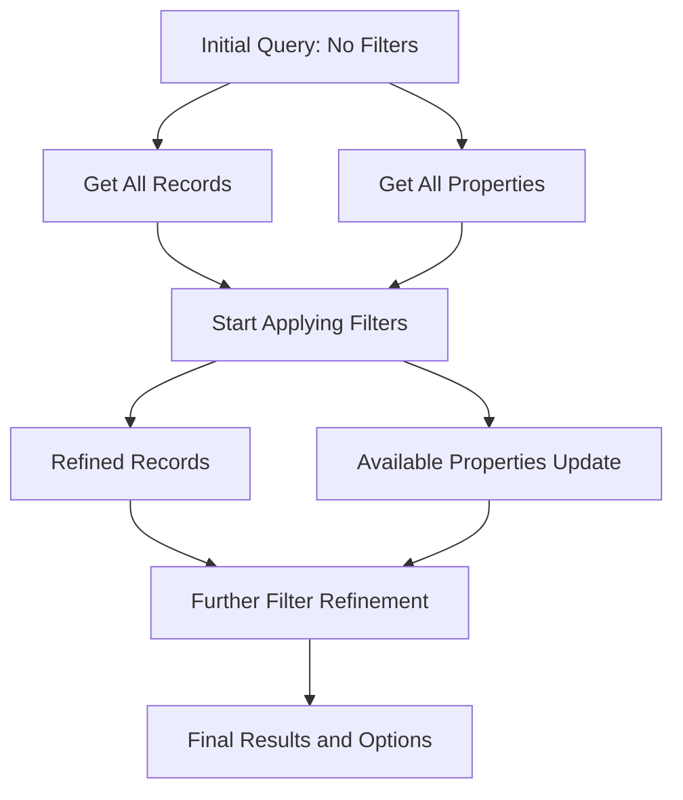
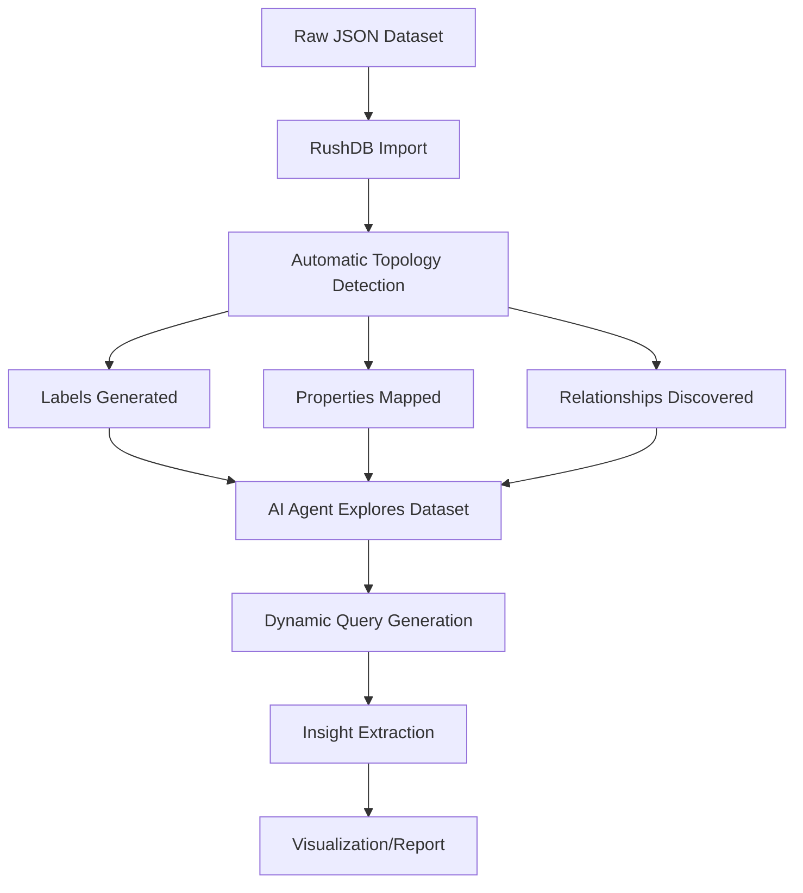

import Tabs from '@theme/Tabs';
import TabItem from '@theme/TabItem';

# Reusable SearchQuery

One of the most powerful concepts behind RushDB is its "fractal" API architecture with a self-aware design that's exposed through a consistent, easy-to-understand interface. This design philosophy allows you to use the same query structure across different aspects of your graph database, creating a highly flexible and intuitive developer experience.

## The Power of Consistency

At the heart of RushDB's API design is the SearchQuery pattern - a standardized way to query your data that remains consistent regardless of what entity you're working with: records, relationships, labels, or properties. This consistent approach brings several powerful benefits:

- **Reduced learning curve**: Learn the query pattern once, apply it everywhere
- **Predictable API usage**: No need to learn different filtering paradigms for different entity types
- **Code reusability**: Reuse query logic across different parts of your application
- **Self-discoverability**: The graph intrinsically knows its structure and exposes it consistently

## SearchQuery Structure

The SearchQuery object provides a standardized way to filter, sort, and paginate results:

```typescript
interface SearchQuery {
  // Filter by record labels
  labels?: string[];

  // Filter by property values and relationships
  where?: WhereClause;

  // Maximum number of records to return (default: 100)
  limit?: number;

  // Number of records to skip (for pagination)
  skip?: number;

  // Sorting configuration
  orderBy?: OrderByClause;

  // Data aggregation and transformation
  aggregate?: AggregateClause;
}
```

## Fractal API in Action

The power of RushDB's fractal API design becomes apparent when you see the same query structure used across different endpoints:

### 1. Searching Records

<Tabs groupId="programming-language">
  <TabItem value="typescript" label="TypeScript" default>
```typescript
// Find all active PRODUCT records with price between $10-$50
const products = await db.records.find({
  labels: ['PRODUCT'],
  where: {
    active: true,
    price: { $gte: 10, $lte: 50 }
  },
  orderBy: { price: 'asc' },
  limit: 20
});
```
  </TabItem>
  <TabItem value="python" label="Python">
```python
# Find all active PRODUCT records with price between $10-$50
products = db.records.find({
  "labels": ["PRODUCT"],
  "where": {
    "active": True,
    "price": {"$gte": 10, "$lte": 50}
  },
  "orderBy": {"price": "asc"},
  "limit": 20
})
```
  </TabItem>
  <TabItem value="rest" label="REST API">
```bash
# Find all active PRODUCT records with price between $10-$50
curl -X POST "https://api.rushdb.com/api/v1/records/search" \
  -H "Token: $TOKEN" \
  -H "Content-Type: application/json" \
  -d '{
    "labels": ["PRODUCT"],
    "where": {
      "active": true,
      "price": {
        "$gte": 10,
        "$lte": 50
      }
    },
    "orderBy": {"price": "asc"},
    "limit": 20
  }'
```
  </TabItem>
</Tabs>

### 2. Deleting Records with the Same Query Structure

<Tabs groupId="programming-language">
  <TabItem value="typescript" label="TypeScript" default>
```typescript
// Delete discontinued products with zero inventory
await db.records.delete({
  labels: ['PRODUCT'],
  where: {
    discontinued: true,
    inventory: 0
  }
});
```
  </TabItem>
  <TabItem value="python" label="Python">
```python
# Delete discontinued products with zero inventory
db.records.delete({
  "labels": ["PRODUCT"],
  "where": {
    "discontinued": True,
    "inventory": 0
  }
})
```
  </TabItem>
  <TabItem value="rest" label="REST API">
```bash
# Delete discontinued products with zero inventory
curl -X PUT "https://api.rushdb.com/api/v1/records/delete" \
  -H "Token: $TOKEN" \
  -H "Content-Type: application/json" \
  -d '{
    "labels": ["PRODUCT"],
    "where": {
      "discontinued": true,
      "inventory": 0
    }
  }'
```
  </TabItem>
</Tabs>

### 3. Searching Relationships

<Tabs groupId="programming-language">
  <TabItem value="typescript" label="TypeScript" default>
```typescript
// Find all CREATED relationships by users in the admin group
const createdRelationships = await db.relationships.find({
  where: {
    groups: { $contains: ["admin"] },
    $relation: {
      type: "CREATED"
    }
  },
  limit: 50
});
```
  </TabItem>
  <TabItem value="python" label="Python">
```python
# Find all CREATED relationships by users in the admin group
created_relationships = db.relationships.find({
  "where": {
    "groups": { "$contains": ["admin"] },
    "$relation": {
      "type": "CREATED"
    }
  },
  "limit": 50
})
```
  </TabItem>
  <TabItem value="rest" label="REST API">
```bash
# Find all CREATED relationships by users in the admin group
curl -X POST "https://api.rushdb.com/api/v1/relationships/search" \
  -H "Token: $TOKEN" \
  -H "Content-Type: application/json" \
  -d '{
    "where": {
      "groups": { "$contains": ["admin"] },
      "$relation": {
        "type": "CREATED"
      }
    },
    "limit": 50
  }'
```
  </TabItem>
</Tabs>

### 4. Discovering Labels

<Tabs groupId="programming-language">
  <TabItem value="typescript" label="TypeScript" default>
```typescript
// Find all labels used on records in North America region
const labels = await db.labels.find({
  where: {
    region: { $in: ["US", "CA", "MX"] }
  }
});
```
  </TabItem>
  <TabItem value="python" label="Python">
```python
# Find all labels used on records in North America region
labels = db.labels.find({
  "where": {
    "region": {"$in": ["US", "CA", "MX"]}
  }
})
```
  </TabItem>
  <TabItem value="rest" label="REST API">
```bash
# Find all labels used on records in North America region
curl -X POST "https://api.rushdb.com/api/v1/labels/search" \
  -H "Token: $TOKEN" \
  -H "Content-Type: application/json" \
  -d '{
    "where": {
      "region": {"$in": ["US", "CA", "MX"]}
    }
  }'
```
  </TabItem>
</Tabs>

### 5. Exploring Properties

<Tabs groupId="programming-language">
  <TabItem value="typescript" label="TypeScript" default>
```typescript
// Get all string properties used on PRODUCT records
const productProps = await db.properties.find({
  labels: ["PRODUCT"],
  where: {
    // ...
  }
});
```
  </TabItem>
  <TabItem value="python" label="Python">
```python
# Get all string properties used on PRODUCT records
product_props = db.properties.find({
  "labels": ["PRODUCT"],
  "where": {
    // ...
  }
})
```
  </TabItem>
  <TabItem value="rest" label="REST API">
```bash
# Get all string properties used on PRODUCT records
curl -X POST "https://api.rushdb.com/api/v1/properties/search" \
  -H "Token: $TOKEN" \
  -H "Content-Type: application/json" \
  -d '{
    "labels": ["PRODUCT"],
    "where": {
      // ...
    }
  }'
```
  </TabItem>
</Tabs>

## APIs Supporting SearchQuery

RushDB provides consistent SearchQuery capabilities across multiple API endpoints:

| API Endpoint                   | Description                          | Documentation                                           |
|--------------------------------|--------------------------------------|---------------------------------------------------------|
| `/api/v1/records/search`       | Search for records                   | [Records API](../rest-api/records/get-records.md)       |
| `/api/v1/records/delete`       | Delete records using search criteria | [Delete Records](../rest-api/records/delete-records.md) |
| `/api/v1/relationships/search` | Search for relationships             | [Relationships API](../rest-api/relationships.md)       |
| `/api/v1/labels/search`        | Search for labels                    | [Labels API](../rest-api/labels.md)                     |
| `/api/v1/properties/search`    | Search for properties                | [Properties API](../rest-api/properties.md)             |

## Powerful Use Cases

### Dynamic Filtering in Catalog Applications

With RushDB's fractal API design, building dynamic filtering interfaces for catalog or marketplace applications becomes dramatically simplified. The more you filter records (and simultaneously filter properties), the more precise your results become.



To implement this pattern:

1. Fetch all records and all available properties (no filters applied)
2. As users select filters, apply the same SearchQuery to both the records and properties endpoints
3. The filtered properties API will return only properties that exist in the remaining record set
4. Update your UI to display only filter options that are still relevant

<Tabs groupId="programming-language">
  <TabItem value="typescript" label="TypeScript" default>
```typescript
// User selects a categoryId filter
const filterQuery = {
  where: { categoryId: "electronics" }
};

// Get filtered products
const products = await db.records.find({
  labels: ["PRODUCT"],
  ...filterQuery
});

// Get available properties for the remaining product set
const availableProperties = await db.properties.find(filterQuery);

// Generate dynamic filters based on available properties
const dynamicFilters = generateFiltersFromProperties(availableProperties);
```
  </TabItem>
  <TabItem value="python" label="Python">
```python
# User selects a categoryId filter
filter_query = {
  "where": {"categoryId": "electronics"}
}

# Get filtered products
products = db.records.find({
  "labels": ["PRODUCT"],
  **filter_query
})

# Get available properties for the remaining product set
available_properties = db.properties.find(filter_query)

# Generate dynamic filters based on available properties
dynamic_filters = generate_filters_from_properties(available_properties)
```
  </TabItem>
</Tabs>

### AI-Powered Data Analytics Without ETL

RushDB's fractal API design makes it exceptionally well-suited for AI workflows and RAG (Retrieval Augmented Generation) systems. By importing raw JSON data and allowing RushDB to automatically recognize and index structures, you can eliminate traditional ETL processes.



This allows AI agents to:

1. Explore available data structure without predefined schemas
2. Dynamically generate queries based on discovered patterns
3. Refetch and recalculate results on-the-fly as new insights emerge
4. Perform complex aggregations without manual data preparation

For example, an AI agent could:

<Tabs groupId="programming-language">
  <TabItem value="typescript" label="TypeScript" default>
```typescript
// Discovery phase: Explore available labels
const availableLabels = await db.labels.find({});
console.log("Discovered entity types:", Object.keys(availableLabels));

// Explore properties of a specific label
const personProperties = await db.properties.find({
  where: {
    recordLabels: { $contains: ["PERSON"] }
  }
});

// Generate insights based on discovered structure
const insightQuery = generateQueryFromDiscoveredStructure(personProperties);
const results = await db.records.find(insightQuery);
```
  </TabItem>
  <TabItem value="python" label="Python">
```python
# Discovery phase: Explore available labels
available_labels = db.labels.find({})
print("Discovered entity types:", list(available_labels.keys()))

# Explore properties of a specific label
person_properties = db.properties.find({
  "where": {
    "recordLabels": {"$contains": ["PERSON"]}
  }
})

# Generate insights based on discovered structure
insight_query = generate_query_from_discovered_structure(person_properties)
results = db.records.find(insight_query)
```
  </TabItem>
</Tabs>

## Conclusion

RushDB's fractal API design with the reusable SearchQuery pattern represents a significant advancement in database interaction. By maintaining a consistent query structure across different entities and operations, RushDB enables developers to build more intuitive, flexible, and powerful applications with less code and cognitive overhead.

This design philosophy reflects a deep understanding of how developers work with data, ensuring that once you learn the SearchQuery pattern, you can apply that knowledge universally throughout your application's interaction with RushDB.
