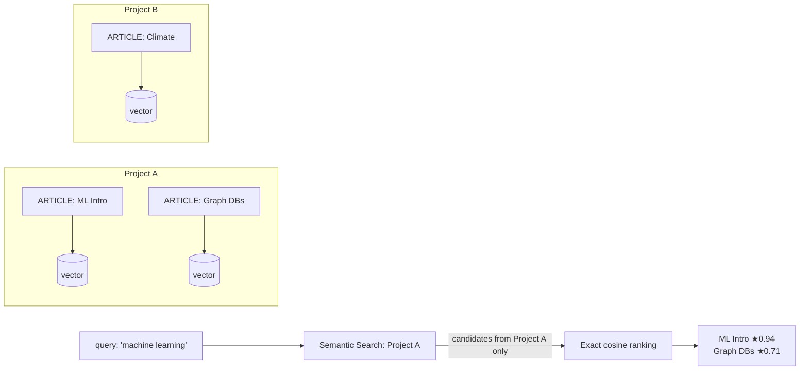

import Tabs from '@site/src/components/LanguageTabs';
import TabItem from '@theme/TabItem';

# Semantic Search for Multi-Tenant Products

Vector search in multi-tenant products has one rule that trumps all others: a user in tenant A must never see results from tenant B, even if tenant B has a more semantically similar document.

RushDB's semantic search enforces this at the storage layer. Every project is an isolated namespace. When you call `db.ai.search()`, the search is **always scoped to your project**. There is no global vector index, no shared ANN pool, no cross-project leakage.

This tutorial shows you exactly how the scoping works, how to add structured filters on top of semantic ranking, and how to build a multi-tenant search endpoint that is correct by construction.

---

## How project-scoped search works



The prefilter step narrows candidates to records in the current project (via a Cypher MATCH/WHERE clause) before any similarity computation runs. Exact cosine similarity is then applied to the prefiltered set.

This means:
- Tenant isolation is guaranteed by the query engine, not by application-layer filtering
- Adding a `where` clause narrows the candidate set further but does not change the isolation guarantee
- Results always carry a `__score` (0–1) indicating cosine similarity

---

## Step 1: Ingest multi-tenant content

In a real multi-tenant product, each tenant has its own RushDB project and its own API key. For this tutorial, the "tenant isolation" is the project itself.

<Tabs groupId="programming-language">
<TabItem value="typescript" label="TypeScript">

```typescript
import RushDB from '@rushdb/javascript-sdk'

// Each tenant has their own project key
const db = new RushDB('TENANT_PROJECT_API_KEY')

await db.records.importJson({
  label: 'ARTICLE',
  data: [
    {
      title: 'Reducing Infrastructure Costs with Spot Instances',
      body: 'A practical guide to lowering cloud bills using preemptible compute.',
      category: 'infrastructure',
      authorId: 'u-101',
      publishedAt: '2025-01-15'
    },
    {
      title: 'Query Planner Internals',
      body: 'How modern databases choose execution plans and when they get it wrong.',
      category: 'databases',
      authorId: 'u-202',
      publishedAt: '2025-02-10'
    },
    {
      title: 'Incident Response Automation',
      body: 'Automating runbooks, page routing, and post-incident review with LLMs.',
      category: 'operations',
      authorId: 'u-101',
      publishedAt: '2025-03-01'
    }
  ]
})
```

</TabItem>
<TabItem value="python" label="Python">

```python
from rushdb import RushDB

db = RushDB("TENANT_PROJECT_API_KEY", base_url="https://api.rushdb.com/api/v1")

db.records.import_json({
    "label": "ARTICLE",
    "data": [
        {
            "title": "Reducing Infrastructure Costs with Spot Instances",
            "body": "A practical guide to lowering cloud bills using preemptible compute.",
            "category": "infrastructure",
            "authorId": "u-101",
            "publishedAt": "2025-01-15"
        },
        {
            "title": "Query Planner Internals",
            "body": "How modern databases choose execution plans when they get it wrong.",
            "category": "databases",
            "authorId": "u-202",
            "publishedAt": "2025-02-10"
        },
        {
            "title": "Incident Response Automation",
            "body": "Automating runbooks, page routing, and post-incident review with LLMs.",
            "category": "operations",
            "authorId": "u-101",
            "publishedAt": "2025-03-01"
        }
    ]
})
```

</TabItem>
<TabItem value="shell" label="Shell">

```bash
BASE="https://api.rushdb.com/api/v1"
TOKEN="TENANT_PROJECT_API_KEY"
H='Content-Type: application/json'

curl -s -X POST "$BASE/records/import/json" \
  -H "$H" -H "Authorization: Bearer $TOKEN" \
  -d '{
    "label": "ARTICLE",
    "data": [
      {"title": "Reducing Infrastructure Costs with Spot Instances", "body": "A practical guide to lowering cloud bills.", "category": "infrastructure", "authorId": "u-101"},
      {"title": "Query Planner Internals", "body": "How databases choose execution plans.", "category": "databases", "authorId": "u-202"},
      {"title": "Incident Response Automation", "body": "Automating runbooks with LLMs.", "category": "operations", "authorId": "u-101"}
    ]
  }'
```

</TabItem>
</Tabs>

---

## Step 2: Create an embedding index

Semantic search requires an embedding index on the property you want to search. Create it once per label/property combination.

<Tabs groupId="programming-language">
<TabItem value="typescript" label="TypeScript">

```typescript
const index = await db.ai.indexes.create({
  label: 'ARTICLE',
  propertyName: 'body',
  sourceType: 'managed'   // RushDB embeds automatically
})

console.log('Index status:', index.data.status)
// status will be 'pending' or 'indexing' initially
```

</TabItem>
<TabItem value="python" label="Python">

```python
index = db.ai.indexes.create({
    "label": "ARTICLE",
    "propertyName": "body",
    "sourceType": "managed"
})

print("Index status:", index.data["status"])
```

</TabItem>
<TabItem value="shell" label="Shell">

```bash
curl -s -X POST "$BASE/ai/indexes" \
  -H "$H" -H "Authorization: Bearer $TOKEN" \
  -d '{"label":"ARTICLE","propertyName":"body","sourceType":"managed"}'
```

</TabItem>
</Tabs>

---

## Step 3: Poll until the index is ready

Backfilling vectors takes time proportional to record count. Poll the stats endpoint until `indexedRecords` equals `totalRecords`.

<Tabs groupId="programming-language">
<TabItem value="typescript" label="TypeScript">

```typescript
async function waitForIndex(indexId: string, intervalMs = 3000): Promise<void> {
  while (true) {
    const stats = await db.ai.indexes.stats(indexId)
    const { totalRecords, indexedRecords } = stats.data
    console.log(`Indexed ${indexedRecords} / ${totalRecords}`)
    if (indexedRecords >= totalRecords) break
    await new Promise(r => setTimeout(r, intervalMs))
  }
}

await waitForIndex(index.data.id)
```

</TabItem>
<TabItem value="python" label="Python">

```python
import time

def wait_for_index(index_id: str, interval: float = 3.0) -> None:
    while True:
        stats = db.ai.indexes.stats(index_id)
        total = stats.data["totalRecords"]
        indexed = stats.data["indexedRecords"]
        print(f"Indexed {indexed} / {total}")
        if indexed >= total:
            break
        time.sleep(interval)

wait_for_index(index.data["id"])
```

</TabItem>
<TabItem value="shell" label="Shell">

```bash
INDEX_ID="<index-id-from-create>"

while true; do
  STATS=$(curl -s "$BASE/ai/indexes/$INDEX_ID/stats" \
    -H "Authorization: Bearer $TOKEN")
  TOTAL=$(echo "$STATS" | jq '.data.totalRecords')
  INDEXED=$(echo "$STATS" | jq '.data.indexedRecords')
  echo "Indexed $INDEXED / $TOTAL"
  [ "$INDEXED" -ge "$TOTAL" ] && break
  sleep 3
done
```

</TabItem>
</Tabs>

---

## Step 4: Basic semantic search

No `where` filter — returns the top matches across all ARTICLE records in this project, ranked by cosine similarity.

<Tabs groupId="programming-language">
<TabItem value="typescript" label="TypeScript">

```typescript
const results = await db.ai.search({
  query: 'how to reduce cloud spending',
  propertyName: 'body',
  labels: ['ARTICLE'],
  limit: 5
})

for (const result of results.data) {
  console.log(`${result.__score.toFixed(3)}  ${result.title}`)
}
```

</TabItem>
<TabItem value="python" label="Python">

```python
results = db.ai.search({
    "query": "how to reduce cloud spending",
    "propertyName": "body",
    "labels": ["ARTICLE"],
    "limit": 5
})

for r in results.data:
    print(f"{r.score:.3f}  {r['title']}")
```

</TabItem>
<TabItem value="shell" label="Shell">

```bash
curl -s -X POST "$BASE/ai/search" \
  -H "$H" -H "Authorization: Bearer $TOKEN" \
  -d '{
    "query": "how to reduce cloud spending",
    "propertyName": "body",
    "labels": ["ARTICLE"],
    "limit": 5
  }' | jq '.data[] | {score: .__score, title: .title}'
```

</TabItem>
</Tabs>

---

## Step 5: Scope results with structured filters

Add a `where` clause to narrow candidates before cosine ranking. This is the correct pattern for per-user or per-category search in a product.

<Tabs groupId="programming-language">
<TabItem value="typescript" label="TypeScript">

```typescript
// Only search articles written by a specific author
const authorResults = await db.ai.search({
  query: 'automation and reliability',
  propertyName: 'body',
  labels: ['ARTICLE'],
  where: {
    authorId: 'u-101'
  },
  limit: 5
})

// Only search articles in a specific category
const categoryResults = await db.ai.search({
  query: 'database performance',
  propertyName: 'body',
  labels: ['ARTICLE'],
  where: {
    category: { $in: ['databases', 'infrastructure'] }
  },
  limit: 10
})

// Date-bounded search
const recentResults = await db.ai.search({
  query: 'incident response',
  propertyName: 'body',
  labels: ['ARTICLE'],
  where: {
    publishedAt: {
      $gte: { $year: 2025, $month: 2, $day: 1 }
    }
  },
  limit: 10
})
```

</TabItem>
<TabItem value="python" label="Python">

```python
# Scoped to one author
author_results = db.ai.search({
    "query": "automation and reliability",
    "propertyName": "body",
    "labels": ["ARTICLE"],
    "where": {"authorId": "u-101"},
    "limit": 5
})

# Scoped to categories
category_results = db.ai.search({
    "query": "database performance",
    "propertyName": "body",
    "labels": ["ARTICLE"],
    "where": {"category": {"$in": ["databases", "infrastructure"]}},
    "limit": 10
})

# Date-bounded
recent_results = db.ai.search({
    "query": "incident response",
    "propertyName": "body",
    "labels": ["ARTICLE"],
    "where": {"publishedAt": {"$gte": {"$year": 2025, "$month": 2, "$day": 1}}},
    "limit": 10
})
```

</TabItem>
<TabItem value="shell" label="Shell">

```bash
# Author-scoped
curl -s -X POST "$BASE/ai/search" \
  -H "$H" -H "Authorization: Bearer $TOKEN" \
  -d '{
    "query": "automation and reliability",
    "propertyName": "body",
    "labels": ["ARTICLE"],
    "where": {"authorId": "u-101"},
    "limit": 5
  }'

# Category-scoped
curl -s -X POST "$BASE/ai/search" \
  -H "$H" -H "Authorization: Bearer $TOKEN" \
  -d '{
    "query": "database performance",
    "propertyName": "body",
    "labels": ["ARTICLE"],
    "where": {"category": {"$in": ["databases","infrastructure"]}},
    "limit": 10
  }'
```

</TabItem>
</Tabs>

---

## Step 6: Paginate over semantic results

Use `skip` to page through ranked results.

<Tabs groupId="programming-language">
<TabItem value="typescript" label="TypeScript">

```typescript
async function searchPage(query: string, page: number, pageSize = 10) {
  return db.ai.search({
    query,
    propertyName: 'body',
    labels: ['ARTICLE'],
    skip: page * pageSize,
    limit: pageSize
  })
}

const page0 = await searchPage('cloud infrastructure', 0)
const page1 = await searchPage('cloud infrastructure', 1)
```

</TabItem>
<TabItem value="python" label="Python">

```python
def search_page(query: str, page: int, page_size: int = 10):
    return db.ai.search({
        "query": query,
        "propertyName": "body",
        "labels": ["ARTICLE"],
        "skip": page * page_size,
        "limit": page_size
    })

page0 = search_page("cloud infrastructure", 0)
page1 = search_page("cloud infrastructure", 1)
```

</TabItem>
<TabItem value="shell" label="Shell">

```bash
# Page 0
curl -s -X POST "$BASE/ai/search" \
  -H "$H" -H "Authorization: Bearer $TOKEN" \
  -d '{"query":"cloud infrastructure","propertyName":"body","labels":["ARTICLE"],"skip":0,"limit":10}'

# Page 1
curl -s -X POST "$BASE/ai/search" \
  -H "$H" -H "Authorization: Bearer $TOKEN" \
  -d '{"query":"cloud infrastructure","propertyName":"body","labels":["ARTICLE"],"skip":10,"limit":10}'
```

</TabItem>
</Tabs>

---

## Step 7: Using external vectors (BYOV)

If you manage your own embeddings, create an external index and push vectors inline at write time.

<Tabs groupId="programming-language">
<TabItem value="typescript" label="TypeScript">

```typescript
// Create an external index (dimensions must match your model)
await db.ai.indexes.create({
  label: 'ARTICLE',
  propertyName: 'body',
  sourceType: 'external',
  dimensions: 1536,
  similarityFunction: 'cosine'
})

// Write a record with an inline vector
await db.records.create({
  label: 'ARTICLE',
  data: {
    title: 'Distributed Tracing at Scale',
    body: 'How to instrument services for end-to-end trace collection.',
    category: 'observability',
  },
  vectors: [
    {
      propertyName: 'body',
      vector: [/* 1536-dimension float array from your embedding model */]
    }
  ]
})

// Search with an external query vector
const vectorResults = await db.ai.search({
  queryVector: [/* same 1536-dimension array */],
  propertyName: 'body',
  labels: ['ARTICLE'],
  sourceType: 'external',
  limit: 5
})
```

</TabItem>
<TabItem value="python" label="Python">

```python
# Create external index
db.ai.indexes.create({
    "label": "ARTICLE",
    "propertyName": "body",
    "sourceType": "external",
    "dimensions": 1536,
    "similarityFunction": "cosine"
})

# Write record with inline vector
db.records.create(
    "ARTICLE",
    {
        "title": "Distributed Tracing at Scale",
        "body": "How to instrument services for trace collection.",
        "category": "observability",
    },
    vectors=[
        {
            "propertyName": "body",
            "vector": [/* 1536-dimension float array */]
        }
    ]
)

# Search with query vector
results = db.ai.search({
    "queryVector": [/* same 1536-dim array */],
    "propertyName": "body",
    "labels": ["ARTICLE"],
    "sourceType": "external",
    "limit": 5
})
```

</TabItem>
<TabItem value="shell" label="Shell">

```bash
# Create external index
curl -s -X POST "$BASE/ai/indexes" \
  -H "$H" -H "Authorization: Bearer $TOKEN" \
  -d '{"label":"ARTICLE","propertyName":"body","sourceType":"external","dimensions":1536,"similarityFunction":"cosine"}'

# Search with query vector
curl -s -X POST "$BASE/ai/search" \
  -H "$H" -H "Authorization: Bearer $TOKEN" \
  -d '{"queryVector":[0.1,0.2,...],"propertyName":"body","labels":["ARTICLE"],"sourceType":"external","limit":5}'
```

</TabItem>
</Tabs>

---

## The multi-tenant API endpoint pattern

Here is a minimal handler that exposes project-scoped semantic search for a product:

<Tabs groupId="programming-language">
<TabItem value="typescript" label="TypeScript">

```typescript
// POST /api/search
import RushDB from '@rushdb/javascript-sdk'

export async function searchHandler(req: Request): Promise<Response> {
  const { query, category, page = 0, pageSize = 10 } = await req.json()

  // Each tenant authenticates with their project API key
  // Never hard-code the key — pull it from the tenant's session/config
  const tenantApiKey = getTenantApiKey(req)
  const db = new RushDB(tenantApiKey)

  const where: Record<string, unknown> = {}
  if (category) where.category = category

  const results = await db.ai.search({
    query,
    propertyName: 'body',
    labels: ['ARTICLE'],
    where: Object.keys(where).length > 0 ? where : undefined,
    skip: page * pageSize,
    limit: pageSize
  })

  return Response.json({
    results: results.data.map(r => ({
      id: r.__id,
      title: r.title,
      score: r.__score,
      category: r.category
    })),
    total: results.total
  })
}
```

</TabItem>
<TabItem value="python" label="Python">

```python
# POST /api/search (e.g. Flask / FastAPI handler)
from rushdb import RushDB

def search_handler(tenant_api_key: str, query: str, category: str = None, page: int = 0, page_size: int = 10):
    db = RushDB(tenant_api_key)

    where = {}
    if category:
        where["category"] = category

    results = db.ai.search({
        "query": query,
        "propertyName": "body",
        "labels": ["ARTICLE"],
        "where": where if where else None,
        "skip": page * page_size,
        "limit": page_size
    })

    return {
        "results": [
            {"id": r.id, "title": r.get("title"), "score": r.score, "category": r.get("category")}
            for r in results.data
        ],
        "total": results.total
    }
```

</TabItem>
<TabItem value="shell" label="Shell">

```bash
# Each tenant uses their own project API key
TENANT_TOKEN="rbk_tenant_project_key"
BASE="https://api.rushdb.com/api/v1"

curl -s -X POST "$BASE/ai/search" \
  -H "Content-Type: application/json" \
  -H "Authorization: Bearer $TENANT_TOKEN" \
  -d '{
    "query": "performance tuning",
    "propertyName": "body",
    "labels": ["ARTICLE"],
    "where": {"category": "infrastructure"},
    "skip": 0,
    "limit": 10
  }'
```

</TabItem>
</Tabs>

Because `RushDB(tenantApiKey)` is project-scoped, there is no application-layer filtering needed. The isolation guarantee comes from the storage layer.

---

## Production caveat

Project-scoped isolation is enforced at the API key level. If you accidentally reuse the same API key across tenants (for example by sharing a single project for all tenants), no isolation exists. Each tenant must have a separate project with a separate API key. The recommended architecture is one RushDB project per tenant.

---

## Next steps

- [Hybrid Retrieval: Structured Filters Plus Semantic Search](./hybrid-retrieval.mdx) — combining semantic ranking with deeper graph traversal
- [RAG Pipeline in Minutes](./rag-pipeline.mdx) — adding an LLM generation step on top of retrieval
- [Semantic Search reference](../typescript-sdk/ai/search.md) — full parameter reference
