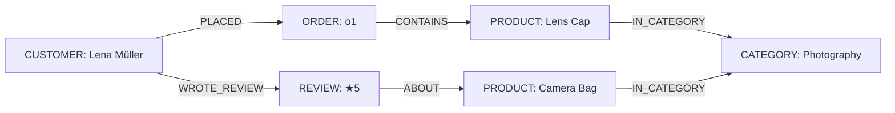

import Tabs from '@site/src/components/LanguageTabs';
import TabItem from '@theme/TabItem';

# Thinking in Graphs: From Tables to Traversals

Most developers arrive at a graph database carrying mental models built from SQL tables or JSON documents. Both are useful starting points. Neither maps directly to the query patterns that make graphs worth using.

This tutorial uses a realistic e-commerce scenario — customers, orders, products, and reviews — to show the same data across three mental models:

1. Relational (normalized tables)
2. Document (nested JSON)
3. Graph (labeled nodes + typed relationships)

Then it translates five common business questions into RushDB queries so you can see exactly where the graph model pays off.

---

## The scenario

A minimal e-commerce platform has:

- Customers who place orders
- Orders that contain line items referencing products
- Products that belong to categories
- Customers who write reviews for products

---

## Three mental models for the same data

### Relational model

```
customers(id, name, email)
products(id, name, category_id, price)
categories(id, name)
orders(id, customer_id, placed_at, status)
order_items(order_id, product_id, quantity, unit_price)
reviews(id, customer_id, product_id, rating, body)
```

In SQL you answer "which customers reviewed a product they never ordered?" with a NOT EXISTS subquery across three joins. The query is correct but the intent is buried in JOIN columns.

### Document model

```json
{
  "customerId": "c1",
  "name": "Lena Müller",
  "orders": [
    {
      "orderId": "o1",
      "status": "shipped",
      "items": [
        { "productId": "p1", "qty": 2 }
      ]
    }
  ],
  "reviews": [
    { "productId": "p2", "rating": 5 }
  ]
}
```

Documents are fast for loading a single customer's full history. The problem appears at the edges: "which products from the same category did this customer's network also buy?" requires post-processing across multiple documents.

### Graph model

The same data becomes labeled nodes connected by typed, directed relationships:



The graph stores **relationships as first-class data**, which is why multi-hop questions become natural instead of awkward.

---

## Ingesting the dataset

<Tabs groupId="programming-language">
<TabItem value="typescript" label="TypeScript">

```typescript
import RushDB from '@rushdb/javascript-sdk'

const db = new RushDB('RUSHDB_API_KEY')

// Categories
const [photography, audio] = await Promise.all([
  db.records.create({ label: 'CATEGORY', data: { name: 'Photography' } }),
  db.records.create({ label: 'CATEGORY', data: { name: 'Audio' } }),
])

// Products
const [lensCap, cameraBag, headphones] = await Promise.all([
  db.records.create({ label: 'PRODUCT', data: { name: 'Lens Cap 58mm', price: 12.99 } }),
  db.records.create({ label: 'PRODUCT', data: { name: 'Camera Bag Pro', price: 89.00 } }),
  db.records.create({ label: 'PRODUCT', data: { name: 'Studio Headphones', price: 149.00 } }),
])

// Link products to categories
await Promise.all([
  db.records.attach({ source: lensCap, target: photography, options: { type: 'IN_CATEGORY' } }),
  db.records.attach({ source: cameraBag, target: photography, options: { type: 'IN_CATEGORY' } }),
  db.records.attach({ source: headphones, target: audio, options: { type: 'IN_CATEGORY' } }),
])

// Customers
const [lena, marco] = await Promise.all([
  db.records.create({ label: 'CUSTOMER', data: { name: 'Lena Müller', email: 'lena@example.com' } }),
  db.records.create({ label: 'CUSTOMER', data: { name: 'Marco Rossi', email: 'marco@example.com' } }),
])

// Orders
const order1 = await db.records.create({ label: 'ORDER', data: { status: 'shipped', placedAt: '2025-01-10' } })
await db.records.attach({ source: lena, target: order1, options: { type: 'PLACED' } })
await db.records.attach({ source: order1, target: lensCap, options: { type: 'CONTAINS' } })

const order2 = await db.records.create({ label: 'ORDER', data: { status: 'delivered', placedAt: '2025-02-14' } })
await db.records.attach({ source: marco, target: order2, options: { type: 'PLACED' } })
await db.records.attach({ source: order2, target: cameraBag, options: { type: 'CONTAINS' } })

// Reviews
const review1 = await db.records.create({ label: 'REVIEW', data: { rating: 5, body: 'Perfect fit.' } })
await db.records.attach({ source: lena, target: review1, options: { type: 'WROTE_REVIEW' } })
await db.records.attach({ source: review1, target: cameraBag, options: { type: 'ABOUT' } })
```

</TabItem>
<TabItem value="python" label="Python">

```python
from rushdb import RushDB

db = RushDB("RUSHDB_API_KEY", base_url="https://api.rushdb.com/api/v1")

# Categories
photography = db.records.create("CATEGORY", {"name": "Photography"})
audio = db.records.create("CATEGORY", {"name": "Audio"})

# Products
lens_cap = db.records.create("PRODUCT", {"name": "Lens Cap 58mm", "price": 12.99})
camera_bag = db.records.create("PRODUCT", {"name": "Camera Bag Pro", "price": 89.00})
headphones = db.records.create("PRODUCT", {"name": "Studio Headphones", "price": 149.00})

# Link products to categories
db.records.attach(lens_cap.id, photography.id, {"type": "IN_CATEGORY"})
db.records.attach(camera_bag.id, photography.id, {"type": "IN_CATEGORY"})
db.records.attach(headphones.id, audio.id, {"type": "IN_CATEGORY"})

# Customers
lena = db.records.create("CUSTOMER", {"name": "Lena Müller", "email": "lena@example.com"})
marco = db.records.create("CUSTOMER", {"name": "Marco Rossi", "email": "marco@example.com"})

# Orders
order1 = db.records.create("ORDER", {"status": "shipped", "placedAt": "2025-01-10"})
db.records.attach(lena.id, order1.id, {"type": "PLACED"})
db.records.attach(order1.id, lens_cap.id, {"type": "CONTAINS"})

order2 = db.records.create("ORDER", {"status": "delivered", "placedAt": "2025-02-14"})
db.records.attach(marco.id, order2.id, {"type": "PLACED"})
db.records.attach(order2.id, camera_bag.id, {"type": "CONTAINS"})

# Reviews
review1 = db.records.create("REVIEW", {"rating": 5, "body": "Perfect fit."})
db.records.attach(lena.id, review1.id, {"type": "WROTE_REVIEW"})
db.records.attach(review1.id, camera_bag.id, {"type": "ABOUT"})
```

</TabItem>
<TabItem value="shell" label="Shell">

```bash
BASE="https://api.rushdb.com/api/v1"
TOKEN="RUSHDB_API_KEY"
H='Content-Type: application/json'

# Create category
PHOTO_ID=$(curl -s -X POST "$BASE/records" \
  -H "$H" -H "Authorization: Bearer $TOKEN" \
  -d '{"label":"CATEGORY","data":{"name":"Photography"}}' \
  | jq -r '.data.__id')

# Create product
LENS_ID=$(curl -s -X POST "$BASE/records" \
  -H "$H" -H "Authorization: Bearer $TOKEN" \
  -d '{"label":"PRODUCT","data":{"name":"Lens Cap 58mm","price":12.99}}' \
  | jq -r '.data.__id')

# Link product to category
curl -s -X POST "$BASE/records/$LENS_ID/relations" \
  -H "$H" -H "Authorization: Bearer $TOKEN" \
  -d "{\"targets\":[\"$PHOTO_ID\"],\"options\":{\"type\":\"IN_CATEGORY\"}}"
```

</TabItem>
</Tabs>

---

## Five business questions, translated

### Q1: Which orders has a given customer placed?

**Relational intuition:** `SELECT * FROM orders WHERE customer_id = 'c1'`

**Graph query:**

<Tabs groupId="programming-language">
<TabItem value="typescript" label="TypeScript">

```typescript
const results = await db.records.find({
  labels: ['ORDER'],
  where: {
    CUSTOMER: {
      $alias: '$customer',
      $relation: { type: 'PLACED', direction: 'in' },
      email: 'lena@example.com'
    }
  },
  orderBy: { placedAt: 'desc' }
})
```

</TabItem>
<TabItem value="python" label="Python">

```python
results = db.records.find({
    "labels": ["ORDER"],
    "where": {
        "CUSTOMER": {
            "$alias": "$customer",
            "$relation": {"type": "PLACED", "direction": "in"},
            "email": "lena@example.com"
        }
    },
    "orderBy": {"placedAt": "desc"}
})
```

</TabItem>
<TabItem value="shell" label="Shell">

```bash
curl -s -X POST "$BASE/records/search" \
  -H "$H" -H "Authorization: Bearer $TOKEN" \
  -d '{
    "labels": ["ORDER"],
    "where": {
      "CUSTOMER": {
        "$alias": "$customer",
        "$relation": {"type": "PLACED", "direction": "in"},
        "email": "lena@example.com"
      }
    },
    "orderBy": {"placedAt": "desc"}
  }'
```

</TabItem>
</Tabs>

### Q2: Which products did a customer purchase, grouped by category?

Three hops: CUSTOMER → ORDER → PRODUCT → CATEGORY.

<Tabs groupId="programming-language">
<TabItem value="typescript" label="TypeScript">

```typescript
const results = await db.records.find({
  labels: ['PRODUCT'],
  where: {
    ORDER: {
      $alias: '$order',
      $relation: { type: 'CONTAINS', direction: 'in' },
      CUSTOMER: {
        email: 'lena@example.com'
      }
    },
    CATEGORY: {
      $alias: '$cat'
    }
  },
  select: {
    productName: '$record.name',
    price: '$record.price',
    categoryName: '$cat.name',
    orderedAt: '$order.placedAt'
  }
})
```

</TabItem>
<TabItem value="python" label="Python">

```python
results = db.records.find({
    "labels": ["PRODUCT"],
    "where": {
        "ORDER": {
            "$alias": "$order",
            "$relation": {"type": "CONTAINS", "direction": "in"},
            "CUSTOMER": {
                "email": "lena@example.com"
            }
        },
        "CATEGORY": {
            "$alias": "$cat"
        }
    },
    "select": {
        "productName": "$record.name",
        "price": "$record.price",
        "categoryName": "$cat.name",
        "orderedAt": "$order.placedAt"
    }
})
```

</TabItem>
<TabItem value="shell" label="Shell">

```bash
curl -s -X POST "$BASE/records/search" \
  -H "$H" -H "Authorization: Bearer $TOKEN" \
  -d '{
    "labels": ["PRODUCT"],
    "where": {
      "ORDER": {
        "$alias": "$order",
        "$relation": {"type": "CONTAINS", "direction": "in"},
        "CUSTOMER": {"email": "lena@example.com"}
      },
      "CATEGORY": {"$alias": "$cat"}
    },
    "select": {
      "productName": "$record.name",
      "categoryName": "$cat.name"
    }
  }'
```

</TabItem>
</Tabs>

### Q3: Which products received 5-star reviews but have not been ordered yet?

<Tabs groupId="programming-language">
<TabItem value="typescript" label="TypeScript">

```typescript
// First, find product IDs that appear in orders
const orderedResults = await db.records.find({
  labels: ['PRODUCT'],
  where: {
    ORDER: { $relation: { type: 'CONTAINS', direction: 'in' } }
  },
  select: { id: '$record.__id' }
})

const orderedIds = orderedResults.data.map((r: any) => r.id)

// Then find 5-star reviewed products NOT in that set
const unorderedHighRated = await db.records.find({
  labels: ['PRODUCT'],
  where: {
    __id: { $nin: orderedIds },
    REVIEW: {
      $relation: { type: 'ABOUT', direction: 'in' },
      rating: 5
    }
  }
})
```

</TabItem>
<TabItem value="python" label="Python">

```python
# Products that appear in orders
ordered = db.records.find({
    "labels": ["PRODUCT"],
    "where": {
        "ORDER": {"$relation": {"type": "CONTAINS", "direction": "in"}}
    },
    "select": {"id": "$record.__id"}
})
ordered_ids = [r["id"] for r in ordered.data]

# 5-star reviewed products NOT in ordered set
unordered_high = db.records.find({
    "labels": ["PRODUCT"],
    "where": {
        "__id": {"$nin": ordered_ids},
        "REVIEW": {
            "$relation": {"type": "ABOUT", "direction": "in"},
            "rating": 5
        }
    }
})
```

</TabItem>
<TabItem value="shell" label="Shell">

```bash
# Step 1: collect ordered product IDs (use jq to extract)
ORDERED_IDS=$(curl -s -X POST "$BASE/records/search" \
  -H "$H" -H "Authorization: Bearer $TOKEN" \
  -d '{"labels":["PRODUCT"],"where":{"ORDER":{"$relation":{"type":"CONTAINS","direction":"in"}}},"select":{"id":"$record.__id"}}' \
  | jq '[.data[].id]')

# Step 2: query unordered 5-star products
curl -s -X POST "$BASE/records/search" \
  -H "$H" -H "Authorization: Bearer $TOKEN" \
  -d "{
    \"labels\": [\"PRODUCT\"],
    \"where\": {
      \"__id\": {\"\$nin\": $ORDERED_IDS},
      \"REVIEW\": {
        \"\$relation\": {\"type\": \"ABOUT\", \"direction\": \"in\"},
        \"rating\": 5
      }
    }
  }"
```

</TabItem>
</Tabs>

### Q4: How many orders per customer, with average order recency?

<Tabs groupId="programming-language">
<TabItem value="typescript" label="TypeScript">

```typescript
const summary = await db.records.find({
  labels: ['CUSTOMER'],
  where: {
    ORDER: {
      $alias: '$order',
      $relation: { type: 'PLACED', direction: 'out' }
    }
  },
  select: {
    customerName: '$record.name',
    orderCount: { $count: '$order' },
    lastOrderDate: { $max: '$order.placedAt' }
  },
  groupBy: ['customerName', 'orderCount', 'lastOrderDate'],
  orderBy: { orderCount: 'desc' }
})
```

</TabItem>
<TabItem value="python" label="Python">

```python
summary = db.records.find({
    "labels": ["CUSTOMER"],
    "where": {
        "ORDER": {
            "$alias": "$order",
            "$relation": {"type": "PLACED", "direction": "out"}
        }
    },
    "select": {
        "customerName": "$record.name",
        "orderCount": {"$count": "$order"},
        "lastOrderDate": {"$max": "$order.placedAt"}
    },
    "groupBy": ["customerName", "orderCount", "lastOrderDate"],
    "orderBy": {"orderCount": "desc"}
})
```

</TabItem>
<TabItem value="shell" label="Shell">

```bash
curl -s -X POST "$BASE/records/search" \
  -H "$H" -H "Authorization: Bearer $TOKEN" \
  -d '{
    "labels": ["CUSTOMER"],
    "where": {
      "ORDER": {
        "$alias": "$order",
        "$relation": {"type": "PLACED", "direction": "out"}
      }
    },
    "select": {
      "customerName": "$record.name",
      "orderCount": {"$count": "$order"},
      "lastOrderDate": {"$max": "$order.placedAt"}
    },
    "groupBy": ["customerName", "orderCount", "lastOrderDate"],
    "orderBy": {"orderCount": "desc"}
  }'
```

</TabItem>
</Tabs>

### Q5: Which products in the Photography category have been both ordered and reviewed?

<Tabs groupId="programming-language">
<TabItem value="typescript" label="TypeScript">

```typescript
const results = await db.records.find({
  labels: ['PRODUCT'],
  where: {
    CATEGORY: { name: 'Photography' },
    ORDER: { $relation: { type: 'CONTAINS', direction: 'in' } },
    REVIEW: { $alias: '$review', $relation: { type: 'ABOUT', direction: 'in' } }
  },
  select: {
    productName: '$record.name',
    reviewCount: { $count: '$review' },
    avgRating: { $avg: '$review.rating', $precision: 1 }
  },
  groupBy: ['productName', 'reviewCount', 'avgRating'],
  orderBy: { avgRating: 'desc' }
})
```

</TabItem>
<TabItem value="python" label="Python">

```python
results = db.records.find({
    "labels": ["PRODUCT"],
    "where": {
        "CATEGORY": {"name": "Photography"},
        "ORDER": {"$relation": {"type": "CONTAINS", "direction": "in"}},
        "REVIEW": {
            "$alias": "$review",
            "$relation": {"type": "ABOUT", "direction": "in"}
        }
    },
    "select": {
        "productName": "$record.name",
        "reviewCount": {"$count": "$review"},
        "avgRating": {"$avg": "$review.rating", "$precision": 1}
    },
    "groupBy": ["productName", "reviewCount", "avgRating"],
    "orderBy": {"avgRating": "desc"}
})
```

</TabItem>
<TabItem value="shell" label="Shell">

```bash
curl -s -X POST "$BASE/records/search" \
  -H "$H" -H "Authorization: Bearer $TOKEN" \
  -d '{
    "labels": ["PRODUCT"],
    "where": {
      "CATEGORY": {"name": "Photography"},
      "ORDER": {"$relation": {"type": "CONTAINS", "direction": "in"}},
      "REVIEW": {"$alias": "$review", "$relation": {"type": "ABOUT", "direction": "in"}}
    },
    "select": {
      "productName": "$record.name",
      "reviewCount": {"$count": "$review"},
      "avgRating": {"$avg": "$review.rating", "$precision": 1}
    },
    "groupBy": ["productName", "reviewCount", "avgRating"],
    "orderBy": {"avgRating": "desc"}
  }'
```

</TabItem>
</Tabs>

---

## What changed between the mental models

| Concern | Relational | Document | Graph |
|---|---|---|---|
| Multi-hop traversal | Multi-join SQL | Iteration across documents | Single query with nested `where` |
| Adding a new relationship type | New foreign key column or join table | Schema migration or array append | New `attach` call, zero schema changes |
| Querying along a new path | Rewrite query or add index | Rewrite aggregation logic | Extend existing `where` block |
| Metrics along path | GROUP BY with joins | Map-reduce | Per-hop metrics in same query |

---

## Production caveat

Relationship traversal queries become expensive when each hop fans out to thousands of related records. Before deploying traversal-heavy queries in production, scope them aggressively with `limit` on the leaf label and property filters that eliminate most candidates early. The [`SearchQuery Deep Dive`](./searchquery-advanced-patterns.mdx) tutorial covers aggregation and traversal optimization in more detail.

---

## Next steps

- [Choosing Relationship Types That Age Well](./choosing-relationship-types.mdx) — when to use generic edges versus typed relationships
- [SearchQuery Deep Dive](./searchquery-advanced-patterns.mdx) — aggregation, collect, and groupBy patterns
- [RushDB as a Memory Layer](./memory-layer.mdx) — using the same graph primitives for agent memory
